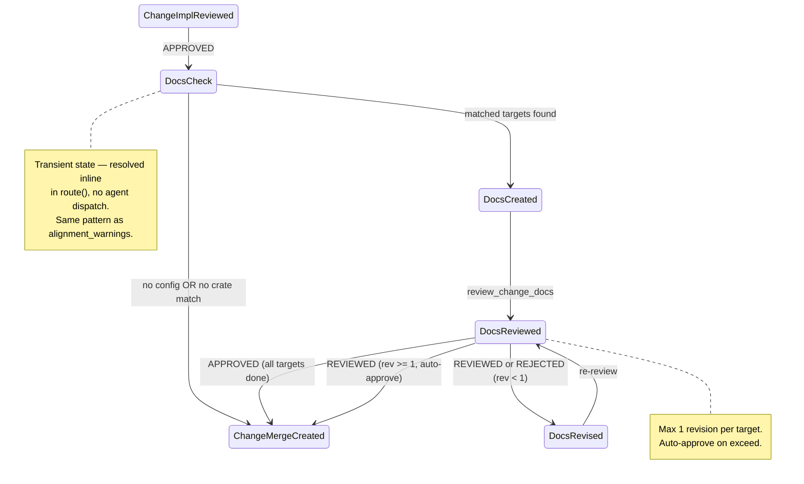
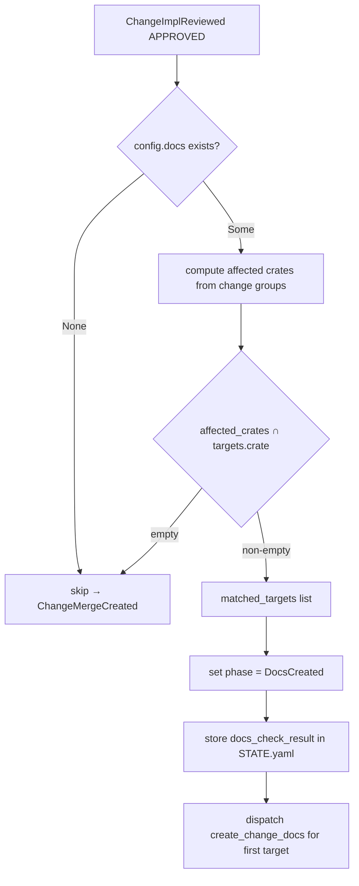
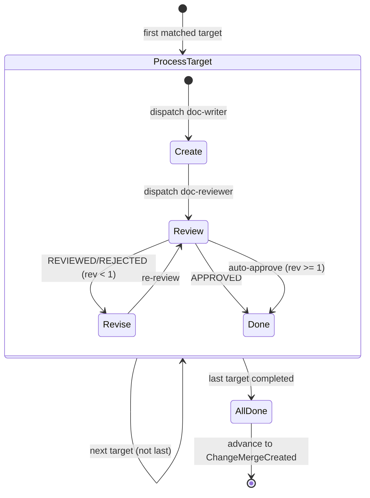
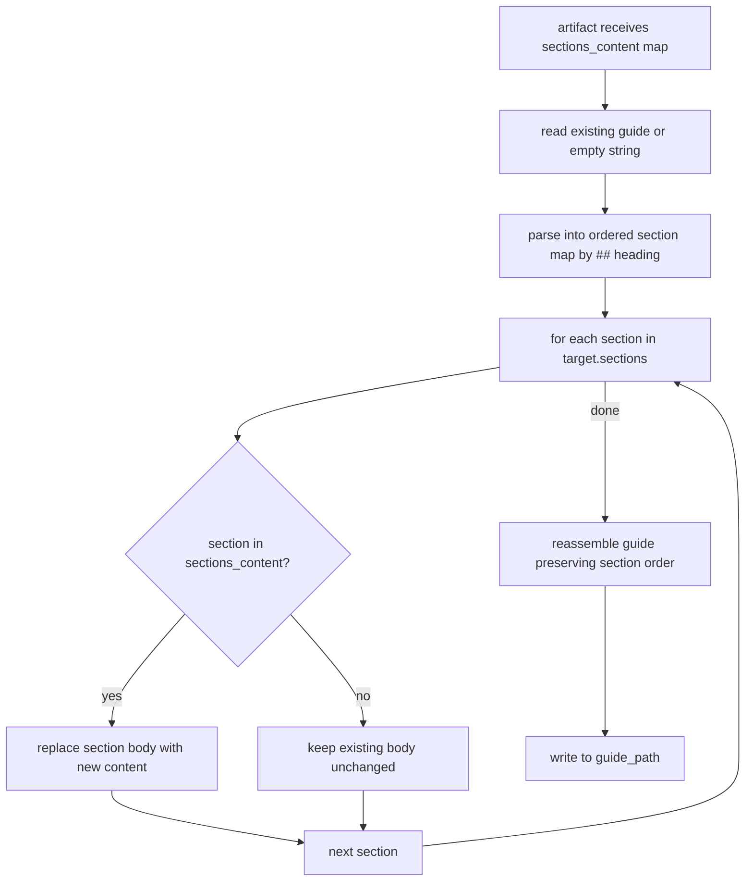
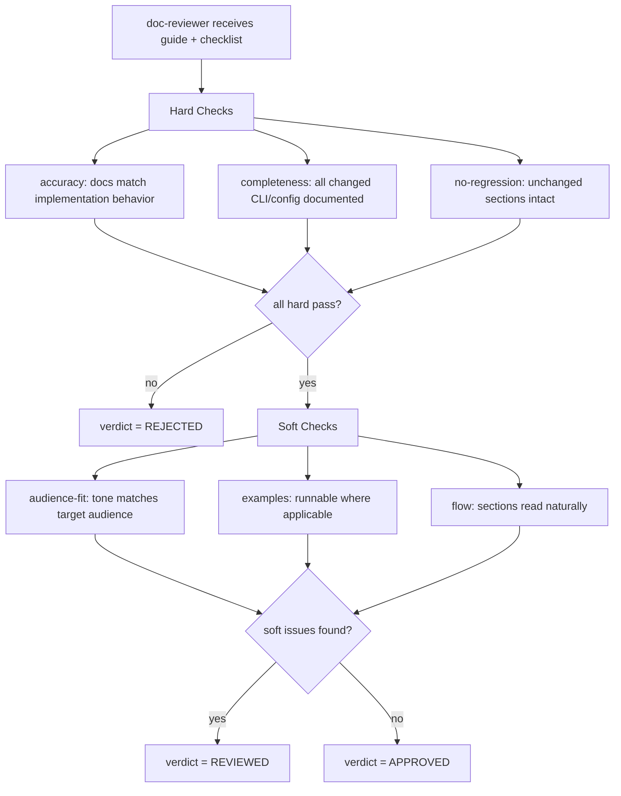
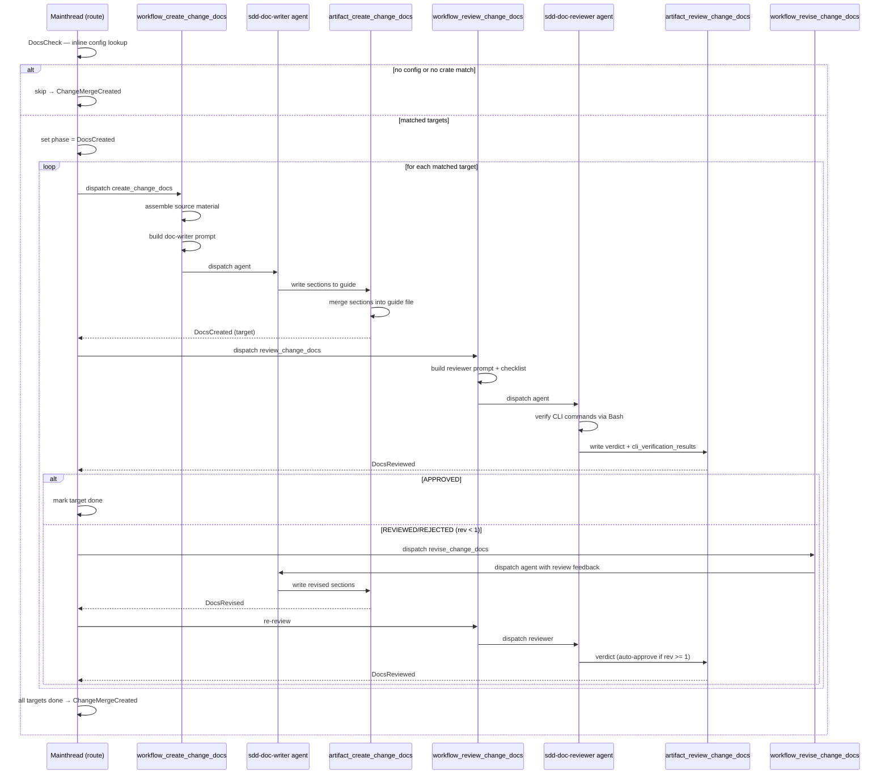

# Docs Phase Logic

## Overview

Core logic for the docs generation phase — the decision tree, CRR orchestration, target matching, prompt building, and guide section merge strategy.

**Position in workflow**: After `ChangeImplementationReviewed` (APPROVED), before `ChangeMergeCreated`. Guarded by `DocsCheck` — a transient state that auto-resolves inline (no agent dispatch).

| Aspect | Value |
|--------|-------|
| Entry state | `ChangeImplementationReviewed` (APPROVED) |
| Guard state | `DocsCheck` (transient — resolved inline in `route()`) |
| CRR states | `DocsCreated` → `DocsReviewed` → `DocsRevised` |
| Exit state | `ChangeMergeCreated` |
| Skip condition | No `[sdd.docs]` config OR no crate match |
| Agents | `sdd-doc-writer` (create/revise), `sdd-doc-reviewer` (review) |
| Source material | Change specs + CLI specs + config specs + scenarios → guide sections |
| Output | Updated guide files written to `output_dir` (default `docs/`) |

**Key design decisions**:
- `DocsCheck` is transient — same pattern as `alignment_warnings` computation (inline in `route()`, no agent dispatch)
- Target matching = set intersection of change-affected crates and `[sdd.docs].targets[].crate`
- Guide section merge preserves unchanged sections — only matched sections are overwritten
- Review checklist has hard (must-pass) and soft (REVIEWED) criteria
- Doc-reviewer executes CLI commands to verify accuracy (per clarification Q2)

**Scope**: Orchestration logic and data flow. Interface definitions are in `artifact-tools-docs-phase`. State machine enum changes are in `state-machine-docs-phase`. Config schema is in `config-docs-section`. CLI routing is in `cli-commands-docs-phase`.
## Requirements

| ID | Requirement | Priority |
|----|-------------|----------|
| R1 | Implement `DocsCheck` as a transient state resolved inline in `route()`. When `ChangeImplementationReviewed` (APPROVED) is reached, `route()` checks for `[sdd.docs]` config and computes crate intersection — no agent dispatch, no separate tool call. If skip, advance directly to `ChangeMergeCreated`. Same pattern as `alignment_warnings` inline computation. | high |
| R2 | Implement target matching: compute set intersection of change-affected crates (`change.groups[].crates`) and `config.docs.targets[].crate`. Only matched targets proceed to doc generation. Unmatched targets are skipped. If zero matches, skip entire docs phase. | high |
| R3 | Implement docs CRR cycle: `DocsCreated` → `DocsReviewed` → `DocsRevised` → `DocsReviewed`. Same CRR pattern as implementation phase — max 1 revision per target, auto-approve on exceed. APPROVED advances to `ChangeMergeCreated`. | high |
| R4 | Build doc-writer prompt for create action: inputs are change specs (all `groups/{group}/specs/*.md`), existing guide file (if exists), matched target config (audience, sections), CLI specs, config specs. Output template instructs agent to update only matched sections in guide file. | high |
| R5 | Build doc-reviewer prompt for review action: includes review checklist (hard: accuracy, completeness, no-regression; soft: audience-fit, examples, flow). Instructs reviewer to execute CLI commands and compare output against documented behavior. Provides Bash (read-only by prompt), Read, Glob, Grep tools — no Write. | high |
| R6 | Build doc-writer prompt for revise action: same as create prompt but with review feedback appended. Review notes, CLI verification failures, and verdict reason are included as revision context. | high |
| R7 | Guide section merge strategy: read existing guide file, parse into sections by `## heading`, replace only sections matching `target.sections[]`, preserve all other sections unchanged. If guide file does not exist, create it with matched sections only. | high |
| R8 | Phase routing in `route()`: add routing entries for `DocsCreated`, `DocsReviewed`, `DocsRevised` states. `DocsCreated` → dispatch `review_change_docs`. `DocsReviewed` (APPROVED) → advance to `ChangeMergeCreated`. `DocsReviewed` (REVIEWED/REJECTED) → dispatch `revise_change_docs`. `DocsRevised` → dispatch `review_change_docs`. | high |
| R9 | Parse `DocsConfig` and `DocsTarget` from `SddConfig`. `DocsConfig` has `output_dir: String` (default `"docs"`) and `targets: Vec<DocsTarget>`. `DocsTarget` has `crate_name: String`, `guide: String`, `audience: Audience`, `sections: Vec<String>`. Audience enum: `Developer`, `EndUser`, `Admin`. | medium |
| R10 | Multi-target sequencing: when multiple targets match, process them sequentially (one CRR cycle per target). Track per-target completion in `STATE.yaml` via `docs_targets_progress` field (analogous to `groups_progress`). | medium |
| R11 | Source material assembly: for each matched target, collect (1) change specs from all groups, (2) CLI spec from `cclab/specs/crates/{crate}/interfaces/cli/`, (3) config spec from `cclab/specs/crates/{crate}/config/`, (4) scenarios from change specs. Bundle as prompt context for doc-writer. | medium |
| R12 | STATE.yaml extensions: add `docs_check_result` field (`skip` \| `proceed`, with `skip_reason` and `matched_targets`), `docs_targets_progress` field (list of completed target crates), `docs_revision_counts` per-target revision tracking. | medium |
## Scenarios

### S1: No [sdd.docs] config — skip to merge (R1)

- **GIVEN** change `1145` reaches `ChangeImplementationReviewed` (APPROVED)
- **AND** `cclab/config.toml` has no `[sdd.docs]` section
- **WHEN** `route()` processes the phase transition
- **THEN** `DocsCheck` resolves inline with `skip_reason: "no_docs_config"`
- **AND** phase advances directly to `ChangeMergeCreated`
- **AND** no agent is dispatched

### S2: Config exists but no crate match — skip to merge (R1, R2)

- **GIVEN** change `1145` affects crate `cclab-pg`
- **AND** `[sdd.docs].targets` only has entries for `cclab-sdd` and `cclab-mamba`
- **WHEN** `route()` computes target intersection
- **THEN** intersection is empty → `skip_reason: "no_crate_match"`
- **AND** phase advances directly to `ChangeMergeCreated`

### S3: Single target match — full CRR cycle (R2, R3, R8)

- **GIVEN** change `1145` affects crate `cclab-sdd`
- **AND** `[sdd.docs].targets` has entry `{ crate = "cclab-sdd", guide = "docs/sdd-user-guide.md", audience = "developer", sections = ["cli-reference", "config-reference"] }`
- **WHEN** `route()` processes `DocsCheck`
- **THEN** target match found → phase set to `DocsCreated`
- **AND** `sdd_workflow_create_change_docs` dispatches `sdd-doc-writer` agent
- **THEN** after agent writes guide sections → phase set to `DocsReviewed` pending review
- **AND** `sdd_workflow_review_change_docs` dispatches `sdd-doc-reviewer` agent

### S4: Review APPROVED — advance to merge (R3, R8)

- **GIVEN** change is in `DocsReviewed` state
- **AND** doc-reviewer verdict is `APPROVED`
- **WHEN** `route()` processes the verdict
- **THEN** phase advances to `ChangeMergeCreated`
- **AND** `docs_targets_progress` marks target crate as done

### S5: Review REVIEWED — revise then re-review (R3, R6, R8)

- **GIVEN** change is in `DocsReviewed` state with verdict `REVIEWED`
- **AND** review notes include soft criteria feedback (audience-fit, examples)
- **WHEN** `route()` processes the verdict
- **THEN** `sdd_workflow_revise_change_docs` dispatches `sdd-doc-writer` with review feedback
- **AND** after revision → `sdd_workflow_review_change_docs` dispatches re-review

### S6: Review REJECTED — rewrite then re-review (R3, R6, R8)

- **GIVEN** change is in `DocsReviewed` state with verdict `REJECTED`
- **AND** review notes include hard criteria failures (accuracy, completeness)
- **WHEN** `route()` processes the verdict
- **THEN** `sdd_workflow_revise_change_docs` dispatches `sdd-doc-writer` with review feedback
- **AND** revision count incremented for target

### S7: Max revisions exceeded — auto-approve (R3)

- **GIVEN** change target has revision count >= 1
- **AND** re-review returns `REVIEWED`
- **WHEN** `route()` processes the verdict
- **THEN** auto-approve triggers → phase advances to `ChangeMergeCreated`
- **AND** same pattern as implementation CRR max-revision auto-approve

### S8: Guide file does not exist — create new (R7)

- **GIVEN** target `guide = "docs/sdd-user-guide.md"` and file does not exist
- **WHEN** doc-writer artifact writes sections
- **THEN** new file created at `docs/sdd-user-guide.md` with only matched sections
- **AND** sections ordered as specified in `target.sections[]`

### S9: Guide file exists — merge sections (R7)

- **GIVEN** `docs/sdd-user-guide.md` exists with sections `[getting-started, workflow, cli-reference, config-reference, troubleshooting]`
- **AND** target sections = `[cli-reference, config-reference]`
- **WHEN** doc-writer artifact writes sections
- **THEN** only `cli-reference` and `config-reference` sections are replaced
- **AND** `getting-started`, `workflow`, `troubleshooting` remain unchanged

### S10: Multiple target matches — sequential processing (R10)

- **GIVEN** change affects crates `cclab-sdd` and `cclab-mamba`
- **AND** both have matching `[sdd.docs].targets` entries
- **WHEN** docs phase runs
- **THEN** `cclab-sdd` target processed first (full CRR cycle)
- **AND** after completion, `cclab-mamba` target processed (full CRR cycle)
- **AND** `docs_targets_progress` tracks per-target completion

### S11: Doc-reviewer verifies CLI command accuracy (R5)

- **GIVEN** guide documents `cclab sdd status 1145` command with expected output format
- **WHEN** doc-reviewer agent runs review
- **THEN** reviewer executes `cclab sdd status 1145` via Bash tool
- **AND** compares actual output against documented output
- **AND** records result in `cli_verification_results`

### S12: Source material assembled for doc-writer (R4, R11)

- **GIVEN** change `1145` with group `sdd-docs-phase` affecting crate `cclab-sdd`
- **WHEN** `build_doc_writer_prompt()` assembles source material
- **THEN** prompt includes: (1) change specs from `groups/sdd-docs-phase/specs/`, (2) CLI spec from `cclab/specs/crates/cclab-sdd/interfaces/cli/`, (3) config spec from `cclab/specs/crates/cclab-sdd/config/`, (4) scenarios extracted from change specs
## Diagrams

### Interaction
<!-- type: interaction lang: mermaid -->
<!-- TODO -->

### Logic
<!-- type: logic lang: mermaid -->
<!-- TODO -->

### Dependencies
<!-- type: dependency lang: mermaid -->
<!-- TODO -->

### State Machine
<!-- type: state-machine lang: mermaid -->
<!-- TODO -->

### Data Model
<!-- type: db-model lang: mermaid -->
<!-- TODO -->

## API Spec

### REST API
<!-- type: rest-api lang: yaml -->
<!-- TODO -->

### RPC API
<!-- type: rpc-api lang: json -->
<!-- TODO -->

### Async API
<!-- type: async-api lang: yaml -->
<!-- TODO -->

### CLI
<!-- type: cli lang: yaml -->
<!-- TODO -->

### Schema
<!-- type: schema lang: json -->
<!-- TODO -->

### Config
<!-- type: config lang: json -->
<!-- TODO -->

## Test Plan

### Unit Tests

| Test | Function Under Test | Validates |
|------|--------------------|-----------|
| `test_docs_check_no_config_skips` | `docs_check()` | Returns `skip` with `no_docs_config` when `config.docs` is `None` (R1) |
| `test_docs_check_no_crate_match_skips` | `docs_check()` | Returns `skip` with `no_crate_match` when intersection is empty (R1, R2) |
| `test_docs_check_single_match` | `docs_check()` | Returns `proceed` with one `MatchedTarget` when crate matches (R2) |
| `test_docs_check_multi_match` | `docs_check()` | Returns multiple `MatchedTarget` entries, order preserved from config (R2, R10) |
| `test_compute_matched_targets` | `compute_matched_targets()` | Set intersection logic, preserves config order (R2) |
| `test_compute_matched_targets_empty` | `compute_matched_targets()` | Empty result when no overlap (R2) |
| `test_guide_merge_new_file` | `merge_guide_sections()` | Creates new guide with only matched sections when file absent (R7) |
| `test_guide_merge_existing_replaces_matched` | `merge_guide_sections()` | Replaces only matched sections, preserves others (R7) |
| `test_guide_merge_preserves_order` | `merge_guide_sections()` | Section order in output matches original guide order (R7) |
| `test_parse_guide_sections` | `parse_guide_sections()` | Correctly parses `## heading` boundaries (R7) |
| `test_docs_config_deserialize` | `DocsConfig` serde | Deserializes valid TOML, default output_dir = "docs" (R9) |
| `test_docs_config_missing_targets` | `DocsConfig` serde | Fails deserialization when targets array is missing (R9) |
| `test_audience_enum_kebab_case` | `Audience` serde | Deserializes "end-user" → `Audience::EndUser` (R9) |
| `test_source_material_assembly` | `assemble_source_material()` | Collects change specs, CLI spec, config spec, scenarios (R11) |

### Integration Tests

| Test | Scope | Validates |
|------|-------|-----------|
| `test_route_impl_approved_skips_docs_no_config` | `route()` end-to-end | `ChangeImplReviewed` → `ChangeMergeCreated` when no `[sdd.docs]` (S1) |
| `test_route_impl_approved_skips_docs_no_match` | `route()` end-to-end | `ChangeImplReviewed` → `ChangeMergeCreated` when crates don't match (S2) |
| `test_route_impl_approved_enters_docs_phase` | `route()` end-to-end | `ChangeImplReviewed` → `DocsCreated` when target matched (S3) |
| `test_route_docs_reviewed_approved_advances` | `route()` end-to-end | `DocsReviewed` (APPROVED) → `ChangeMergeCreated` (S4) |
| `test_route_docs_reviewed_revise_cycle` | `route()` end-to-end | `DocsReviewed` (REVIEWED) → revise → re-review → auto-approve (S5, S7) |
| `test_multi_target_sequential` | Full docs phase | Two targets processed sequentially with independent CRR cycles (S10) |
| `test_state_yaml_docs_fields` | STATE.yaml | `docs_check_result`, `docs_targets_progress`, `docs_revision_counts` persisted correctly (R12) |
## Changes

```yaml
changes:
  - path: crates/cclab-sdd/src/models/config.rs
    action: modify
    description: |
      Add DocsConfig, DocsTarget, and Audience structs:
        pub struct DocsConfig { output_dir: String, targets: Vec<DocsTarget> }
        pub struct DocsTarget { crate_name: String, guide: String, audience: Audience, sections: Vec<String> }
        pub enum Audience { Developer, EndUser, Admin }
      Add #[serde(rename = "crate")] on crate_name field.
      Add #[serde(rename_all = "kebab-case")] on Audience enum.
      Add default_docs_dir() -> "docs".
      Add docs: Option<DocsConfig> field to SddConfig with #[serde(default, skip_serializing_if = "Option::is_none")].

  - path: crates/cclab-sdd/src/models/state.rs
    action: modify
    description: |
      Add StatePhase variants: DocsCheck, DocsCreated, DocsReviewed, DocsRevised.
      Add to State struct:
        docs_check_result: Option<DocsCheckResult>
        docs_targets_progress: Vec<DocsTargetProgress>
        docs_revision_counts: HashMap<String, u32>
      Add DocsCheckResult struct: outcome (skip|proceed), skip_reason, matched_targets.
      Add DocsTargetProgress struct: crate_name, status, revision_count, last_verdict, guide_path, sections_written.

  - path: crates/cclab-sdd/src/workflow/mod.rs
    action: modify
    description: |
      Extend route() function:
      1. After ChangeImplReviewed (APPROVED), call docs_check() inline.
         If skip → advance to ChangeMergeCreated.
         If proceed → set phase to DocsCreated, store docs_check_result in STATE.yaml.
      2. Add routing entries:
         DocsCreated → dispatch sdd_workflow_create_change_docs (next unfinished target)
         DocsReviewed (APPROVED) → mark target done; if all targets done → ChangeMergeCreated
         DocsReviewed (REVIEWED/REJECTED, rev < 1) → dispatch sdd_workflow_revise_change_docs
         DocsReviewed (REVIEWED, rev >= 1) → auto-approve → ChangeMergeCreated
         DocsRevised → dispatch sdd_workflow_review_change_docs

  - path: crates/cclab-sdd/src/workflow/docs_phase.rs
    action: create
    description: |
      New module containing docs-phase orchestration logic:
      - docs_check(config: &SddConfig, change: &Change) -> DocsCheckResult
        Inline config lookup + crate intersection. No agent dispatch.
      - compute_matched_targets(targets: &[DocsTarget], crates: &HashSet<String>) -> Vec<DocsTarget>
        Set intersection, preserving config order.
      - build_doc_writer_prompt(target: &DocsTarget, source: &SourceMaterial, feedback: Option<&str>) -> String
        Assembles prompt template with source material, audience config, target sections.
        If feedback is Some, appends review feedback section (for revise action).
      - build_doc_reviewer_prompt(target: &DocsTarget, guide_path: &Path, checklist: &ReviewChecklist) -> String
        Assembles reviewer prompt with hard/soft checklist, CLI verification instructions.
      - assemble_source_material(change_dir: &Path, target: &DocsTarget, specs_root: &Path) -> SourceMaterial
        Collects change specs, CLI spec, config spec, scenarios, existing guide.
      - merge_guide_sections(existing: &str, new_sections: &HashMap<String, String>) -> String
        Parse existing guide by ## headings, replace matched sections, preserve others.
      - parse_guide_sections(content: &str) -> Vec<(String, String)>
        Split guide content into ordered (heading, body) pairs.

  - path: crates/cclab-sdd/src/workflow/mod.rs
    action: modify
    description: |
      Add pub mod docs_phase; declaration.

  - path: cclab/specs/crates/cclab-sdd/logic/docs-phase.md
    action: create
    description: |
      New main spec file. Merge target for this change-spec.
      Contains: DocsCheck decision logic, CRR cycle, target matching,
      prompt building, guide merge strategy, data schemas, test plan.

  - path: crates/cclab-sdd/src/tools/create_change_docs.rs
    action: modify
    description: |
      In execute_workflow(): call docs_phase::build_doc_writer_prompt()
      and docs_phase::assemble_source_material() to construct prompt.
      In execute_artifact(): call docs_phase::merge_guide_sections()
      to write sections to guide file.

  - path: crates/cclab-sdd/src/tools/review_change_docs.rs
    action: modify
    description: |
      In execute_workflow(): call docs_phase::build_doc_reviewer_prompt()
      with ReviewChecklist (hard + soft criteria).

  - path: crates/cclab-sdd/src/tools/revise_change_docs.rs
    action: modify
    description: |
      In execute_workflow(): call docs_phase::build_doc_writer_prompt()
      with review feedback parameter (from previous review verdict).
```
## Wireframe
<!-- type: wireframe lang: yaml -->

<!-- TODO -->

## Component
<!-- type: component lang: json -->

<!-- TODO -->

## Design Token
<!-- type: design-token lang: json -->

<!-- TODO -->

## Doc
<!-- type: doc lang: markdown -->

<!-- TODO -->


## State Machine



### DocsCheck Decision Logic



### Multi-Target Sub-State Machine




## Logic

### Prompt Building Logic

```mermaid
flowchart TD
    A[build_doc_writer_prompt] --> B[load matched DocsTarget]
    B --> C[collect change specs from all groups]
    C --> D[load CLI spec: specs/crates/{crate}/interfaces/cli/]
    D --> E[load config spec: specs/crates/{crate}/config/]
    E --> F[extract scenarios from change specs]
    F --> G[load existing guide file if exists]
    G --> H{guide exists?}
    H -->|yes| I[parse existing sections]
    H -->|no| J[empty section map]
    I --> K[assemble prompt template]
    J --> K
    K --> L[inject: audience, target sections, source material, existing content]
    L --> M[write prompt to changes/{id}/groups/{group}/prompts/create_change_docs.md]
```

### Guide Section Merge Logic



### Review Checklist Evaluation



### Target Matching Algorithm

```yaml
function: compute_matched_targets
input:
  config_targets: Vec<DocsTarget>  # from [sdd.docs].targets
  change_crates: HashSet<String>   # from change groups metadata
output: Vec<DocsTarget>            # matched targets
algorithm:
  1. for each target in config_targets:
       if target.crate in change_crates:
         matched.push(target)
  2. return matched  # order preserved from config
```


## Interaction




## Schema

### DocsCheckResult

```json
{
  "$id": "docs-check-result",
  "title": "DocsCheckResult",
  "description": "Result of inline DocsCheck evaluation in route(). Stored in STATE.yaml.",
  "type": "object",
  "required": ["outcome"],
  "properties": {
    "outcome": {
      "type": "string",
      "enum": ["skip", "proceed"]
    },
    "skip_reason": {
      "type": "string",
      "enum": ["no_docs_config", "no_crate_match"],
      "description": "Present when outcome=skip"
    },
    "matched_targets": {
      "type": "array",
      "items": { "$ref": "#/$defs/MatchedTarget" },
      "description": "Present when outcome=proceed"
    }
  },
  "$defs": {
    "MatchedTarget": {
      "type": "object",
      "required": ["crate_name", "guide", "audience", "sections"],
      "properties": {
        "crate_name": { "type": "string" },
        "guide": { "type": "string" },
        "audience": { "type": "string", "enum": ["developer", "end-user", "admin"] },
        "sections": { "type": "array", "items": { "type": "string" } }
      }
    }
  }
}
```

### DocsTargetProgress

```json
{
  "$id": "docs-target-progress",
  "title": "DocsTargetProgress",
  "description": "Per-target CRR progress tracking in STATE.yaml.",
  "type": "object",
  "required": ["crate_name", "status"],
  "properties": {
    "crate_name": { "type": "string" },
    "status": {
      "type": "string",
      "enum": ["pending", "created", "reviewed", "revised", "approved"]
    },
    "revision_count": { "type": "integer", "minimum": 0, "default": 0 },
    "last_verdict": {
      "type": "string",
      "enum": ["APPROVED", "REVIEWED", "REJECTED"],
      "description": "Most recent review verdict"
    },
    "guide_path": { "type": "string" },
    "sections_written": {
      "type": "array",
      "items": { "type": "string" },
      "description": "Guide sections that were written/updated"
    }
  }
}
```

### ReviewChecklist

```json
{
  "$id": "docs-review-checklist",
  "title": "DocsReviewChecklist",
  "description": "Two-tier review checklist for doc-reviewer agent.",
  "type": "object",
  "required": ["hard", "soft"],
  "properties": {
    "hard": {
      "type": "array",
      "items": { "type": "string" },
      "description": "Must-pass criteria — failure yields REJECTED",
      "default": ["accuracy: docs match actual implementation behavior", "completeness: all changed CLI commands and config options documented", "no-regression: unchanged sections not broken"]
    },
    "soft": {
      "type": "array",
      "items": { "type": "string" },
      "description": "Advisory criteria — issues yield REVIEWED",
      "default": ["audience-fit: tone and detail level match target audience", "examples: runnable examples where applicable", "flow: sections read naturally in order"]
    }
  }
}
```

### SourceMaterial

```json
{
  "$id": "docs-source-material",
  "title": "SourceMaterial",
  "description": "Assembled source material bundle for doc-writer prompt.",
  "type": "object",
  "required": ["change_specs", "target"],
  "properties": {
    "change_specs": {
      "type": "array",
      "items": { "type": "string" },
      "description": "Paths to change spec files from all groups"
    },
    "cli_spec": {
      "type": "string",
      "description": "Path to CLI spec for the target crate (if exists)"
    },
    "config_spec": {
      "type": "string",
      "description": "Path to config spec for the target crate (if exists)"
    },
    "scenarios": {
      "type": "array",
      "items": { "type": "string" },
      "description": "Extracted scenario text from change specs"
    },
    "existing_guide": {
      "type": "string",
      "description": "Content of existing guide file (null if new)"
    },
    "target": { "$ref": "docs-check-result#/$defs/MatchedTarget" }
  }
}
```


## Config

Config structs parsed from `[sdd.docs]` in `cclab/config.toml`. Schema defined in `config-docs-section` spec — this section covers the Rust struct definitions and parsing logic.

### Rust Struct Definitions

```json
{
  "$id": "docs-config-structs",
  "title": "DocsConfig Rust Structs",
  "type": "object",
  "properties": {
    "DocsConfig": {
      "type": "object",
      "description": "Top-level docs config — maps to [sdd.docs] TOML section",
      "properties": {
        "output_dir": {
          "type": "string",
          "default": "docs",
          "x-rust-type": "String",
          "x-serde": "#[serde(default = \"default_docs_dir\")]"
        },
        "targets": {
          "type": "array",
          "items": { "$ref": "#/properties/DocsTarget" },
          "x-rust-type": "Vec<DocsTarget>"
        }
      },
      "required": ["targets"],
      "x-rust-derives": ["Debug", "Clone", "Serialize", "Deserialize"]
    },
    "DocsTarget": {
      "type": "object",
      "description": "Per-crate doc target — maps to [[sdd.docs.targets]] TOML array",
      "properties": {
        "crate_name": {
          "type": "string",
          "x-rust-type": "String",
          "x-serde": "#[serde(rename = \"crate\")]",
          "x-note": "TOML key is 'crate' but Rust field is crate_name (crate is reserved keyword)"
        },
        "guide": { "type": "string", "x-rust-type": "String" },
        "audience": {
          "type": "string",
          "enum": ["developer", "end-user", "admin"],
          "x-rust-type": "Audience"
        },
        "sections": {
          "type": "array",
          "items": { "type": "string" },
          "x-rust-type": "Vec<String>"
        }
      },
      "required": ["crate_name", "guide", "audience", "sections"],
      "x-rust-derives": ["Debug", "Clone", "Serialize", "Deserialize"]
    },
    "Audience": {
      "type": "string",
      "enum": ["developer", "end-user", "admin"],
      "x-rust-type": "enum Audience { Developer, EndUser, Admin }",
      "x-serde": "#[serde(rename_all = \"kebab-case\")]",
      "x-rust-derives": ["Debug", "Clone", "Serialize", "Deserialize", "PartialEq"]
    }
  }
}
```

### SddConfig Integration

```yaml
SddConfig:
  field: docs
  type: Option<DocsConfig>
  serde: "#[serde(default, skip_serializing_if = 'Option::is_none')]"
  default: None
  validated: false  # NOT required by load_validated()

default_docs_dir:
  returns: "docs"
  type: String
```

### Parsing Flow

```yaml
DocsConfig::load:
  1. SddConfig::load() deserializes [sdd.docs] into config.docs: Option<DocsConfig>
  2. If None → docs phase skips at DocsCheck
  3. If Some → validate targets non-empty (minItems 1)
  4. Resolve output_dir relative to project_root (PathBuf::from(project_root).join(output_dir))
  5. Resolve each target.guide relative to project_root
```

# Reviews
