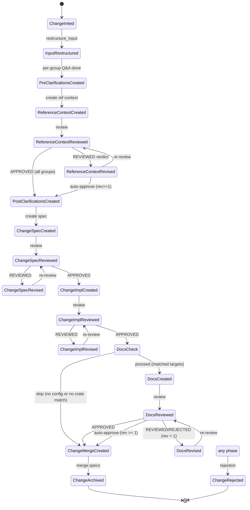

# State Machine Docs Phase

## Overview

Extend the SDD state machine to include the docs generation phase. Inserts four new `StatePhase` variants and corresponding transitions between `ChangeImplementationReviewed` and `ChangeMergeCreated`.

| Aspect | Value |
|--------|-------|
| Target spec | `cclab/specs/crates/cclab-sdd/logic/state-machine.md` |
| Action | Modify — add states, transitions, routing entries |
| New states | `DocsCheck` (transient), `DocsCreated`, `DocsReviewed`, `DocsRevised` |
| Insertion point | After `ChangeImplementationReviewed` (APPROVED), before `ChangeMergeCreated` |
| Guard | `DocsCheck` — transient choice state resolved inline in `route()` (no agent dispatch) |
| CRR states | `DocsCreated` → `DocsReviewed` → `DocsRevised` (same max-1-revision pattern) |
| Skip path | No `[sdd.docs]` config OR no crate intersection → straight to `ChangeMergeCreated` |
| Total variants | 16 → 20 (adds `docs_check`, `docs_created`, `docs_reviewed`, `docs_revised`) |

**Scope**: StatePhase enum, Phase Flow diagram, Phase Routing table, x-total-variants count. Detailed docs-phase logic (decision tree, target matching, prompt building) lives in `docs-phase-logic` change-spec.
## Requirements

### R1: StatePhase enum extension
- Add four variants: `docs_check`, `docs_created`, `docs_reviewed`, `docs_revised`
- Update `x-total-variants` from 16 to 20
- `docs_check` is a transient choice state (not terminal, not CRR)
- `docs_created`, `docs_reviewed`, `docs_revised` form a CRR triple
- Update `x-note` to document docs phase: "Docs have CRR (Created/Reviewed/Revised). DocsCheck is transient — resolved inline, not a persisted phase."

### R2: Phase Flow diagram update
- Insert docs phase states between `ChangeImplReviewed` and `ChangeMergeCreated`
- `ChangeImplReviewed` APPROVED → `DocsCheck` (not directly to `ChangeMergeCreated`)
- `DocsCheck` is a `<<choice>>` pseudo-state with two exits: skip → `ChangeMergeCreated`, proceed → `DocsCreated`
- `DocsCreated` → `DocsReviewed` → `DocsRevised` → `DocsReviewed` (CRR cycle)
- `DocsReviewed` APPROVED → `ChangeMergeCreated`
- `DocsReviewed` REVIEWED (rev >= 1) → auto-approve → `ChangeMergeCreated`

### R3: Phase Routing table update
- Add routing entries for `DocsCheck`, `DocsCreated`, `DocsReviewed`, `DocsRevised`
- `ChangeImplReviewed` (APPROVED) routes through `DocsCheck` inline before reaching `ChangeMergeCreated`
- `DocsCreated` → `sdd_workflow_create_change_docs`
- `DocsReviewed` → `sdd_workflow_review_change_docs`
- `DocsRevised` → `sdd_workflow_revise_change_docs`

### R4: CRR cycle consistency
- Docs CRR follows same max-1-revision pattern as existing spec/impl CRR
- Auto-approve on `rev >= 1`, same as reference context CRR
## Scenarios

### S1: Skip — no `[sdd.docs]` config
| Step | State | Action |
|------|-------|--------|
| 1 | `ChangeImplReviewed` | APPROVED verdict |
| 2 | `DocsCheck` (transient) | `route()` reads config → no `[sdd.docs]` section |
| 3 | `ChangeMergeCreated` | Skip directly, no agent dispatch |

### S2: Skip — config exists but no crate match
| Step | State | Action |
|------|-------|--------|
| 1 | `ChangeImplReviewed` | APPROVED verdict |
| 2 | `DocsCheck` (transient) | Config has `[sdd.docs]` with targets for `cclab-mamba` |
| 3 | `DocsCheck` | Change affects only `cclab-pg` → intersection is empty |
| 4 | `ChangeMergeCreated` | Skip, no agent dispatch |

### S3: Happy path — single target, approved on first review
| Step | State | Action |
|------|-------|--------|
| 1 | `ChangeImplReviewed` | APPROVED verdict |
| 2 | `DocsCheck` (transient) | Config has target `cclab-sdd`, change affects `cclab-sdd` → match |
| 3 | `DocsCreated` | Dispatch `sdd-doc-writer` → generates guide sections |
| 4 | `DocsReviewed` | Dispatch `sdd-doc-reviewer` → APPROVED |
| 5 | `ChangeMergeCreated` | All targets done, advance |

### S4: CRR with revision — REVIEWED then auto-approve
| Step | State | Action |
|------|-------|--------|
| 1 | `DocsCreated` | Dispatch `sdd-doc-writer` → initial docs |
| 2 | `DocsReviewed` | `sdd-doc-reviewer` → REVIEWED (soft issues), rev=0 < 1 |
| 3 | `DocsRevised` | Dispatch `sdd-doc-writer` with feedback → revised docs |
| 4 | `DocsReviewed` | `sdd-doc-reviewer` → REVIEWED again, rev=1 >= 1 → auto-approve |
| 5 | `ChangeMergeCreated` | Auto-approve advances to merge |

### S5: Multi-target — two matched targets
| Step | State | Action |
|------|-------|--------|
| 1 | `DocsCheck` | Two matched targets: `cclab-sdd`, `cclab-mamba` |
| 2 | `DocsCreated` | Process target[0] `cclab-sdd`: CRR → APPROVED |
| 3 | `DocsCreated` | Process target[1] `cclab-mamba`: CRR → APPROVED |
| 4 | `ChangeMergeCreated` | All targets done |

### S6: REJECTED verdict — full rewrite
| Step | State | Action |
|------|-------|--------|
| 1 | `DocsCreated` | `sdd-doc-writer` creates docs |
| 2 | `DocsReviewed` | `sdd-doc-reviewer` → REJECTED, rev=0 < 1 |
| 3 | `DocsRevised` | `sdd-doc-writer` rewrites with rejection feedback |
| 4 | `DocsReviewed` | Re-review → auto-approve (rev >= 1) |
| 5 | `ChangeMergeCreated` | Advance |
## Diagrams

### Interaction
<!-- type: interaction lang: mermaid -->
<!-- TODO -->

### Logic
<!-- type: logic lang: mermaid -->
<!-- TODO -->

### Dependencies
<!-- type: dependency lang: mermaid -->
<!-- TODO -->

### State Machine
<!-- type: state-machine lang: mermaid -->
<!-- TODO -->

### Data Model
<!-- type: db-model lang: mermaid -->
<!-- TODO -->

## API Spec

### REST API
<!-- type: rest-api lang: yaml -->
<!-- TODO -->

### RPC API
<!-- type: rpc-api lang: json -->
<!-- TODO -->

### Async API
<!-- type: async-api lang: yaml -->
<!-- TODO -->

### CLI
<!-- type: cli lang: yaml -->
<!-- TODO -->

### Schema
<!-- type: schema lang: json -->
<!-- TODO -->

### Config
<!-- type: config lang: json -->
<!-- TODO -->

## Test Plan
<!-- type: test-plan lang: markdown -->

<!-- TODO -->

## Changes

```yaml
changes:
  - path: cclab/specs/crates/cclab-sdd/logic/state-machine.md
    action: modify
    description: |
      § StatePhase (JSON Schema):
      1. Insert four enum variants after "change_implementation_revised":
         "docs_check", "docs_created", "docs_reviewed", "docs_revised"
      2. Add "x-transient": ["docs_check"]
      3. Update "x-total-variants": 16 → 20
      4. Update "x-note" to include docs phase:
         append "Docs have CRR (Created/Reviewed/Revised). DocsCheck is transient — resolved inline in route(), not a persisted phase."

      § Phase Flow (Mermaid stateDiagram-v2):
      1. Change transition: ChangeImplReviewed APPROVED → DocsCheck (was → ChangeMergeCreated)
      2. Add DocsCheck as <<choice>> pseudo-state:
         - DocsCheck → ChangeMergeCreated: skip (no config or no crate match)
         - DocsCheck → DocsCreated: proceed (matched targets)
      3. Add docs CRR transitions:
         - DocsCreated → DocsReviewed: review
         - DocsReviewed → DocsRevised: REVIEWED/REJECTED (rev < 1)
         - DocsReviewed → ChangeMergeCreated: APPROVED
         - DocsReviewed → ChangeMergeCreated: auto-approve (rev >= 1)
         - DocsRevised → DocsReviewed: re-review

      § Phase Routing table:
      1. Insert after ChangeImplementation row, before ChangeMergeCreated:
         | DocsCheck | _(transient — resolved inline in route())_ |
         | DocsCreated | sdd_workflow_create_change_docs |
         | DocsReviewed | sdd_workflow_review_change_docs |
         | DocsRevised | sdd_workflow_revise_change_docs |
      2. ChangeImplReviewed APPROVED no longer routes directly to ChangeMergeCreated;
         route() calls docs_check() inline which determines skip vs proceed.

  - path: crates/cclab-sdd/src/models/state.rs
    action: modify
    description: |
      Add StatePhase enum variants: DocsCheck, DocsCreated, DocsReviewed, DocsRevised.
      Insert after ChangeImplementationRevised, before ChangeMergeCreated.
      Add serde rename: #[serde(rename = "docs_check")] etc.

  - path: crates/cclab-sdd/src/tools/phase_transition.rs
    action: modify
    description: |
      Update route() function:
      1. After ChangeImplReviewed (APPROVED), call docs_check() inline instead of
         advancing directly to ChangeMergeCreated.
      2. Add match arms for DocsCreated, DocsReviewed, DocsRevised routing.
      3. DocsCheck is never persisted — resolved in same route() call.
```
## Wireframe
<!-- type: wireframe lang: yaml -->

<!-- TODO -->

## Component
<!-- type: component lang: json -->

<!-- TODO -->

## Design Token
<!-- type: design-token lang: json -->

<!-- TODO -->

## Doc
<!-- type: doc lang: markdown -->

<!-- TODO -->


## State Machine

### Updated StatePhase Enum

```json
{
  "$schema": "https://json-schema.org/draft/2020-12/schema",
  "title": "StatePhase",
  "type": "string",
  "enum": [
    "change_inited",
    "input_restructured",
    "pre_clarifications_created",
    "reference_context_created",
    "reference_context_reviewed",
    "reference_context_revised",
    "post_clarifications_created",
    "change_spec_created",
    "change_spec_reviewed",
    "change_spec_revised",
    "change_implementation_created",
    "change_implementation_reviewed",
    "change_implementation_revised",
    "docs_check",
    "docs_created",
    "docs_reviewed",
    "docs_revised",
    "change_merge_created",
    "change_archived",
    "change_rejected"
  ],
  "x-terminal": ["change_archived", "change_rejected"],
  "x-transient": ["docs_check"],
  "x-total-variants": 20,
  "x-note": "Pre/Post-clarifications are create-only (no CRR). Reference context, spec, impl, docs have CRR (Created/Reviewed/Revised). DocsCheck is transient — resolved inline in route(), not a persisted phase. Merge is create-only (programmatic replace, no review cycle). APPROVED verdict advances directly to next phase's Created — no intermediate Approved state."
}
```

### Updated Phase Flow



### Updated Phase Routing

| StatePhase | Next Tool |
|------------|----------|
| _(no dir)_ | `sdd_workflow_init_change` |
| `ChangeInited` | `sdd_workflow_restructure_input` |
| `InputRestructured` | `sdd_workflow_create_pre_clarifications` |
| `PreClarificationsCreated` | `sdd_workflow_create_reference_context` |
| `ReferenceContext{Created,Reviewed,Revised}` | `sdd_workflow_create_reference_context` |
| `PostClarificationsCreated` | `sdd_workflow_create_post_clarifications` |
| `ChangeSpec{Created,Reviewed,Revised}` | `sdd_workflow_create_change_spec` |
| `ChangeImplementation{Created,Reviewed,Revised}` | `sdd_workflow_create_change_implementation` |
| `DocsCheck` | _(transient — resolved inline in route())_ |
| `DocsCreated` | `sdd_workflow_create_change_docs` |
| `DocsReviewed` | `sdd_workflow_review_change_docs` |
| `DocsRevised` | `sdd_workflow_revise_change_docs` |
| `ChangeMergeCreated` | `sdd_workflow_create_change_merge` |
| `ChangeArchived` / `ChangeRejected` | _(terminal)_ |

# Reviews
