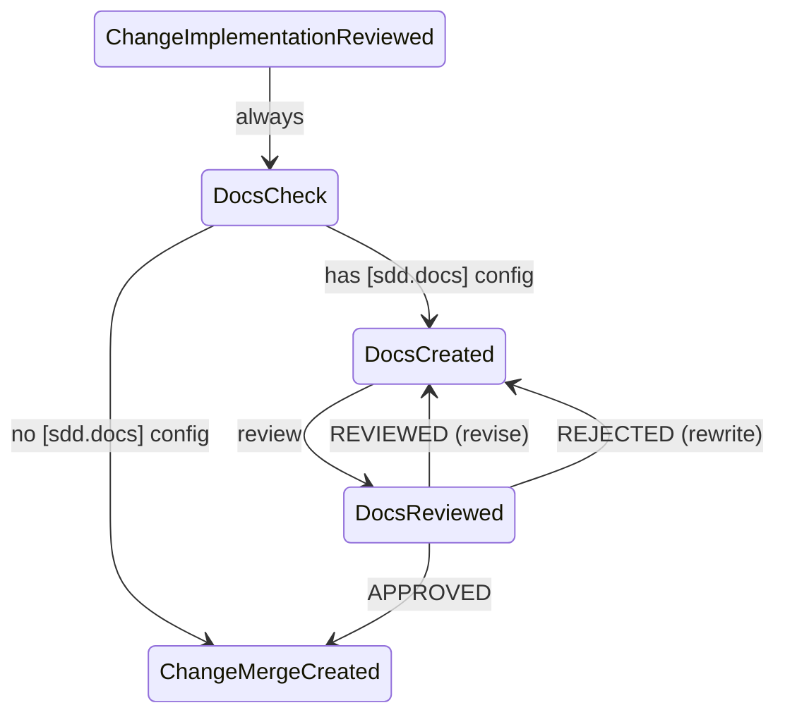
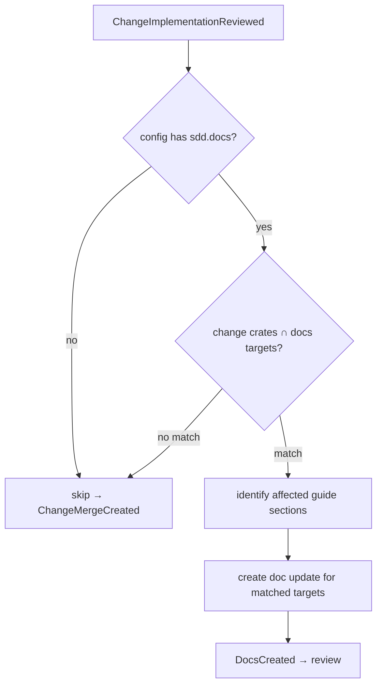

# #1145 — feat(sdd): docs generation phase — spec-driven user manual updates

## Summary

Add a docs generation phase to the SDD workflow with full CRR cycle. Controlled via `cclab/config.toml` — if `[sdd.docs]` is configured, the phase runs; no config = skip.

## Config

```toml
[sdd.docs]
output_dir = "docs"

[[sdd.docs.targets]]
crate = "cclab-sdd"
guide = "docs/sdd-user-guide.md"
audience = "developer"           # developer | end-user | admin
sections = ["getting-started", "workflow", "cli-reference", "config-reference"]

[[sdd.docs.targets]]
crate = "cclab-mamba"
guide = "docs/mamba-guide.md"
audience = "end-user"
sections = ["getting-started", "stdlib", "examples"]
```

No `enabled` flag — presence of `[sdd.docs]` section = enabled.

## State Machine



Decision tree inside DocsCheck:



## CRR Cycle

Same pattern as implementation CRR:

| Step | Agent | Input | Output |
|------|-------|-------|--------|
| Create | doc-writer | change specs + existing guide + audience config | updated guide sections |
| Review | doc-reviewer | updated guide vs specs vs audience | verdict: APPROVED / REVIEWED / REJECTED |
| Revise | doc-writer | review feedback | revised guide sections |

## Review Checklist

### Hard (must pass)
- Accuracy: docs match actual implementation behavior
- Completeness: all changed CLI commands / config options documented
- No regression: unchanged sections not broken

### Soft (REVIEWED)
- Audience fit: tone and detail level match target audience
- Examples: runnable examples where applicable
- Flow: sections read naturally in order

## Phase Design

| Aspect | Decision |
|--------|----------|
| When | After implementation reviewed, before merge |
| Trigger | `[sdd.docs]` section exists in config AND change crates intersect targets |
| CRR | Yes — Create-Review-Revise, same as implementation |
| Input | Change specs, existing guide file, audience/sections config |
| Output | Updated guide sections committed with the change |
| Source material | CLI specs → command reference, Config specs → config guide, Scenarios → usage examples |

## Acceptance Criteria

- `[sdd.docs]` config section parsed and validated
- State machine: DocsCheck / DocsCreated / DocsReviewed states
- Decision tree: skip when no config or no crate match
- Full CRR: create → review → revise until approved
- Guide sections written to `output_dir`
- Included in merge commit alongside code

Depends on: #1142 (check-alignment Phase 3 — workflow integration patterns)
