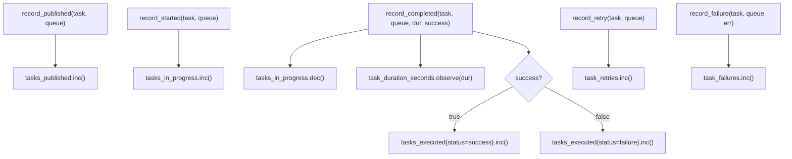

# Metrics

## Overview

<!-- type: overview lang: markdown -->

`TaskMetrics` is the Prometheus-based observability struct for cclab-queue, gated behind `#[cfg(feature = "metrics")]`. It exposes 6 metric instruments:

| Instrument | Type | Label Keys | Prometheus Name |
|------------|------|------------|----------------|
| `tasks_published` | CounterVec | task_name, queue | `tasks_published_total` |
| `tasks_executed` | CounterVec | task_name, queue, status | `tasks_executed_total` |
| `task_duration_seconds` | HistogramVec | task_name, queue | `task_duration_seconds` |
| `tasks_in_progress` | GaugeVec | task_name, queue | `tasks_in_progress` |
| `task_retries` | CounterVec | task_name, queue | `task_retries_total` |
| `task_failures` | CounterVec | task_name, queue, error_type | `task_failures_total` |

Convenience methods (`record_published`, `record_started`, `record_completed`, `record_retry`, `record_failure`) encapsulate label construction and metric updates. A global `METRICS` static (`Lazy<TaskMetrics>`) provides singleton access. `gather_metrics()` exports all registered metrics in Prometheus text format.

This spec defines the data model, recording logic, and test plan for unit test coverage of `crates/cclab-queue/src/metrics.rs`.
## Requirements
<!-- type: requirements lang: markdown -->

<!-- TODO -->

## Scenarios
<!-- type: scenarios lang: markdown -->

<!-- TODO -->

## Diagrams

### Interaction
<!-- type: interaction lang: mermaid -->
<!-- TODO -->

### Logic
<!-- type: logic lang: mermaid -->
<!-- TODO -->

### Dependencies
<!-- type: dependency lang: mermaid -->
<!-- TODO -->

### State Machine
<!-- type: state-machine lang: mermaid -->
<!-- TODO -->

### Data Model
<!-- type: db-model lang: mermaid -->
<!-- TODO -->

## API Spec

### REST API
<!-- type: rest-api lang: yaml -->
<!-- TODO -->

### RPC API
<!-- type: rpc-api lang: json -->
<!-- TODO -->

### Async API
<!-- type: async-api lang: yaml -->
<!-- TODO -->

### CLI
<!-- type: cli lang: yaml -->
<!-- TODO -->

### Schema
<!-- type: schema lang: json -->
<!-- TODO -->

### Config
<!-- type: config lang: json -->
<!-- TODO -->

## Test Plan

<!-- type: test-plan lang: markdown -->

All tests go in `crates/cclab-queue/src/metrics.rs` as `#[cfg(test)] mod tests`. Tests require `--features metrics` to compile.

**Important**: Prometheus global registry is shared per-process. Each test must use unique metric names or run in isolation. Use `#[serial_test::serial]` or unique label values per test to avoid registration conflicts.

### Unit Tests (feature = "metrics")

| ID | Test | Covers | Assertion |
|----|------|--------|-----------|
| T1 | `new_creates_all_instruments` | `TaskMetrics::new()` | All 6 fields are accessible without panic |
| T2 | `default_delegates_to_new` | `Default` impl | `TaskMetrics::default()` does not panic, fields match `new()` behavior |
| T3 | `record_published_increments` | `record_published` | After calling `record_published("my_task", "default")`, counter value for those labels is 1.0 |
| T4 | `record_published_multiple` | `record_published` | Calling twice increments counter to 2.0 |
| T5 | `record_started_increments_gauge` | `record_started` | After `record_started("t", "q")`, gauge value is 1.0 |
| T6 | `record_completed_success` | `record_completed` success path | `tasks_in_progress` decremented, `task_duration_seconds` observed, `tasks_executed{status=success}` incremented |
| T7 | `record_completed_failure` | `record_completed` failure path | `tasks_executed{status=failure}` incremented, gauge decremented |
| T8 | `record_completed_duration_observed` | `record_completed` histogram | `task_duration_seconds` sample count increases by 1, sample sum increases by duration |
| T9 | `record_retry_increments` | `record_retry` | Counter for given labels is 1.0 after one call |
| T10 | `record_failure_increments` | `record_failure` | Counter with `[task_name, queue, error_type]` labels is 1.0 |
| T11 | `record_failure_different_error_types` | `record_failure` label isolation | Two calls with different `error_type` → each label combination has count 1.0 |
| T12 | `gauge_start_complete_returns_to_zero` | `record_started` + `record_completed` | After start then complete, gauge is 0.0 |
| T13 | `histogram_bucket_boundaries` | HistogramOpts buckets | `task_duration_seconds` metric has exactly 9 bucket boundaries matching `[0.001, 0.005, 0.01, 0.05, 0.1, 0.5, 1.0, 5.0, 10.0]` |
| T14 | `gather_metrics_returns_text` | `gather_metrics()` | Returns non-empty String containing Prometheus text format (`# HELP`, `# TYPE`) |
| T15 | `gather_metrics_includes_registered` | `gather_metrics()` after recording | Output contains `tasks_published_total` after calling `record_published` |
| T16 | `label_isolation_across_queues` | Label dimension independence | `record_published("t", "q1")` does not affect counter for `("t", "q2")` |
| T17 | `label_isolation_across_tasks` | Label dimension independence | `record_published("t1", "q")` does not affect counter for `("t2", "q")` |
| T18 | `metrics_static_is_lazy` | `METRICS` static | Accessing `METRICS.tasks_published` does not panic |
| T19 | `concurrent_recording_safe` | Thread safety | Spawn 10 threads each calling `record_published` — no panic, final count is 10 |

### Compile-gated Tests (feature disabled)

| ID | Test | Covers | Assertion |
|----|------|--------|-----------|
| T20 | `no_metrics_module_without_feature` | Feature gate | `#[cfg(not(feature = "metrics"))]` test asserts module is excluded — compile-only verification (this test lives outside metrics.rs, e.g., in `tests/feature_gates.rs`) |
## Changes

<!-- type: changes lang: yaml -->

```yaml
_sdd:
  id: metrics-changes
  refs:
    - $ref: "#task-metrics-schema"
changes:
  - path: crates/cclab-queue/src/metrics.rs
    action: modify
    description: Add #[cfg(test)] mod tests with 19 unit tests covering TaskMetrics construction, all record_* methods, label isolation, histogram buckets, gather_metrics output, METRICS static, and concurrent safety
  - path: crates/cclab-queue/tests/feature_gates.rs
    action: create
    description: Add compile-gate verification test (T20) asserting metrics module excluded when feature disabled
  - path: crates/cclab-queue/Cargo.toml
    action: modify
    description: Add serial_test to dev-dependencies for metric registration isolation
```
## Wireframe
<!-- type: wireframe lang: yaml -->

<!-- TODO -->

## Component
<!-- type: component lang: json -->

<!-- TODO -->

## Design Token
<!-- type: design-token lang: json -->

<!-- TODO -->

## Doc
<!-- type: doc lang: markdown -->

<!-- TODO -->


## Logic

<!-- type: logic lang: mermaid -->

Task lifecycle metric recording flow:



### Histogram Buckets

`task_duration_seconds` uses custom bucket boundaries:

| Bucket (seconds) |
|---|
| 0.001 |
| 0.005 |
| 0.01 |
| 0.05 |
| 0.1 |
| 0.5 |
| 1.0 |
| 5.0 |
| 10.0 |

### Label Schema

| Method | Labels Applied |
|--------|---------------|
| `record_published` | `[task_name, queue]` |
| `record_started` | `[task_name, queue]` |
| `record_completed` | gauge: `[task_name, queue]`, histogram: `[task_name, queue]`, counter: `[task_name, queue, status]` |
| `record_retry` | `[task_name, queue]` |
| `record_failure` | `[task_name, queue, error_type]` |

### Feature Gate

All types, methods, and the `METRICS` static are behind `#[cfg(feature = "metrics")]`. When the feature is disabled, the entire `metrics` module is excluded from compilation.


## Schema

<!-- type: schema lang: json -->

```json
{
  "$id": "task-metrics",
  "title": "TaskMetrics",
  "description": "Prometheus metric instruments for task queue observability",
  "type": "object",
  "properties": {
    "tasks_published": {
      "type": "object",
      "description": "CounterVec — total tasks published",
      "x-prometheus": { "type": "counter", "name": "tasks_published_total", "labels": ["task_name", "queue"] }
    },
    "tasks_executed": {
      "type": "object",
      "description": "CounterVec — total tasks executed",
      "x-prometheus": { "type": "counter", "name": "tasks_executed_total", "labels": ["task_name", "queue", "status"] }
    },
    "task_duration_seconds": {
      "type": "object",
      "description": "HistogramVec — task execution duration",
      "x-prometheus": { "type": "histogram", "name": "task_duration_seconds", "labels": ["task_name", "queue"], "buckets": [0.001, 0.005, 0.01, 0.05, 0.1, 0.5, 1.0, 5.0, 10.0] }
    },
    "tasks_in_progress": {
      "type": "object",
      "description": "GaugeVec — tasks currently executing",
      "x-prometheus": { "type": "gauge", "name": "tasks_in_progress", "labels": ["task_name", "queue"] }
    },
    "task_retries": {
      "type": "object",
      "description": "CounterVec — total task retries",
      "x-prometheus": { "type": "counter", "name": "task_retries_total", "labels": ["task_name", "queue"] }
    },
    "task_failures": {
      "type": "object",
      "description": "CounterVec — total task failures",
      "x-prometheus": { "type": "counter", "name": "task_failures_total", "labels": ["task_name", "queue", "error_type"] }
    }
  },
  "required": ["tasks_published", "tasks_executed", "task_duration_seconds", "tasks_in_progress", "task_retries", "task_failures"],
  "x-sdd": {
    "id": "task-metrics-schema",
    "source": "crates/cclab-queue/src/metrics.rs",
    "feature_gate": "metrics",
    "deps": ["prometheus", "once_cell"]
  }
}
```

# Reviews
