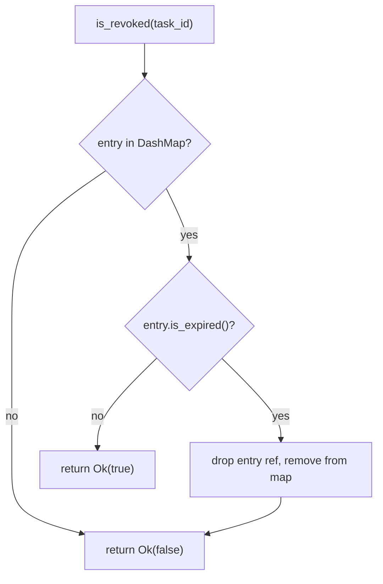
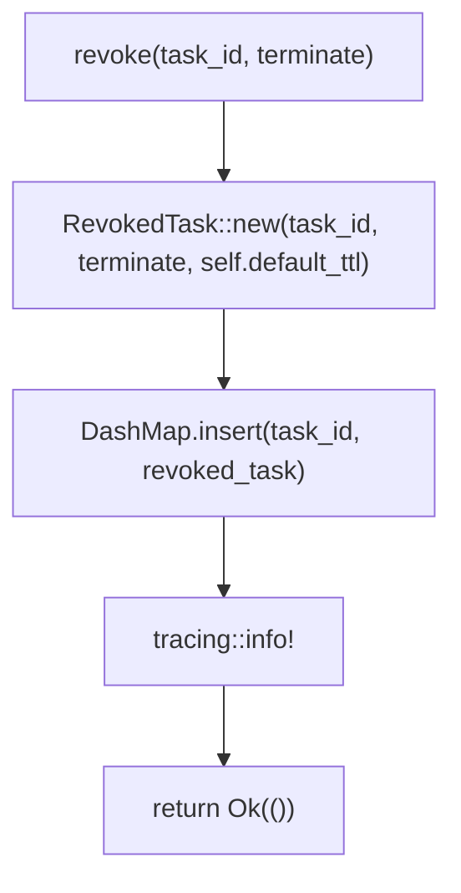
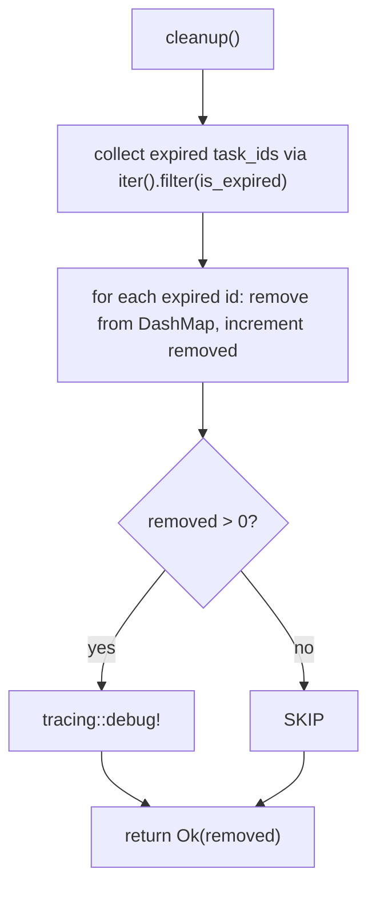
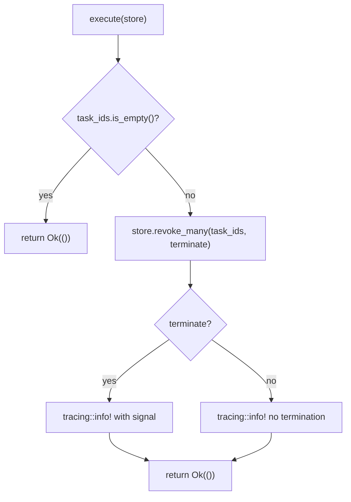

# Revocation

## Overview

<!-- type: overview lang: markdown -->

Task revocation system for cclab-queue. Provides mechanisms to revoke tasks (prevent execution or terminate running tasks) via pluggable storage backends.

| Component | Type | Purpose |
|-----------|------|--------|
| `RevokedTask` | Record struct | Revocation record: `task_id`, `revoked_at`, `terminate`, `expires_at`; `new()` constructor with optional TTL, `is_expired()` check |
| `RevocationStore` | Async trait | Backend-agnostic interface: `is_revoked`, `revoke`, `revoke_many`, `get_revoked`, `cleanup` — Send + Sync + 'static |
| `InMemoryRevocationStore` | Impl (DashMap) | Thread-safe non-distributed store; `new()`, `with_ttl()`, `len()`, `is_empty()`, `Default`; auto-removes expired entries on `is_revoked` check |
| `RedisRevocationStore` | Impl (feature="redis") | Distributed store using Redis SET + key-value; per-key TTL via EXPIRE; `new()`, `with_prefix()`, `with_ttl()` |
| `RevokeRequest` | Builder | Batch revocation builder: `task_id()`, `task_ids()`, `terminate()`, `signal()`, `execute()` |
| `RevokeByNameRequest` | Builder | Name-based revocation: `terminate()`, `signal()` (requires external task registry lookup) |
| `revoke()` | Helper fn | Creates `RevokeRequest` for a single `TaskId` |
| `revoke_by_name()` | Helper fn | Creates `RevokeByNameRequest` for a task name |

Worker integration: `TaskExecutor::check_revocation()` queries the store before execution; if revoked, emits `Signal::TaskRevoked` and transitions task state to `Revoked`.

This spec defines the logic, data model, and test plan for achieving comprehensive unit test coverage of `crates/cclab-queue/src/revocation.rs`.
## Requirements
<!-- type: requirements lang: markdown -->

<!-- TODO -->

## Scenarios
<!-- type: scenarios lang: markdown -->

<!-- TODO -->

## Diagrams

### Interaction
<!-- type: interaction lang: mermaid -->
<!-- TODO -->

### Logic
<!-- type: logic lang: mermaid -->
<!-- TODO -->

### Dependencies
<!-- type: dependency lang: mermaid -->
<!-- TODO -->

### State Machine
<!-- type: state-machine lang: mermaid -->
<!-- TODO -->

### Data Model
<!-- type: db-model lang: mermaid -->
<!-- TODO -->

## API Spec

### REST API
<!-- type: rest-api lang: yaml -->
<!-- TODO -->

### RPC API
<!-- type: rpc-api lang: json -->
<!-- TODO -->

### Async API
<!-- type: async-api lang: yaml -->
<!-- TODO -->

### CLI
<!-- type: cli lang: yaml -->
<!-- TODO -->

### Schema
<!-- type: schema lang: json -->
<!-- TODO -->

### Config
<!-- type: config lang: json -->
<!-- TODO -->

## Test Plan

<!-- type: test-plan lang: markdown -->

All tests go in `crates/cclab-queue/src/revocation.rs` as `#[cfg(test)] mod tests`. Existing 9 tests are kept; new tests fill coverage gaps.

### RevokedTask

| ID | Test | Covers | Assertion |
|----|------|--------|-----------|
| T1 | `revoked_task_new_no_ttl` | `RevokedTask::new` without TTL | `task_id` matches input, `terminate == false`, `expires_at == None`, `revoked_at <= Utc::now()` |
| T2 | `revoked_task_new_with_ttl` | `RevokedTask::new` with TTL | `expires_at.is_some()`, `expires_at.unwrap() > revoked_at` |
| T3 | `revoked_task_new_terminate_flag` | `terminate` field propagation | `RevokedTask::new(id, true, None).terminate == true` |
| T4 | `revoked_task_is_expired_none` | `is_expired` with `expires_at == None` | returns `false` |
| T5 | `revoked_task_is_expired_future` | `is_expired` with future expiry | returns `false` |
| T6 | `revoked_task_is_expired_past` | `is_expired` with past expiry | returns `true` (construct with tiny TTL, sleep past it) |
| T7 | `revoked_task_serde_roundtrip` | Serialize + Deserialize | `serde_json::to_string` then `from_str` recovers matching fields |
| T8 | `revoked_task_debug_impl` | Debug derive | `format!("{:?}", task)` contains `"RevokedTask"` |
| T9 | `revoked_task_clone` | Clone derive | cloned task has same `task_id`, `terminate`, `expires_at` |

### InMemoryRevocationStore — Construction

| ID | Test | Covers | Assertion |
|----|------|--------|-----------|
| T10 | `store_new_empty` | `InMemoryRevocationStore::new()` | `is_empty() == true`, `len() == 0` |
| T11 | `store_default_equals_new` | `Default` impl | `InMemoryRevocationStore::default().is_empty()` |
| T12 | `store_with_ttl_empty` | `with_ttl()` constructor | `is_empty() == true`, `len() == 0` |

### InMemoryRevocationStore — RevocationStore trait

| ID | Test | Covers | Assertion |
|----|------|--------|-----------|
| T13* | `test_revoke_single` | `revoke` + `is_revoked` basic | (existing) |
| T14* | `test_revoke_many` | `revoke_many` + `get_revoked` | (existing) |
| T15* | `test_is_revoked` | `is_revoked` with different IDs | (existing) |
| T16* | `test_cleanup_expired` | `cleanup` removes expired | (existing) |
| T17* | `test_revocation_expires` | `is_revoked` auto-removes expired | (existing) |
| T18 | `is_revoked_auto_removes_expired_entry` | `is_revoked` expired path: entry removed from map | After expired entry, `is_revoked` returns false AND `len() == 0` |
| T19 | `get_revoked_filters_expired` | `get_revoked` skips expired | Revoke 2 tasks (one with tiny TTL), sleep, `get_revoked` returns only non-expired |
| T20 | `cleanup_no_expired_returns_zero` | `cleanup` with no expired entries | Revoke task with no TTL, `cleanup()` returns `0` |
| T21 | `cleanup_mixed_expired_and_live` | `cleanup` partial removal | Revoke 3 tasks (2 with tiny TTL, 1 without), sleep, `cleanup()` returns `2`, `len() == 1` |
| T22 | `revoke_overwrites_existing` | `revoke` same task_id twice | Second revoke overwrites; `len() == 1`, `is_revoked` still true |
| T23 | `revoke_many_empty_slice` | `revoke_many(&[], terminate)` | Returns `Ok(())`, `len() == 0` |

### RevokeRequest Builder

| ID | Test | Covers | Assertion |
|----|------|--------|-----------|
| T24* | `test_revoke_request_builder` | Builder + execute | (existing) |
| T25 | `revoke_request_default` | `Default` impl | `task_ids.is_empty()`, `terminate == false`, `signal == None` |
| T26 | `revoke_request_new_equals_default` | `RevokeRequest::new()` == `Default` | Same field values |
| T27 | `revoke_request_task_ids_batch` | `task_ids()` builder (Vec) | `RevokeRequest::new().task_ids(vec![id1, id2]).task_ids.len() == 2` |
| T28 | `revoke_request_execute_empty` | `execute` with no task_ids | Returns `Ok(())`, store unchanged |
| T29 | `revoke_request_terminate_flag` | `terminate()` builder | `RevokeRequest::new().terminate(true).terminate == true` |
| T30 | `revoke_request_signal_builder` | `signal()` builder | `RevokeRequest::new().signal("SIGKILL".into()).signal == Some("SIGKILL")` |
| T31 | `revoke_request_chained_builder` | Full builder chain | `new().task_id(id).terminate(true).signal("SIGTERM".into())` — all fields set |

### RevokeByNameRequest

| ID | Test | Covers | Assertion |
|----|------|--------|-----------|
| T32* | `test_revoke_by_name` | Builder fields | (existing) |
| T33 | `revoke_by_name_defaults` | `revoke_by_name()` defaults | `terminate == false`, `signal == None`, `task_name` matches |
| T34 | `revoke_by_name_terminate` | `terminate()` builder | `revoke_by_name("t").terminate(true).terminate == true` |
| T35 | `revoke_by_name_signal` | `signal()` builder | `revoke_by_name("t").signal("SIGKILL".into()).signal == Some("SIGKILL")` |
| T36 | `revoke_by_name_debug_clone` | Debug + Clone derives | `format!("{:?}", req)` does not panic; `clone()` matches fields |

### Helper Functions

| ID | Test | Covers | Assertion |
|----|------|--------|-----------|
| T37* | `test_helper_functions` | `revoke()` helper | (existing) |
| T38 | `revoke_helper_creates_single_id` | `revoke()` returns request with 1 task_id | `revoke(id).task_ids.len() == 1`, `terminate == false` |

### Store Utility Methods

| ID | Test | Covers | Assertion |
|----|------|--------|-----------|
| T39* | `test_store_len_and_empty` | `len()`, `is_empty()` | (existing) |
| T40 | `store_len_after_multiple_revokes` | `len()` accuracy | Revoke 3 tasks → `len() == 3` |

### Trait + Thread Safety

| ID | Test | Covers | Assertion |
|----|------|--------|-----------|
| T41 | `in_memory_store_is_send_sync` | Send + Sync bounds | `fn assert_send_sync<T: Send + Sync>(){}; assert_send_sync::<InMemoryRevocationStore>()` |
| T42 | `revoked_task_is_send_sync` | Send + Sync bounds | `fn assert_send_sync<T: Send + Sync>(){}; assert_send_sync::<RevokedTask>()` |
| T43 | `concurrent_revoke_and_check` | Thread safety | Spawn 10 tokio tasks each revoking a unique ID; join all; `len() == 10` |
| T44 | `concurrent_revoke_same_id` | Concurrent writes to same key | Spawn 5 tasks revoking same ID; `is_revoked` returns true, `len() == 1` |

\* = existing test (kept as-is)
## Changes

<!-- type: changes lang: yaml -->

```yaml
_sdd:
  id: revocation-changes
  refs:
    - $ref: "#in-memory-is-revoked"
    - $ref: "#in-memory-revoke"
    - $ref: "#in-memory-cleanup"
    - $ref: "#revoke-request-execute"
changes:
  - path: crates/cclab-queue/src/revocation.rs
    action: modify
    description: >
      Expand existing #[cfg(test)] mod tests from 9 to 44 tests.
      Add coverage for: RevokedTask (new constructors, is_expired paths, serde roundtrip, Debug, Clone),
      InMemoryRevocationStore (Default, with_ttl, auto-remove on is_revoked, get_revoked filtering,
      cleanup edge cases, revoke overwrite, revoke_many empty slice),
      RevokeRequest (Default, new, task_ids batch, execute empty, builder chaining),
      RevokeByNameRequest (defaults, terminate, signal, Debug+Clone),
      helper functions (revoke single id verification),
      store utility methods (len accuracy),
      trait bounds (Send+Sync), and concurrent access safety.
```
## Wireframe
<!-- type: wireframe lang: yaml -->

<!-- TODO -->

## Component
<!-- type: component lang: json -->

<!-- TODO -->

## Design Token
<!-- type: design-token lang: json -->

<!-- TODO -->

## Doc
<!-- type: doc lang: markdown -->

<!-- TODO -->


## Logic

<!-- type: logic lang: mermaid -->

InMemoryRevocationStore `is_revoked` logic (auto-cleanup on expired entries):



InMemoryRevocationStore `revoke` logic:



InMemoryRevocationStore `cleanup` logic:



RevokeRequest `execute` logic:



### RevokedTask Fields

| Field | Type | Source |
|-------|------|--------|
| `task_id` | `TaskId` | Caller-provided |
| `revoked_at` | `DateTime<Utc>` | `Utc::now()` at construction |
| `terminate` | `bool` | Caller-provided |
| `expires_at` | `Option<DateTime<Utc>>` | `ttl.map(\|d\| revoked_at + d)` |

### Expiration Logic

| `expires_at` | `Utc::now()` vs `expires_at` | `is_expired()` |
|-------------|------------------------------|----------------|
| `None` | N/A | `false` |
| `Some(t)` | `now > t` | `true` |
| `Some(t)` | `now <= t` | `false` |

### RevocationStore Trait Methods

| Method | Semantics |
|--------|----------|
| `is_revoked(task_id)` | Check + auto-remove if expired (InMemory impl) |
| `revoke(task_id, terminate)` | Insert single revocation record |
| `revoke_many(task_ids, terminate)` | Iterate + call `revoke()` per id |
| `get_revoked()` | Return non-expired task_ids only |
| `cleanup()` | Remove all expired entries, return count |

# Reviews
