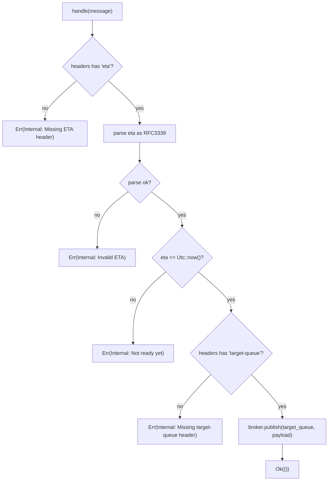
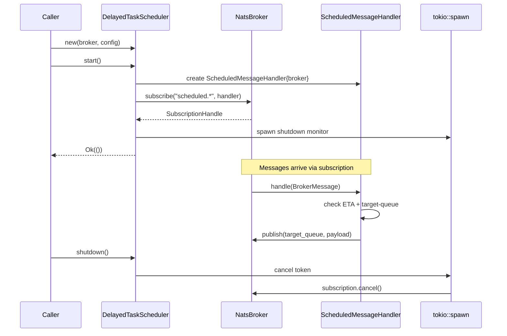

# Scheduler Delay

## Overview

<!-- type: overview lang: markdown -->

Delayed task scheduler for cclab-queue. Polls scheduled messages on NATS `scheduled.*` subjects and republishes them to target queues when ETA is reached. All types gated behind `#[cfg(feature = "nats")]`.

| Component | Type | Purpose |
|-----------|------|--------|
| `DelayedTaskConfig` | Config struct | `poll_interval: Duration` (default 1s), `batch_size: usize` (default 100); implements `Default`, `Debug`, `Clone` |
| `DelayedTaskScheduler` | Scheduler struct | Holds `config`, `broker: Arc<NatsBroker>`, `shutdown: CancellationToken`; methods `new`, `start`, `shutdown` |
| `ScheduledMessageHandler` | Inner struct (in `start`) | Implements `MessageHandler` trait; core decision logic for ETA checking + republish |

### Handler Decision Logic

| Header | Condition | Outcome |
|--------|-----------|--------|
| `eta` missing | — | `TaskError::Internal("Missing ETA header")` |
| `eta` present | Invalid RFC3339 | `TaskError::Internal("Invalid ETA: {e}")` |
| `eta` present | `eta > Utc::now()` | `TaskError::Internal("Not ready yet")` (nack/requeue) |
| `eta` present, `target-queue` missing | `eta <= Utc::now()` | `TaskError::Internal("Missing target-queue header")` |
| `eta` present, `target-queue` present | `eta <= Utc::now()` | `broker.publish(target_queue, payload)` → `Ok(())` |

This spec defines the logic and test plan for achieving unit + integration test coverage of `crates/cclab-queue/src/scheduler/delay.rs`.
## Requirements
<!-- type: requirements lang: markdown -->

<!-- TODO -->

## Scenarios
<!-- type: scenarios lang: markdown -->

<!-- TODO -->

## Diagrams

### Interaction
<!-- type: interaction lang: mermaid -->
<!-- TODO -->

### Logic
<!-- type: logic lang: mermaid -->
<!-- TODO -->

### Dependencies
<!-- type: dependency lang: mermaid -->
<!-- TODO -->

### State Machine
<!-- type: state-machine lang: mermaid -->
<!-- TODO -->

### Data Model
<!-- type: db-model lang: mermaid -->
<!-- TODO -->

## API Spec

### REST API
<!-- type: rest-api lang: yaml -->
<!-- TODO -->

### RPC API
<!-- type: rpc-api lang: json -->
<!-- TODO -->

### Async API
<!-- type: async-api lang: yaml -->
<!-- TODO -->

### CLI
<!-- type: cli lang: yaml -->
<!-- TODO -->

### Schema
<!-- type: schema lang: json -->
<!-- TODO -->

### Config
<!-- type: config lang: json -->
<!-- TODO -->

## Test Plan

<!-- type: test-plan lang: markdown -->

All tests go in `crates/cclab-queue/src/scheduler/delay.rs` under `#[cfg(all(test, feature = "nats"))] mod tests`. Existing 1 test (`test_config_defaults`) is kept; new tests fill coverage gaps.

Note: `ScheduledMessageHandler` is a local struct inside `start()` — cannot be directly unit tested. Handler logic requires either (a) refactoring to extract a module-level function, or (b) integration tests with real NATS. Both approaches are specified below.

### DelayedTaskConfig

| ID | Test | Covers | Assertion |
|----|------|--------|-----------|
| T1 | `config_defaults` | `Default` impl (existing) | `poll_interval == 1s`, `batch_size == 100` |
| T2 | `config_custom_values` | Custom construction | `DelayedTaskConfig { poll_interval: 5s, batch_size: 50 }` fields match |
| T3 | `config_debug_impl` | Debug derive | `format!("{:?}", config)` contains `"poll_interval"` |
| T4 | `config_clone` | Clone derive | Cloned config equals original field-by-field |
| T5 | `config_zero_batch_size` | Edge case | `batch_size: 0` is constructible (no panic) |
| T6 | `config_zero_poll_interval` | Edge case | `poll_interval: Duration::ZERO` is constructible |
| T7 | `config_large_batch_size` | Edge case | `batch_size: usize::MAX` is constructible |

### DelayedTaskScheduler Construction

| ID | Test | Covers | Assertion |
|----|------|--------|-----------|
| T8 | `scheduler_new_default_config` | `new()` with default config | Constructor does not panic |
| T9 | `scheduler_new_custom_config` | `new()` with custom config | Constructor does not panic |
| T10 | `scheduler_shutdown_before_start` | `shutdown()` without `start()` | Calling `shutdown()` on unstarted scheduler does not panic |
| T11 | `scheduler_shutdown_idempotent` | Double `shutdown()` | Calling `shutdown()` twice does not panic |

### Handler Logic (requires refactoring to module-level function)

Refactor: extract `check_scheduled_message(message: &BrokerMessage) -> Result<(&str, &TaskMessage), TaskError>` from the inner handler closure. Then unit test:

| ID | Test | Covers | Assertion |
|----|------|--------|-----------|
| T12 | `handler_missing_eta_header` | No "eta" header | `Err(Internal("Missing ETA header"))` |
| T13 | `handler_invalid_eta_format` | Malformed RFC3339 | `Err(Internal("Invalid ETA: ..."))` |
| T14 | `handler_eta_in_future` | ETA 1 hour from now | `Err(Internal("Not ready yet"))` |
| T15 | `handler_eta_reached_missing_target_queue` | ETA in past, no `target-queue` | `Err(Internal("Missing target-queue header"))` |
| T16 | `handler_eta_reached_with_target_queue` | ETA in past + valid `target-queue` | Returns `Ok` with target queue name and payload ref |
| T17 | `handler_eta_exactly_now` | ETA == now (boundary) | Returns `Ok` (eta <= now is true) |
| T18 | `handler_eta_just_past` | ETA 1ms ago | Returns `Ok` |
| T19 | `handler_eta_far_past` | ETA 24h ago | Returns `Ok` |
| T20 | `handler_empty_eta_string` | `eta: ""` header | `Err(Internal("Invalid ETA: ..."))` |
| T21 | `handler_eta_non_utc_timezone` | ETA with `+05:00` offset, already past | Returns `Ok` (converts to UTC correctly) |

### Integration Tests (require real NATS)

| ID | Test | Covers | Assertion |
|----|------|--------|-----------|
| T22 | `integration_start_and_shutdown` | Full lifecycle | `start()` → `shutdown()` completes without error |
| T23 | `integration_scheduled_message_delivered` | End-to-end happy path | Publish to `scheduled.test` with past ETA → message appears on target queue |
| T24 | `integration_future_message_not_delivered` | Future ETA nack | Publish with future ETA → message NOT on target queue within timeout |
| T25 | `integration_invalid_message_does_not_crash` | Error resilience | Publish message without ETA header → scheduler continues running |
## Changes

<!-- type: changes lang: yaml -->

```yaml
_sdd:
  id: scheduler-delay-changes
  refs:
    - $ref: "#scheduled-message-handler"
    - $ref: "#scheduler-lifecycle"
changes:
  - path: crates/cclab-queue/src/scheduler/delay.rs
    action: modify
    description: >
      Refactor: extract handler decision logic into module-level
      `check_scheduled_message` function (pub(crate) for testability).
      Expand existing #[cfg(all(test, feature = "nats"))] mod tests from 1 to 21 tests.
      Add unit tests for: DelayedTaskConfig (defaults, custom, Debug, Clone, edge cases),
      DelayedTaskScheduler construction (default config, custom config, shutdown idempotency),
      handler logic (missing ETA, invalid ETA, future ETA, missing target-queue, happy path, boundary cases).
  - path: crates/cclab-queue/tests/scheduler_delay_integration.rs
    action: create
    description: >
      Integration tests requiring real NATS.
      Tests: start+shutdown lifecycle, end-to-end scheduled message delivery,
      future ETA nack, error resilience for malformed messages.
      Gated behind #[cfg(feature = "nats")].
```
## Wireframe
<!-- type: wireframe lang: yaml -->

<!-- TODO -->

## Component
<!-- type: component lang: json -->

<!-- TODO -->

## Design Token
<!-- type: design-token lang: json -->

<!-- TODO -->

## Doc
<!-- type: doc lang: markdown -->

<!-- TODO -->


## Logic

<!-- type: logic lang: mermaid -->

ScheduledMessageHandler decision flowchart:



DelayedTaskScheduler lifecycle:



### DelayedTaskConfig Defaults

| Field | Type | Default |
|-------|------|---------|
| `poll_interval` | `Duration` | `1s` |
| `batch_size` | `usize` | `100` |

# Reviews
