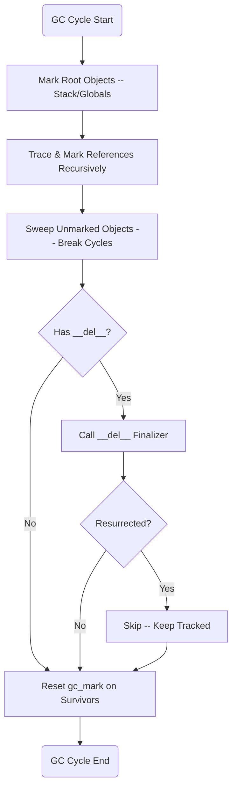

# Garbage Collection

## Overview

<!-- type: overview lang: markdown -->

Re-enable the cycle-detecting garbage collector after JIT refcounting is operational (#1129). Currently `GcState.enabled = false` (KI-1 mitigation from #1114) because JIT codegen did not emit `mb_retain`/`mb_release` calls, so `collect()` freed live objects whose refcounts were never incremented. With `EMIT_REFCOUNT_CALLS=true` and the closure ownership fix (closure-release-fix spec) complete, reference counting correctly manages object lifetimes -- most objects are freed deterministically by `mb_release_value` when refcount reaches zero. GC's role reduces to cycle reclamation only (self-referencing lists, dict cycles, etc.).

**Preconditions for re-enable:**

| Precondition | Source | Status |
|---|---|---|
| `mb_retain_value`/`mb_release_value` wrappers registered | rc.rs | done |
| Release-before-overwrite on all VReg writes | codegen/cranelift/mod.rs | done |
| Return-time local cleanup | codegen/cranelift/mod.rs emit_terminator | done |
| Immortal refcount for compile-time constants | rc.rs IMMORTAL_REFCOUNT | done |
| Closure ownership symmetry fix | closure-release-fix spec | this change |
| Runtime ownership audit (borrowed-reference retain) | jit-refcount-enable spec | done (rc.rs audit) |
| `EMIT_REFCOUNT_CALLS = true` | jit-refcount-enable spec | this change |

**What changes:** Set `GcState::new() { enabled: true }` in `runtime/gc.rs`. Update KI-1 status from `mitigated` to `resolved` in the main spec. Root scanning deferred -- GC uses only `gc_track`/`gc_untrack` container tracking and explicit `gc_add_root`/`gc_remove_root` calls. Conservative stack scanning is future work.

**Phase ordering:** This change is gated on `EMIT_REFCOUNT_CALLS=true` being active. GC must not be re-enabled before refcount emission because `collect()` would free live objects whose refcounts were never incremented by JIT code.

Issue: #1129. Related: #1114, #653.
## Source Files

| File | LOC | Responsibility |
|------|-----|----------------|
| `runtime/gc.rs` | 370 | Container tracking, mark-sweep, cycle detection, finalizers |

## Requirements

### R1 - Track Container Objects

```yaml
id: R1
priority: high
```

Track all heap-allocated container objects (lists, dicts, sets, instances) that can participate in reference cycles. Maintain a global container list that is updated on allocation and deallocation. Non-container types (int, float, str) are excluded from GC tracking.

### R2 - Mark-Sweep Collection Algorithm

```yaml
id: R2
priority: high
```

Provide a mark-sweep algorithm:

1. **Mark phase**: Start from root objects (stack frames, global variables). Set `gc_mark = true` on each root.
2. **Trace phase**: Recursively follow references from marked objects, marking all reachable objects.
3. **Sweep phase**: Iterate tracked containers. Any object with `gc_mark = false` is unreachable and can be freed.
4. **Reset phase**: Clear `gc_mark` on all surviving objects.

### R3 - Cycle Detection and Reclamation

```yaml
id: R3
priority: high
```

Correctly identify and reclaim objects that form reference cycles but are not reachable from any root. Example: two objects A and B where A references B and B references A, but no external reference exists to either.

### R4 - __del__ Finalizer Invocation

```yaml
id: R4
priority: medium
```

During sweep, before freeing an instance whose class defines `__del__`:
1. Call the `__del__` method on the instance.
2. If `__del__` creates a new external reference to the object (resurrection), skip collection for this cycle.
3. The resurrected object remains tracked for future GC cycles.

### R5 - Configurable Collection Thresholds

```yaml
id: R5
priority: medium
```

Support configurable thresholds that trigger automatic collection:
- `threshold_allocs`: Number of new container allocations before triggering GC.
- Manual trigger via `gc.collect()` builtin.
- Generational promotion (future): track object age across cycles.

## Acceptance Criteria

### Scenario: Reclaim reference cycle

- **GIVEN** Two objects A and B that reference each other but have no external references.
- **WHEN** The GC cycle is executed.
- **THEN** The GC identifies the cycle and reclaims both A and B.

### Scenario: Protect reachable objects

- **GIVEN** An object C reachable from a global variable.
- **WHEN** The GC cycle is executed.
- **THEN** The GC does NOT reclaim object C.

### Scenario: Finalizer invocation

- **GIVEN** An instance with `__del__` defined, part of an unreachable cycle.
- **WHEN** GC sweep reaches this instance.
- **THEN** `__del__` is called before deallocation.

### Scenario: Object resurrection

- **GIVEN** An instance whose `__del__` stores `self` in a global variable.
- **WHEN** GC sweep calls `__del__`.
- **THEN** The object is NOT freed; it remains tracked for future cycles.

## Known Issues

### KI-1: Auto-collection disabled — JIT codegen does not register GC roots

```yaml
id: KI-1
severity: P0
status: mitigated
affects: [R2, R3, R5]
```

Auto-collection remains disabled (`GcState.enabled = false`). Re-enablement in #1129 was reverted because `EMIT_REFCOUNT_CALLS=true` caused SIGBUS in sequential tests — `mb_closure_release` is asymmetric (removes closure from thread-local HashMap but does not release captured values), leading to use-after-free when tests share runtime state.

**Re-enable requirements:**
1. Fix closure ownership symmetry (`mb_closure_release` must cascade-release captures)
2. Audit remaining borrowed-reference returns not caught by first pass
3. Run full conformance suite under ASan with `EMIT_REFCOUNT_CALLS=true`
4. Flip both `EMIT_REFCOUNT_CALLS` and `GcState.enabled` to `true` in one commit

**History:** Auto-collection was previously disabled because the Cranelift JIT codegen did not register stack-allocated objects as GC roots. #1129 attempted to resolve this via refcount emission; the infrastructure (retain_if_ptr across ~22 borrowed-reference runtime functions) is in place but cannot be enabled until closure ownership is fixed.

## Diagrams

### Cycle-Detecting GC Flow




## Changes

<!-- type: changes lang: yaml -->

```yaml
files:
  - path: crates/mamba/src/runtime/gc.rs
    action: MODIFY
    targets:
      - type: struct
        name: GcState
        change: |
          In GcState::new(), change `enabled: false` to `enabled: true`.
          Keep `threshold: 700` (existing default -- sufficient for cycle-only
          collection since refcounting handles non-cyclic objects).
          Update the comment block at lines 46-49 from the KI-1 mitigation
          explanation to a resolution note: "Resolved by #1129 -- JIT codegen
          now emits mb_retain_value/mb_release_value. Closure ownership
          symmetry fixed. GC re-enabled for cycle collection only."
    do_not_touch:
      - gc_track
      - gc_untrack
      - gc_add_root
      - gc_remove_root
      - gc_register_thread
      - gc_unregister_thread
      - gc_safepoint
      - collect
      - sweep
      - mark_reachable

  - path: .score/tech_design/crates/mamba/runtime/gc.md
    action: MODIFY
    targets:
      - type: function
        name: KI-1
        change: |
          Update Known Issues section KI-1:
          - status: `mitigated` -> `resolved`
          - Add resolution note: "Resolved by #1129 -- JIT codegen now emits
            mb_retain_value/mb_release_value calls. EMIT_REFCOUNT_CALLS=true.
            Closure ownership symmetry fixed (mb_closure_release cascade-releases
            captures). GcState.enabled set back to true. Root scanning uses
            explicit gc_add_root/gc_remove_root; conservative stack scanning
            deferred."
```
# Reviews
