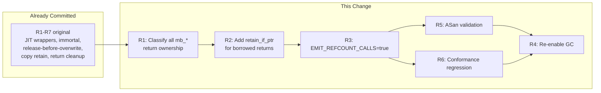

# Mamba Refcount Jit Spec

## Overview

<!-- type: overview lang: markdown -->

Enable CPython 3.12-style reference counting in Mamba's JIT codegen by flipping `EMIT_REFCOUNT_CALLS` from `false` to `true` in `codegen/cranelift/mod.rs` (#1129). This activates all conditional refcount emission blocks in both the AOT backend (mod.rs) and JIT backend (jit.rs), causing JIT-compiled code to emit `mb_retain_value`/`mb_release_value` calls for:

- **Copy**: retain new value after aliasing (two VRegs reference same object)
- **StoreGlobal/StoreCell**: release old value before overwriting
- **Return**: release all I64 local variables except the return value
- **Release-before-overwrite**: release old dest VReg before any instruction that writes a new value

**Infrastructure already committed** (all gated behind the `EMIT_REFCOUNT_CALLS` flag):

| Component | Status |
|-----------|--------|
| `mb_retain_value(u64)` / `mb_release_value(u64)` JIT wrappers | done (rc.rs) |
| Immortal refcount (`IMMORTAL_REFCOUNT = u32::MAX`) for compile-time constants | done (rc.rs) |
| `release_contained_values()` cascading release on free | done (rc.rs) |
| Release-before-overwrite for all VReg-writing instructions | done (mod.rs, jit.rs) |
| Copy retain (`mb_retain_value` after Copy) | done (mod.rs, jit.rs) |
| Return cleanup (release all locals except return value) | done (mod.rs emit_terminator) |
| Container retain-on-store (`mb_list_append`, `mb_dict_setitem`, `mb_set_add`) | done (list_ops.rs, dict_ops.rs, set_ops.rs) |
| Runtime ownership audit -- 22 borrowed-reference functions have `retain_if_ptr` | done (rc.rs doc comment) |

**Blocked by**: closure ownership symmetry bug (see closure-release-fix spec). `mb_closure_release` removes closures from the thread-local HashMap without releasing captured MbValues. Fix must land before enabling the flag.

**This change**: After closure fix lands, set `EMIT_REFCOUNT_CALLS = true`. Verify with `cargo test -p mamba --test jit_refcount_audit_tests -- --test-threads=1` and full conformance suite. Remove `#[ignore]` from `test_conformance_with_refcount_basic`.

Issue: #1129. Related: #1114 (SIGBUS crash that prompted GC disable), #653 (gc stdlib module, unblocked by this).
## Requirements

| ID | Title | Priority | Acceptance Criteria |
|----|-------|----------|---------------------|
| R1 | Classify all mb_* runtime functions returning MbValue | P0 | Create an ownership audit table covering every `mb_*` function registered in `runtime_symbols()` that returns `MbValue` (~80 functions). Classify each as: **new** (allocates or creates new MbObject, caller owns) or **borrowed** (returns pointer from existing container/global, container still owns). Document in `rc.rs` module-level comment. |
| R2 | Add retain_if_ptr for borrowed-reference returns | P0 | For each function classified as **borrowed** in R1, add `rc::retain_if_ptr(result)` before returning so the caller always receives an owned reference with rc incremented. Affected functions include: `mb_list_getitem`, `mb_dict_getitem`, `mb_tuple_getitem`, `mb_seq_getitem`, `mb_getattr`, `mb_global_get`, `mb_global_get_id`, `mb_cell_get`, `mb_closure_get_capture`, `mb_module_getattr`, `mb_import_from`, `mb_next`, `mb_next_raise`, `mb_generator_yield_value`, `mb_coroutine_get_local`, `mb_property_get`, `mb_super_getattr`, `mb_getattr_default`, `mb_dict_get`, `mb_dict_setdefault`, `mb_catch_exception`, `mb_catch_exception_instance`. |
| R3 | Enable EMIT_REFCOUNT_CALLS flag | P0 | Set `const EMIT_REFCOUNT_CALLS: bool = true` in `codegen/cranelift/mod.rs`. All JIT-compiled code now emits retain/release calls. Existing release-before-overwrite, Copy retain, and return cleanup logic activates. |
| R4 | Re-enable GC auto-collection | P1 | Set `GcState::new()` to `enabled: true` in `gc.rs`. Keep `threshold: 700`. With refcounting active, GC only collects cyclic garbage. |
| R5 | ASan validation — zero heap-use-after-free | P0 | Run full conformance test suite under AddressSanitizer with `EMIT_REFCOUNT_CALLS = true`. Zero heap-use-after-free, double-free, or use-after-scope reports. |
| R6 | No functional regression | P0 | All existing conformance tests (200+ fixtures) pass with identical output when `EMIT_REFCOUNT_CALLS = true`. No SIGBUS, SIGSEGV. |

### Constraints

- `retain_if_ptr(val: MbValue) -> MbValue` already exists in `rc.rs` — it checks `is_ptr()`, extracts `as_ptr()`, checks `rc != IMMORTAL_REFCOUNT`, then calls `mb_retain(ptr)`. Returns the same MbValue unchanged.
- Functions that return non-pointer MbValues (ints, bools, floats, None) are inherently safe — `retain_if_ptr` is a no-op for these
- Functions returning **new** references (allocating constructors like `mb_list_new`, `mb_str_concat`, `mb_dict_copy`, `mb_list_copy`, `mb_list_from_iterable`) must NOT add retain — they already return rc=1
- Void-returning functions (`mb_list_append`, `mb_dict_setitem`, etc.) are not in scope — they don't return MbValue
- Functions returning MbValue wrapping a NaN-boxed int/bool/float (e.g., `mb_len` returns `MbValue::from_int(n)`, `mb_is_truthy` returns i64) skip retain because `is_ptr()` returns false
- Phase ordering: R2 must complete before R3 (all borrows must be fixed before enabling the flag). R4 is gated on R5/R6 passing.
- `mb_list_pop` and `mb_list_pop_at` are special: they **remove** from container AND return — these are new references (container releases its ref, value survives with caller's ref)
## Scenarios

### S1: List getitem borrowed → owned reference (R2)

**GIVEN** JIT-compiled code:
```python
def foo():
    a = [1, 2, 3]
    x = a[0]
    return x
```
**WHEN** `foo()` returns and `mb_release_value` is called for local `a`
**THEN** The list `a` is freed (rc 1→0). Variable `x` (the return value) survives because `mb_list_getitem` called `retain_if_ptr` on the returned element before returning. Without the retain fix, `x` would be freed with `a` (use-after-free).

### S2: Dict getitem borrowed → owned reference (R2)

**GIVEN** JIT-compiled code:
```python
def bar():
    d = {"key": [1, 2]}
    v = d["key"]
    return v
```
**WHEN** `bar()` returns and `mb_release_value` is called for local `d`
**THEN** The dict `d` and its key string are freed. The list value `v` survives (return value, not released) with rc=1 because `mb_dict_getitem` retained it before returning.

### S3: Getattr borrowed → owned reference (R2)

**GIVEN** JIT-compiled code:
```python
class Foo:
    def __init__(self):
        self.items = [1, 2, 3]

def baz():
    f = Foo()
    result = f.items
    return result
```
**WHEN** `baz()` returns and `mb_release_value` is called for local `f`
**THEN** Instance `f` may be freed but `result` survives because `mb_getattr` retained the attribute value before returning.

### S4: Global get borrowed → owned reference (R2)

**GIVEN** JIT-compiled code:
```python
GLOBAL_LIST = [1, 2, 3]

def get_global():
    x = GLOBAL_LIST
    return x
```
**WHEN** `get_global()` returns and `mb_release_value` is called for local `x` (the return value transfers ownership, so only non-returned locals are released)
**THEN** `GLOBAL_LIST` is not freed. If called twice, the second call still sees the same list. `mb_global_get_id` retains the value so each access creates an owned reference.

### S5: Iterator next borrowed → owned reference (R2)

**GIVEN** JIT-compiled code:
```python
def iterate():
    items = [10, 20, 30]
    it = iter(items)
    first = next(it)
    return first
```
**WHEN** `iterate()` returns, releasing `items` and `it`
**THEN** `first` (value 10, NaN-boxed int) is not a pointer — `mb_release_value` is a no-op. For heap objects in a list (e.g., `[[1], [2], [3]]`), `mb_next` retains the returned element so it survives after the iterator/list is freed.

### S6: New-reference functions unchanged (R1)

**GIVEN** JIT-compiled code: `x = [1, 2]; y = sorted(x)`
**WHEN** `mb_sorted` is called
**THEN** `mb_sorted` returns a **new** list (rc=1). No `retain_if_ptr` added. When `y` is released at function return, rc drops to 0 and the new list is freed correctly.

### S7: Refcount-enabled conformance suite (R3, R5, R6)

**GIVEN** `EMIT_REFCOUNT_CALLS = true` in `mod.rs`, all borrowed-reference functions fixed (R2)
**WHEN** The full conformance test suite (200+ fixtures) runs under ASan
**THEN** All tests pass with identical output. Zero ASan reports (no heap-use-after-free, no double-free). Memory usage per test is bounded.

### S8: Closure capture get borrowed → owned (R2)

**GIVEN** JIT-compiled code:
```python
def outer():
    captured = [1, 2, 3]
    def inner():
        return captured
    return inner()
```
**WHEN** `inner()` accesses `captured` via `mb_closure_get_capture` and returns it
**THEN** The captured list survives because `mb_closure_get_capture` retains the value. The closure's cell still holds its reference. Both references are properly tracked.

### S9: Dict pop is new reference — no extra retain (R1)

**GIVEN** JIT-compiled code: `d = {"k": [1]}; v = d.pop("k")`
**WHEN** `mb_dict_pop` removes "k" from `d` and returns the value
**THEN** The value is a **new reference** — the dict released its ref and the value survives with rc=1 for the caller. No `retain_if_ptr` needed (would cause rc=2, leak).

### S10: GC collects cyclic garbage after refcount enable (R3, R4)

**GIVEN** `EMIT_REFCOUNT_CALLS = true`, `GcState.enabled = true`
**WHEN** JIT-compiled code creates a self-referencing list `a = []; a.append(a)` and `a` goes out of scope
**THEN** `mb_release_value` decrements rc to 1 (self-reference). GC cycle detects the unreachable cycle and frees `a`.
## Diagrams

### Interaction
<!-- type: interaction lang: mermaid -->
<!-- TODO -->

### Logic
<!-- type: logic lang: mermaid -->
<!-- TODO -->

### Dependencies
<!-- type: dependency lang: mermaid -->
<!-- TODO -->

### State Machine
<!-- type: state-machine lang: mermaid -->
<!-- TODO -->

### Data Model
<!-- type: db-model lang: mermaid -->
<!-- TODO -->

## API Spec

### REST API
<!-- type: rest-api lang: yaml -->
<!-- TODO -->

### RPC API
<!-- type: rpc-api lang: json -->
<!-- TODO -->

### Async API
<!-- type: async-api lang: yaml -->
<!-- TODO -->

### CLI
<!-- type: cli lang: yaml -->
<!-- TODO -->

### Schema
<!-- type: schema lang: json -->
<!-- TODO -->

### Config
<!-- type: config lang: json -->
<!-- TODO -->

## Test Plan

<!-- type: test-plan lang: markdown -->

### Unit Tests (rc.rs -- existing, verify no regression)

| Test | Validates | Description |
|------|-----------|-------------|
| `test_retain_if_ptr_int_noop` | R2 | `retain_if_ptr(MbValue::from_int(42))` -- no crash, same value |
| `test_retain_if_ptr_heap_obj` | R2 | `retain_if_ptr` on heap list increments rc 1->2 |
| `test_retain_if_ptr_immortal_noop` | R2 | `retain_if_ptr` on immortal string -- rc stays IMMORTAL |
| `test_retain_if_ptr_none_noop` | R2 | `retain_if_ptr(MbValue::none())` -- no crash |

### Integration Tests (jit_refcount_audit_tests.rs -- existing)

| Test | Validates | Description |
|------|-----------|-------------|
| `test_list_getitem_owned_ref` | R2, S1 | `mb_list_getitem` returns owned ref -- element survives after list freed |
| `test_dict_getitem_owned_ref` | R2, S2 | `mb_dict_getitem` returns owned ref -- value survives after dict freed |
| `test_tuple_getitem_owned_ref` | R2 | `mb_tuple_getitem` returns owned ref |
| `test_getattr_owned_ref` | R2, S3 | `mb_getattr` returns owned ref |
| `test_global_get_owned_ref` | R2, S4 | `mb_global_get_id` returns owned ref |
| `test_cell_get_owned_ref` | R2 | `mb_cell_get` returns owned ref |
| `test_closure_get_capture_owned_ref` | R2, S8 | `mb_closure_get_capture` returns owned ref |
| `test_emit_refcount_enabled` | R3 | JIT-compile a function, verify it runs correctly with refcount calls |
| `test_gc_enabled` | R4 | `gc::collect()` runs without panic |
| `test_conformance_with_refcount_basic` | R3, R6 | 6 JIT-compiled programs run with refcounting enabled -- no SIGBUS |

### Closure Ownership Tests (closure.rs unit tests -- existing)

| Test | Validates | Description |
|------|-----------|-------------|
| `test_closure_create_and_capture` | closure-fix | Create closure, get captures, set captures, release |
| `test_closure_release_removes` | closure-fix | After release, get_capture returns None |
| `test_closure_get_func` | closure-fix | get_func returns the stored function pointer |
| `test_cleanup_all_closures_clears_closures` | closure-fix | cleanup_all_closures empties CLOSURES map |
| `test_cleanup_all_closures_clears_cells` | closure-fix | cleanup_all_closures empties CELLS map |
| `test_cleanup_all_closures_clears_globals` | closure-fix | cleanup_all_closures empties GLOBAL_NAMESPACE |

### Execution

```bash
# All refcount audit tests (single-threaded to avoid cross-test interference)
cargo test -p mamba --test jit_refcount_audit_tests -- --test-threads=1

# Closure unit tests
cargo test -p mamba -- closure::tests --test-threads=1

# Full test suite
cargo test -p mamba -- --test-threads=1

# Conformance suite
cargo test -p mamba --test conformance_tests
```
## Changes

<!-- type: changes lang: yaml -->

```yaml
files:
  - path: crates/mamba/src/codegen/cranelift/mod.rs
    action: MODIFY
    targets:
      - type: function
        name: EMIT_REFCOUNT_CALLS
        change: |
          Change `const EMIT_REFCOUNT_CALLS: bool = false` to
          `const EMIT_REFCOUNT_CALLS: bool = true` at line 15.
          Update the doc comment to note that the closure ownership bug
          is resolved and the flag is now active.
          All conditional blocks gated on this flag (lines 258, 397, 407,
          642, 674) now activate -- JIT-compiled code emits mb_retain_value
          and mb_release_value calls for Copy, StoreGlobal, StoreCell,
          Return, and release-before-overwrite instructions.
    do_not_touch:
      - emit_inst
      - emit_terminator
      - emit_binop
      - emit_internal_call
      - emit_extern_call
      - mamba_to_cl_type
      - VarAlloc

  - path: crates/mamba/tests/jit_refcount_audit_tests.rs
    action: MODIFY
    targets:
      - type: function
        name: test_conformance_with_refcount_basic
        change: |
          Remove `#[ignore = "SIGBUS -- ownership audit incomplete, see #1129"]`
          attribute. This test should now pass with EMIT_REFCOUNT_CALLS=true
          and closure ownership fixed.
```
## Wireframe
<!-- type: wireframe lang: yaml -->

<!-- TODO -->

## Component
<!-- type: component lang: json -->

<!-- TODO -->

## Design Token
<!-- type: design-token lang: json -->

<!-- TODO -->

## Doc
<!-- type: doc lang: markdown -->

<!-- TODO -->


## Logic

```mermaid
flowchart TB
    subgraph audit["Ownership Audit Decision"]
        Fn["mb_* function returning MbValue"]
        Fn --> Q1{"Allocates new MbObject?\n(new_list, new_str, concat, copy)"}
        Q1 -->|Yes| New["NEW reference\nrc=1, caller owns\nNo change needed"]
        Q1 -->|No| Q2{"Removes from container?\n(pop, pop_at)"}
        Q2 -->|Yes| New
        Q2 -->|No| Q3{"Returns element from\ncontainer/global/cell?"}
        Q3 -->|Yes| Borrowed["BORROWED reference\nContainer still owns\nAdd retain_if_ptr"]
        Q3 -->|No| Q4{"Returns NaN-boxed\nint/bool/float/None?"}
        Q4 -->|Yes| Safe["Non-pointer value\nis_ptr()=false\nNo change needed"]
        Q4 -->|No| Borrowed
    end

    subgraph fix["retain_if_ptr Pattern"]
        Before["fn mb_X_getitem(container, idx) -> MbValue"]
        Before --> Lookup["let result = container.items[idx]"]
        Lookup --> Retain["rc::retain_if_ptr(result)"]
        Retain --> CheckPtr{"result.is_ptr()?"}
        CheckPtr -->|No| ReturnDirect["return result"]
        CheckPtr -->|Yes| CheckImm{"rc == IMMORTAL?"}
        CheckImm -->|Yes| ReturnDirect
        CheckImm -->|No| IncRC["mb_retain(ptr)\nrc += 1"]
        IncRC --> ReturnOwned["return result (now owned)"]
    end

    subgraph lifecycle["JIT Value Lifecycle with Audit Fix"]
        JITCall["JIT calls mb_list_getitem(list, 0)"]
        JITCall --> Runtime["Runtime: lookup list.items[0]"]
        Runtime --> RetainFix["retain_if_ptr(elem) — rc: 1→2"]
        RetainFix --> StoreVReg["JIT stores result in dest VReg"]
        StoreVReg --> FnReturn["Function return"]
        FnReturn --> ReleaseLocals["mb_release_value for each local"]
        ReleaseLocals --> ReleaseList["Release list → rc: 1→0 → freed\n(cascading release: elem rc: 2→1)"]
        ReleaseLocals --> ReleaseElem["Release elem (if not return val)\nrc: 1→0 → freed"]
    end
```



## Dependencies



# Reviews
