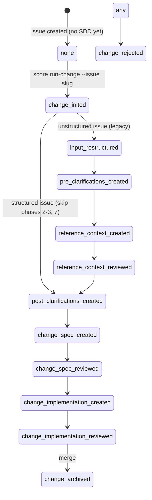

# Sdd Issue Centric

## Overview

<!-- type: overview lang: markdown -->

Make the issue the single unit of work in SDD. Every change requires an issue. Issue frontmatter tracks workflow state (phase, branch), replacing STATE.yaml.

| Before | After |
|--------|-------|
| `score run-change --description "..."` | `score run-change --issue <slug>` |
| STATE.yaml tracks phase/branch | Issue frontmatter tracks phase/branch |
| change-id independent of issue | change-id = issue slug |
| Multi-issue changes allowed | One issue = one change |

### Components

| Component | File | Change |
|-----------|------|--------|
| run-change CLI | `projects/score/cli/src/` | Accept `--issue` only, reject `--description` |
| Issue model | `crates/sdd/src/models/` | Add phase/branch/git_workflow to Issue struct |
| Phase persistence | `crates/sdd/src/tools/` | Write phase to issue frontmatter instead of STATE.yaml |
| Issues list | `projects/score/cli/src/issues.rs` | Show phase column |
## Requirements
<!-- type: requirements lang: markdown -->

<!-- TODO -->

## Scenarios
<!-- type: scenarios lang: markdown -->

<!-- TODO -->

## Diagrams

### Interaction
<!-- type: interaction lang: mermaid -->
<!-- TODO -->

### Logic
<!-- type: logic lang: mermaid -->
<!-- TODO -->

### Dependencies
<!-- type: dependency lang: mermaid -->
<!-- TODO -->

### State Machine
<!-- type: state-machine lang: mermaid -->
<!-- TODO -->

### Data Model
<!-- type: db-model lang: mermaid -->
<!-- TODO -->

## API Spec

### REST API
<!-- type: rest-api lang: yaml -->
<!-- TODO -->

### RPC API
<!-- type: rpc-api lang: json -->
<!-- TODO -->

### Async API
<!-- type: async-api lang: yaml -->
<!-- TODO -->

### CLI
<!-- type: cli lang: yaml -->
<!-- TODO -->

### Schema
<!-- type: schema lang: json -->
<!-- TODO -->

### Config
<!-- type: config lang: json -->
<!-- TODO -->

## Test Plan
<!-- type: test-plan lang: markdown -->

<!-- TODO -->

## Changes

<!-- type: changes lang: markdown -->

### 1. `crates/sdd/src/models/issue.rs` — Add phase/branch fields to Issue struct

```rust
pub struct Issue {
    // existing fields...
    pub phase: Option<String>,       // SDD phase (None = no active change)
    pub branch: Option<String>,      // Git branch for this change
    pub git_workflow: Option<String>, // "new_branch" or "in_place"
}
```

Update `serialize_frontmatter()` and `deserialize_frontmatter()` to read/write these fields.

### 2. `crates/sdd/src/tools/init_change.rs` — Accept issue slug, write phase to issue

Replace `--description` with `--issue <slug>` flow:

```rust
// Load issue
let issue = Issue::load_by_slug(slug)?;
// Set phase
issue.phase = Some("change_inited".to_string());
issue.branch = Some(branch_name.to_string());
issue.save()?;
// Create change artifacts dir using issue slug
let change_dir = format!(".score/changes/{}/", slug);
```

### 3. `crates/sdd/src/workflow/mod.rs` — Read phase from issue

Update `route()` to read phase from issue frontmatter instead of STATE.yaml:

```rust
// Before: let state = State::load(change_dir)?;
// After:  let issue = Issue::load_by_slug(change_id)?;
//         let phase = issue.phase.unwrap_or("none");
```

### 4. `projects/score/cli/src/run_change.rs` — Accept --issue only

Remove `--description` flag. Add `--issue <slug>` as required argument.
Error if no issue: "Create an issue first: score issues create"

### 5. `projects/score/cli/src/issues.rs` — Show phase in list

Add phase column to `score issues list` output:

```
[enhancement] open (tech_design_created) #1200 jet: add jet test CLI...
```

### 6. Backward compat

- If `.score/changes/{id}/STATE.yaml` exists AND issue has no phase: read from STATE.yaml (legacy)
- New changes always write to issue frontmatter
- STATE.yaml still created for artifacts but phase field is deprecated
## Wireframe
<!-- type: wireframe lang: yaml -->

<!-- TODO -->

## Component
<!-- type: component lang: json -->

<!-- TODO -->

## Design Token
<!-- type: design-token lang: json -->

<!-- TODO -->

## Doc
<!-- type: doc lang: markdown -->

<!-- TODO -->


## Schema

<!-- type: schema lang: json -->

### Issue Frontmatter (extended)

```json
{
  "$schema": "https://json-schema.org/draft/2020-12/schema",
  "title": "IssueFrontmatter",
  "type": "object",
  "properties": {
    "type": { "type": "string", "enum": ["bug", "enhancement", "refactor", "test", "epic"] },
    "title": { "type": "string" },
    "state": { "type": "string", "enum": ["open", "closed", "draft"] },
    "labels": { "type": "array", "items": { "type": "string" } },
    "phase": {
      "type": "string",
      "description": "SDD workflow phase — replaces STATE.yaml phase field",
      "enum": ["none", "change_inited", "input_restructured", "pre_clarifications_created", "reference_context_created", "reference_context_reviewed", "post_clarifications_created", "change_spec_created", "change_spec_reviewed", "change_implementation_created", "change_implementation_reviewed", "change_archived", "change_rejected"]
    },
    "branch": {
      "type": "string",
      "description": "Git branch for this change — replaces STATE.yaml branch field"
    },
    "git_workflow": {
      "type": "string",
      "enum": ["new_branch", "in_place"],
      "description": "How the branch was created"
    }
  },
  "required": ["type", "title", "state"]
}
```

### run-change --issue interface

```json
{
  "title": "RunChangeIssueArgs",
  "type": "object",
  "properties": {
    "issue": { "type": "string", "description": "Issue slug from .score/issues/" }
  },
  "required": ["issue"]
}
```


## State Machine

<!-- type: state-machine lang: mermaid -->

### Phase Lifecycle (issue-centric)



### Phase Storage

| Before | After |
|--------|-------|
| `.score/changes/{id}/STATE.yaml` → `phase: X` | `.score/issues/open/{slug}.md` frontmatter → `phase: X` |
| Read: `State::load(change_dir)` | Read: `Issue::load(slug)` → `issue.phase` |
| Write: `state.phase = X; state.save()` | Write: `issue.phase = X; issue.save()` |

# Reviews
