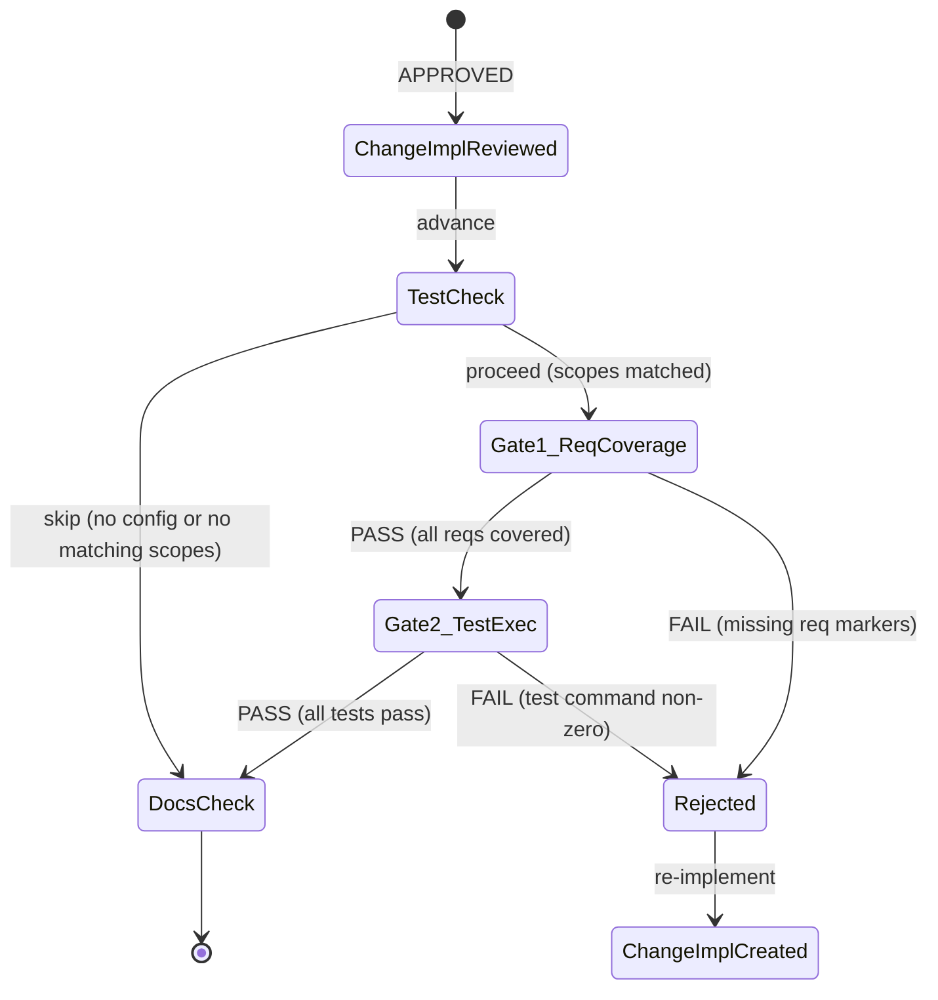

# Sdd Tdd Gate Spec

## Overview

Add a TDD (Test-Driven Development) gate to the SDD workflow that enforces test coverage and test execution before implementation can advance to review.

This change has two parts:

| Part | Scope | Description |
|------|-------|-------------|
| PR1: test-config | Data | Add `[sdd.test]` config section with `TestConfig`/`TestScope` structs to `SddConfig`. Parse `[[sdd.test.scope]]` entries with GitLab CI-style `changes` glob patterns. |
| PR2: tdd-workflow-gate | Logic | Insert `TestCheck` transient phase between `ChangeImplementationReviewed` and `DocsCheck`. Gate 1: parse Mermaid `requirementDiagram` from specs, verify test files contain `REQ:` markers. Gate 2: match changed files against scope `changes` patterns, execute `test_cmd`. Update implementation agent prompt with TDD instructions. |

**Design pattern**: Follows the `DocsCheck` transient phase pattern — `TestCheck` is resolved inline in `route()`, skips when no `[sdd.test]` config or no matching scopes.

**Config pattern**: `TestConfig`/`TestScope` mirror `DocsConfig`/`DocsTarget` struct layout in `models/change.rs`.
## Requirements

### R1: TestConfig and TestScope structs

| Field | Type | Description |
|-------|------|-------------|
| `TestConfig.test_cmd` | `Option<String>` | Global default test command inherited by scopes |
| `TestConfig.setup` | `Option<String>` | Global setup command (run before tests) |
| `TestConfig.teardown` | `Option<String>` | Global teardown command (run after tests) |
| `TestConfig.scope` | `Vec<TestScope>` | Per-module test scope definitions |
| `TestScope.name` | `String` | Human-readable scope name |
| `TestScope.changes` | `Vec<String>` | GitLab CI-style gitignore globs matching file paths |
| `TestScope.test_cmd` | `Option<String>` | Override test command (inherits from TestConfig if absent) |
| `TestScope.setup` | `Option<String>` | Override setup command |
| `TestScope.teardown` | `Option<String>` | Override teardown command |

Add `test: Option<TestConfig>` to `SddConfig`. Presence = enabled (no `enabled` flag), same pattern as `[sdd.docs]`.

**Priority**: high

### R2: TOML config parsing

Deserialize `[sdd.test]` and `[[sdd.test.scope]]` from `.score/config.toml` in `SddConfig::load()`. Follow the same overlay pattern used for `repo_platform` and `agents` — extract from `[sdd]` table after primary deserialization.

**Priority**: high

### R3: Config entries for conductor and cclab-queue

Add to `.score/config.toml`:

```toml
[sdd.test]
test_cmd = "cargo test"

[[sdd.test.scope]]
name = "conductor"
changes = ["projects/conductor/**"]
test_cmd = "bash projects/conductor/scripts/test-env.sh"

[[sdd.test.scope]]
name = "cclab-queue"
changes = ["crates/cclab-queue/**"]
```

**Priority**: medium

### R4: TestCheck transient phase

Insert `TestCheck` as a transient `<<choice>>` phase between `ChangeImplementationReviewed` (APPROVED) and `DocsCheck`. Resolved inline in `route()` — not persisted. Two exits:
- Skip: no `[sdd.test]` config OR no changed files match any scope `changes` patterns
- Proceed: at least one scope matched — run gates

Add `StatePhase::TestCheck` variant.

**Priority**: high

### R5: Gate 1 — Requirement coverage check

Parse Mermaid `requirementDiagram` blocks from approved spec files. Extract requirement IDs (format: `REQ-{id}`). Scan test files in the change for `REQ: REQ-{id}` comment markers (regex: `REQ:\s*(REQ-\w+)`). Reject if any requirement ID has no matching test marker.

**Priority**: high

### R6: Gate 2 — Test execution gate

Match changed files (from `git diff`) against `changes` glob patterns in `TestScope` entries using `globset` crate. For each matched scope:
1. Run `setup` command (if any, from scope or global default)
2. Run `test_cmd` (from scope, or global default)
3. Run `teardown` command (if any)

Reject if any `test_cmd` exits non-zero.

**Priority**: high

### R7: Implementation agent TDD instructions

Update `.claude/agents/sdd-change-implementation.md` with TDD instructions: agent must write tests alongside implementation code, test files must include `// REQ: REQ-{id}` comments referencing requirement IDs from the change spec.

**Priority**: medium

### R8: Conductor test-env.sh

Create `projects/conductor/scripts/test-env.sh` with setup (start mock server, seed data) and test execution for conductor project.

**Priority**: medium

### R9: --skip-tests escape hatch

Add `--skip-tests` flag to `score run-change`. When passed, skip TestCheck gate but log a warning and set `tests_skipped: true` in STATE.yaml.

**Priority**: low
## Scenarios

### S1: Config parsing — round-trip

| Step | Action | Expected |
|------|--------|----------|
| 1 | Write `[sdd.test]` with `test_cmd` and two `[[sdd.test.scope]]` entries to config.toml | |
| 2 | `SddConfig::load()` | `test` field is `Some(TestConfig)` with 2 scopes |
| 3 | Serialize back to TOML | Output matches original structure |

### S2: Config absent — test field is None

| Step | Action | Expected |
|------|--------|----------|
| 1 | config.toml has no `[sdd.test]` section | |
| 2 | `SddConfig::load()` | `test` field is `None` |
| 3 | `SddConfig::validate()` | Passes (test config is optional) |

### S3: TestCheck skip — no config

| Step | Action | Expected |
|------|--------|----------|
| 1 | `ChangeImplementationReviewed` APPROVED | |
| 2 | `TestCheck` transient | No `[sdd.test]` config |
| 3 | Skip to `DocsCheck` | No test execution |

### S4: TestCheck skip — no matching scopes

| Step | Action | Expected |
|------|--------|----------|
| 1 | `ChangeImplementationReviewed` APPROVED | |
| 2 | `TestCheck` transient | Config has scope for `projects/conductor/**` |
| 3 | Changed files: `crates/sdd/src/models/change.rs` | No scope matches |
| 4 | Skip to `DocsCheck` | No test execution |

### S5: Gate 1 pass — all requirements covered

| Step | Action | Expected |
|------|--------|----------|
| 1 | Spec has `requirementDiagram` with REQ-001, REQ-002 | |
| 2 | Test file contains `// REQ: REQ-001` and `// REQ: REQ-002` | |
| 3 | Gate 1 | PASS — all requirements have markers |

### S6: Gate 1 fail — missing requirement marker

| Step | Action | Expected |
|------|--------|----------|
| 1 | Spec has `requirementDiagram` with REQ-001, REQ-002 | |
| 2 | Test file only contains `// REQ: REQ-001` | |
| 3 | Gate 1 | FAIL — REQ-002 has no test marker |
| 4 | Advancement rejected | Error message lists uncovered requirements |

### S7: Gate 2 pass — tests pass

| Step | Action | Expected |
|------|--------|----------|
| 1 | Changed file: `projects/conductor/fe/src/App.tsx` | |
| 2 | Matches scope `conductor` (`projects/conductor/**`) | |
| 3 | Run setup, test_cmd (exit 0), teardown | |
| 4 | Gate 2 | PASS |

### S8: Gate 2 fail — test command fails

| Step | Action | Expected |
|------|--------|----------|
| 1 | Matched scope runs `test_cmd` | |
| 2 | `test_cmd` exits with code 1 | |
| 3 | Gate 2 | FAIL — test execution failed |
| 4 | Advancement rejected | Error includes test output |

### S9: --skip-tests escape hatch

| Step | Action | Expected |
|------|--------|----------|
| 1 | `score run-change --skip-tests` | |
| 2 | `TestCheck` transient | Flag detected |
| 3 | Skip to `DocsCheck` | Warning logged, `tests_skipped: true` in STATE.yaml |

### S10: TestScope inherits global test_cmd

| Step | Action | Expected |
|------|--------|----------|
| 1 | Config: `[sdd.test] test_cmd = "cargo test"`, scope has no `test_cmd` | |
| 2 | Scope matched | |
| 3 | Gate 2 runs `cargo test` (inherited from global) | |
## Diagrams

### Interaction
<!-- type: interaction lang: mermaid -->
<!-- TODO -->

### Logic
<!-- type: logic lang: mermaid -->
<!-- TODO -->

### Dependencies
<!-- type: dependency lang: mermaid -->
<!-- TODO -->

### State Machine
<!-- type: state-machine lang: mermaid -->
<!-- TODO -->

### Data Model
<!-- type: db-model lang: mermaid -->
<!-- TODO -->

## API Spec

### REST API
<!-- type: rest-api lang: yaml -->
<!-- TODO -->

### RPC API
<!-- type: rpc-api lang: json -->
<!-- TODO -->

### Async API
<!-- type: async-api lang: yaml -->
<!-- TODO -->

### CLI
<!-- type: cli lang: yaml -->
<!-- TODO -->

### Schema
<!-- type: schema lang: json -->
<!-- TODO -->

### Config
<!-- type: config lang: json -->
<!-- TODO -->

## Test Plan
<!-- type: test-plan lang: markdown -->

<!-- TODO -->

## Changes

```yaml
changes:
  # PR1: test-config (data only)
  - path: crates/sdd/src/models/change.rs
    action: modify
    description: |
      Add TestConfig struct (test_cmd, setup, teardown, scope: Vec<TestScope>).
      Add TestScope struct (name, changes: Vec<String>, test_cmd, setup, teardown).
      Add `test: Option<TestConfig>` field to SddConfig.
      Add #[serde(default, skip_serializing_if = "Option::is_none")] on test field.
      Update SddConfig::load() to extract [sdd.test] from parsed TOML table.
      Update SddConfig::Default to set test: None.

  - path: .score/config.toml
    action: modify
    description: |
      Add [sdd.test] section with global test_cmd = "cargo test".
      Add [[sdd.test.scope]] for conductor (changes: ["projects/conductor/**"]).
      Add [[sdd.test.scope]] for cclab-queue (changes: ["crates/cclab-queue/**"]).

  # PR2: tdd-workflow-gate (logic + infrastructure)
  - path: crates/sdd/src/models/state.rs
    action: modify
    description: |
      Add StatePhase::TestCheck variant (transient, between ChangeImplementationReviewed and DocsCheck).
      Add serde serialize/deserialize for "test_check" string.
      Update total variant count comment.

  - path: crates/sdd/src/workflow/mod.rs
    action: modify
    description: |
      Add TestCheck routing in route() function.
      TestCheck resolved inline: load SddConfig, check test config presence,
      match changed files against scope patterns, run gates.
      On skip: advance to DocsCheck.
      On gate pass: advance to DocsCheck.
      On gate fail: revert to ChangeImplementationCreated.

  - path: crates/sdd/src/workflow/test_gate.rs
    action: create
    description: |
      New module: test gate logic.
      - parse_requirement_ids(spec_content: &str) -> Vec<String>
        Regex-extract REQ-\w+ from requirementDiagram blocks.
      - scan_test_markers(test_files: &[PathBuf]) -> HashSet<String>
        Regex-match REQ:\s*(REQ-\w+) in test file contents.
      - check_requirement_coverage(spec_reqs, test_markers) -> Result<(), Vec<String>>
        Return missing requirement IDs.
      - match_scopes(changed_files: &[String], config: &TestConfig) -> Vec<&TestScope>
        Use globset to match files against scope changes patterns.
      - run_test_gate(scope: &TestScope, global: &TestConfig) -> Result<()>
        Execute setup, test_cmd, teardown. Return error on non-zero exit.

  - path: .claude/agents/sdd-change-implementation.md
    action: modify
    description: |
      Add TDD instructions section:
      - Write tests alongside implementation code
      - Include // REQ: REQ-{id} comments in test files
      - Reference requirement IDs from the change spec requirementDiagram
      - Tests must pass before implementation is considered complete

  - path: projects/conductor/scripts/test-env.sh
    action: create
    description: |
      Test environment setup/teardown script for conductor.
      Setup: start mock backend, seed test data.
      Test: run Playwright e2e tests.
      Teardown: stop mock backend, clean up.

  - path: crates/sdd/Cargo.toml
    action: modify
    description: |
      Add globset dependency for gitignore-style glob matching.
```
## Wireframe
<!-- type: wireframe lang: yaml -->

<!-- TODO -->

## Component
<!-- type: component lang: json -->

<!-- TODO -->

## Design Token
<!-- type: design-token lang: json -->

<!-- TODO -->

## Doc
<!-- type: doc lang: markdown -->

<!-- TODO -->


## State Machine



**Phase insertion point**: Between `ChangeImplementationReviewed` (APPROVED) and `DocsCheck`.

**Transient**: `TestCheck` is resolved inline in `route()` — never persisted to STATE.yaml. Same pattern as `DocsCheck`.

**Rejection path**: On gate failure, phase reverts to `ChangeImplementationCreated` for re-implementation (agent must add/fix tests).


## Config

```json
{
  "$schema": "http://json-schema.org/draft-07/schema#",
  "title": "TestConfig",
  "description": "[sdd.test] section in .score/config.toml",
  "type": "object",
  "properties": {
    "test_cmd": {
      "type": "string",
      "description": "Global default test command. Scopes inherit if they omit test_cmd."
    },
    "setup": {
      "type": "string",
      "description": "Global setup command run before tests."
    },
    "teardown": {
      "type": "string",
      "description": "Global teardown command run after tests."
    },
    "scope": {
      "type": "array",
      "items": {
        "$ref": "#/definitions/TestScope"
      },
      "description": "Per-module test scope definitions [[sdd.test.scope]]."
    }
  },
  "required": ["scope"],
  "definitions": {
    "TestScope": {
      "type": "object",
      "properties": {
        "name": {
          "type": "string",
          "description": "Human-readable scope name."
        },
        "changes": {
          "type": "array",
          "items": { "type": "string" },
          "description": "GitLab CI-style gitignore glob patterns matching file paths."
        },
        "test_cmd": {
          "type": "string",
          "description": "Override test command for this scope."
        },
        "setup": {
          "type": "string",
          "description": "Override setup command."
        },
        "teardown": {
          "type": "string",
          "description": "Override teardown command."
        }
      },
      "required": ["name", "changes"]
    }
  }
}
```

### Example TOML

```toml
[sdd.test]
test_cmd = "cargo test"

[[sdd.test.scope]]
name = "conductor"
changes = ["projects/conductor/**"]
test_cmd = "bash projects/conductor/scripts/test-env.sh"
setup = "docker compose -f projects/conductor/docker-compose.test.yml up -d"
teardown = "docker compose -f projects/conductor/docker-compose.test.yml down"

[[sdd.test.scope]]
name = "cclab-queue"
changes = ["crates/cclab-queue/**"]
```

In this example, `cclab-queue` scope inherits `test_cmd = "cargo test"` from the global default.

# Reviews
