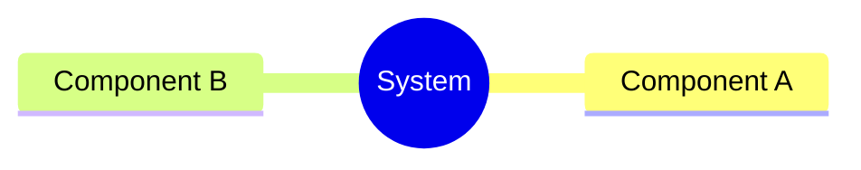
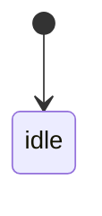
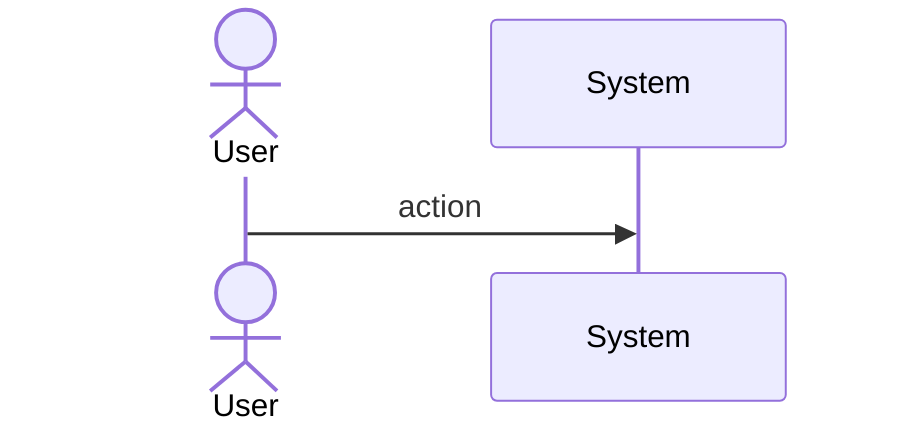
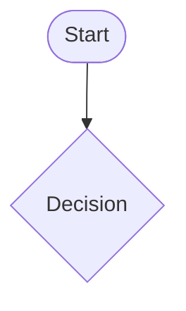
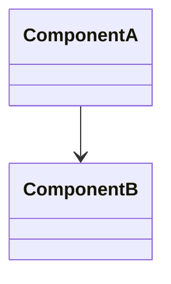
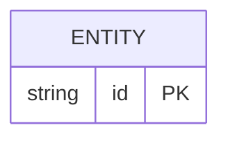

# Mamba Compile Builtin Runtime

## Overview

<!-- type: overview lang: markdown -->

Implements the `compile(source, filename, mode)` builtin function for the Mamba runtime (#976). The stub in `runtime/builtins.rs` that returns the source string unchanged is replaced with a real implementation that:

1. Parses the source string using the Mamba parser for the requested compilation mode.
2. Stores the parsed AST (`Module`), filename, source text, and mode in a new heap-allocated `CodeObject` (new `ObjData::CodeObject` variant in `runtime/rc.rs`).
3. Returns an `MbValue` pointer to the `CodeObject`.
4. Raises `SyntaxError` with line/column information for parse failures.
5. Validates the mode argument (`exec`, `eval`, `single`) and raises `ValueError` for unknown modes.
6. Validates mode-specific constraints: `eval` mode requires a single expression; `single` mode requires a single statement.
7. Accepts optional `flags` and `dont_inherit` parameters without error (no-op for now).
8. Accepts `source` as a `bytes` object by decoding it as UTF-8.

The `CodeObject` is an opaque handle — no attribute access (co_varnames, etc.) is promised in phase 1. It is designed to be consumed by `exec()`/`eval()` once #441 lands.
## Requirements

<!-- type: requirements lang: markdown -->

### R1: Code Object Return Value

`compile(source, filename, mode)` returns a non-None `MbValue` pointer to a heap-allocated `CodeObject` for valid inputs. The code object stores the parsed AST `Module`, `filename` string, `mode` string, and original `source` text.

**Priority**: high

### R2: Mode Validation and Mode-Specific Parsing

`mode` must be one of `"exec"`, `"eval"`, or `"single"`. Unknown modes raise `ValueError: compile() mode must be 'exec', 'eval' or 'single'`. Each mode uses a dedicated parse strategy:
- `exec`: parse as module (statement sequence, any number of statements).
- `eval`: parse as a single expression. If the source contains a statement (not an expression), raise `SyntaxError: invalid syntax`.
- `single`: parse as a single interactive statement. If the source contains more than one top-level statement, raise `SyntaxError: multiple statements found while compiling a single statement`.

**Priority**: high

### R3: Filename Threading

`filename` is stored in the `CodeObject`. When parsing fails, error messages include the filename so tracebacks can point to the correct file.

**Priority**: high

### R4: SyntaxError on Parse Failure

Parse errors surface as `SyntaxError` with a message containing the error description, filename, and line/column information (`line N col C`), matching CPython's behavior pattern.

**Priority**: high

### R5: Accept flags and dont_inherit Parameters

`compile(source, filename, mode, flags=0, dont_inherit=False)` accepts `flags` and `dont_inherit` as no-op parameters without raising an error.

**Priority**: medium

### R6: Accept bytes source

When `source` is a `bytes` object, decode it as UTF-8 before parsing. If decoding fails, raise `ValueError`.

**Priority**: low
## Scenarios
<!-- type: scenarios lang: yaml -->

<!-- TODO: Use YAML GWT structured format. Example:
```yaml
- id: S1
  given: Initial state description
  when: Action or event that triggers the scenario
  then: Expected outcome

- id: S2
  given: Another initial state
  when: Another action
  then: Another expected outcome
  diagram_ref: interaction-S2
```
-->

## Diagrams

### Mindmap
<!-- type: mindmap lang: mermaid -->
<!-- TODO: Use Mermaid Plus mindmap (YAML frontmatter inside mermaid block).

-->

### State Machine
<!-- type: state-machine lang: mermaid -->
<!-- TODO: Use Mermaid Plus stateDiagram-v2 (YAML frontmatter inside mermaid block).

-->

### Interaction
<!-- type: interaction lang: mermaid -->
<!-- TODO: Use Mermaid Plus sequenceDiagram (YAML frontmatter inside mermaid block).

-->

### Logic
<!-- type: logic lang: mermaid -->
<!-- TODO: Use Mermaid Plus flowchart (YAML frontmatter inside mermaid block).

-->

### Dependencies
<!-- type: dependency lang: mermaid -->
<!-- TODO: Use Mermaid Plus classDiagram (YAML frontmatter inside mermaid block).

-->

### Data Model
<!-- type: db-model lang: mermaid -->
<!-- TODO: Use Mermaid Plus erDiagram (YAML frontmatter inside mermaid block).

-->

## API Spec

### REST API
<!-- type: rest-api lang: yaml -->
<!-- TODO -->

### RPC API
<!-- type: rpc-api lang: yaml -->
<!-- TODO: OpenRPC 1.3 as YAML. Example:
```yaml
openrpc: "1.3.2"
info:
  title: Service Name
  version: "1.0.0"
methods: []
```
-->

### Async API
<!-- type: async-api lang: yaml -->
<!-- TODO -->

### CLI
<!-- type: cli lang: yaml -->
<!-- TODO -->

### Schema
<!-- type: schema lang: yaml -->
<!-- TODO: JSON Schema as YAML. Example:
```yaml
"$schema": "https://json-schema.org/draft/2020-12/schema"
type: object
properties:
  id:
    type: string
required: [id]
```
-->

### Config
<!-- type: config lang: yaml -->
<!-- TODO -->

## Test Plan
<!-- type: test-plan lang: mermaid -->

<!-- TODO: Use Mermaid Plus requirementDiagram with element nodes and verifies relationships.
```mermaid
---
id: test-plan
---
requirementDiagram

element T1 {
  type: "Test"
}

element T2 {
  type: "Test"
}

T1 - verifies -> R1
T2 - verifies -> R2
```
-->

## Changes

<!-- type: changes lang: yaml -->

changes:
  - path: crates/mamba/src/runtime/rc.rs
    action: MODIFY
    targets:
      - type: enum
        name: ObjKind
        change: add CodeObject variant (value 13)
      - type: enum
        name: ObjData
        change: add CodeObject variant storing (source: String, filename: String, mode: String, ast: Box<crate::parser::ast::Module>)
      - type: impl
        name: MbObject
        change: add new_code_object(source, filename, mode, ast) constructor
    do_not_touch: [new_str, new_list, new_dict, new_tuple, new_set, new_bytes, new_bytearray, new_frozenset, new_bigint, new_complex, new_instance]
  - path: crates/mamba/src/runtime/builtins.rs
    action: MODIFY
    targets:
      - type: function
        name: mb_compile
        change: replace stub with full implementation — extract source string (or bytes R6), extract filename string, extract mode string, validate mode, parse source using crate::parser with a local SourceFile/SourceMap for error location, return MbValue::from_ptr(MbObject::new_code_object(...))
      - type: function
        name: mb_compile_3
        change: new function accepting source/filename/mode (3-arg signature registered in symbols.rs; existing mb_compile becomes mb_compile_5 accepting flags/dont_inherit)
    do_not_touch: [mb_eval, mb_exec, mb_globals, mb_locals]
  - path: crates/mamba/src/runtime/symbols.rs
    action: MODIFY
    targets:
      - type: function
        name: runtime_symbols
        change: update mb_compile registration to use the new 3-arg (and optionally 5-arg) signature
## Wireframe
<!-- type: wireframe lang: yaml -->

<!-- TODO -->

## Component
<!-- type: component lang: yaml -->

<!-- TODO -->

## Design Token
<!-- type: design-token lang: yaml -->

<!-- TODO -->

## Doc
<!-- type: doc lang: markdown -->

<!-- TODO -->

# Reviews
