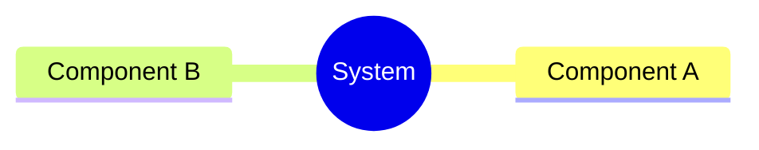
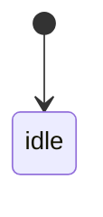
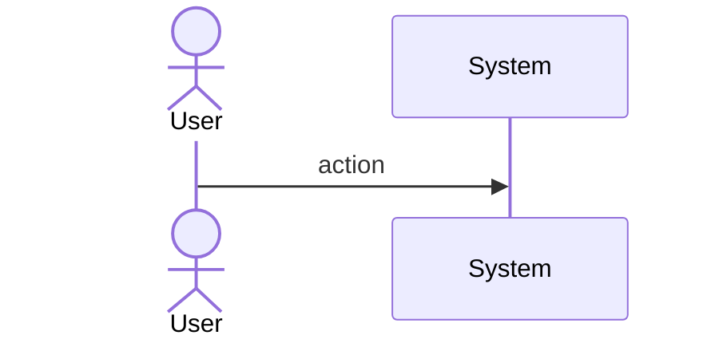
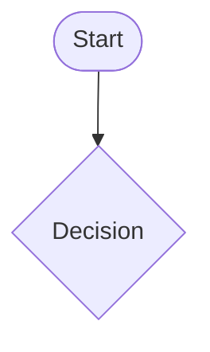
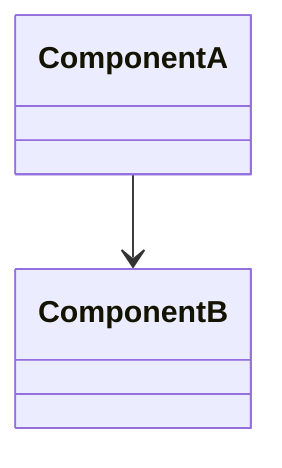
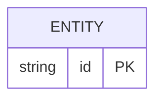

# Mamba Compile Builtin Value Rc

## Overview
<!-- type: overview lang: markdown -->

<!-- TODO -->

## Requirements

<!-- type: requirements lang: markdown -->

### R1: CodeObject ObjKind Variant

Add `CodeObject = 13` variant to the `ObjKind` enum in `runtime/rc.rs`. This enables type-tagging of code object heap objects.

**Priority**: high

### R2: CodeObject ObjData Variant

Add `CodeObject` variant to the `ObjData` enum that stores:
- `source: String` — the original source text
- `filename: String` — the filename for diagnostic threading
- `mode: String` — the compilation mode (`exec`, `eval`, or `single`)
- `ast: Box<crate::parser::ast::Module>` — the parsed AST

**Priority**: high

### R3: CodeObject Constructor

Add `MbObject::new_code_object(source: String, filename: String, mode: String, ast: Module) -> *mut Self` constructor. Returns a heap-allocated `MbObject` with `kind: ObjKind::CodeObject` and `rc: 1`. Not GC-tracked (CodeObject is an immutable value like BigInt).

**Priority**: high
## Scenarios
<!-- type: scenarios lang: yaml -->

<!-- TODO: Use YAML GWT structured format. Example:
```yaml
- id: S1
  given: Initial state description
  when: Action or event that triggers the scenario
  then: Expected outcome

- id: S2
  given: Another initial state
  when: Another action
  then: Another expected outcome
  diagram_ref: interaction-S2
```
-->

## Diagrams

### Mindmap
<!-- type: mindmap lang: mermaid -->
<!-- TODO: Use Mermaid Plus mindmap (YAML frontmatter inside mermaid block).

-->

### State Machine
<!-- type: state-machine lang: mermaid -->
<!-- TODO: Use Mermaid Plus stateDiagram-v2 (YAML frontmatter inside mermaid block).

-->

### Interaction
<!-- type: interaction lang: mermaid -->
<!-- TODO: Use Mermaid Plus sequenceDiagram (YAML frontmatter inside mermaid block).

-->

### Logic
<!-- type: logic lang: mermaid -->
<!-- TODO: Use Mermaid Plus flowchart (YAML frontmatter inside mermaid block).

-->

### Dependencies
<!-- type: dependency lang: mermaid -->
<!-- TODO: Use Mermaid Plus classDiagram (YAML frontmatter inside mermaid block).

-->

### Data Model
<!-- type: db-model lang: mermaid -->
<!-- TODO: Use Mermaid Plus erDiagram (YAML frontmatter inside mermaid block).

-->

## API Spec

### REST API
<!-- type: rest-api lang: yaml -->
<!-- TODO -->

### RPC API
<!-- type: rpc-api lang: yaml -->
<!-- TODO: OpenRPC 1.3 as YAML. Example:
```yaml
openrpc: "1.3.2"
info:
  title: Service Name
  version: "1.0.0"
methods: []
```
-->

### Async API
<!-- type: async-api lang: yaml -->
<!-- TODO -->

### CLI
<!-- type: cli lang: yaml -->
<!-- TODO -->

### Schema
<!-- type: schema lang: yaml -->
<!-- TODO: JSON Schema as YAML. Example:
```yaml
"$schema": "https://json-schema.org/draft/2020-12/schema"
type: object
properties:
  id:
    type: string
required: [id]
```
-->

### Config
<!-- type: config lang: yaml -->
<!-- TODO -->

## Test Plan
<!-- type: test-plan lang: mermaid -->

<!-- TODO: Use Mermaid Plus requirementDiagram with element nodes and verifies relationships.
```mermaid
---
id: test-plan
---
requirementDiagram

element T1 {
  type: "Test"
}

element T2 {
  type: "Test"
}

T1 - verifies -> R1
T2 - verifies -> R2
```
-->

## Changes

<!-- type: changes lang: yaml -->

changes:
  - path: crates/mamba/src/runtime/rc.rs
    action: MODIFY
    targets:
      - type: enum
        name: ObjKind
        change: add CodeObject = 13 variant
      - type: enum
        name: ObjData
        change: add CodeObject { source: String, filename: String, mode: String, ast: Box<crate::parser::ast::Module> } variant
      - type: impl
        name: MbObject
        change: add new_code_object(source, filename, mode, ast) constructor allocating a non-GC-tracked CodeObject heap object with rc=1
    do_not_touch: [new_str, new_str_immortal, new_list, new_dict, new_dict_with_capacity, new_tuple, new_set, new_bytes, new_bytes_immortal, new_bytearray, new_frozenset, new_bigint, new_complex, new_instance, new_instance_with_capacity]
## Wireframe
<!-- type: wireframe lang: yaml -->

<!-- TODO -->

## Component
<!-- type: component lang: yaml -->

<!-- TODO -->

## Design Token
<!-- type: design-token lang: yaml -->

<!-- TODO -->

## Doc
<!-- type: doc lang: markdown -->

<!-- TODO -->

# Reviews
