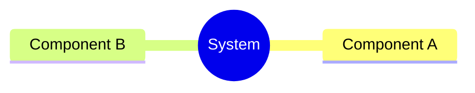
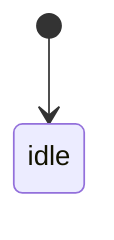
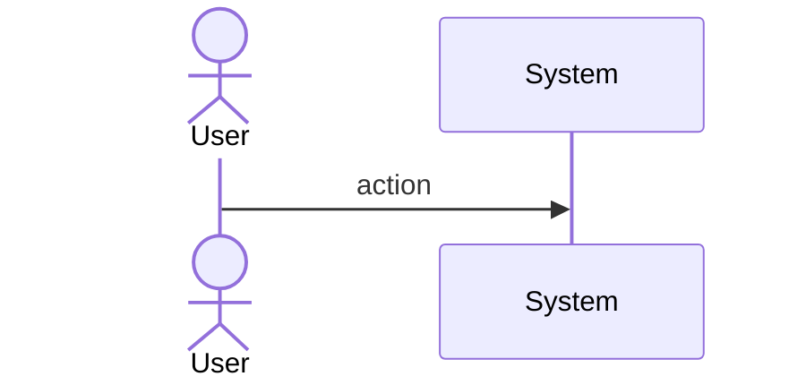
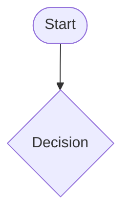
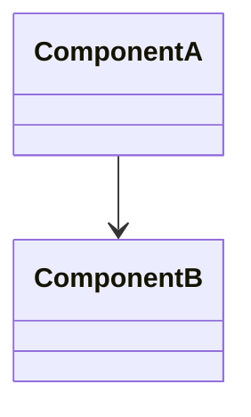
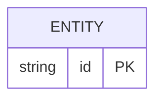

# Score Init Command

## Overview

<!-- type: overview lang: markdown -->

Wires the `score init` CLI command by adding an `Init` variant to the `Commands` enum in `projects/score/cli/src/commands.rs` and dispatching it to the existing `init::run()` function. Also completes the bootstrap asset set: adds all 5 `score-*` agent definition templates, 3 hook scripts, a `settings.json` template (with SubagentStop hook registration), and the 2 missing skills (`score-issue`, `score-issue-patrol`) to `projects/score/cli/templates/mainthread/`. Updates `install_system_files()` to install agents, hooks, and settings alongside skills.
## Requirements

```mermaid
---
id: requirements
---
requirementDiagram

requirement R1 {
  id: R1
  text: "Add Init variant to Commands enum with name: Option<String> and force: bool fields"
  risk: low
  verifymethod: test
}

requirement R2 {
  id: R2
  text: "Dispatch Commands::Init to init::run() in run_command()"
  risk: low
  verifymethod: test
}

requirement R3 {
  id: R3
  text: "score init --help shows command purpose and flags"
  risk: low
  verifymethod: test
}

requirement R4 {
  id: R4
  text: "Add 5 score-* agent definition template files to templates/mainthread/agents/ as include_str! constants"
  risk: low
  verifymethod: inspection
}

requirement R5 {
  id: R5
  text: "install_agents() writes agent files to .claude/agents/ in target project"
  risk: low
  verifymethod: test
}

requirement R6 {
  id: R6
  text: "init removes legacy sdd-*.md files from .claude/agents/ during install"
  risk: low
  verifymethod: test
}

requirement R7 {
  id: R7
  text: "Add 3 hook scripts to templates/mainthread/hooks/ (score-safe-bash.sh, score-readonly-bash.sh, score-next-step.sh)"
  risk: low
  verifymethod: inspection
}

requirement R8 {
  id: R8
  text: "install_hooks() writes hook scripts to .claude/hooks/ with executable permissions (chmod +x)"
  risk: low
  verifymethod: test
}

requirement R9 {
  id: R9
  text: "Add settings.json template to templates/mainthread/ with SubagentStop hook matching score-* pattern"
  risk: low
  verifymethod: inspection
}

requirement R10 {
  id: R10
  text: "install_settings_json() merges template with existing .claude/settings.json preserving user hooks"
  risk: medium
  verifymethod: test
}

requirement R11 {
  id: R11
  text: "If existing settings.json already has SubagentStop score-* hook, warn user and skip"
  risk: low
  verifymethod: test
}

requirement R12 {
  id: R12
  text: "Add score-issue skill template and install via install_claude_skills()"
  risk: low
  verifymethod: test
}

requirement R13 {
  id: R13
  text: "Add score-issue-patrol skill template and install via install_claude_skills()"
  risk: low
  verifymethod: test
}

requirement R14 {
  id: R14
  text: "Running score init on already-initialized project updates all assets without losing user customizations"
  risk: medium
  verifymethod: test
}

requirement R15 {
  id: R15
  text: "Version check prevents downgrades (existing behavior preserved)"
  risk: low
  verifymethod: test
}
```

<!-- type: requirements lang: mermaid -->


## Scenarios
<!-- type: scenarios lang: yaml -->

<!-- TODO: Use YAML GWT structured format. Example:
```yaml
- id: S1
  given: Initial state description
  when: Action or event that triggers the scenario
  then: Expected outcome

- id: S2
  given: Another initial state
  when: Another action
  then: Another expected outcome
  diagram_ref: interaction-S2
```
-->

## Diagrams

### Mindmap
<!-- type: mindmap lang: mermaid -->
<!-- TODO: Use Mermaid Plus mindmap (YAML frontmatter inside mermaid block).

-->

### State Machine
<!-- type: state-machine lang: mermaid -->
<!-- TODO: Use Mermaid Plus stateDiagram-v2 (YAML frontmatter inside mermaid block).

-->

### Interaction
<!-- type: interaction lang: mermaid -->
<!-- TODO: Use Mermaid Plus sequenceDiagram (YAML frontmatter inside mermaid block).

-->

### Logic
<!-- type: logic lang: mermaid -->
<!-- TODO: Use Mermaid Plus flowchart (YAML frontmatter inside mermaid block).

-->

### Dependencies
<!-- type: dependency lang: mermaid -->
<!-- TODO: Use Mermaid Plus classDiagram (YAML frontmatter inside mermaid block).

-->

### Data Model
<!-- type: db-model lang: mermaid -->
<!-- TODO: Use Mermaid Plus erDiagram (YAML frontmatter inside mermaid block).

-->

## API Spec

### REST API
<!-- type: rest-api lang: yaml -->
<!-- TODO -->

### RPC API
<!-- type: rpc-api lang: yaml -->
<!-- TODO: OpenRPC 1.3 as YAML. Example:
```yaml
openrpc: "1.3.2"
info:
  title: Service Name
  version: "1.0.0"
methods: []
```
-->

### Async API
<!-- type: async-api lang: yaml -->
<!-- TODO -->

### CLI
<!-- type: cli lang: yaml -->
<!-- TODO -->

### Schema
<!-- type: schema lang: yaml -->
<!-- TODO: JSON Schema as YAML. Example:
```yaml
"$schema": "https://json-schema.org/draft/2020-12/schema"
type: object
properties:
  id:
    type: string
required: [id]
```
-->

### Config
<!-- type: config lang: yaml -->
<!-- TODO -->

## Test Plan
<!-- type: test-plan lang: mermaid -->

<!-- TODO: Use Mermaid Plus requirementDiagram with element nodes and verifies relationships.
```mermaid
---
id: test-plan
---
requirementDiagram

element T1 {
  type: "Test"
}

element T2 {
  type: "Test"
}

T1 - verifies -> R1
T2 - verifies -> R2
```
-->

## Changes

<!-- type: changes lang: yaml -->

```yaml
files:
  - path: projects/score/cli/src/commands.rs
    action: modify
    changes:
      - Add Init variant to Commands enum with doc comment, name: Option<String>, force: bool args
      - Add crate::init import at top
      - Add Commands::Init dispatch arm in run_command() calling init::run(name, force, None)

  - path: projects/score/cli/src/init.rs
    action: modify
    changes:
      - Add AGENT_* include_str! constants for all 5 agent templates
      - Add HOOK_* include_str! constants for all 3 hook scripts
      - Add SETTINGS_JSON include_str! constant for settings.json template
      - Add SKILL_ISSUE and SKILL_ISSUE_PATROL include_str! constants
      - Add install_agents() function — creates .claude/agents/, writes agent files, removes sdd-*.md legacy files
      - Add install_hooks() function — creates .claude/hooks/, writes hook scripts, chmod +x each
      - Add install_settings_json() function — merges template with existing settings.json, warns/skips if SubagentStop score-* already present
      - Update install_system_files() to call install_agents(), install_hooks(), install_settings_json()
      - Update install_claude_skills() to add score-issue and score-issue-patrol to skills vec
      - Update install_claude_skills() deprecated list to add score-agent
      - Update print_init_success() to mention .claude/agents/ and .claude/hooks/

  - path: projects/score/cli/templates/mainthread/agents/score-change-implementation.md
    action: create
    changes:
      - Copy content from .claude/agents/score-change-implementation.md

  - path: projects/score/cli/templates/mainthread/agents/score-change-spec.md
    action: create
    changes:
      - Copy content from .claude/agents/score-change-spec.md

  - path: projects/score/cli/templates/mainthread/agents/score-reference-context.md
    action: create
    changes:
      - Copy content from .claude/agents/score-reference-context.md

  - path: projects/score/cli/templates/mainthread/agents/score-review.md
    action: create
    changes:
      - Copy content from .claude/agents/score-review.md

  - path: projects/score/cli/templates/mainthread/agents/score-issue-author.md
    action: create
    changes:
      - Copy content from .claude/agents/score-issue-author.md

  - path: projects/score/cli/templates/mainthread/hooks/score-safe-bash.sh
    action: create
    changes:
      - Copy content from .claude/hooks/score-safe-bash.sh

  - path: projects/score/cli/templates/mainthread/hooks/score-readonly-bash.sh
    action: create
    changes:
      - Copy content from .claude/hooks/score-readonly-bash.sh

  - path: projects/score/cli/templates/mainthread/hooks/score-next-step.sh
    action: create
    changes:
      - Copy content from .claude/hooks/score-next-step.sh

  - path: projects/score/cli/templates/mainthread/settings.json
    action: create
    changes:
      - Minimal settings.json template with SubagentStop hook for score-* pattern

  - path: projects/score/cli/templates/mainthread/skills/score-issue/SKILL.md
    action: create
    changes:
      - Copy content from .claude/skills/score-issue/SKILL.md

  - path: projects/score/cli/templates/mainthread/skills/score-issue-patrol/SKILL.md
    action: create
    changes:
      - Copy content from .claude/skills/score-issue-patrol/SKILL.md
```
## Wireframe
<!-- type: wireframe lang: yaml -->

<!-- TODO -->

## Component
<!-- type: component lang: yaml -->

<!-- TODO -->

## Design Token
<!-- type: design-token lang: yaml -->

<!-- TODO -->

## Doc
<!-- type: doc lang: markdown -->

<!-- TODO -->


## CLI

<!-- type: cli lang: yaml -->

```yaml
command: score init
description: Bootstrap .score/ workspace and .claude/ assets in the current project
args: []
options:
  - name: --name
    short: -n
    type: Option<String>
    description: Project name (deprecated, ignored)
  - name: --force
    short: -f
    type: bool
    description: Override version downgrade protection and force-replace all assets
subcommands: []
examples:
  - cmd: score init
    desc: Fresh install — creates .score/, .claude/agents/, .claude/skills/, .claude/hooks/, .claude/settings.json
  - cmd: score init --force
    desc: Force update — replaces all system assets even if same/older version
```

# Reviews
