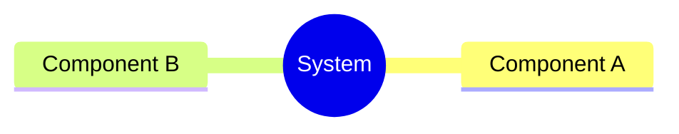
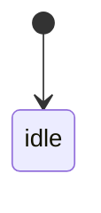
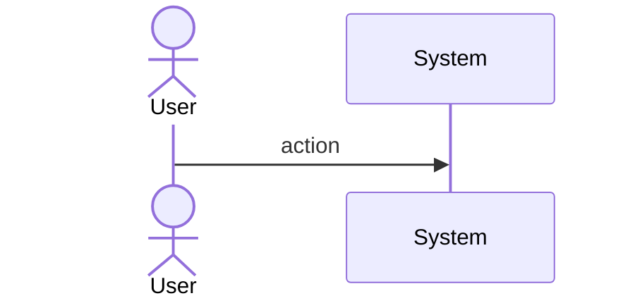
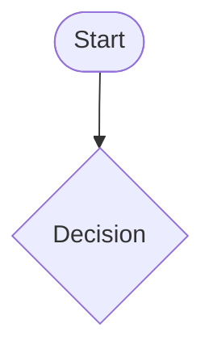
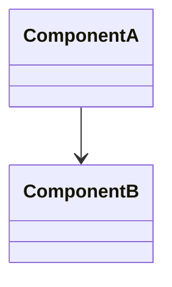
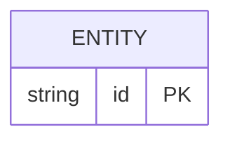

# Sdd Merge Gaps Fix Spec

## Overview

Fix 3 bugs in the `create_change_merge` / `merge_git_ops` workflow:

1. **`git_commit_sha` null after auto-commit**: After step 3 (worktree merge into main), capture the merge commit SHA via `git rev-parse HEAD` on `project_root`. Return this as the canonical commit SHA since it is the commit that landed on the default branch.

2. **Auto-PR not running when expected**: The `create_pr` call currently runs after local merge+cleanup (steps 3+4), at which point the worktree branch may already be deleted. Fix: in the worktree flow, attempt PR creation BEFORE local merge when `auto_pr=true`. `auto_pr` remains opt-in (default: false) — downstream projects set it explicitly.

3. **Issue close only matches slug**: `close_issue_if_exists` only checks for `{change_id}.md` in `open/`. Add a fallback: scan all open issues and match by frontmatter `id` field (UUID) so issues created with UUID-based names are also closed on merge.
## Requirements

```mermaid
---
id: requirements
---
requirementDiagram

requirement R1 {
  id: R1
  text: "After a successful worktree merge (step 3), git_commit_sha in the response must be the merge commit SHA on the default branch (git rev-parse HEAD on project_root)"
  risk: medium
  verifymethod: test
}

requirement R2 {
  id: R2
  text: "auto_pr must default to false. When auto_pr=true and worktree is active, PR creation runs before local merge steps 3+4. In legacy in-place flow, auto_pr is skipped."
  risk: medium
  verifymethod: test
}

requirement R3 {
  id: R3
  text: "close_issue_if_exists must match open issues by: (1) slug == change_id, (2) frontmatter id UUID == change_id. Scan all open issues for UUID match."
  risk: low
  verifymethod: test
}
```


## Scenarios

```yaml
- id: S1
  given: auto_commit=true, worktree branch exists, files committed in worktree
  when: post_archive_git_ops completes step 3 merge into default branch
  then: git_commit_sha equals the merge commit SHA from git rev-parse HEAD on project_root

- id: S2
  given: auto_commit=true, auto_pr=false, worktree branch exists
  when: post_archive_git_ops runs
  then: no PR is created (auto_pr is opt-in, default false)

- id: S3
  given: auto_commit=true, auto_pr=true, worktree branch exists
  when: post_archive_git_ops runs
  then: gh pr create is called BEFORE local merge (step 3), so branch still exists

- id: S4
  given: auto_pr=true, no worktree (legacy in-place flow)
  when: post_archive_git_ops runs
  then: auto-PR is skipped (no branch to PR from)

- id: S5
  given: change_id is 'my-feature', open issue file is 'my-feature.md' with matching slug
  when: close_issue_if_exists runs with change_id='my-feature'
  then: issue is moved to closed/ (slug match)

- id: S6
  given: change_id is 'my-feature', open issue file is 'bug-abc123.md' with id='my-feature' in frontmatter
  when: close_issue_if_exists runs with change_id='my-feature'
  then: issue is moved to closed/ (frontmatter id match)

- id: S7
  given: change_id is 'xyz-nonexistent', no open issue matches by slug or frontmatter id
  when: close_issue_if_exists runs
  then: returns false, no issue closed
```
## Diagrams

### Mindmap
<!-- type: mindmap lang: mermaid -->
<!-- TODO: Use Mermaid Plus mindmap (YAML frontmatter inside mermaid block).

-->

### State Machine
<!-- type: state-machine lang: mermaid -->
<!-- TODO: Use Mermaid Plus stateDiagram-v2 (YAML frontmatter inside mermaid block).

-->

### Interaction
<!-- type: interaction lang: mermaid -->
<!-- TODO: Use Mermaid Plus sequenceDiagram (YAML frontmatter inside mermaid block).

-->

### Logic
<!-- type: logic lang: mermaid -->
<!-- TODO: Use Mermaid Plus flowchart (YAML frontmatter inside mermaid block).

-->

### Dependencies
<!-- type: dependency lang: mermaid -->
<!-- TODO: Use Mermaid Plus classDiagram (YAML frontmatter inside mermaid block).

-->

### Data Model
<!-- type: db-model lang: mermaid -->
<!-- TODO: Use Mermaid Plus erDiagram (YAML frontmatter inside mermaid block).

-->

## API Spec

### REST API
<!-- type: rest-api lang: yaml -->
<!-- TODO -->

### RPC API
<!-- type: rpc-api lang: yaml -->
<!-- TODO: OpenRPC 1.3 as YAML. Example:
```yaml
openrpc: "1.3.2"
info:
  title: Service Name
  version: "1.0.0"
methods: []
```
-->

### Async API
<!-- type: async-api lang: yaml -->
<!-- TODO -->

### CLI
<!-- type: cli lang: yaml -->
<!-- TODO -->

### Schema
<!-- type: schema lang: yaml -->
<!-- TODO: JSON Schema as YAML. Example:
```yaml
"$schema": "https://json-schema.org/draft/2020-12/schema"
type: object
properties:
  id:
    type: string
required: [id]
```
-->

### Config
<!-- type: config lang: yaml -->
<!-- TODO -->

## Test Plan
<!-- type: test-plan lang: mermaid -->

<!-- TODO: Use Mermaid Plus requirementDiagram with element nodes and verifies relationships.
```mermaid
---
id: test-plan
---
requirementDiagram

element T1 {
  type: "Test"
}

element T2 {
  type: "Test"
}

T1 - verifies -> R1
T2 - verifies -> R2
```
-->

## Changes

```yaml
files_affected:
  - path: crates/sdd/src/tools/merge_git_ops.rs
    action: modify
    description: |
      Fix 1: After step 3 merge succeeds, capture merge commit SHA via git rev-parse HEAD
      on project_root and use it as git_commit_sha in GitOpsResult.
      Fix 2: When auto_pr=true and worktree exists, call create_pr BEFORE
      merge_worktree_branch (steps 3+4). In legacy flow (no worktree), skip auto_pr.

  - path: crates/sdd/src/tools/create_change_merge.rs
    action: modify
    description: |
      Fix 3: close_issue_if_exists — add fallback scan of all open issues.
      Match by frontmatter id field (UUID) in addition to slug match.
      Use local_backend load_all() to scan, then find by id field.
```
## Wireframe
<!-- type: wireframe lang: yaml -->

<!-- TODO -->

## Component
<!-- type: component lang: yaml -->

<!-- TODO -->

## Design Token
<!-- type: design-token lang: yaml -->

<!-- TODO -->

## Doc
<!-- type: doc lang: markdown -->

<!-- TODO -->

# Reviews
