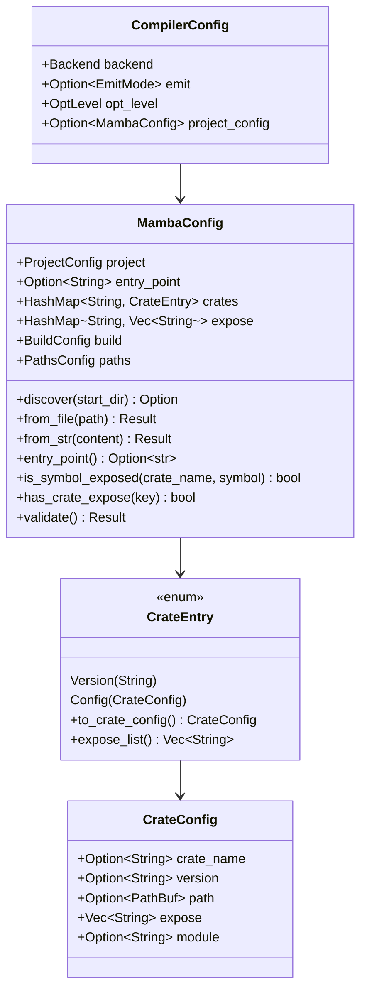

# 1134 Mamba Dual Config Spec

## Overview

Unify the two conflicting `MambaConfig` structs that existed before this change:

| Location | Used by | Format |
|----------|---------|--------|
| `driver/config.rs` | CLI (`cclab mamba run/build`) | `entry_point` at root, `crates: HashMap<String, String>`, `expose: HashMap<String, Vec<String>>` |
| `config/schema.rs` | Nothing (dead code) | `[project]` table with name/version, `crates: HashMap<String, CrateConfig>` (structured with path/version/expose/module) |

The resolution merges both formats into a single `MambaConfig` in `config/schema.rs`. The richer format becomes canonical while the flat format is preserved for backward compatibility via the `CrateEntry` enum (`Version` or `Config` variants). The duplicate struct in `driver/config.rs` is removed; `driver/config.rs` now only contains `CompilerConfig` and imports `MambaConfig` from `crate::config::MambaConfig`.

This fixes the TOML parse error that occurred when Conductor's `mamba.toml` (written for the richer format with `[crates.cclab-schema-mamba]` sub-tables) was parsed by the CLI which expected flat `crates = version_string` format.

Issue: #1134.
## Requirements

| ID | Title | Priority | Acceptance Criteria |
|----|-------|----------|---------------------|
| R1 | Single canonical MambaConfig | P0 | `MambaConfig` exists only in `config/schema.rs`. All consumers import from `crate::config::MambaConfig`. No duplicate struct in `driver/config.rs`. |
| R2 | Richer format as canonical | P0 | Canonical format: `[project]` table with name/version/entry_point; `[crates.<key>]` tables with CrateConfig (crate name, version, path, expose list, module alias); `CrateEntry` enum accepting plain version string or full CrateConfig table. |
| R3 | Flat format backward compatibility | P0 | Flat format parses: `entry_point = "src/main.py"` at root; `[crates]` as `HashMap<String, String>` (version strings only); `[expose]` as `HashMap<String, Vec<String>>` at top level. Implemented via `CrateEntry::Version(String)` variant and optional top-level fields. |
| R4 | Driver config update | P0 | `driver/config.rs` only contains `CompilerConfig` struct (backend, emit, opt_level, project_config: Option<MambaConfig>). No MambaConfig definition. Imports MambaConfig from `crate::config`. |
| R5 | Validation covers both formats | P1 | `MambaConfig::validate()` validates rich-format entries (semver, expose non-empty, version or path required) while being lenient for flat-format entries (plain version strings skip rich validation). |
## Scenarios

### Scenario 1: Rich format parses correctly

- **GIVEN** A `mamba.toml` with `[project]` table and `[crates.pg]` sub-table
- **WHEN** `MambaConfig::from_file()` is called
- **THEN** Parses successfully; `project.name` and `crates["pg"]` are populated as `CrateEntry::Config`

### Scenario 2: Flat format backward compatibility

- **GIVEN** A `mamba.toml` with `entry_point = "src/main.py"` and `[crates]` as version strings
- **WHEN** `MambaConfig::from_file()` is called
- **THEN** Parses successfully; `entry_point()` returns `"src/main.py"`, crates are `CrateEntry::Version`

### Scenario 3: Conductor mamba.toml works

- **GIVEN** Conductor's `mamba.toml` with `[project]` and `[crates.cclab-schema-mamba]` sub-tables
- **WHEN** `cclab mamba run` is executed in the Conductor project directory
- **THEN** No TOML parse error; driver uses the rich format config

### Scenario 4: CLI uses unified MambaConfig

- **GIVEN** `cclab mamba run` command
- **WHEN** It discovers `mamba.toml` via `MambaConfig::discover()`
- **THEN** Returns `Some(MambaConfig, path)` from `crate::config::MambaConfig`, not from any driver-local struct

### Scenario 5: Both entry_point fields coexist

- **GIVEN** A `mamba.toml` with both top-level `entry_point` and `[project].entry_point`
- **WHEN** `MambaConfig::entry_point()` is called
- **THEN** Top-level `entry_point` takes precedence over `project.entry_point`
## Diagrams

### Interaction
<!-- type: interaction lang: mermaid -->
<!-- TODO -->

### Logic
<!-- type: logic lang: mermaid -->
<!-- TODO -->

### Dependencies
<!-- type: dependency lang: mermaid -->
<!-- TODO -->

### State Machine
<!-- type: state-machine lang: mermaid -->
<!-- TODO -->

### Data Model
<!-- type: db-model lang: mermaid -->
<!-- TODO -->

## API Spec

### REST API
<!-- type: rest-api lang: yaml -->
<!-- TODO -->

### RPC API
<!-- type: rpc-api lang: json -->
<!-- TODO -->

### Async API
<!-- type: async-api lang: yaml -->
<!-- TODO -->

### CLI
<!-- type: cli lang: yaml -->
<!-- TODO -->

### Schema
<!-- type: schema lang: json -->
<!-- TODO -->

### Config
<!-- type: config lang: json -->
<!-- TODO -->

## Test Plan

### Unit Tests (config/schema.rs)

| Test | Scenario | Expected |
|------|----------|----------|
| `test_basic_config_with_crates` | Rich format with [project] and [crates] | Parses correctly |
| `flat_format_entry_point_and_crates` | Flat format with version strings | CrateEntry::Version parsed |
| `flat_format_with_expose` | Flat format with [expose] table | expose map populated |
| `discover_finds_config_in_start_dir` | discover() with mamba.toml present | Returns Some |
| `discover_walks_up_parent_dirs` | discover() from nested subdir | Walks up successfully |
| `from_file_parses_project_and_crates` | from_file() with rich format | Parses correctly |
| `test_invalid_semver` | Invalid project.version | Returns Err |
| `test_empty_expose` | CrateConfig with empty expose | Returns Err |
| `test_missing_version_and_path` | CrateConfig with neither | Returns Err |
| `flat_format_is_symbol_exposed_blocks_unlisted` | Symbol not in expose | Returns false |
| `entry_point_top_level_takes_precedence` | Both entry_point fields set | Top-level wins |
| `entry_point_falls_back_to_project` | Only project.entry_point set | project.entry_point used |

### Driver Tests (driver/config.rs)

| Test | Scenario | Expected |
|------|----------|----------|
| `discover_finds_config_in_start_dir` | Driver uses crate::config::MambaConfig | discover() works |
| `from_file_parses_project_and_crates` | Parses rich format via config module | Correct result |
| `discover_flat_format_mamba_toml` | Flat format also works | Parses correctly |
## Changes

- action: modify
  file: crates/mamba/src/config/schema.rs
  description: Unified MambaConfig struct with both rich and flat format support. CrateEntry enum (Version/Config variants), CrateConfig, ProjectConfig, BuildConfig, PathsConfig. Methods: discover(), from_file(), from_str(), entry_point(), is_symbol_exposed(), has_crate_expose(), validate().

- action: modify
  file: crates/mamba/src/config/mod.rs
  description: Re-exports MambaConfig from schema module.

- action: modify
  file: crates/mamba/src/driver/config.rs
  description: Removed duplicate MambaConfig. Now only contains CompilerConfig (backend, emit, opt_level, project_config: Option<MambaConfig>). Imports MambaConfig from crate::config.

- action: modify
  file: crates/mamba/src/driver/mod.rs
  description: Re-exports MambaConfig from crate::config::MambaConfig for driver consumers.
## Wireframe
<!-- type: wireframe lang: yaml -->

<!-- TODO -->

## Component
<!-- type: component lang: json -->

<!-- TODO -->

## Design Token
<!-- type: design-token lang: json -->

<!-- TODO -->

## Doc
<!-- type: doc lang: markdown -->

<!-- TODO -->

## Data Model

## Interaction

N/A — no actor interaction sequence for a data model unification. The config loading flow is: CLI discovers mamba.toml -> MambaConfig::discover() -> MambaConfig::from_file() -> CompilerConfig.project_config.

## Logic

N/A — this change is a data model unification. The data model class diagram in the db-model section captures the full structure.

# Reviews
