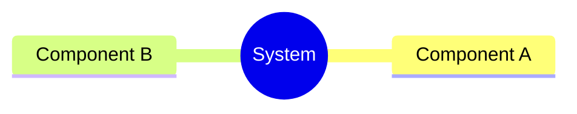
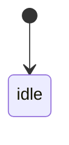
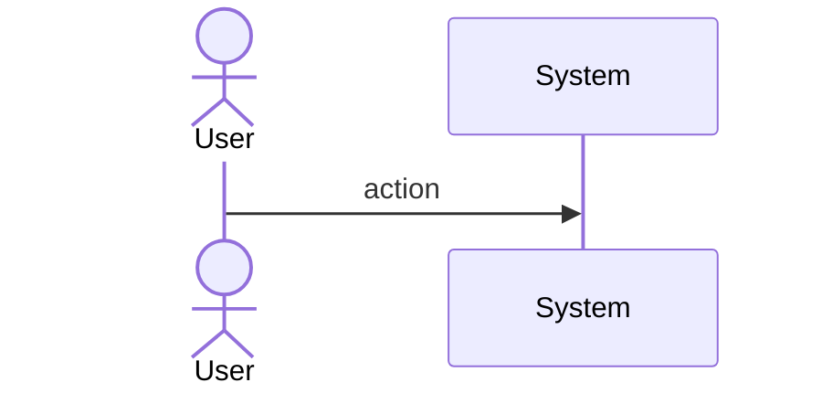
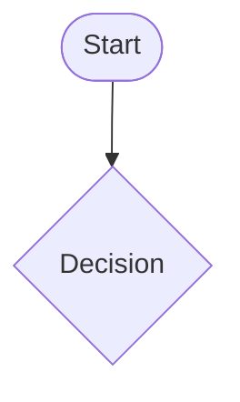
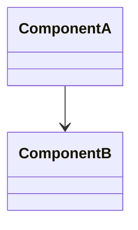
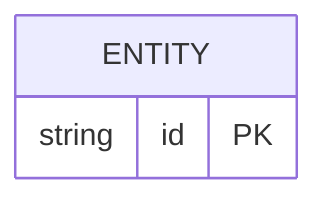

# Sdd Codegen Behavioral Generators

## Overview

<!-- type: overview lang: markdown -->

Behavioral generators (Category B) produce code skeletons and SPEC-REF markers from Mermaid Plus behavioral diagram frontmatter. Unlike structural generators (Category A), behavioral specs describe system behavior rather than code structure — full deterministic generation is not possible. Instead, generators emit what they can (enum variants, function signatures, control flow scaffolds) and insert `// SPEC-REF: <spec-path>#<section>` markers for the imperative logic that requires human or LLM authorship.

| Diagram Type | Section Type | Codegen Target | Coverage |
|---|---|---|---|
| `stateDiagram-v2` | `state-machine` | Rust enum variants + `is_terminal()` / `is_transient()` + `next()` skeleton | ~40% |
| `sequenceDiagram` | `interaction` | Method signatures + call-graph annotations | ~30% |
| `flowchart` | `logic` | Function skeleton + control flow scaffolds | ~20% |

All behavioral generators integrate with the CODEGEN marker system (R7) — generated code lives inside `// CODEGEN-BEGIN` / `// CODEGEN-END` blocks, hand-written logic outside is preserved. SPEC-REF markers inside CODEGEN blocks point back to the TD section for non-deterministic parts. Markers are tracked in `.score/codegen_markers.yaml` for CI visibility.
## Requirements

<!-- type: requirements lang: mermaid -->

```mermaid
---
id: sdd-codegen-behavioral-requirements
title: Behavioral Generators Requirements
requirements:
  R1:
    text: State-machine generator produces Rust enum variants from stateDiagram-v2 YAML frontmatter nodes
    type: functional
    priority: high
    risk: medium
    verification: test
    notes: |
      Parse `nodes` map from state-machine frontmatter. Each node becomes an enum variant.
      Generate `is_terminal()` bool returning true for terminal states.
      Generate `is_transient()` bool for transient/choice states.
      Generate `next()` match skeleton with SPEC-REF markers for routing logic.
  R2:
    text: Interaction generator produces method signatures from sequenceDiagram YAML frontmatter
    type: functional
    priority: medium
    risk: medium
    verification: test
    notes: |
      Parse `actors` and `messages` from interaction frontmatter.
      Generate method/fn signatures for each message.
      Annotate with call-graph: `// CALL: actor -> target` comments.
      Body is SPEC-REF marker pointing to interaction spec section.
  R3:
    text: Logic generator produces function skeleton from flowchart YAML frontmatter
    type: functional
    priority: medium
    risk: medium
    verification: test
    notes: |
      Parse `nodes` and `edges` from logic frontmatter.
      Generate fn skeleton with control flow based on decision nodes.
      SPEC-REF markers for each branch body.
  R4:
    text: All behavioral generators emit SPEC-REF markers for non-deterministic parts
    type: functional
    priority: high
    risk: low
    verification: test
    notes: |
      Marker format: `// SPEC-REF: <spec-path>#<section>\n// TODO: <task>`
      Language-aware comment syntax (// for Rust).
      Markers tracked in .score/codegen_markers.yaml.
  R5:
    text: Generated behavioral code lives inside CODEGEN-BEGIN/END blocks
    type: functional
    priority: high
    risk: low
    verification: test
    notes: |
      All behavioral generator output wrapped in CODEGEN block markers.
      Hand-written code outside markers preserved on re-generation.
---
requirementDiagram
    requirement R1 {
      id: R1
      text: State-machine generator
      risk: medium
      verifymethod: test
    }
    requirement R2 {
      id: R2
      text: Interaction generator
      risk: medium
      verifymethod: test
    }
    requirement R3 {
      id: R3
      text: Logic generator
      risk: medium
      verifymethod: test
    }
    requirement R4 {
      id: R4
      text: SPEC-REF markers
      risk: low
      verifymethod: test
    }
    requirement R5 {
      id: R5
      text: CODEGEN block wrapping
      risk: low
      verifymethod: test
    }
```
## Scenarios

<!-- type: scenarios lang: yaml -->

```yaml
scenarios:
  S1:
    name: State machine enum generation
    verifies: [R1, R5]
    given: |
      State-machine spec with frontmatter: nodes {change_inited: {kind: initial},
      pre_clarifications_created: {kind: normal}, change_archived: {kind: terminal}}
    when: score gen apply runs on the spec
    then: |
      Generated Rust in CODEGEN block:
      pub enum StatePhase { ChangeInited, PreClarificationsCreated, ChangeArchived }
      impl StatePhase { pub fn is_terminal(&self) -> bool { matches!(self, Self::ChangeArchived) } }
      // SPEC-REF: state-machine.md#routing exists in next() skeleton
  S2:
    name: Interaction method signatures generation
    verifies: [R2, R4, R5]
    given: |
      Interaction spec with actors [Client, Server] and messages
      [{from: Client, to: Server, name: create_issue}, {from: Server, to: Client, name: issue_created}]
    when: score gen apply runs on the spec
    then: |
      Generated Rust in CODEGEN block:
      async fn create_issue(&self, ...) -> Result<()> {
        // SPEC-REF: interaction.md#create-issue-flow
        // TODO: Implement
        todo!()
      }
  S3:
    name: Logic function skeleton generation
    verifies: [R3, R4]
    given: |
      Logic spec (flowchart) with nodes {start: decision, validate_input: process,
      return_error: terminal, process_ok: terminal} and edges with conditional branches
    when: score gen apply runs on the spec
    then: |
      Generated Rust skeleton with if/match structure based on decision nodes.
      Each branch body has SPEC-REF marker pointing to the flowchart spec.
  S4:
    name: CODEGEN markers preserved on re-generation
    verifies: [R5]
    given: |
      Target file has CODEGEN-BEGIN/END block from previous gen apply.
      Hand-written code exists below CODEGEN-END.
    when: score gen apply runs again after state-machine spec updated
    then: |
      Content inside CODEGEN block updated with new enum variants.
      Hand-written code below CODEGEN-END unchanged.
      SPEC-MANAGED comment at top of block updated.
```
## Diagrams

### Mindmap
<!-- type: mindmap lang: mermaid -->
<!-- TODO: Use Mermaid Plus mindmap (YAML frontmatter inside mermaid block).

-->

### State Machine
<!-- type: state-machine lang: mermaid -->
<!-- TODO: Use Mermaid Plus stateDiagram-v2 (YAML frontmatter inside mermaid block).

-->

### Interaction
<!-- type: interaction lang: mermaid -->
<!-- TODO: Use Mermaid Plus sequenceDiagram (YAML frontmatter inside mermaid block).

-->

### Logic
<!-- type: logic lang: mermaid -->
<!-- TODO: Use Mermaid Plus flowchart (YAML frontmatter inside mermaid block).

-->

### Dependencies
<!-- type: dependency lang: mermaid -->
<!-- TODO: Use Mermaid Plus classDiagram (YAML frontmatter inside mermaid block).

-->

### Data Model
<!-- type: db-model lang: mermaid -->
<!-- TODO: Use Mermaid Plus erDiagram (YAML frontmatter inside mermaid block).

-->

## API Spec

### REST API
<!-- type: rest-api lang: yaml -->
<!-- TODO -->

### RPC API
<!-- type: rpc-api lang: yaml -->
<!-- TODO: OpenRPC 1.3 as YAML. Example:
```yaml
openrpc: "1.3.2"
info:
  title: Service Name
  version: "1.0.0"
methods: []
```
-->

### Async API
<!-- type: async-api lang: yaml -->
<!-- TODO -->

### CLI
<!-- type: cli lang: yaml -->
<!-- TODO -->

### Schema
<!-- type: schema lang: yaml -->
<!-- TODO: JSON Schema as YAML. Example:
```yaml
"$schema": "https://json-schema.org/draft/2020-12/schema"
type: object
properties:
  id:
    type: string
required: [id]
```
-->

### Config
<!-- type: config lang: yaml -->
<!-- TODO -->

## Test Plan
<!-- type: test-plan lang: mermaid -->

<!-- TODO: Use Mermaid Plus requirementDiagram with element nodes and verifies relationships.
```mermaid
---
id: test-plan
---
requirementDiagram

element T1 {
  type: "Test"
}

element T2 {
  type: "Test"
}

T1 - verifies -> R1
T2 - verifies -> R2
```
-->

## Changes

<!-- type: changes lang: yaml -->

```yaml
changes:
  - path: crates/sdd/src/generate/gen/rust/state_machine.rs
    action: create
    description: |
      State machine generator. Reads state-machine frontmatter YAML (nodes + edges),
      generates Rust enum variants, is_terminal(), is_transient(), next() skeleton with SPEC-REF markers.
  - path: crates/sdd/src/generate/gen/rust/interaction.rs
    action: create
    description: |
      Interaction/sequence generator. Reads interaction frontmatter YAML (actors + messages),
      generates method signatures with call-graph annotations and SPEC-REF body markers.
  - path: crates/sdd/src/generate/gen/rust/logic.rs
    action: create
    description: |
      Logic/flowchart generator. Reads logic frontmatter YAML (nodes + edges),
      generates function skeletons with control flow scaffolds and SPEC-REF markers.
  - path: crates/sdd/src/generate/gen/rust/mod.rs
    action: modify
    description: Add pub mod state_machine; pub mod interaction; pub mod logic;
  - path: crates/sdd/src/generate/marker.rs
    action: create
    description: |
      SPEC-REF marker emitter and CODEGEN block parser/replacer.
      Parses existing CODEGEN-BEGIN/END blocks. Replaces content inside. Preserves wrapper.
      Emits SPEC-REF markers with language-aware comment syntax.
  - path: .score/codegen_markers.yaml
    action: create
    description: |
      Tracking file for all SPEC-REF markers emitted across all specs.
      Updated by score gen apply. Used for CI visibility.
```
## Wireframe
<!-- type: wireframe lang: yaml -->

<!-- TODO -->

## Component
<!-- type: component lang: yaml -->

<!-- TODO -->

## Design Token
<!-- type: design-token lang: yaml -->

<!-- TODO -->

## Doc
<!-- type: doc lang: markdown -->

<!-- TODO -->

# Reviews
