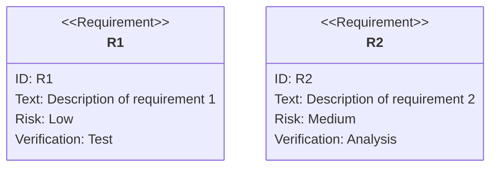
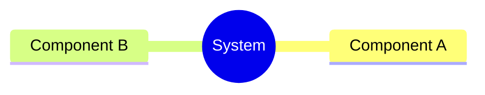
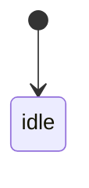
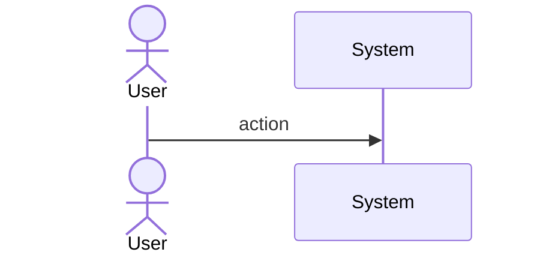
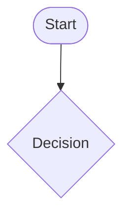
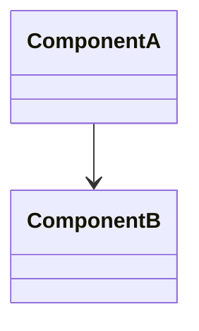
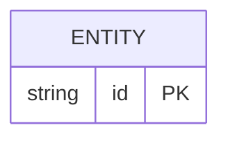

# Sdd Codegen Graph Envelope

## Overview

<!-- type: overview lang: markdown -->

Defines the common `Diagram<C>` envelope and per-diagram Content types for TD→code codegen. All Mermaid Plus diagram blocks share the same outer YAML shape but each diagram type has a distinct `Content` struct that matches its structural elements.

Common envelope shape (stored in Mermaid frontmatter):
```
id: <diagram-id>
title: <optional>
<diagram-specific fields>
```

Each diagram type has a specific Content struct:
- `state-machine`: `StateMachineContent { nodes: Map<id, StateNode>, edges: Vec<Transition>, initial: String }`
- `interaction`: `InteractionContent { actors: Vec<Actor>, messages: Vec<Message> }`
- `logic`: `LogicContent { nodes: Map<id, FlowNode>, edges: Vec<FlowEdge>, entry: String }`
- `requirements`: `RequirementContent { requirements: Map<id, Requirement>, elements: Map<id, Element>, relationships: Vec<Relationship> }`
- `schema`/`db-model`/`class`: Structural content types (see sdd-codegen-structural-generators)

This design (D3) avoids a universal `Graph<N,E>` — each diagram type is explicit and type-safe. The Rust trait `DiagramFrontmatter` provides a common interface for ID and node enumeration.
## Requirements
<!-- type: requirements lang: mermaid -->

<!-- TODO: Use Mermaid Plus requirementDiagram (SysML v1.6). Example:

-->

## Scenarios
<!-- type: scenarios lang: yaml -->

<!-- TODO: Use YAML GWT structured format. Example:
```yaml
- id: S1
  given: Initial state description
  when: Action or event that triggers the scenario
  then: Expected outcome

- id: S2
  given: Another initial state
  when: Another action
  then: Another expected outcome
  diagram_ref: interaction-S2
```
-->

## Diagrams

### Mindmap
<!-- type: mindmap lang: mermaid -->
<!-- TODO: Use Mermaid Plus mindmap (YAML frontmatter inside mermaid block).

-->

### State Machine
<!-- type: state-machine lang: mermaid -->
<!-- TODO: Use Mermaid Plus stateDiagram-v2 (YAML frontmatter inside mermaid block).

-->

### Interaction
<!-- type: interaction lang: mermaid -->
<!-- TODO: Use Mermaid Plus sequenceDiagram (YAML frontmatter inside mermaid block).

-->

### Logic
<!-- type: logic lang: mermaid -->
<!-- TODO: Use Mermaid Plus flowchart (YAML frontmatter inside mermaid block).

-->

### Dependencies
<!-- type: dependency lang: mermaid -->
<!-- TODO: Use Mermaid Plus classDiagram (YAML frontmatter inside mermaid block).

-->

### Data Model
<!-- type: db-model lang: mermaid -->
<!-- TODO: Use Mermaid Plus erDiagram (YAML frontmatter inside mermaid block).

-->

## API Spec

### REST API
<!-- type: rest-api lang: yaml -->
<!-- TODO -->

### RPC API
<!-- type: rpc-api lang: yaml -->
<!-- TODO: OpenRPC 1.3 as YAML. Example:
```yaml
openrpc: "1.3.2"
info:
  title: Service Name
  version: "1.0.0"
methods: []
```
-->

### Async API
<!-- type: async-api lang: yaml -->
<!-- TODO -->

### CLI
<!-- type: cli lang: yaml -->
<!-- TODO -->

### Schema
<!-- type: schema lang: yaml -->
<!-- TODO: JSON Schema as YAML. Example:
```yaml
"$schema": "https://json-schema.org/draft/2020-12/schema"
type: object
properties:
  id:
    type: string
required: [id]
```
-->

### Config
<!-- type: config lang: yaml -->
<!-- TODO -->

## Test Plan
<!-- type: test-plan lang: mermaid -->

<!-- TODO: Use Mermaid Plus requirementDiagram with element nodes and verifies relationships.
```mermaid
---
id: test-plan
---
requirementDiagram

element T1 {
  type: "Test"
}

element T2 {
  type: "Test"
}

T1 - verifies -> R1
T2 - verifies -> R2
```
-->

## Changes

<!-- type: changes lang: yaml -->

```yaml
changes:
  - path: crates/sdd/src/generate/diagrams/envelope.rs
    action: create
    description: |
      Common Diagram<C> envelope struct and DiagramFrontmatter trait.
      pub struct Diagram<C> { pub id: String, pub title: Option<String>, pub content: C }
      pub trait DiagramFrontmatter { fn id(&self) -> &str; fn node_ids(&self) -> Vec<&str>; }
  - path: crates/sdd/src/generate/diagrams/content/state_machine.rs
    action: create
    description: |
      StateMachineContent struct with nodes (HashMap<String, StateNode>) and edges (Vec<Transition>).
      Replaces XState-based schema in state_plus/schema.rs (D8).
  - path: crates/sdd/src/generate/diagrams/content/interaction.rs
    action: create
    description: |
      InteractionContent struct with actors (Vec<Actor>) and messages (Vec<Message>).
      Replaces XState-based schema in sequence_plus/schema.rs.
  - path: crates/sdd/src/generate/diagrams/content/logic.rs
    action: create
    description: |
      LogicContent struct with nodes (HashMap<String, FlowNode>) and edges (Vec<FlowEdge>).
      Replaces XState-based schema in flowchart_plus/schema.rs.
  - path: crates/sdd/src/generate/diagrams/content/requirement.rs
    action: create
    description: |
      RequirementContent struct with requirements map, elements map, relationships vec.
      Replaces existing requirement_plus/schema.rs.
  - path: crates/sdd/src/generate/diagrams/content/mod.rs
    action: create
    description: Exposes all content modules.
  - path: crates/sdd/src/generate/frontmatter.rs
    action: create
    description: |
      YAML frontmatter extractor from Mermaid code fence.
      Parses ```mermaid\n---\n<yaml>\n---\n<mermaid body>\n``` blocks.
      Returns (yaml_value, mermaid_body) tuple.
  - path: crates/sdd/src/generate/diagrams/mod.rs
    action: modify
    description: Add pub mod envelope; pub mod content; and update exports.
```
## Wireframe
<!-- type: wireframe lang: yaml -->

<!-- TODO -->

## Component
<!-- type: component lang: yaml -->

<!-- TODO -->

## Design Token
<!-- type: design-token lang: yaml -->

<!-- TODO -->

## Doc
<!-- type: doc lang: markdown -->

<!-- TODO -->


## Schema

<!-- type: schema lang: yaml -->

```yaml
"$schema": "https://json-schema.org/draft/2020-12/schema"
title: DiagramFrontmatter
description: Common envelope for all Mermaid Plus diagram types
type: object
required: [id]
properties:
  id:
    type: string
    pattern: "^[a-z][a-z0-9-]*$"
    description: Diagram identifier, kebab-case
  title:
    type: string
    description: Optional human-readable title

---
title: StateMachineContent
description: Content type for state-machine section (stateDiagram-v2)
type: object
required: [nodes, initial]
properties:
  id:
    type: string
  initial:
    type: string
    description: ID of the initial state
  nodes:
    type: object
    description: Map of state_id -> StateNode
    additionalProperties:
      type: object
      properties:
        kind:
          type: string
          enum: [initial, normal, terminal, transient, choice]
        label:
          type: string
        description:
          type: string
  edges:
    type: array
    description: Transitions between states
    items:
      type: object
      required: [from, to]
      properties:
        from:
          type: string
        to:
          type: string
        event:
          type: string
        guard:
          type: string
        label:
          type: string

---
title: InteractionContent
description: Content type for interaction section (sequenceDiagram)
type: object
required: [actors, messages]
properties:
  id:
    type: string
  actors:
    type: array
    items:
      type: object
      required: [id]
      properties:
        id:
          type: string
        kind:
          type: string
          enum: [actor, participant, system]
  messages:
    type: array
    description: Ordered message sequence
    items:
      type: object
      required: [from, to, name]
      properties:
        from:
          type: string
        to:
          type: string
        name:
          type: string
        async:
          type: boolean
        returns:
          type: string

---
title: LogicContent
description: Content type for logic section (flowchart)
type: object
required: [nodes, entry]
properties:
  id:
    type: string
  entry:
    type: string
    description: Entry node ID
  nodes:
    type: object
    description: Map of node_id -> FlowNode
    additionalProperties:
      type: object
      properties:
        kind:
          type: string
          enum: [start, process, decision, terminal]
        label:
          type: string
  edges:
    type: array
    items:
      type: object
      required: [from, to]
      properties:
        from:
          type: string
        to:
          type: string
        label:
          type: string
```

# Reviews
