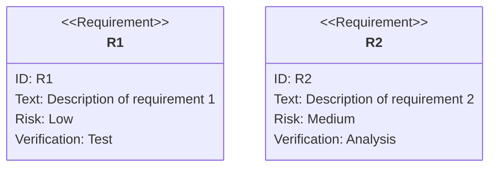
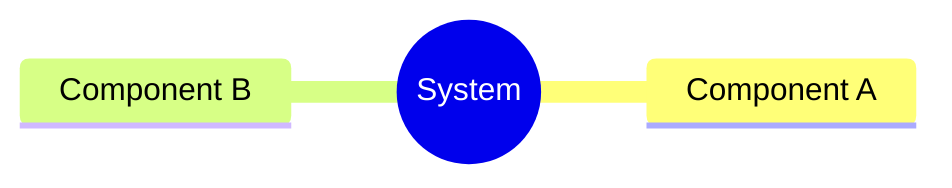
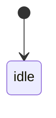
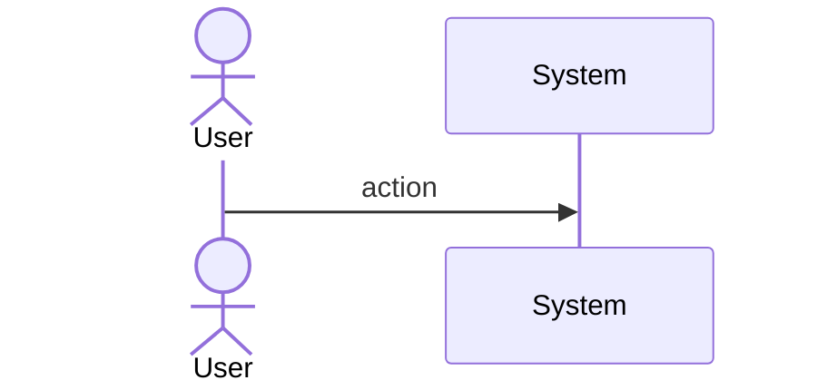
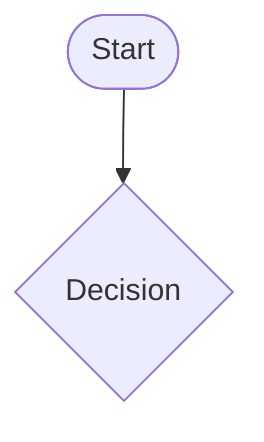
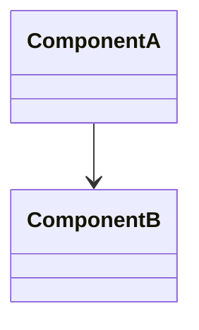
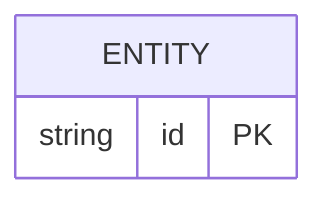

# Sdd Codegen Type System

## Overview

<!-- type: overview lang: markdown -->

The abstract type system enables multi-language codegen from a single TD spec. YAML frontmatter uses abstract types (`integer`, `string`, `list<T>`, `optional<T>`, etc.) that are translated to each target language by a per-language translator.

For MVP, only the Rust translator is implemented. Python/TypeScript translators share the same abstract type enum and translator trait but have deferred implementations.

Translation table (Rust MVP):

| Abstract | Modifier | Rust |
|---|---|---|
| `integer` | `int_size: 64` | `i64` |
| `integer` | `unsigned: true, int_size: 64` | `u64` |
| `integer` | `int_size: 32` | `i32` |
| `string` | — | `String` |
| `bool` | — | `bool` |
| `list<T>` | — | `Vec<T>` |
| `map<K,V>` | — | `HashMap<K,V>` |
| `optional<T>` | — | `Option<T>` |
| `ref<Name>` | — | `Name` (same module) or `crate::Name` (cross-module) |
| `bytes` | — | `Vec<u8>` |
| `any` | — | `serde_json::Value` |

Type translation lives in `crates/sdd/src/generate/types.rs`. The `AbstractType` enum is parsed from YAML `type` fields in schema frontmatter. The `RustTypeTranslator` implements `TypeTranslator<String>` for Rust output.
## Requirements
<!-- type: requirements lang: mermaid -->

<!-- TODO: Use Mermaid Plus requirementDiagram (SysML v1.6). Example:

-->

## Scenarios
<!-- type: scenarios lang: yaml -->

<!-- TODO: Use YAML GWT structured format. Example:
```yaml
- id: S1
  given: Initial state description
  when: Action or event that triggers the scenario
  then: Expected outcome

- id: S2
  given: Another initial state
  when: Another action
  then: Another expected outcome
  diagram_ref: interaction-S2
```
-->

## Diagrams

### Mindmap
<!-- type: mindmap lang: mermaid -->
<!-- TODO: Use Mermaid Plus mindmap (YAML frontmatter inside mermaid block).

-->

### State Machine
<!-- type: state-machine lang: mermaid -->
<!-- TODO: Use Mermaid Plus stateDiagram-v2 (YAML frontmatter inside mermaid block).

-->

### Interaction
<!-- type: interaction lang: mermaid -->
<!-- TODO: Use Mermaid Plus sequenceDiagram (YAML frontmatter inside mermaid block).

-->

### Logic
<!-- type: logic lang: mermaid -->
<!-- TODO: Use Mermaid Plus flowchart (YAML frontmatter inside mermaid block).

-->

### Dependencies
<!-- type: dependency lang: mermaid -->
<!-- TODO: Use Mermaid Plus classDiagram (YAML frontmatter inside mermaid block).

-->

### Data Model
<!-- type: db-model lang: mermaid -->
<!-- TODO: Use Mermaid Plus erDiagram (YAML frontmatter inside mermaid block).

-->

## API Spec

### REST API
<!-- type: rest-api lang: yaml -->
<!-- TODO -->

### RPC API
<!-- type: rpc-api lang: yaml -->
<!-- TODO: OpenRPC 1.3 as YAML. Example:
```yaml
openrpc: "1.3.2"
info:
  title: Service Name
  version: "1.0.0"
methods: []
```
-->

### Async API
<!-- type: async-api lang: yaml -->
<!-- TODO -->

### CLI
<!-- type: cli lang: yaml -->
<!-- TODO -->

### Schema
<!-- type: schema lang: yaml -->
<!-- TODO: JSON Schema as YAML. Example:
```yaml
"$schema": "https://json-schema.org/draft/2020-12/schema"
type: object
properties:
  id:
    type: string
required: [id]
```
-->

### Config
<!-- type: config lang: yaml -->
<!-- TODO -->

## Test Plan
<!-- type: test-plan lang: mermaid -->

<!-- TODO: Use Mermaid Plus requirementDiagram with element nodes and verifies relationships.
```mermaid
---
id: test-plan
---
requirementDiagram

element T1 {
  type: "Test"
}

element T2 {
  type: "Test"
}

T1 - verifies -> R1
T2 - verifies -> R2
```
-->

## Changes

<!-- type: changes lang: yaml -->

```yaml
changes:
  - path: crates/sdd/src/generate/types.rs
    action: create
    description: |
      Abstract type system for multi-language codegen.
      pub enum AbstractType { Integer { int_size: u8, unsigned: bool }, String, Bool, Bytes, Any,
        List { item: Box<AbstractType> }, Map { key: Box<AbstractType>, value: Box<AbstractType> },
        Optional { inner: Box<AbstractType> }, Ref { name: String } }
      pub trait TypeTranslator { fn translate(&self, t: &AbstractType) -> String; }
      pub struct RustTypeTranslator;
      impl TypeTranslator for RustTypeTranslator { ... }
      pub fn parse_abstract_type(yaml_str: &str) -> Result<AbstractType>
  - path: crates/sdd/src/generate/config_loader.rs
    action: create
    description: |
      Loads codegen configuration from .score/config.toml [codegen.rust.defaults].
      pub struct RustConfig { pub derives: Vec<String>, pub serde_rename_strategy: String,
        pub visibility: String, pub derive_hash: bool, pub derive_copy: bool }
      impl Default for RustConfig (use project standard defaults)
      pub fn load_rust_config(project_root: &Path) -> RustConfig
      pub fn merge_spec_overrides(base: RustConfig, frontmatter: &Value) -> RustConfig
```
## Wireframe
<!-- type: wireframe lang: yaml -->

<!-- TODO -->

## Component
<!-- type: component lang: yaml -->

<!-- TODO -->

## Design Token
<!-- type: design-token lang: yaml -->

<!-- TODO -->

## Doc
<!-- type: doc lang: markdown -->

<!-- TODO -->


## Schema

<!-- type: schema lang: yaml -->

```yaml
"$schema": "https://json-schema.org/draft/2020-12/schema"
title: AbstractTypeSpec
description: Abstract type specification used in structural diagram frontmatter fields
type: object
properties:
  type:
    type: string
    description: Abstract type name
    enum:
      - integer
      - string
      - bool
      - bytes
      - any
      - "list<T>"
      - "map<K,V>"
      - "optional<T>"
      - "ref<Name>"
  int_size:
    type: integer
    description: Bit width for integer types (8, 16, 32, 64)
    enum: [8, 16, 32, 64]
    default: 64
  unsigned:
    type: boolean
    description: Whether integer type is unsigned
    default: false
  item_type:
    type: string
    description: Element type for list<T> and key type for map<K,V>
  value_type:
    type: string
    description: Value type for map<K,V>
  ref_name:
    type: string
    description: Referenced type name for ref<Name>

---
title: RustConfig
description: Rust codegen configuration (from global config.toml + per-spec x-rust overrides)
type: object
properties:
  derives:
    type: array
    items:
      type: string
    default: ["Debug", "Clone", "PartialEq", "Serialize", "Deserialize"]
  serde_rename_strategy:
    type: string
    enum: [snake_case, camelCase, PascalCase, SCREAMING_SNAKE_CASE]
    default: snake_case
  visibility:
    type: string
    enum: [pub, pub(crate), ""]
    default: pub
  derive_hash:
    type: boolean
    description: Add Hash to derives
    default: false
  derive_copy:
    type: boolean
    description: Add Copy to derives
    default: false
```

# Reviews
