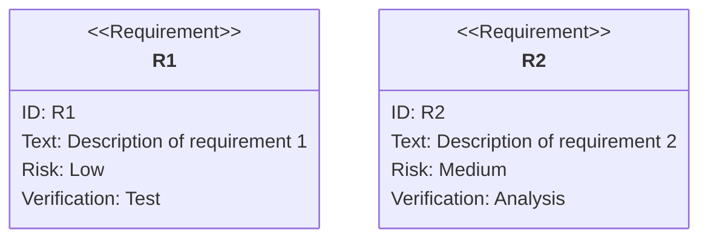
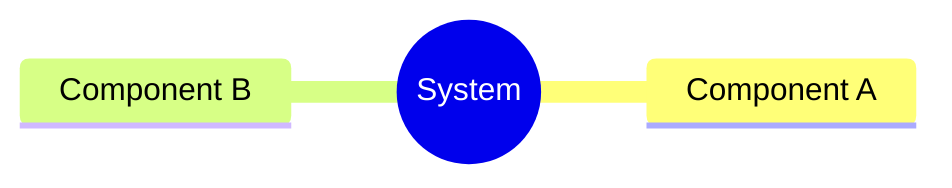
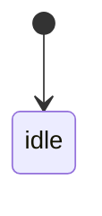
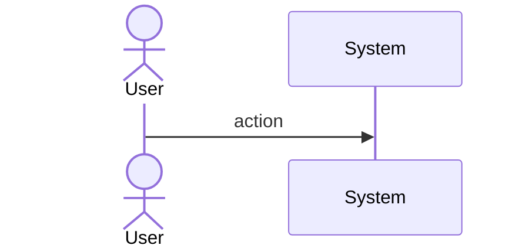
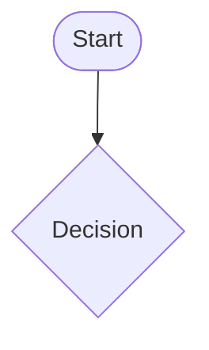
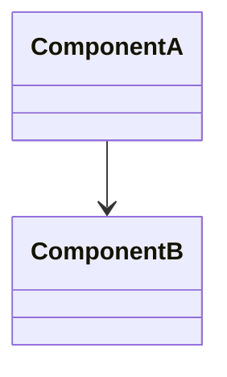
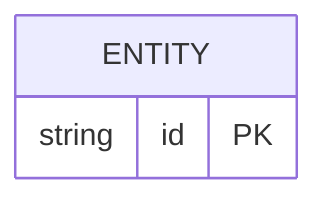

# Sdd Codegen Validation Harness

## Overview

<!-- type: overview lang: markdown -->

The validation harness provides four CLI entry points for the TD→code codegen pipeline. It is the primary interface for developers to verify spec-to-code alignment and apply generated code to target files.

| Command | Purpose | Writes Files |
|---|---|---|
| `score gen diff <spec-path>` | Show drift between generated and current code | No |
| `score gen apply <spec-path>` | Write generated code to target files | Yes |
| `score gen render <spec-path>` | Regenerate Mermaid body from frontmatter YAML | Yes (spec file) |
| `score gen validate <spec-path>` | Check frontmatter schema compliance | No |

All four commands are integrated into `score check-alignment` as sub-checks. The diff command is the primary loop primitive: run it, fix gaps, re-run until exit code 0.

**Diff report classifications**:
- `exact`: generated code matches current file content exactly
- `marker-only`: difference is only SPEC-REF markers (acceptable)
- `drift`: content differs beyond markers (needs fixing)
- `gap`: target file has no CODEGEN block for this spec (missing)

**Metrics** (R1.3):
- `drift%` = drift lines / total lines
- `marker%` = marker lines / total lines  
- `coverage%` = generated lines / total lines
- Exit 0 if drift% == 0 AND marker% <= 10%
## Requirements
<!-- type: requirements lang: mermaid -->

<!-- TODO: Use Mermaid Plus requirementDiagram (SysML v1.6). Example:

-->

## Scenarios
<!-- type: scenarios lang: yaml -->

<!-- TODO: Use YAML GWT structured format. Example:
```yaml
- id: S1
  given: Initial state description
  when: Action or event that triggers the scenario
  then: Expected outcome

- id: S2
  given: Another initial state
  when: Another action
  then: Another expected outcome
  diagram_ref: interaction-S2
```
-->

## Diagrams

### Mindmap
<!-- type: mindmap lang: mermaid -->
<!-- TODO: Use Mermaid Plus mindmap (YAML frontmatter inside mermaid block).

-->

### State Machine
<!-- type: state-machine lang: mermaid -->
<!-- TODO: Use Mermaid Plus stateDiagram-v2 (YAML frontmatter inside mermaid block).

-->

### Interaction
<!-- type: interaction lang: mermaid -->
<!-- TODO: Use Mermaid Plus sequenceDiagram (YAML frontmatter inside mermaid block).

-->

### Logic
<!-- type: logic lang: mermaid -->
<!-- TODO: Use Mermaid Plus flowchart (YAML frontmatter inside mermaid block).

-->

### Dependencies
<!-- type: dependency lang: mermaid -->
<!-- TODO: Use Mermaid Plus classDiagram (YAML frontmatter inside mermaid block).

-->

### Data Model
<!-- type: db-model lang: mermaid -->
<!-- TODO: Use Mermaid Plus erDiagram (YAML frontmatter inside mermaid block).

-->

## API Spec

### REST API
<!-- type: rest-api lang: yaml -->
<!-- TODO -->

### RPC API
<!-- type: rpc-api lang: yaml -->
<!-- TODO: OpenRPC 1.3 as YAML. Example:
```yaml
openrpc: "1.3.2"
info:
  title: Service Name
  version: "1.0.0"
methods: []
```
-->

### Async API
<!-- type: async-api lang: yaml -->
<!-- TODO -->

### CLI
<!-- type: cli lang: yaml -->
<!-- TODO -->

### Schema
<!-- type: schema lang: yaml -->
<!-- TODO: JSON Schema as YAML. Example:
```yaml
"$schema": "https://json-schema.org/draft/2020-12/schema"
type: object
properties:
  id:
    type: string
required: [id]
```
-->

### Config
<!-- type: config lang: yaml -->
<!-- TODO -->

## Test Plan
<!-- type: test-plan lang: mermaid -->

<!-- TODO: Use Mermaid Plus requirementDiagram with element nodes and verifies relationships.
```mermaid
---
id: test-plan
---
requirementDiagram

element T1 {
  type: "Test"
}

element T2 {
  type: "Test"
}

T1 - verifies -> R1
T2 - verifies -> R2
```
-->

## Changes

<!-- type: changes lang: yaml -->

```yaml
changes:
  - path: crates/sdd/src/generate/diff.rs
    action: create
    description: |
      Diff implementation: given spec path, run codegen, compare against current target files.
      pub struct DiffReport { pub files: Vec<FileDiff> }
      pub struct FileDiff { pub path: PathBuf, pub classification: DiffClass, pub drift_pct: f32,
        pub marker_pct: f32, pub coverage_pct: f32 }
      pub enum DiffClass { Exact, MarkerOnly, Drift, Gap }
      pub fn run_diff(spec_path: &Path, project_root: &Path) -> Result<DiffReport>
  - path: crates/sdd/src/generate/apply.rs
    action: create
    description: |
      Apply implementation: run codegen and write CODEGEN blocks to target files.
      pub fn run_apply(spec_path: &Path, project_root: &Path, dry_run: bool) -> Result<ApplyReport>
      pub fn run_apply_worktree(spec_path: &Path, worktree: &Path) -> Result<ApplyReport>
  - path: crates/sdd/src/generate/render.rs
    action: create
    description: |
      Render implementation: parse Mermaid Plus frontmatter YAML and regenerate diagram body.
      pub fn run_render(spec_path: &Path, check_only: bool) -> Result<RenderReport>
      Parses YAML between --- markers in mermaid blocks, regenerates Mermaid syntax from YAML.
  - path: crates/sdd/src/generate/mod.rs
    action: modify
    description: Add pub mod diff; pub mod apply; pub mod render; pub mod types; pub mod frontmatter; pub mod gen;
  - path: projects/score/cli/src/commands.rs
    action: modify
    description: |
      Extend GenCommands enum with:
      - Diff { spec_path: Option<String>, all: bool, json: bool }
      - Apply { spec_path: Option<String>, all: bool, dry_run: bool, into_worktree: Option<String> }
      - Render { spec_path: String, check: bool }
      - Validate { spec_path: Option<String>, all: bool }
      - InitMarkers { file: String, spec: String, symbol: Option<String> }
  - path: projects/score/cli/src/codegen.rs
    action: modify
    description: |
      Add dispatch arms for new GenCommands variants:
      Diff -> codegen::run_diff()
      Apply -> codegen::run_apply()
      Render -> codegen::run_render()
      Validate -> codegen::run_validate()
      InitMarkers -> codegen::run_init_markers()
  - path: projects/score/cli/src/check_alignment.rs
    action: modify
    description: |
      Integrate score gen diff --all as a sub-check in check-alignment.
      Run diff for all covered specs. Add DiffCheck { drift_pct, marker_pct } to AlignmentResult.
```
## Wireframe
<!-- type: wireframe lang: yaml -->

<!-- TODO -->

## Component
<!-- type: component lang: yaml -->

<!-- TODO -->

## Design Token
<!-- type: design-token lang: yaml -->

<!-- TODO -->

## Doc
<!-- type: doc lang: markdown -->

<!-- TODO -->


## CLI

<!-- type: cli lang: yaml -->

```yaml
command: score gen
description: TD→code codegen pipeline entry points
subcommands:
  - name: diff
    description: Show drift between generated and current code (no file writes)
    args:
      - name: spec_path
        type: string
        description: Path to a spec file (.score/tech_design/**/*.md)
        required: false
      - name: --all
        type: bool
        description: Run diff for all covered specs in the project
        required: false
      - name: --json
        type: bool
        description: Output diff report as JSON
        required: false
    examples:
      - score gen diff .score/tech_design/crates/sdd/logic/structured-issue.md
      - score gen diff --all
      - score gen diff --all --json

  - name: apply
    description: Write generated code to target files (updates CODEGEN blocks)
    args:
      - name: spec_path
        type: string
        description: Path to a spec file
        required: false
      - name: --all
        type: bool
        description: Apply all covered specs
        required: false
      - name: --dry-run
        type: bool
        description: Print output to stdout, do not write files
        required: false
      - name: --into-worktree
        type: string
        description: Write to specified worktree path instead of project root
        required: false
    examples:
      - score gen apply .score/tech_design/crates/sdd/logic/structured-issue.md
      - score gen apply --all --dry-run

  - name: render
    description: Regenerate Mermaid diagram body from YAML frontmatter in spec file
    args:
      - name: spec_path
        type: string
        description: Path to a spec file with Mermaid Plus blocks
        required: true
      - name: --check
        type: bool
        description: Check if body is in sync (exit 1 if not), do not write
        required: false
    examples:
      - score gen render .score/tech_design/crates/sdd/logic/structured-issue.md
      - score gen render --check .score/tech_design/crates/sdd/logic/state-machine.md

  - name: validate
    description: Check frontmatter schema compliance for a spec file
    args:
      - name: spec_path
        type: string
        description: Path to a spec file
        required: true
      - name: --all
        type: bool
        description: Validate all spec files
        required: false
    examples:
      - score gen validate .score/tech_design/crates/sdd/logic/structured-issue.md

  - name: init-markers
    description: Scaffold CODEGEN-BEGIN/END markers in an existing target file
    args:
      - name: file
        type: string
        description: Target Rust file path
        required: true
      - name: --spec
        type: string
        description: Spec reference (e.g. crates/sdd/logic/structured-issue.md#schema)
        required: true
      - name: --symbol
        type: string
        description: Symbol name near insertion point (optional)
        required: false
    examples:
      - score gen init-markers crates/sdd/src/models/state.rs --spec crates/sdd/logic/state-machine.md#state-phase
```

# Reviews
