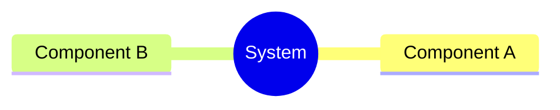
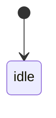
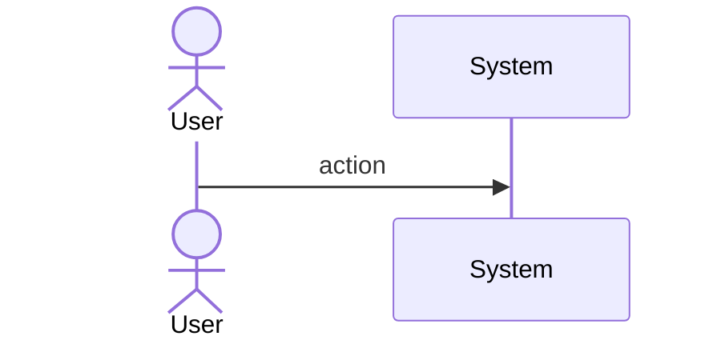
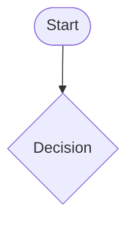
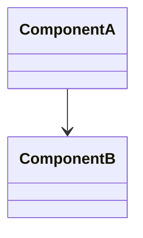
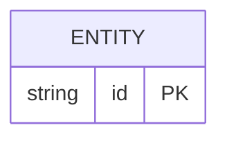

# Mamba Type 3arg Spec

## Overview

<!-- type: overview lang: markdown -->

Implements `type(name, bases, namespace)` — the 3-arg form of the `type` builtin — in cclab-mamba (#974). This is the runtime primitive that backs all dynamic class creation. Django ORM model metaclass, SQLAlchemy declarative base, Pydantic BaseModel, attrs, dataclasses, enum.Enum, and ABCMeta all depend on it.

The implementation adds `mb_type3(name, bases, dict)` to `runtime/builtins.rs`. It extracts the class name string, resolves base class names from the bases tuple, separates dict entries into methods (callables and dunders) and class attributes, then delegates to `mb_class_register` in `runtime/class.rs` which provides C3 MRO computation, `__init_subclass__` hook dispatch, and `__set_name__` protocol. The `class` statement and `type()` 3-arg form share this same `mb_class_register` infrastructure.

The `dispatch_type` wrapper in `stdlib/builtins_mod.rs` routes by argument count: 1-arg → `mb_type`, 3-arg → `mb_type3`.
## Requirements

```mermaid
---
id: requirements
---
requirementDiagram

requirement R1 {
  id: R1
  text: "type(name, bases, namespace) returns new class object with name: str, bases: tuple[type,...], namespace entries as attrs/methods"
  risk: high
  verifymethod: test
}

requirement R2 {
  id: R2
  text: "Resulting class has __name__, __bases__, namespace entries bound as class attributes"
  risk: high
  verifymethod: test
}

requirement R3 {
  id: R3
  text: "C3 linearization MRO computed at class-creation time, matching CPython"
  risk: high
  verifymethod: test
}

requirement R4 {
  id: R4
  text: "New class usable like statically-defined class: instantiate, call, isinstance, issubclass"
  risk: high
  verifymethod: test
}

requirement R5 {
  id: R5
  text: "__init_subclass__ and __set_name__ hooks fire on class construction"
  risk: medium
  verifymethod: test
}

requirement R7 {
  id: R7
  text: "class statement and type() 3-arg share mb_class_register infrastructure"
  risk: medium
  verifymethod: analysis
}
```

<!-- type: requirements lang: mermaid -->


## Scenarios

<!-- type: scenarios lang: yaml -->

```yaml
- id: AC1
  given: type('MyCls', (), {'x': 1}) is called
  when: mb_type3 executes
  then: class MyCls is created with MyCls.x == 1 and MyCls.__name__ == 'MyCls'

- id: AC2
  given: type('MyCls', (object,), {'greet': lambda self: 'hi'}) is called
  when: an instance is created and greet() is called
  then: MyCls().greet() returns 'hi'

- id: AC3
  given: type('C', (A, B), {}) where A and B are registered classes
  when: class C is created
  then: C.__mro__ matches what class C(A, B): pass produces

- id: AC4
  given: MyCls is created via type()
  when: isinstance and issubclass are called
  then: isinstance(MyCls(), MyCls) is True and issubclass(MyCls, object) is True

- id: AC5
  given: a parent class defines __init_subclass__(cls)
  when: type() creates a subclass
  then: parent __init_subclass__ is called with cls=new_class

- id: AC7
  given: class X: pass and type('X2', (), {}) are both defined
  when: instances are created from each
  then: both produce functionally equivalent class objects with same MRO and isinstance behavior
```
## Diagrams

### Mindmap
<!-- type: mindmap lang: mermaid -->
<!-- TODO: Use Mermaid Plus mindmap (YAML frontmatter inside mermaid block).

-->

### State Machine
<!-- type: state-machine lang: mermaid -->
<!-- TODO: Use Mermaid Plus stateDiagram-v2 (YAML frontmatter inside mermaid block).

-->

### Interaction
<!-- type: interaction lang: mermaid -->
<!-- TODO: Use Mermaid Plus sequenceDiagram (YAML frontmatter inside mermaid block).

-->

### Logic
<!-- type: logic lang: mermaid -->
<!-- TODO: Use Mermaid Plus flowchart (YAML frontmatter inside mermaid block).

-->

### Dependencies
<!-- type: dependency lang: mermaid -->
<!-- TODO: Use Mermaid Plus classDiagram (YAML frontmatter inside mermaid block).

-->

### Data Model
<!-- type: db-model lang: mermaid -->
<!-- TODO: Use Mermaid Plus erDiagram (YAML frontmatter inside mermaid block).

-->

## API Spec

### REST API
<!-- type: rest-api lang: yaml -->
<!-- TODO -->

### RPC API
<!-- type: rpc-api lang: yaml -->
<!-- TODO: OpenRPC 1.3 as YAML. Example:
```yaml
openrpc: "1.3.2"
info:
  title: Service Name
  version: "1.0.0"
methods: []
```
-->

### Async API
<!-- type: async-api lang: yaml -->
<!-- TODO -->

### CLI
<!-- type: cli lang: yaml -->
<!-- TODO -->

### Schema
<!-- type: schema lang: yaml -->
<!-- TODO: JSON Schema as YAML. Example:
```yaml
"$schema": "https://json-schema.org/draft/2020-12/schema"
type: object
properties:
  id:
    type: string
required: [id]
```
-->

### Config
<!-- type: config lang: yaml -->
<!-- TODO -->

## Test Plan
<!-- type: test-plan lang: mermaid -->

<!-- TODO: Use Mermaid Plus requirementDiagram with element nodes and verifies relationships.
```mermaid
---
id: test-plan
---
requirementDiagram

element T1 {
  type: "Test"
}

element T2 {
  type: "Test"
}

T1 - verifies -> R1
T2 - verifies -> R2
```
-->

## Changes

<!-- type: changes lang: yaml -->

```yaml
files:
  - path: crates/mamba/src/runtime/builtins.rs
    action: MODIFY
    targets:
      - type: function
        name: mb_type3
        change: add — 3-arg type() that extracts name/bases/dict, splits methods vs attrs, calls mb_class_register, returns make_type_object()
    do_not_touch: [mb_type]

  - path: crates/mamba/src/runtime/stdlib/builtins_mod.rs
    action: MODIFY
    targets:
      - type: function
        name: dispatch_type
        change: route nargs==3 to mb_type3 in addition to nargs==1 to mb_type

  - path: crates/mamba/src/runtime/class.rs
    action: MODIFY
    targets:
      - type: function
        name: mb_class_register
        change: shared by both class statement and type() 3-arg — no change needed, already handles C3 MRO, __init_subclass__, __set_name__
    do_not_touch: [mb_class_register]

  - path: crates/mamba/tests/fixtures/conformance/class_system/type_3arg.py
    action: CREATE
    description: conformance test for basic class creation, attribute access, isinstance, issubclass

  - path: crates/mamba/tests/fixtures/conformance/class_system/type_3arg.expected
    action: CREATE
    description: expected output for type_3arg.py conformance test
```
## Wireframe
<!-- type: wireframe lang: yaml -->

<!-- TODO -->

## Component
<!-- type: component lang: yaml -->

<!-- TODO -->

## Design Token
<!-- type: design-token lang: yaml -->

<!-- TODO -->

## Doc
<!-- type: doc lang: markdown -->

<!-- TODO -->

# Reviews
