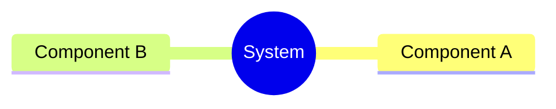
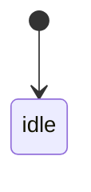
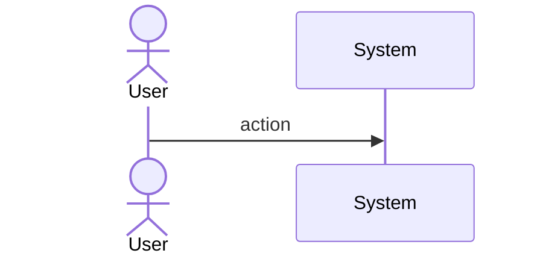
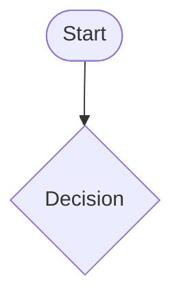
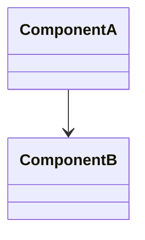
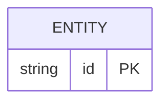

# Bug Init Change Writes Score Changes To Main Repo Inst Spec

## Overview
<!-- type: overview lang: markdown -->

Clarify the storage model in issue-centric-workflow.md: `.score/changes/<id>/` lives on the main repo (control plane), while code and tech_design changes live in the worktree (data plane). The current implementation is correct — this change updates the spec pseudocode and adds a Storage Model section to eliminate ambiguity.
## Requirements
<!-- type: requirements lang: mermaid -->

| ID | Text | Risk | Verify |
|----|------|------|--------|
| R1 | Update Changes pseudocode to explicitly state change_dir = project_root/.score/changes/<slug> (main repo), not worktree_path | low | inspection |
| R2 | Add Storage Model section: control plane (main: issues, changes, STATE) vs data plane (worktree: code, tech_design) | low | inspection |
| R3 | Document init_change execution order (change_dir before worktree) as correct by design | low | inspection |
## Scenarios
<!-- type: scenarios lang: yaml -->

<!-- TODO: Use YAML GWT structured format. Example:
```yaml
- id: S1
  given: Initial state description
  when: Action or event that triggers the scenario
  then: Expected outcome

- id: S2
  given: Another initial state
  when: Another action
  then: Another expected outcome
  diagram_ref: interaction-S2
```
-->

## Diagrams

### Mindmap
<!-- type: mindmap lang: mermaid -->
<!-- TODO: Use Mermaid Plus mindmap (YAML frontmatter inside mermaid block).

-->

### State Machine
<!-- type: state-machine lang: mermaid -->
<!-- TODO: Use Mermaid Plus stateDiagram-v2 (YAML frontmatter inside mermaid block).

-->

### Interaction
<!-- type: interaction lang: mermaid -->
<!-- TODO: Use Mermaid Plus sequenceDiagram (YAML frontmatter inside mermaid block).

-->

### Logic
<!-- type: logic lang: mermaid -->
<!-- TODO: Use Mermaid Plus flowchart (YAML frontmatter inside mermaid block).

-->

### Dependencies
<!-- type: dependency lang: mermaid -->
<!-- TODO: Use Mermaid Plus classDiagram (YAML frontmatter inside mermaid block).

-->

### Data Model
<!-- type: db-model lang: mermaid -->
<!-- TODO: Use Mermaid Plus erDiagram (YAML frontmatter inside mermaid block).

-->

## API Spec

### REST API
<!-- type: rest-api lang: yaml -->
<!-- TODO -->

### RPC API
<!-- type: rpc-api lang: yaml -->
<!-- TODO: OpenRPC 1.3 as YAML. Example:
```yaml
openrpc: "1.3.2"
info:
  title: Service Name
  version: "1.0.0"
methods: []
```
-->

### Async API
<!-- type: async-api lang: yaml -->
<!-- TODO -->

### CLI
<!-- type: cli lang: yaml -->
<!-- TODO -->

### Schema
<!-- type: schema lang: yaml -->
<!-- TODO: JSON Schema as YAML. Example:
```yaml
"$schema": "https://json-schema.org/draft/2020-12/schema"
type: object
properties:
  id:
    type: string
required: [id]
```
-->

### Config
<!-- type: config lang: yaml -->
<!-- TODO -->

## Test Plan
<!-- type: test-plan lang: mermaid -->

<!-- TODO: Use Mermaid Plus requirementDiagram with element nodes and verifies relationships.
```mermaid
---
id: test-plan
---
requirementDiagram

element T1 {
  type: "Test"
}

element T2 {
  type: "Test"
}

T1 - verifies -> R1
T2 - verifies -> R2
```
-->

## Changes
<!-- type: changes lang: yaml -->

```yaml
- path: .score/tech_design/crates/sdd/logic/issue-centric-workflow.md
  action: modify
  description: >
    1. Add Storage Model section after Overview documenting control plane vs data plane split.
    2. Update Changes pseudocode (line ~441-447) to explicitly annotate change_dir as project_root-relative.
    3. Add comment documenting init_change execution order as correct by design.
```
## Wireframe
<!-- type: wireframe lang: yaml -->

<!-- TODO -->

## Component
<!-- type: component lang: yaml -->

<!-- TODO -->

## Design Token
<!-- type: design-token lang: yaml -->

<!-- TODO -->

## Doc
<!-- type: doc lang: markdown -->

<!-- TODO -->

# Reviews
