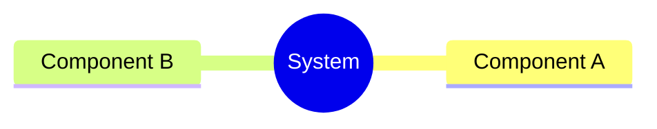
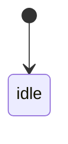
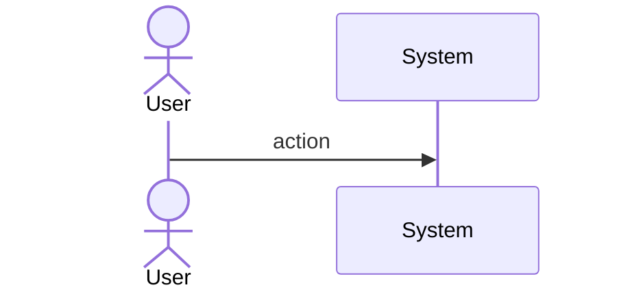
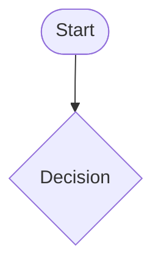
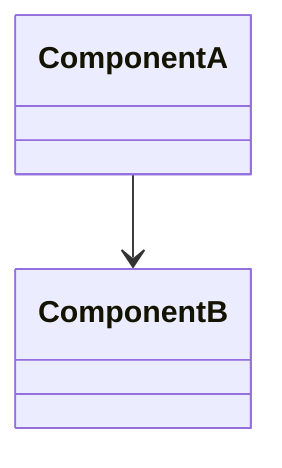
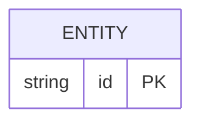

# Score Handoff Takeoff Spec

## Overview

Two new score CLI subcommands for structured session continuity.

`score handoff create --topic X` creates a skeleton at `~/.score/handoffs/YYYYMMDD-X.md` with YAML frontmatter (topic, date, project, branch) + 5 fixed sections (Status, Findings, Done, Next, Criteria). Model fills content, CLI owns structure.

`score takeoff [--latest | <file>]` reads a handoff, auto-verifies Criteria checkboxes by extracting backtick-wrapped commands and running them, then displays pass/fail + Next steps.

Skills `/score:handoff` and `/score:takeoff` are thin wrappers around the CLI.
## Requirements

```mermaid
requirementDiagram
  requirement R1 {
    id: R1
    text: score handoff create --topic X [--json] creates skeleton at ~/.score/handoffs/YYYYMMDD-X.md with frontmatter + 5 sections
    risk: high
  }
  requirement R2 {
    id: R2
    text: score handoff list shows handoffs newest-first with Status one-liner
    risk: low
  }
  requirement R3 {
    id: R3
    text: score handoff show [--latest | file] displays full handoff content
    risk: low
  }
  requirement R4 {
    id: R4
    text: score takeoff [--latest | file] [--json] reads handoff, extracts Criteria commands, runs them, reports pass/fail
    risk: high
  }
  requirement R5 {
    id: R5
    text: Frontmatter auto-detects branch (git) and project (cwd)
    risk: low
  }
  requirement R6 {
    id: R6
    text: /score:handoff skill dispatches CLI create then mainthread fills sections
    risk: medium
  }
  requirement R7 {
    id: R7
    text: /score:takeoff skill dispatches CLI takeoff then mainthread resumes from Next steps
    risk: medium
  }
  requirement R8 {
    id: R8
    text: Rename existing .claude/skills/handoff/ to .claude/skills/score-handoff/
    risk: low
  }
```
## Scenarios

### S1: Create handoff skeleton
**Given** no existing handoff for today
**When** `score handoff create --topic statemanager --json`
**Then** file at `~/.score/handoffs/YYYYMMDD-statemanager.md` with frontmatter (topic, date, project, branch) + 5 section headers; JSON output has path + next_action

### S2: List handoffs
**Given** 3 handoff files exist
**When** `score handoff list`
**Then** shows 3 entries newest-first with Status one-liner from each

### S3: Takeoff auto-verify
**Given** handoff with Criteria: `- [ ] \`cargo test -p sdd --lib\` passes`
**When** `score takeoff --latest --json`
**Then** runs `cargo test -p sdd --lib`, JSON output has `criteria[0].verified: true/false`

### S4: Takeoff manual criteria
**Given** Criteria: `- [ ] no regressions` (no backtick command)
**When** takeoff runs
**Then** criterion marked `auto: false`, not verified automatically

### S5: Auto-detect branch
**Given** in a git repo on branch `main`
**When** `score handoff create --topic x`
**Then** frontmatter has `branch: main`
## Diagrams

### Mindmap
<!-- type: mindmap lang: mermaid -->
<!-- TODO: Use Mermaid Plus mindmap (YAML frontmatter inside mermaid block).

-->

### State Machine
<!-- type: state-machine lang: mermaid -->
<!-- TODO: Use Mermaid Plus stateDiagram-v2 (YAML frontmatter inside mermaid block).

-->

### Interaction
<!-- type: interaction lang: mermaid -->
<!-- TODO: Use Mermaid Plus sequenceDiagram (YAML frontmatter inside mermaid block).

-->

### Logic
<!-- type: logic lang: mermaid -->
<!-- TODO: Use Mermaid Plus flowchart (YAML frontmatter inside mermaid block).

-->

### Dependencies
<!-- type: dependency lang: mermaid -->
<!-- TODO: Use Mermaid Plus classDiagram (YAML frontmatter inside mermaid block).

-->

### Data Model
<!-- type: db-model lang: mermaid -->
<!-- TODO: Use Mermaid Plus erDiagram (YAML frontmatter inside mermaid block).

-->

## API Spec

### REST API
<!-- type: rest-api lang: yaml -->
<!-- TODO -->

### RPC API
<!-- type: rpc-api lang: yaml -->
<!-- TODO: OpenRPC 1.3 as YAML. Example:
```yaml
openrpc: "1.3.2"
info:
  title: Service Name
  version: "1.0.0"
methods: []
```
-->

### Async API
<!-- type: async-api lang: yaml -->
<!-- TODO -->

### CLI
<!-- type: cli lang: yaml -->
<!-- TODO -->

### Schema
<!-- type: schema lang: yaml -->
<!-- TODO: JSON Schema as YAML. Example:
```yaml
"$schema": "https://json-schema.org/draft/2020-12/schema"
type: object
properties:
  id:
    type: string
required: [id]
```
-->

### Config
<!-- type: config lang: yaml -->
<!-- TODO -->

## Test Plan

```mermaid
requirementDiagram
  testCase T1 {
    id: T1
    text: parse_frontmatter extracts topic/date/branch
  }
  testCase T2 {
    id: T2
    text: extract_criteria finds checkbox items
  }
  testCase T3 {
    id: T3
    text: extract_command parses backtick-wrapped commands
  }
  testCase T4 {
    id: T4
    text: extract_sections builds section map
  }
  testCase T5 {
    id: T5
    text: create writes skeleton with correct frontmatter
  }
  T1 - verifies -> R5
  T2 - verifies -> R4
  T3 - verifies -> R4
  T4 - verifies -> R4
  T5 - verifies -> R1
```

| Command | Validates |
|---------|----------|
| `cargo test -p score-cli -- handoff` | T1-T5 |
## Changes

```yaml
changes:
  - file: projects/score/cli/src/handoff.rs
    action: create
    description: New module — handoff create/list/show + takeoff with criteria verification
  - file: projects/score/cli/src/lib.rs
    action: modify
    description: Add pub mod handoff
  - file: projects/score/cli/src/commands.rs
    action: modify
    description: Add Handoff + Takeoff subcommands to Commands enum
  - file: .claude/skills/score-handoff/SKILL.md
    action: create
    description: Skill definition for /score:handoff
  - file: .claude/skills/score-takeoff/SKILL.md
    action: create
    description: Skill definition for /score:takeoff
  - file: .claude/skills/handoff/SKILL.md
    action: delete
    description: Old skill replaced by score-handoff
```
## Wireframe
<!-- type: wireframe lang: yaml -->

<!-- TODO -->

## Component
<!-- type: component lang: yaml -->

<!-- TODO -->

## Design Token
<!-- type: design-token lang: yaml -->

<!-- TODO -->

## Doc
<!-- type: doc lang: markdown -->

<!-- TODO -->


## CLI

```yaml
score:
  handoff:
    create:
      description: Create handoff skeleton
      args:
        --topic: { type: string, required: true }
        --json: { type: bool, default: false }
      output_path: ~/.score/handoffs/YYYYMMDD-{topic}.md
      frontmatter: { topic, date, project, branch }
      sections: [Status, Findings, Done, Next, Criteria]
      verifies: [R1, R5]
    list:
      description: List handoffs newest-first with Status one-liner
      verifies: [R2]
    show:
      description: Display full handoff content
      args:
        --latest: { type: bool, conflicts_with: file }
        file: { type: string, positional: true }
      verifies: [R3]
  takeoff:
    description: Read handoff, auto-verify Criteria, display Next steps
    args:
      --latest: { type: bool, conflicts_with: file }
      file: { type: string, positional: true }
      --json: { type: bool, default: false }
    behavior:
      - Parse frontmatter + sections
      - Extract Criteria checkbox items
      - Run backtick-wrapped commands, record pass/fail
      - Display summary + Next section
    verifies: [R4]

mapping:
  - cli: score handoff create --topic X
    handler: handoff::run_create
  - cli: score handoff list
    handler: handoff::run_list
  - cli: score handoff show [--latest | file]
    handler: handoff::run_show
  - cli: score takeoff [--latest | file]
    handler: handoff::run_takeoff
```

# Reviews
