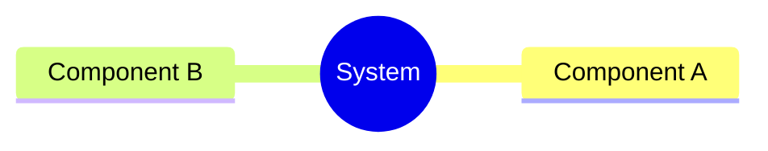
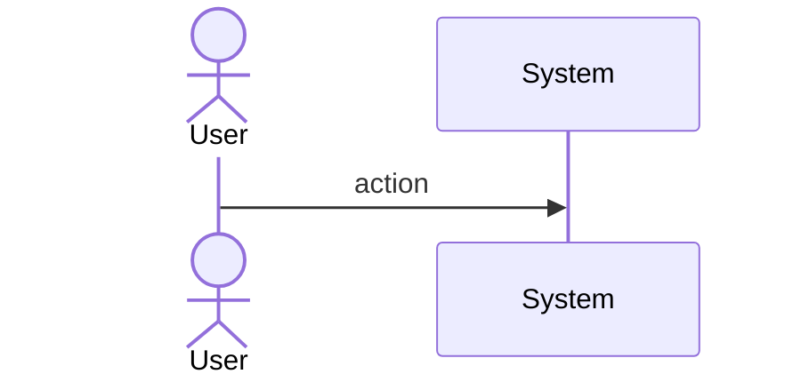
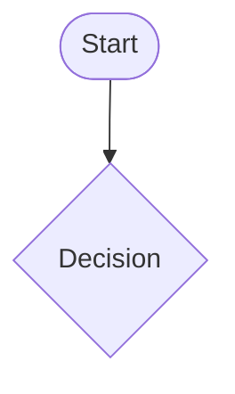
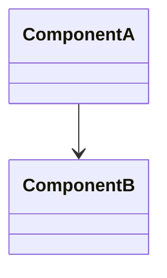
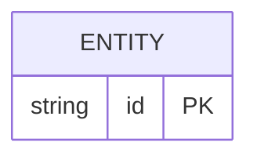

# Bug Find Project Root Must Resolve To Main Repo When I Spec

## Overview
<!-- type: overview lang: markdown -->

`find_project_root()` in `projects/score/cli/src/lib.rs` walks up from CWD looking for `.score/config.toml` and returns the first directory that contains one. Every SDD worktree at `.score/worktrees/<slug>/` carries its own `.score/config.toml`, so when any `score` command is invoked from inside a worktree the walk-up stops at the worktree path and `project_root` silently resolves to the worktree — not the main repo.

Downstream, `resolve_worktree_dir(project_root, change_id)` in `crates/sdd/src/tools/merge_git_ops.rs` (lines 261-268) probes `project_root/.score/worktrees/<slug>/`. When `project_root` is already the worktree, that probe fails and the merge step (`git checkout main && git merge --no-ff cclab/<slug>`) plus worktree cleanup are silently skipped. `close_issue_if_exists` also ends up writing to the worktree's `.score/issues/` instead of main's.

Fix: extend `find_project_root()` with a git-aware post-check. When the discovered config-bearing directory is inside a linked worktree, redirect to the main repo root using `git rev-parse --path-format=absolute --git-common-dir` (returns `<main>/.git`; the main repo root is its parent). Fallback chain: (1) parse the `.git` file (`gitdir: <main>/.git/worktrees/<name>`) if git binary is unavailable, (2) preserve the current walk-up behavior for non-git contexts such as tempdir-based tests. Signature and return type are unchanged; all existing call sites benefit transparently.
## Requirements
<!-- type: requirements lang: mermaid -->

```mermaid
---
id: requirements
---
requirementDiagram

requirement R1 {
  id: R1
  text: "find_project_root detects when CWD is inside a git linked worktree and returns the main repo root instead of the worktree path. Detection uses git rev-parse --path-format=absolute --git-common-dir (main_repo_root = parent of returned .git dir) with fallback to parsing the .git file for a gitdir pointing under .git/worktrees/."
  risk: medium
  verifymethod: test
}

requirement R2 {
  id: R2
  text: "find_project_root public signature and return type are unchanged. All score subcommands that call find_project_root automatically benefit without code modification."
  risk: low
  verifymethod: inspection
}

requirement R3 {
  id: R3
  text: "When CWD is inside a worktree, find_project_root resolves to the main repo root (the directory containing the primary .score/config.toml), not the intermediate worktree path that happens to also carry a .score/config.toml."
  risk: medium
  verifymethod: test
}

requirement R4 {
  id: R4
  text: "When CWD is NOT inside a worktree (normal invocation from main repo root or a subdir of it), find_project_root behavior is unchanged — walk up looking for .score/config.toml and return the first match."
  risk: low
  verifymethod: test
}

requirement R5 {
  id: R5
  text: "When no git binary is available or CWD is not in a git repo at all (e.g., tempdir-based unit tests without git init), find_project_root falls back to the current walk-up behavior so existing tests around crates/sdd/src/tools/merge_git_ops.rs:843+ continue to pass unchanged."
  risk: low
  verifymethod: test
}

requirement R6 {
  id: R6
  text: "close_issue_if_exists in crates/sdd/src/tools/create_change_merge.rs always receives the true main repo project_root. Post-fix this is guaranteed by R1; the call site is verified (code inspection) to pass project_root — not work_root — so that the issue open→closed move and R8 transient-field clearing land in main's .score/issues/."
  risk: low
  verifymethod: inspection
}

R3 - requires -> R1
R4 - requires -> R1
R5 - requires -> R1
R6 - requires -> R1
```
## Scenarios
<!-- type: scenarios lang: markdown -->

```yaml
- id: S1
  title: CWD inside worktree resolves to main repo root
  given: >-
    Main repo at /Users/x/cclab/main with .score/config.toml.
    Linked worktree at /Users/x/cclab/main/.score/worktrees/bug-foo/ created via
    `git worktree add` on branch cclab/bug-foo, which also contains .score/config.toml.
    CWD is /Users/x/cclab/main/.score/worktrees/bug-foo/.
  when: >-
    Any score subcommand (e.g. `score workflow create-change-merge bug-foo`) calls
    find_project_root().
  then: >-
    find_project_root() returns /Users/x/cclab/main (the main repo root),
    NOT /Users/x/cclab/main/.score/worktrees/bug-foo/.
    Detection: `git rev-parse --path-format=absolute --git-common-dir` returns
    /Users/x/cclab/main/.git; parent of that path is the main repo root.
    Downstream resolve_worktree_dir(project_root, 'bug-foo') then finds
    /Users/x/cclab/main/.score/worktrees/bug-foo/ and step 3 (git merge) + step 4
    (worktree cleanup) execute correctly.
  verifies: [R1, R3, R6]

- id: S2
  title: CWD inside main repo resolves to main repo unchanged
  given: >-
    Main repo at /Users/x/cclab/main with .score/config.toml.
    CWD is /Users/x/cclab/main/ (or a subdir like /Users/x/cclab/main/crates/sdd/).
    No worktree involvement.
  when: >-
    find_project_root() is invoked.
  then: >-
    find_project_root() returns /Users/x/cclab/main — identical to pre-fix behavior.
    `git rev-parse --git-common-dir` returns /Users/x/cclab/main/.git whose parent
    equals the walk-up result, so the git-aware redirect is a no-op.
  verifies: [R1, R4]

- id: S3
  title: Non-git context (tempdir without git init) preserves walk-up behavior
  given: >-
    A tempdir at /tmp/score-test-XYZ/proj/ with .score/config.toml but no .git/
    directory and no git repo ancestor (the pattern used by
    crates/sdd/src/tools/merge_git_ops.rs:843+ integration tests).
    CWD is /tmp/score-test-XYZ/proj/.
  when: >-
    find_project_root() is invoked.
  then: >-
    `git rev-parse --git-common-dir` exits non-zero (not a git repo).
    find_project_root() falls back to the original walk-up and returns
    /tmp/score-test-XYZ/proj/. Existing tempdir-based tests continue to pass
    without modification.
  verifies: [R5]
```
## Diagrams

### Mindmap
<!-- type: mindmap lang: mermaid -->
<!-- TODO: Use Mermaid Plus mindmap (YAML frontmatter inside mermaid block).

-->

### State Machine
<!-- type: state-machine lang: mermaid -->
<!-- TODO: Use Mermaid Plus stateDiagram-v2 (YAML frontmatter inside mermaid block).

-->

### Interaction
<!-- type: interaction lang: mermaid -->
<!-- TODO: Use Mermaid Plus sequenceDiagram (YAML frontmatter inside mermaid block).

-->

### Logic
<!-- type: logic lang: mermaid -->
<!-- TODO: Use Mermaid Plus flowchart (YAML frontmatter inside mermaid block).

-->

### Dependencies
<!-- type: dependency lang: mermaid -->
<!-- TODO: Use Mermaid Plus classDiagram (YAML frontmatter inside mermaid block).

-->

### Data Model
<!-- type: db-model lang: mermaid -->
<!-- TODO: Use Mermaid Plus erDiagram (YAML frontmatter inside mermaid block).

-->

## API Spec

### REST API
<!-- type: rest-api lang: yaml -->
<!-- TODO -->

### RPC API
<!-- type: rpc-api lang: yaml -->
<!-- TODO: OpenRPC 1.3 as YAML. Example:
```yaml
openrpc: "1.3.2"
info:
  title: Service Name
  version: "1.0.0"
methods: []
```
-->

### Async API
<!-- type: async-api lang: yaml -->
<!-- TODO -->

### CLI
<!-- type: cli lang: yaml -->
<!-- TODO -->

### Schema
<!-- type: schema lang: yaml -->
<!-- TODO: JSON Schema as YAML. Example:
```yaml
"$schema": "https://json-schema.org/draft/2020-12/schema"
type: object
properties:
  id:
    type: string
required: [id]
```
-->

### Config
<!-- type: config lang: yaml -->
<!-- TODO -->

## Test Plan
<!-- type: test-plan lang: markdown -->

```mermaid
---
id: test-plan
---
requirementDiagram

element T1 {
  type: "Test"
  docref: "projects/score/cli/src/lib.rs::tests::find_project_root_inside_worktree_returns_main"
}

element T2 {
  type: "Test"
  docref: "projects/score/cli/src/lib.rs::tests::find_project_root_inside_main_repo_unchanged"
}

element T3 {
  type: "Test"
  docref: "projects/score/cli/src/lib.rs::tests::find_project_root_non_git_tempdir_walks_up"
}

element T4 {
  type: "Test"
  docref: "projects/score/cli/src/lib.rs::tests::find_project_root_signature_unchanged_compile_check"
}

element T5 {
  type: "Test"
  docref: "crates/sdd/src/tools/create_change_merge.rs::tests::close_issue_receives_project_root_not_work_root"
}

T1 - verifies -> R1
T1 - verifies -> R3
T2 - verifies -> R4
T3 - verifies -> R5
T4 - verifies -> R2
T5 - verifies -> R6
```

### Test Setup (BDD)

**T1 — worktree CWD redirects to main repo** (`#[test]` in `projects/score/cli/src/lib.rs`)
- **Given**: tempdir `main/` initialized as git repo with `.score/config.toml`; `git worktree add .score/worktrees/foo -b cclab/foo` creates a linked worktree; worktree also contains `.score/config.toml`.
- **When**: set CWD to `main/.score/worktrees/foo/` and call `find_project_root()`.
- **Then**: assert return value equals `main/` (canonicalized).

**T2 — main repo CWD unchanged** (`#[test]`)
- **Given**: tempdir git repo with `.score/config.toml` at root.
- **When**: CWD set to the root (and a nested subdir); call `find_project_root()`.
- **Then**: assert return value equals the repo root in both cases.

**T3 — non-git tempdir walks up** (`#[test]`)
- **Given**: tempdir `proj/` with `.score/config.toml` but no `.git/` (not a git repo).
- **When**: CWD set to `proj/`; call `find_project_root()`.
- **Then**: assert return value equals `proj/` (fallback path matches current behavior).

**T4 — signature unchanged** (compile-time `#[test]` asserting function type).
- Static assertion via `let _: fn() -> anyhow::Result<std::path::PathBuf> = find_project_root;`

**T5 — call-site verification** (`#[test]` in `crates/sdd/src/tools/create_change_merge.rs` tests module or code inspection comment)
- Verifies that `close_issue_if_exists` is invoked with `project_root`, not `work_root`. Lightweight check; primary validation remains code-inspection (R6 verifymethod=inspection).
## Changes
<!-- type: changes lang: yaml -->

```yaml
- path: projects/score/cli/src/lib.rs
  action: modify
  satisfies: [R1, R2, R3, R4, R5]
  description: >
    Extend `find_project_root()` with a git-aware post-check. After the walk-up
    discovers a directory containing `.score/config.toml` (call it `candidate`):
    (1) run `git -C <candidate> rev-parse --path-format=absolute --git-common-dir`;
    on success, set `main_root = parent(<returned .git path>)`; if
    `main_root != candidate` and `main_root` also contains `.score/config.toml`,
    return `main_root` instead of `candidate`.
    (2) If the git binary is missing or exits non-zero, fall back to parsing a
    `<candidate>/.git` file (linked worktree marker) for `gitdir: <main>/.git/worktrees/<name>`
    and derive `main_root` from that.
    (3) If neither path resolves (true non-git context), return `candidate` — preserving
    the existing walk-up fallback used by tempdir tests.
    Signature `pub fn find_project_root() -> anyhow::Result<std::path::PathBuf>` is unchanged.
    Add inline doc comment explaining worktree redirect rationale with a reference
    to `.score/tech_design/crates/sdd/logic/change-merge.md`.

- path: projects/score/cli/src/lib.rs
  action: modify
  satisfies: [R1, R3, R4, R5]
  description: >
    Add `#[cfg(test)] mod tests { ... }` at the bottom of the file covering:
    T1 (`find_project_root_inside_worktree_returns_main`) — creates a tempdir git
    repo, `git worktree add`, sets CWD inside worktree, asserts main root returned;
    T2 (`find_project_root_inside_main_repo_unchanged`) — tempdir git repo, CWD at
    root and in subdir, asserts root returned;
    T3 (`find_project_root_non_git_tempdir_walks_up`) — tempdir without git init,
    asserts current walk-up behavior preserved;
    T4 (`find_project_root_signature_unchanged_compile_check`) — compile-time
    function-pointer assertion.
    Tests must use `std::process::Command` to invoke the real `git` binary; skip
    gracefully with `let Ok(_) = which::which("git") else { return; };` if git is
    unavailable on the test host.

- path: crates/sdd/src/tools/create_change_merge.rs
  action: inspect
  satisfies: [R6]
  description: >
    Verify the call site of `close_issue_if_exists` passes `project_root` (the main
    repo root — post-fix guaranteed correct by R1) and NOT `work_root` (the worktree).
    If the current code already passes `project_root`, no edit is needed — add a
    short inline comment citing R6 for auditability. If it passes `work_root`, change
    it to `project_root`. This is inspection-only per R6 verifymethod.

- path: .score/tech_design/crates/sdd/logic/change-merge.md
  action: modify
  satisfies: [R1]
  description: >
    Add a short note under the Pre-flight Gates section (or a new "Path Resolution
    Anchor" subsection) stating that `project_root` is always resolved via
    `find_project_root()` which MUST return the main repo root even when CWD is
    inside a linked worktree. Cross-reference R1 of this spec. Keep additive — do
    not rewrite existing sections.
```
## Wireframe
<!-- type: wireframe lang: yaml -->

<!-- TODO -->

## Component
<!-- type: component lang: yaml -->

<!-- TODO -->

## Design Token
<!-- type: design-token lang: yaml -->

<!-- TODO -->

## Doc
<!-- type: doc lang: markdown -->

<!-- TODO -->

# Reviews
