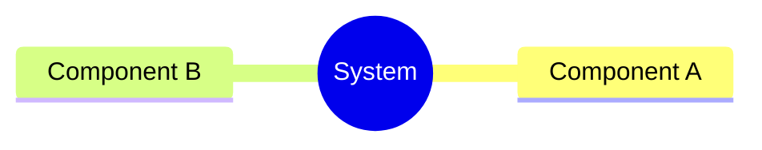
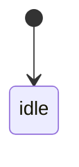
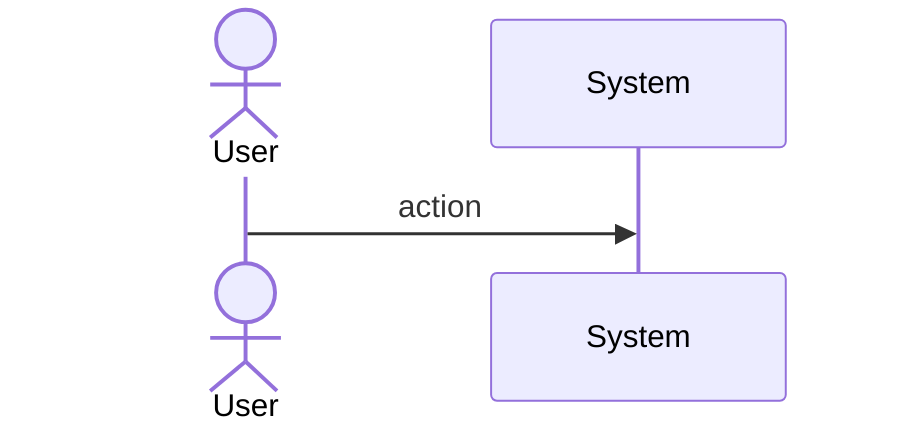
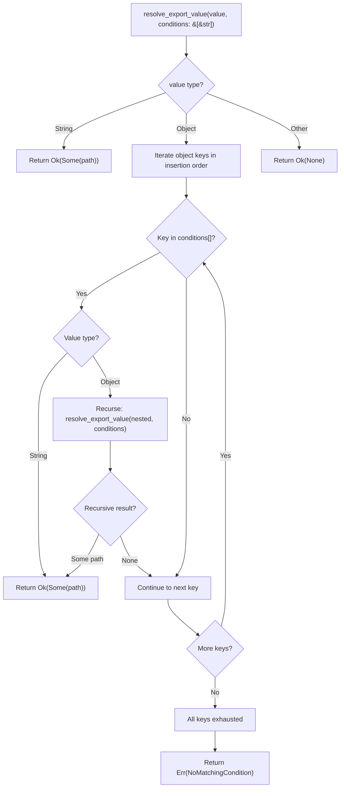
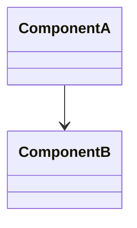
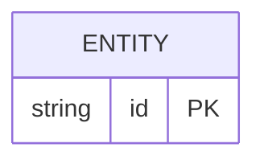

# Enhancement Resolver Conditional Exports Import Require Browse Spec

## Overview
<!-- type: overview lang: markdown -->

`resolve_export_value()` in `crates/cclab-jet/src/resolver/package.rs` iterates a hardcoded condition list (`import`, `default`, `require`, `node`, `browser`) without accepting a caller-supplied condition set, and without recursing into nested condition objects. The result is always the first matching condition string, regardless of the importer's actual environment (ESM vs CJS, browser vs node).

This means packages like React 18 (`exports: { ".": { "react-server": …, "import": …, "require": … } }`), Vue 3, and `node-fetch` are resolved to the wrong file — typically the CJS build when an ESM build should be preferred in dev mode, or the Node.js build when a browser build is required.

Fix: thread a `ConditionSet` through `resolve_exports` → `resolve_export_value`, defaulting to `[import, browser, default]` in dev mode and configurable via `jet.config` for production builds. Add recursive descent so nested condition objects (e.g. `{ "node": { "import": "./node.mjs", "require": "./node.cjs" } }`) are resolved correctly. Emit a structured diagnostic (`ResolveError::NoMatchingCondition`) when no condition matches, listing the conditions tried and the package path.
## Requirements

```mermaid
---
id: requirements
---
requirementDiagram

requirement R1 {
  id: R1
  text: "resolve_exports and resolve_export_value accept a conditions slice; standard conditions: import, require, browser, node, default"
  risk: low
  verifymethod: test
}

requirement R2 {
  id: R2
  text: "resolve_export_value recurses into nested condition objects at arbitrary depth per Node.js PACKAGE_EXPORTS_RESOLVE spec"
  risk: medium
  verifymethod: test
}

requirement R3 {
  id: R3
  text: "Condition precedence follows caller-supplied order; object key order inside exports breaks ties within same priority level"
  risk: medium
  verifymethod: test
}

requirement R4 {
  id: R4
  text: "Dev mode default conditions = import+browser+default; build mode configurable via jet.config.toml resolve.conditions"
  risk: low
  verifymethod: test
}

requirement R5 {
  id: R5
  text: "When no condition matches, return ResolveError::NoMatchingCondition with tried list and package path"
  risk: low
  verifymethod: test
}
```

<!-- type: requirements lang: mermaid -->


## Scenarios
<!-- type: scenarios lang: markdown -->

```yaml
- id: S1
  given: 'package exports { ".": { "import": "./esm.mjs", "require": "./cjs.js", "default": "./index.js" } }'
  when: resolve with conditions [import, default]
  then: returns ./esm.mjs

- id: S2
  given: same package as S1
  when: resolve with conditions [require, default]
  then: returns ./cjs.js

- id: S3
  given: 'package exports { ".": { "import": "./esm.mjs", "require": "./cjs.js" } }'
  when: resolve with conditions [browser, default]
  then: returns Err(NoMatchingCondition { tried: [browser, default] })

- id: S4
  given: 'package exports nested { ".": { "node": { "import": "./node.mjs", "require": "./node.cjs" }, "browser": "./browser.js" } }'
  when: resolve with conditions [browser, import, default]
  then: returns ./browser.js (browser matched at top level)

- id: S5
  given: same nested package as S4
  when: resolve with conditions [node, import, default]
  then: recurses into node object, returns ./node.mjs

- id: S6
  given: 'package exports { ".": { "node": { "import": "./node.mjs", "require": "./node.cjs" }, "default": "./fallback.js" } }'
  when: resolve with conditions [import, default] (no node)
  then: skips node block, returns ./fallback.js via default

- id: S7
  given: 'package exports string shorthand "./dist/index.js"'
  when: resolve with any conditions
  then: returns ./dist/index.js (no condition evaluation needed)

- id: S8
  given: dev mode resolver with no explicit conditions
  when: resolve React 18 exports
  then: uses default conditions [import, browser, default], selects import entry
```
## Mindmap
<!-- type: mindmap lang: mermaid -->
<!-- TODO: Use Mermaid Plus mindmap (YAML frontmatter inside mermaid block).

-->

## State Machine
<!-- type: state-machine lang: mermaid -->
<!-- TODO: Use Mermaid Plus stateDiagram-v2 (YAML frontmatter inside mermaid block).

-->

## Interaction
<!-- type: interaction lang: mermaid -->
<!-- TODO: Use Mermaid Plus sequenceDiagram (YAML frontmatter inside mermaid block).

-->

## Logic
<!-- type: logic lang: mermaid -->



The algorithm iterates the exports object keys in their JSON insertion order (preserved by `serde_json::Map`). For each key, it checks membership in the caller-supplied `conditions` slice. When a key matches and its value is another object, it recurses. This matches the Node.js PACKAGE_EXPORTS_RESOLVE spec where the first matching condition wins, and nested conditions narrow the resolution path.

Condition precedence is entirely determined by the `conditions` parameter order — the resolver does not impose a fixed priority. The caller (dev server, bundler, or config) supplies the ordered list.
## Dependencies
<!-- type: dependency lang: mermaid -->
<!-- TODO: Use Mermaid Plus classDiagram (YAML frontmatter inside mermaid block).

-->

## Data Model
<!-- type: db-model lang: mermaid -->
<!-- TODO: Use Mermaid Plus erDiagram (YAML frontmatter inside mermaid block).

-->

## RPC API
<!-- type: rpc-api lang: yaml -->
<!-- TODO: OpenRPC 1.3 as YAML. Example:
```yaml
openrpc: "1.3.2"
info:
  title: Service Name
  version: "1.0.0"
methods: []
```
-->

## Schema
<!-- type: schema lang: yaml -->
<!-- TODO: JSON Schema as YAML. Example:
```yaml
"$schema": "https://json-schema.org/draft/2020-12/schema"
type: object
properties:
  id:
    type: string
required: [id]
```
-->

## Test Plan
<!-- type: test-plan lang: markdown -->

```mermaid
---
id: test-plan
---
requirementDiagram

requirement R1 {
  id: R1
  text: "Standard conditions: import, require, browser, node, default"
  risk: low
  verifymethod: test
}

requirement R2 {
  id: R2
  text: "Recursive nested condition objects"
  risk: medium
  verifymethod: test
}

requirement R3 {
  id: R3
  text: "Environment-driven precedence with object-order tiebreak"
  risk: medium
  verifymethod: test
}

requirement R4 {
  id: R4
  text: "Dev mode default + build mode configurable"
  risk: low
  verifymethod: test
}

requirement R5 {
  id: R5
  text: "NoMatchingCondition diagnostic"
  risk: low
  verifymethod: test
}

element T1 {
  type: "Test"
  text: "test_resolve_import_condition — Given S1 exports, when conditions=[import,default], then ./esm.mjs"
}

element T2 {
  type: "Test"
  text: "test_resolve_require_condition — Given S1 exports, when conditions=[require,default], then ./cjs.js"
}

element T3 {
  type: "Test"
  text: "test_resolve_browser_condition — Given browser-specific exports, when conditions=[browser,default], then browser entry"
}

element T4 {
  type: "Test"
  text: "test_nested_node_import — Given S4 nested exports, when conditions=[node,import,default], recurse into node then select import"
}

element T5 {
  type: "Test"
  text: "test_nested_skip_unmatched_block — Given S6 exports with node block, when conditions=[import,default], skip node, return default"
}

element T6 {
  type: "Test"
  text: "test_no_matching_condition_error — Given S3 exports, when conditions=[browser,default], return NoMatchingCondition with tried list"
}

element T7 {
  type: "Test"
  text: "test_string_shorthand_ignores_conditions — Given S7 string exports, any conditions, return string directly"
}

element T8 {
  type: "Test"
  text: "test_dev_mode_default_conditions — When ResolveOptions::default(), conditions is [import, browser, default]"
}

element T9 {
  type: "Test"
  text: "test_config_override_conditions — When jet.config sets resolve.conditions, those are used instead of default"
}

element T10 {
  type: "Test"
  text: "test_object_key_order_tiebreak — Given two matching conditions with same priority, first key in JSON object wins"
}

T1 - verifies -> R1
T2 - verifies -> R1
T3 - verifies -> R1
T4 - verifies -> R2
T5 - verifies -> R2
T6 - verifies -> R5
T7 - verifies -> R1
T8 - verifies -> R4
T9 - verifies -> R4
T10 - verifies -> R3
```
## Changes
<!-- type: changes lang: yaml -->

```yaml
changes:
  - file: crates/cclab-jet/src/resolver/package.rs
    action: modify
    description: |
      1. Add `resolve_export_value(value, conditions: &[&str]) -> Result<Option<String>>`
         that replaces the hardcoded condition list with caller-supplied `conditions` slice.
      2. Add recursive descent: when a matched condition key maps to an Object, recurse
         with the same `conditions` slice.
      3. Update `resolve_exports()` signature to accept `conditions: &[&str]`; pass through
         to `resolve_export_value`.
      4. Add `ResolveError::NoMatchingCondition { tried: Vec<String>, package_path: PathBuf }`
         error variant (or struct) returned when no condition matches.

  - file: crates/cclab-jet/src/resolver/mod.rs
    action: modify
    description: |
      1. Add `conditions: Vec<String>` field to `ResolveOptions`.
      2. Default value: `["import", "browser", "default"]`.
      3. Thread `&self.options.conditions` into `resolve_package_dir` -> `resolve_exports`.

  - file: crates/cclab-jet/src/task_runner/config.rs
    action: modify
    description: |
      1. Add `resolve_conditions: Option<Vec<String>>` to `JetConfig` (or nested
         `ResolveConfig` if one exists).
      2. Deserialized from `jet.config.toml` `[resolve] conditions = ["import", "node", "default"]`.

  - file: crates/cclab-jet/src/dev_server/mod.rs
    action: modify
    description: |
      1. When constructing `ResolveOptions` for dev mode, set `conditions` to
         `["import", "browser", "default"]` (hardcoded dev default).
      2. If `jet.config` supplies `resolve_conditions`, use those instead.

  - file: crates/cclab-jet/src/bundler/mod.rs
    action: modify
    description: |
      1. When constructing `ResolveOptions` for build, read `resolve_conditions`
         from config. Default to `["import", "browser", "default"]` if absent.
```

# Reviews

## Review: reviewer (Iteration 1)

**Change ID**: enhancement-resolver-conditional-exports-import-require-browse

**Verdict**: APPROVED

### Summary

Spec is implementation-ready. All 5 requirements have scenarios and tests mapped. Logic flowchart accurately depicts the recursive condition resolution. Changes cover all affected files.

### Issues

No issues found.
