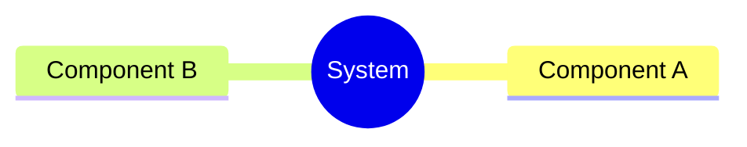
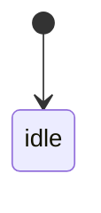
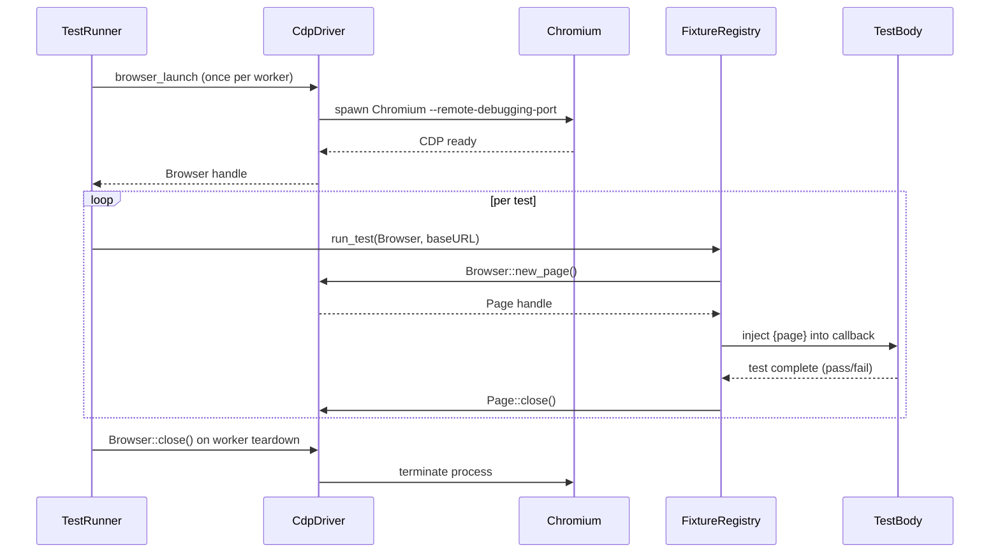
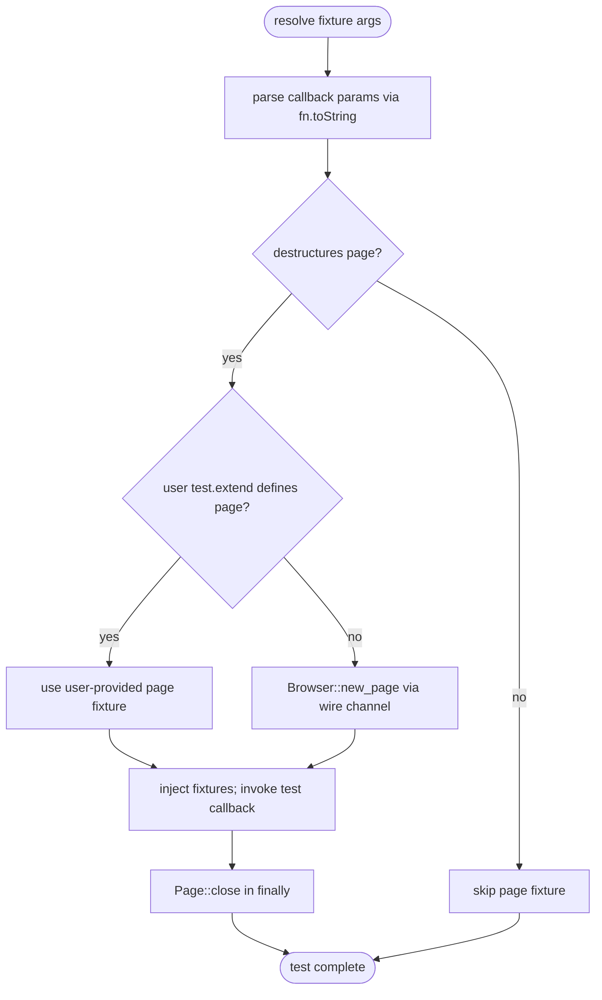
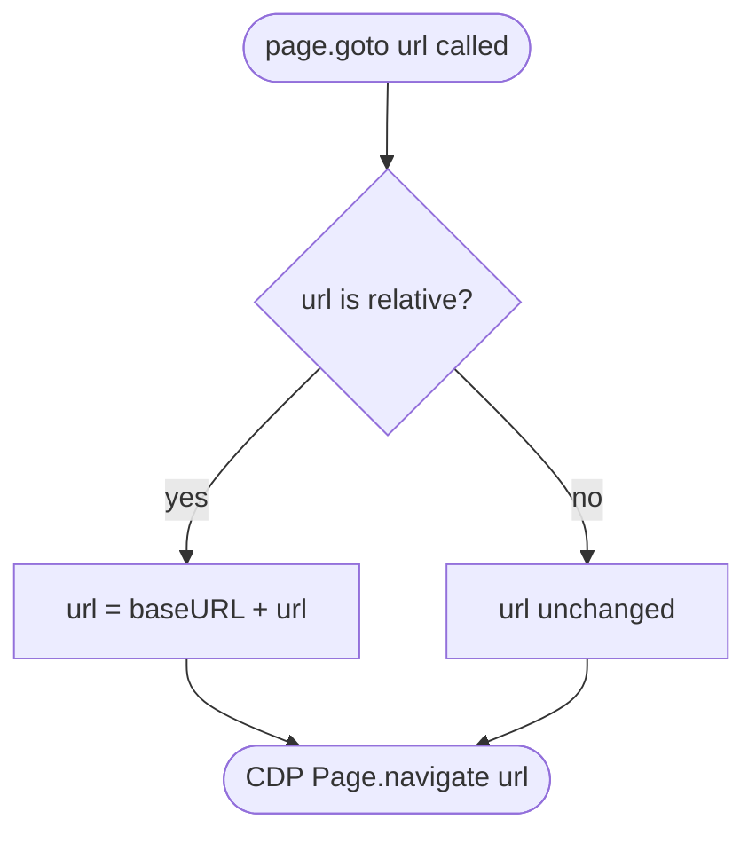

# Enhancement Auto Inject Page Fixture For Playwright Compatible Spec

## Overview
<!-- type: overview lang: markdown -->

Jet's native test runner (Phase 1–4) wires a CDP-backed `page` object through `test.extend()`, requiring each spec to call `test.extend({ page: ... })` before using `page` in test bodies. Playwright-style specs use plain `test('name', async ({ page }) => ...)` with no extend call. This mismatch blocked Phase 5 closeout after the `@jet/test` resolver fix.

This change adds a **default fixture registry** to `crates/jet/runtime/test/index.js` that pre-registers `page` as a built-in fixture backed by the CDP driver. The `page` fixture is injected automatically into every test body and `beforeEach` callback that destructures `page` from the fixture argument — no `test.extend()` call needed. Tests that do not destructure `page` are unaffected.

The browser process (Chromium via CDP) is launched **once per worker** at the start of `run_spec` in `crates/jet/src/test_runner/worker.rs` and closed on worker teardown. `baseURL` and `headless` from `jet.test.config.ts` are forwarded to the JS runtime via the boot script opts object, and `page.goto(relativePath)` resolves relative URLs against `baseURL`.

`test.extend({ page: ... })` continues to work: a user-supplied `page` fixture overrides the default for tests that use the extended test object. User fixtures that themselves accept `page` receive the CDP-backed default.
## Requirements

```mermaid
---
id: requirements
---
requirementDiagram

  requirement R1 {
    id: R1
    text: "page fixture auto-injected into test body and beforeEach without explicit test.extend call"
    risk: low
    verifymethod: test
  }

  requirement R2 {
    id: R2
    text: "page fixture backed by native CDP driver; no Playwright package import"
    risk: low
    verifymethod: inspection
  }

  requirement R3 {
    id: R3
    text: "page.goto(relativePath) resolves against use.baseURL from active project config"
    risk: medium
    verifymethod: test
  }

  requirement R4 {
    id: R4
    text: "each test receives a fresh page instance; page is auto-closed after test body and afterEach hooks complete, pass or fail"
    risk: medium
    verifymethod: test
  }

  requirement R5 {
    id: R5
    text: "browser process shared across all tests in one worker; launched once per worker, closed on worker teardown"
    risk: medium
    verifymethod: test
  }

  requirement R6 {
    id: R6
    text: "injected page exposes: goto, locator, getByText, click, fill, waitForSelector, waitForLoadState, evaluate, url, close; coverage verified against e2e call sites"
    risk: low
    verifymethod: inspection
  }

  requirement R7 {
    id: R7
    text: "test.extend({page: userImpl}) overrides default page fixture for tests using that extended test object"
    risk: low
    verifymethod: test
  }

  requirement R8 {
    id: R8
    text: "user fixtures declared via test.extend that accept page as argument receive the CDP-backed default page"
    risk: medium
    verifymethod: test
  }

  requirement R9 {
    id: R9
    text: "fixture injection does not break existing tests that do not destructure page from the fixture argument"
    risk: low
    verifymethod: test
  }

  requirement R10 {
    id: R10
    text: "runtime surfaces clear actionable error message when CDP browser fails to launch or page cannot be created"
    risk: low
    verifymethod: test
  }
```

<!-- type: requirements lang: mermaid -->


## Scenarios
<!-- type: scenarios lang: markdown -->

```yaml
- id: S1
  requirement: R1
  given: a test file contains `test('name', async ({ page }) => ...)` with no test.extend call
  when: jet executes the spec file
  then: page is defined and is a CDP-backed Page instance; no TypeError about undefined

- id: S2
  requirement: R2
  given: the runtime fixture registry is initialized
  when: the page fixture is resolved
  then: the page object is constructed from CdpSession/Page types in crates/jet/src/cdp_driver/; no require/import of @playwright/test or playwright-core is present in the bundle

- id: S3
  requirement: R3
  given: jet.test.config.ts has `use: { baseURL: 'http://localhost:4200' }` for the active project
  when: page.goto('/dashboard') is called inside a test body
  then: the CDP driver navigates to 'http://localhost:4200/dashboard'

- id: S4
  requirement: R4
  given: two sequential tests each destructure page
  when: both tests run in the same worker
  then: each test gets a distinct Page instance; the first page is closed before the second test begins; page from test-1 is inaccessible in test-2

- id: S5
  requirement: R4
  given: a test body throws an unhandled error after calling page.goto
  when: jet catches the error and runs afterEach hooks
  then: page.close() is still called; no dangling page remains open in the browser

- id: S6
  requirement: R5
  given: a worker is assigned ten test cases
  when: all ten tests run sequentially
  then: exactly one Browser instance is launched at worker start and one Browser.close() is called at worker teardown; no additional browser processes are spawned

- id: S7
  requirement: R6
  given: a test calls page.locator('.btn').click()
  when: the locator action is executed
  then: the CDP driver dispatches a click via the locator engine; the action completes without error

- id: S8
  requirement: R7
  given: a spec calls `const myTest = test.extend({ page: async ({}, use) => { ... await use(customPage); } })`
  when: myTest('name', async ({ page }) => ...) runs
  then: page inside the callback is the customPage supplied by the user fixture, not the CDP default

- id: S9
  requirement: R8
  given: a user fixture declared via test.extend accepts `{ page }` as its first argument
  when: the user fixture is resolved
  then: the page argument is the CDP-backed default page instance

- id: S10
  requirement: R9
  given: a test is defined as `test('name', async () => ...)` with no fixture argument
  when: jet executes the test
  then: the test runs normally; no page is created or closed for this test; no error is thrown

- id: S11
  requirement: R10
  given: the Chromium binary is missing or the CDP port is already in use
  when: the worker attempts to launch the browser
  then: jet emits an error message containing the word 'browser' and the underlying OS error; the test is marked failed with that message, not a silent undefined crash
```
## Mindmap
<!-- type: mindmap lang: mermaid -->
<!-- TODO: Use Mermaid Plus mindmap (YAML frontmatter inside mermaid block).

-->

## State Machine
<!-- type: state-machine lang: mermaid -->
<!-- TODO: Use Mermaid Plus stateDiagram-v2 (YAML frontmatter inside mermaid block).

-->

## Interaction
<!-- type: interaction lang: mermaid -->


## Logic
<!-- type: logic lang: mermaid -->



BaseURL resolution sub-logic (called from `create_cdp_page` path when `page.goto` is invoked):


## Test Plan
<!-- type: test-plan lang: markdown -->

```mermaid
---
id: test-plan
---
requirementDiagram

  element T1 {
    type: "Test"
    docref: "cargo test -p jet --test page_fixture_auto_inject -- test_page_fixture_auto_injected_into_test_body"
  }

  element T2 {
    type: "Test"
    docref: "cargo test -p jet --test page_fixture_auto_inject -- test_page_auto_closed_after_test"
  }

  element T3 {
    type: "Test"
    docref: "cargo test -p jet --test page_fixture_auto_inject -- test_page_auto_closed_on_test_failure"
  }

  element T4 {
    type: "Test"
    docref: "cargo test -p jet --test page_fixture_auto_inject -- test_browser_shared_across_tests_in_worker"
  }

  element T5 {
    type: "Test"
    docref: "cargo test -p jet --test page_fixture_auto_inject -- test_baseurl_resolution_relative_path"
  }

  element T6 {
    type: "Test"
    docref: "cargo test -p jet --test page_fixture_auto_inject -- test_user_extend_page_overrides_default"
  }

  element T7 {
    type: "Test"
    docref: "cargo test -p jet --test page_fixture_auto_inject -- test_user_fixture_receives_cdp_page_as_dependency"
  }

  element T8 {
    type: "Test"
    docref: "cargo test -p jet --test page_fixture_auto_inject -- test_no_page_no_injection"
  }

  element T9 {
    type: "Test"
    docref: "cargo test -p jet --test page_fixture_auto_inject -- test_cdp_launch_failure_error_message"
  }

  element T10 {
    type: "Test"
    docref: "cargo test -p jet --lib test_runner (regression)"
  }

  element T11 {
    type: "Test"
    docref: "jet test /tmp/page_fixture_smoke.spec.ts (e2e smoke)"
  }

  T1 - verifies -> R1
  T2 - verifies -> R4
  T3 - verifies -> R4
  T4 - verifies -> R5
  T5 - verifies -> R3
  T6 - verifies -> R7
  T7 - verifies -> R8
  T8 - verifies -> R9
  T9 - verifies -> R10
  T10 - verifies -> R9
  T11 - verifies -> R1
  T11 - verifies -> R6
```

Concrete test commands:

| ID | Command | Scope |
|----|---------|-------|
| T1–T9 | `cargo test -p jet --test page_fixture_auto_inject` | new integration test file `crates/jet/tests/page_fixture_auto_inject.rs` |
| T10 | `cargo test -p jet --lib test_runner` | existing unit tests; regression gate |
| T11 | `jet test /tmp/page_fixture_smoke.spec.ts` | e2e smoke against live Chromium; spec contains `test('smoke', async ({ page }) => { await page.goto('/'); })` |
## Changes
<!-- type: changes lang: yaml -->

```yaml
_sdd:
  id: changes

changes:
  - id: C1
    path: crates/jet/runtime/test/index.js
    action: edit
    description: >
      Default fixture registry: register 'page' as built-in fixture at module init (lines ~118–158 around existing test.extend block).
      Destructure-detection: parse callback parameter names via fn.toString() to detect '{page}' in test() and test.beforeEach() callbacks.
      If detected and no user 'page' fixture exists in the merged fixture map, inject CDP-backed page from the default registry.
      baseURL resolution: wrap page.goto so relative URLs are prepended with baseURL received from worker boot opts.
      Inject logic at fixture-argument build site (lines ~420–490).
    refs:
      - $ref: "#fixture-injection-logic"
      - $ref: "#baseurl-resolution"

  - id: C2
    path: crates/jet/src/test_runner/worker.rs
    action: edit
    description: >
      Wire baseURL and headless from the active project RunnerConfig into the JS worker boot script.
      Pass as a JSON blob on the opts object (e.g. opts.jetConfig = { baseURL, headless }) so the fixture registry can read them at startup.
      Launch Browser::launch(headless, port) once before running any test; store the handle in a thread-local or worker-scoped variable.
      Pass the browser handle reference to the fixture registry via the wire channel.
      On worker teardown (after all tests), call Browser::close().
    refs:
      - $ref: "#page-fixture-lifecycle"

  - id: C3
    path: crates/jet/src/test_runner/runner_config.rs
    action: edit
    description: >
      Add fields to RunnerConfig (or ProjectConfig nested struct) if absent:
        base_url: Option<String>
        headless: bool (default true)
      Read from jet.test.config.ts project.use.baseURL and project.use.headless during config parse.

  - id: C4
    path: crates/jet/src/cdp_driver/page_binding.rs
    action: create
    description: >
      New file. JS-exposed wrapper that adapts CdpSession/Page to the Playwright-compatible API subset required by R6.
      Exposes via wire channel: goto(url), locator(selector), getByText(text), click(selector), fill(selector, value),
      waitForSelector(selector, opts), waitForLoadState(state), evaluate(expr), url(), close().
      goto implementation delegates baseURL resolution to the caller (JS side prepends before calling Rust).
      Each method maps to existing CdpSession CDP commands; no Playwright dependency.
    refs:
      - $ref: "#page-fixture-lifecycle"

  - id: C5
    path: crates/jet/runtime/test/page.js
    action: create
    description: >
      New file. JS-side Page class that proxies each Playwright-compatible method to the Rust CDP wire channel.
      Constructor accepts a pageId (CDP target ID) and a wireChannel reference.
      Methods: goto(url), locator(selector), getByText(text), click(selector), fill(selector, value),
      waitForSelector(selector, opts), waitForLoadState(state), evaluate(expr), url(), close().
      locator() and getByText() return a Locator proxy object with: click(), fill(), waitFor(), textContent(), getAttribute().
      Imported by the fixture registry in index.js.

  - id: C6
    path: crates/jet/tests/page_fixture_auto_inject.rs
    action: create
    description: >
      New integration test file. Contains #[test] blocks (T1–T9):
        test_page_fixture_auto_injected_into_test_body — runs a minimal spec string via the worker, asserts page is defined
        test_page_auto_closed_after_test — asserts page target is gone after test completes (query CDP targets)
        test_page_auto_closed_on_test_failure — same as above but test body panics
        test_browser_shared_across_tests_in_worker — asserts browser process count stays 1 across 3 sequential tests
        test_baseurl_resolution_relative_path — asserts goto('/path') results in CDP navigate to baseURL+path
        test_user_extend_page_overrides_default — asserts user fixture page identity differs from CDP default
        test_user_fixture_receives_cdp_page_as_dependency — asserts user fixture arg page is CdpPage instance
        test_no_page_no_injection — asserts no browser launch when test does not destructure page
        test_cdp_launch_failure_error_message — kills Chromium binary; asserts error message contains 'browser'
    refs:
      - $ref: "#test-plan"

  - id: C7
    path: jet.test.config.ts
    action: edit
    description: >
      Verify that each project block in use: { baseURL, headless } is present and correctly parsed.
      No new fields needed if they exist; add baseURL to any project block that lacks it so the plumbing test (T5) has a value to read.

  - id: C8
    path: .score/tech_design/crates/jet/testing/test-runner.md
    action: edit
    description: >
      Add section 'Default Fixture Registry' under Requirements: document built-in page fixture, destructure-detection logic, test.extend override precedence.
      Add section 'Page Fixture Lifecycle' under Runner Architecture: fresh-per-test creation, auto-close after afterEach, error surface for launch failure.
      Update T6 requirement row to reflect auto-injection without explicit test.extend.

  - id: C9
    path: .score/tech_design/crates/jet/testing/browser-driver.md
    action: edit
    description: >
      Add 'baseURL Resolution' section: document how use.baseURL is threaded from RunnerConfig through worker wire protocol to Page::goto.
      Add 'Worker Lifecycle' note: Browser owned by worker process, closed on worker shutdown.

  - id: C10
    path: .score/tech_design/crates/jet/testing/locator-engine.md
    action: edit
    description: >
      Add getByText to Design Contract table (currently missing; required by R6).
      Add 'JS Bridge' section: document how locator actions are forwarded from JS fixture proxy to Rust Locator struct over the wire channel.

  - id: C11
    path: .score/tech_design/crates/jet/testing/worker-pool.md
    action: edit
    description: >
      Add note under 'Per-worker browser isolation': the single Browser instance per worker is the same instance that backs the auto-injected page fixture; no second browser is launched for fixture setup.

  - id: C12
    path: .score/tech_design/crates/jet/e2e/e2e-test-infrastructure.md
    action: edit
    description: >
      Add 'page API Call-Site Inventory' table listing every page.* method called across e2e/jet/tests/*.spec.ts.
      Annotate which calls are covered by R6 and flag any gaps for follow-on issues.
```
## Doc
<!-- type: doc lang: markdown -->

### page fixture (auto-injected)

Jet auto-injects a `page` fixture into every test body and `test.beforeEach` callback that destructures `page` from the fixture argument. No `test.extend()` call is required.

```ts
import { test, expect } from '@jet/test';

test('navigates to home', async ({ page }) => {
  await page.goto('/');
  await expect(page.locator('h1')).toHaveText('Welcome');
});
```

### Available methods

| Method | Playwright equivalent |
|--------|----------------------|
| `page.goto(url)` | `page.goto` — relative URLs resolved against `use.baseURL` |
| `page.locator(selector)` | `page.locator` |
| `page.getByText(text)` | `page.getByText` |
| `page.click(selector)` | `page.click` |
| `page.fill(selector, value)` | `page.fill` |
| `page.waitForSelector(selector)` | `page.waitForSelector` |
| `page.waitForLoadState(state)` | `page.waitForLoadState` |
| `page.evaluate(expr)` | `page.evaluate` |
| `page.url()` | `page.url` |
| `page.close()` | `page.close` — called automatically after each test |

### Lifecycle

- Browser: launched once per worker process at startup; closed on worker teardown.
- Page: created fresh for each test; closed automatically after the test body and all `afterEach` hooks complete, whether the test passes or fails.

### Overriding the default page

To replace the default CDP-backed `page` with a custom implementation, use `test.extend`:

```ts
const myTest = test.extend({
  page: async ({}, use) => {
    const p = await createCustomPage();
    await use(p);
    await p.close();
  },
});

myTest('uses custom page', async ({ page }) => { ... });
```

Tests that do not destructure `page` are unaffected; no browser is launched for those tests.

### Configuration

Set `baseURL` in `jet.test.config.ts`:

```ts
export default defineConfig({
  projects: [{
    name: 'local',
    use: { baseURL: 'http://localhost:4200', headless: true },
  }],
});
```

# Reviews

## Review: reviewer (Iteration 1)

**Change ID**: enhancement-auto-inject-page-fixture-for-playwright-compatible

**Verdict**: APPROVED

### Summary

Spec is implementation-ready. Overview explains the Phase 1-4 mismatch (test.extend required vs plain destructure), the default fixture registry solution, and browser-per-worker + baseURL wiring. Requirements are a Mermaid requirementDiagram with R1-R10 mapped 1:1 from the issue body; each has id/text/risk/verifymethod. Scenarios S1-S11 cover R1-R10 with R4 getting both pass and fail paths (S4+S5). Interaction sequenceDiagram shows the TestRunner -> FixtureRegistry -> CdpDriver -> Chromium -> TestBody flow including browser launch (once per worker), page create per test, auto-close in finally, and worker teardown. Logic has two flowcharts: fixture-injection-logic (fn.toString param detection -> user override check -> CDP page create -> inject -> close) and baseurl-resolution (relative URL detection -> prepend baseURL -> CDP navigate). Test Plan is a Mermaid requirementDiagram with T1-T11 each referencing a concrete #[test] function in crates/jet/tests/page_fixture_auto_inject.rs, plus a command table including `cargo test -p jet --test page_fixture_auto_inject`. Changes C1-C12 enumerate concrete files: C1 runtime/test/index.js (fixture registry + injection), C2 worker.rs (browser launch + baseURL wire), C3 runner_config.rs (new fields), C4 cdp_driver/page_binding.rs (NEW), C5 runtime/test/page.js (NEW), C6 tests/page_fixture_auto_inject.rs (NEW), C7 jet.test.config.ts verify, C8-C12 spec edits for 5 existing specs under .score/tech_design/crates/jet/. Doc provides user-facing reference with API subset table, lifecycle notes, and test.extend override pattern. Test Plan -> Changes cross-check: C6 declares the test file holding T1-T11, no hard-reject risk. Irrelevant sections (REST API, Async API, CLI, Config, Wireframe, Component, Design Token, Dependencies, Data Model, RPC API, Schema) were pruned by mainthread to eliminate format-priority violations; frontmatter fill_sections/filled_sections lists only the 8 sections actually filled.

### Issues

No issues found.
