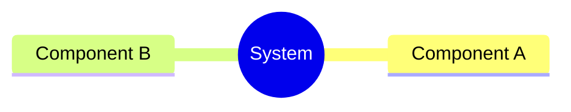
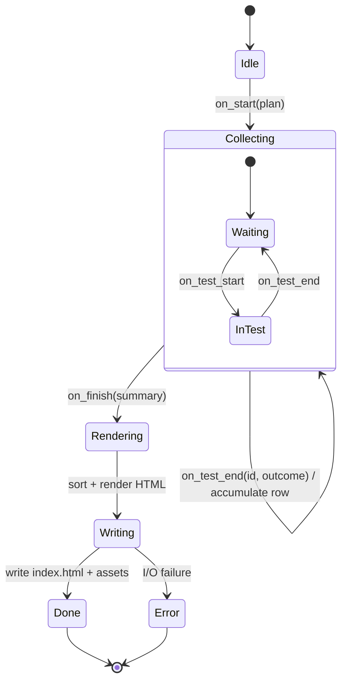
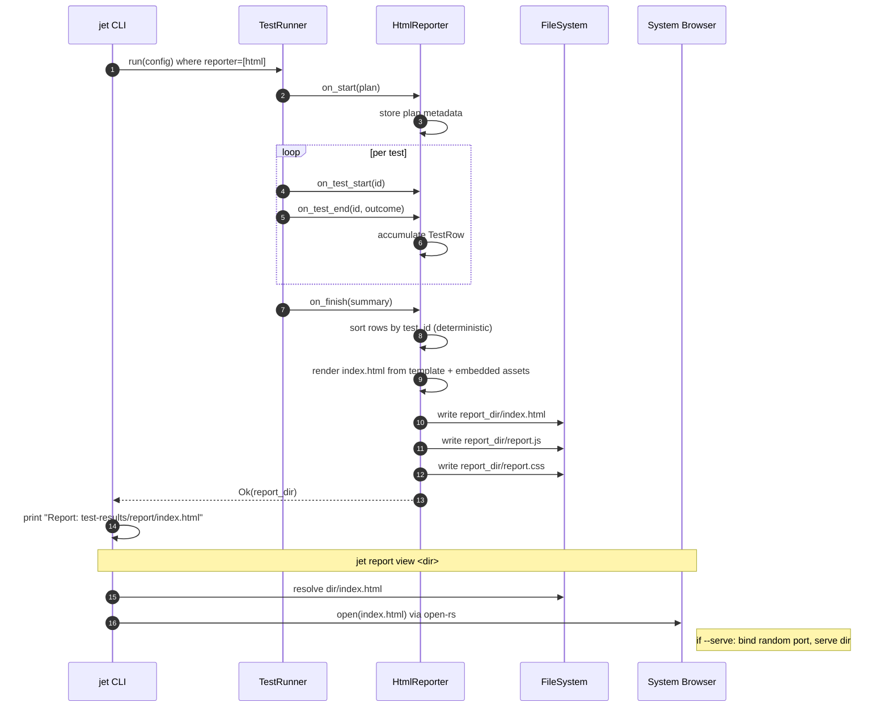
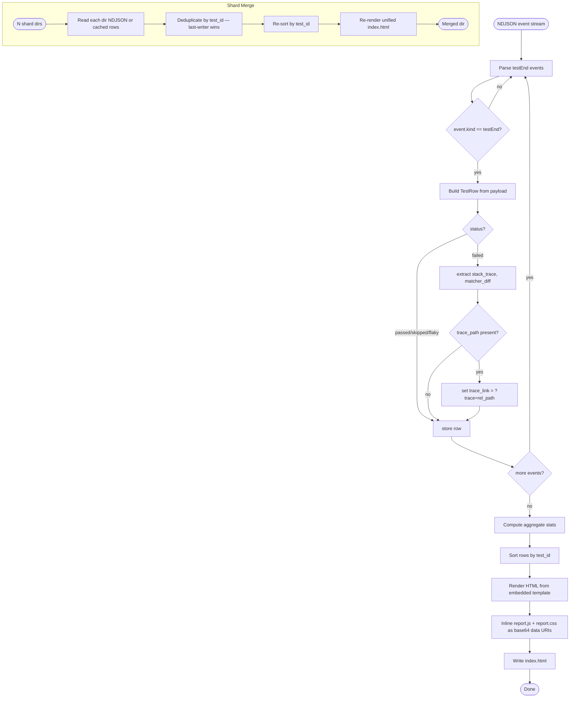
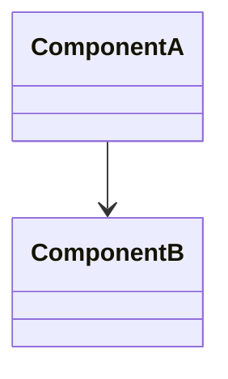
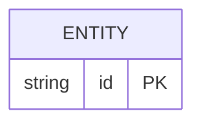

# Enhancement Html Reporter For Native Test Runner Spec

## Overview
<!-- type: overview lang: markdown -->

Static HTML report generator for the jet native test runner. After `jet test` completes, `HtmlReporter` consumes the NDJSON wire protocol event stream and writes a self-contained `test-results/report/index.html` — all JS/CSS embedded in the jet binary via `include_bytes!`. The report shows aggregate stats (total/passed/failed/skipped/flaky/duration/shard info) and per-test rows with status badge, duration, source file:line, expandable stack trace drawer, and a "View trace" deep-link to `jet trace view`.

Key subsystems:
- `crates/jet/src/reporter/html.rs` — `HtmlReporter` implementing the `Reporter` trait; consumes `testEnd` events, renders deterministic HTML.
- `crates/jet/src/reporter/merger.rs` — shard merge algorithm: deduplicates by `test_id`, concatenates per-shard NDJSON streams, emits unified report.
- `crates/jet/assets/html-reporter/{index.html,report.js,report.css}` — embedded static assets.
- `crates/cclab-jet/src/cli/report.rs` — `jet report view <dir>` and `jet report merge` subcommands.

Activation: `--reporter=html` or `--reporter=list,html`; default output dir `test-results/report/`. Deterministic output: tests sorted by stable `test_id`, timestamps ISO-8601, optional `--mask-timestamps` for golden-diff CI.
## Requirements
<!-- type: requirements lang: mermaid -->

| id | Requirement | Priority | Verifies |
|----|-------------|----------|----------|
| R1 | After `jet test` completes, emit `test-results/report/index.html` (and sibling assets) containing a full test-run overview. | high | Integration test: report dir exists after run |
| R2 | Overview panel shows: total tests, passed, failed, skipped, flaky counts; total wall-clock duration; shard index/total when `--shard` was used. | high | Unit test: aggregate stats from fixture NDJSON |
| R3 | Per-test row shows: test name, status badge (passed/failed/skipped/flaky), duration, source file:line, expandable stack-trace drawer (failed only), "View trace" link when trace file present. | high | Unit test: row HTML output |
| R4 | Report is a self-contained static site — HTML/JS/CSS embedded in the jet binary via `include_bytes!`; no CDN or network required at view time. | high | Binary size test; offline open test |
| R5 | HTML reporter activated via `--reporter=html` or `--reporter=list,html`; `--report-dir <path>` sets output dir (default `test-results/report/`). | high | CLI arg parse test |
| R6 | `jet report view <dir>` opens the report in the system default browser (or serves locally on a random port if `--serve` is passed). | medium | CLI smoke test |
| R7 | `jet report merge --input <d1> <d2> ... --output <d>` stitches N per-shard report directories into a single unified report; deduplicates by `test_id`. | high | Merge unit test with two fixture shard dirs |
| R8 | Reporter reads NDJSON `testEnd` event payloads from the existing wire protocol; no new result format introduced. | high | Protocol conformance test |
| R9 | HTML output is deterministic for identical input: tests sorted by `test_id`, no embedded wall-clock timestamps unless `--include-timestamps` passed. | medium | Golden-diff test: same NDJSON → byte-identical HTML |
| R10 | "View trace" link invokes `jet trace view <file>` via `?trace=<relative-path>` query param; `jet report view` resolves it by spawning `jet trace view`. | medium | Deep-link resolution test |
## Scenarios
<!-- type: scenarios lang: markdown -->

| id | Given | When | Then |
|----|-------|------|------|
| S1 | `--reporter=html` flag is set | `jet test` completes (all pass) | `test-results/report/index.html` exists; overview shows correct passed count; no stack-trace drawers |
| S2 | `--reporter=html` flag is set | `jet test` completes with 1 failure | Failed row has status badge "failed", stack trace drawer rendered in collapsed state |
| S3 | `--reporter=list,html` | `jet test` runs | Both terminal summary and HTML report produced |
| S4 | `--report-dir tmp/my-report` | `jet test` completes | Report written to `tmp/my-report/index.html` (not default path) |
| S5 | Report directory with `index.html` exists | `jet report view <dir>` invoked | System browser opens the report (or `--serve` starts local server) |
| S6 | Two shard report dirs `shard-1/` and `shard-2/` exist | `jet report merge --input shard-1 shard-2 --output merged/` invoked | `merged/index.html` aggregates all tests; duplicate `test_id` appears once |
| S7 | Same NDJSON event stream replayed twice | HTML generation runs twice | Byte-identical `index.html` produced both times (R9 determinism) |
| S8 | Test produces a trace file; `--trace=retain-on-failure` | Report viewed | "View trace" link present in failed row; clicking spawns `jet trace view <trace-path>` |
| S9 | NDJSON contains shard metadata (`shard_index`, `shard_total`) | Report generated | Overview panel shows shard info line |
| S10 | Report assets (JS/CSS) are offline | `index.html` opened in browser | Page renders fully without network requests |
## Mindmap
<!-- type: mindmap lang: mermaid -->
<!-- TODO: Use Mermaid Plus mindmap (YAML frontmatter inside mermaid block).

-->

## State Machine
<!-- type: state-machine lang: mermaid -->

Reporter lifecycle state transitions:



State meanings:
- `Idle` — reporter instantiated, no run started.
- `Collecting` — test run active; accumulating `TestRow` entries from `testEnd` events.
- `Rendering` — `on_finish` called; sorting rows, computing aggregate stats, filling HTML template.
- `Writing` — writing `index.html`, `report.js`, `report.css` to `report_dir`.
- `Done` — all assets written; path printed to stdout.
- `Error` — I/O error during write; bubbled to runner as non-fatal (terminal summary still shown).
## Interaction
<!-- type: interaction lang: mermaid -->


## Logic
<!-- type: logic lang: mermaid -->


## Dependencies
<!-- type: dependency lang: mermaid -->
<!-- TODO: Use Mermaid Plus classDiagram (YAML frontmatter inside mermaid block).

-->

## Data Model
<!-- type: db-model lang: mermaid -->
<!-- TODO: Use Mermaid Plus erDiagram (YAML frontmatter inside mermaid block).

-->

## RPC API
<!-- type: rpc-api lang: yaml -->
<!-- TODO: OpenRPC 1.3 as YAML. Example:
```yaml
openrpc: "1.3.2"
info:
  title: Service Name
  version: "1.0.0"
methods: []
```
-->

## CLI
<!-- type: cli lang: yaml -->

```yaml
_sdd:
  id: cli

commands:
  - name: jet test
    description: Run native test runner
    flags:
      - name: --reporter
        type: string
        description: Comma-separated reporter list. Valid values: term, json, html. Default: term,json.
        example: --reporter=list,html
      - name: --report-dir
        type: string
        description: Output directory for HTML report. Default: test-results/report/.
        example: --report-dir ci-artifacts/report

  - name: jet report
    description: Commands for managing HTML test reports
    subcommands:
      - name: view
        description: Open a report directory in the system default browser.
        args:
          - name: dir
            required: true
            description: Path to a report directory containing index.html.
        flags:
          - name: --serve
            type: bool
            description: Serve the report on a local HTTP port instead of opening file:// URL. Port is random.
        example: jet report view test-results/report

      - name: merge
        description: Merge N per-shard report directories into a single unified report.
        flags:
          - name: --input
            type: string[]
            required: true
            description: Space-separated list of shard report directories.
          - name: --output
            type: string
            required: true
            description: Destination directory for the merged report.
        example: jet report merge --input shard-1/report shard-2/report --output merged/report
```
## Schema
<!-- type: schema lang: yaml -->

```json
{
  "$schema": "https://json-schema.org/draft/2020-12/schema",
  "$id": "html-reporter-data-model",
  "title": "HtmlReporterDataModel",
  "definitions": {
    "TestStatus": {
      "enum": ["passed", "failed", "skipped", "flaky"]
    },
    "TestRow": {
      "type": "object",
      "required": ["test_id", "name", "status", "duration_ms", "file"],
      "properties": {
        "test_id": {
          "type": "string",
          "description": "Stable identifier: sha256(file + describe_stack + test_name). Used for sort order and dedup."
        },
        "name": { "type": "string", "description": "Full test title including describe stack." },
        "status": { "$ref": "#/definitions/TestStatus" },
        "duration_ms": { "type": "integer", "minimum": 0 },
        "file": { "type": "string", "description": "Relative path from project root." },
        "line": { "type": "integer", "description": "1-based line number of the test() call." },
        "stack_trace": {
          "type": "string",
          "description": "Raw stack string from testEnd payload. Present only when status=failed."
        },
        "matcher_diff": {
          "type": "string",
          "description": "Structured diff from expect() failure. Present only when status=failed."
        },
        "trace_path": {
          "type": "string",
          "description": "Relative path to the .zip trace file for this test. Present only when trace was captured."
        },
        "logs": {
          "type": "array",
          "items": { "type": "string" },
          "description": "Captured console lines during the test."
        }
      },
      "additionalProperties": false
    },
    "ShardInfo": {
      "type": "object",
      "properties": {
        "index": { "type": "integer", "minimum": 1 },
        "total": { "type": "integer", "minimum": 1 }
      },
      "required": ["index", "total"]
    },
    "ReportSummary": {
      "type": "object",
      "required": ["total", "passed", "failed", "skipped", "flaky", "duration_ms"],
      "properties": {
        "total": { "type": "integer" },
        "passed": { "type": "integer" },
        "failed": { "type": "integer" },
        "skipped": { "type": "integer" },
        "flaky": { "type": "integer", "description": "Failed first attempt, passed on retry." },
        "duration_ms": { "type": "integer" },
        "shard": { "$ref": "#/definitions/ShardInfo" }
      },
      "additionalProperties": false
    },
    "ReportData": {
      "type": "object",
      "required": ["version", "summary", "tests"],
      "properties": {
        "version": { "const": 1, "description": "Schema version for forward-compat." },
        "summary": { "$ref": "#/definitions/ReportSummary" },
        "tests": {
          "type": "array",
          "items": { "$ref": "#/definitions/TestRow" },
          "description": "Sorted by test_id for deterministic output."
        }
      },
      "additionalProperties": false
    }
  }
}
```
## Test Plan

```mermaid
---
id: test-plan
---
requirementDiagram

requirement R1 {
  id: R1
  text: "jet test produces test-results/report/index.html"
  risk: high
  verifymethod: test
}

requirement R2 {
  id: R2
  text: "Aggregate stats panel with totals + shard info"
  risk: high
  verifymethod: test
}

requirement R3 {
  id: R3
  text: "Per-test rows with status badge, duration, file:line, stack trace drawer, trace link"
  risk: high
  verifymethod: test
}

requirement R4 {
  id: R4
  text: "HTML/JS/CSS embedded via include_bytes! — no CDN"
  risk: high
  verifymethod: analysis
}

requirement R5 {
  id: R5
  text: "--reporter=html and --reporter=list,html accepted"
  risk: high
  verifymethod: test
}

requirement R6 {
  id: R6
  text: "jet report view opens report directory in browser"
  risk: medium
  verifymethod: test
}

requirement R7 {
  id: R7
  text: "jet report merge stitches per-shard NDJSON into unified HTML"
  risk: high
  verifymethod: test
}

requirement R8 {
  id: R8
  text: "Reporter reads NDJSON wire protocol — no new format"
  risk: high
  verifymethod: analysis
}

requirement R9 {
  id: R9
  text: "HTML output byte-identical for identical input"
  risk: medium
  verifymethod: test
}

requirement R10 {
  id: R10
  text: "View trace link references per-test trace file path"
  risk: medium
  verifymethod: test
}

element T1 {
  type: "Test"
  docref: "crates/jet/tests/html_reporter_tests.rs::test_reporter_emits_index_html"
}
element T2 {
  type: "Test"
  docref: "crates/jet/tests/html_reporter_tests.rs::test_aggregate_stats_rendered"
}
element T3 {
  type: "Test"
  docref: "crates/jet/tests/html_reporter_tests.rs::test_test_row_contains_required_fields"
}
element T4 {
  type: "Test"
  docref: "crates/jet/tests/html_reporter_tests.rs::test_parser_parses_ndjson"
}
element T5 {
  type: "Test"
  docref: "crates/jet/tests/html_reporter_tests.rs::test_reporter_flag_parses"
}
element T6 {
  type: "Test"
  docref: "crates/jet/tests/html_reporter_tests.rs::test_merge_dedupes_by_test_id"
}
element T7 {
  type: "Test"
  docref: "crates/jet/tests/html_reporter_tests.rs::test_merge_shard_info_aggregated"
}
element T8 {
  type: "Test"
  docref: "crates/jet/tests/html_reporter_tests.rs::test_deterministic_output"
}
element T9 {
  type: "Test"
  docref: "crates/jet/tests/html_reporter_tests.rs::test_trace_link_reference"
}

T1 - verifies -> R1
T2 - verifies -> R2
T3 - verifies -> R3
T4 - verifies -> R8
T5 - verifies -> R5
T6 - verifies -> R7
T7 - verifies -> R7
T8 - verifies -> R9
T9 - verifies -> R10
```

<!-- type: test-plan lang: markdown -->


## Changes
<!-- type: changes lang: yaml -->

```yaml
changes:
  - action: create
    path: crates/jet/src/reporter/html.rs
    purpose: >-
      HtmlReporter struct implementing the Reporter trait. Consumes testEnd
      events, builds Vec<TestRow>, sorts by test_id, renders index.html from
      embedded template using include_bytes! assets.

  - action: create
    path: crates/jet/src/reporter/merger.rs
    purpose: >-
      Shard merge logic. Reads ReportData from N input dirs (each produced by
      HtmlReporter), deduplicates by test_id, recomputes ReportSummary, re-renders
      unified index.html.

  - action: modify
    path: crates/jet/src/reporter/mod.rs
    purpose: >-
      Re-export HtmlReporter and Merger. Add html variant to ReporterKind enum.
      Wire HtmlReporter into reporter factory based on RunnerConfig.reporter list.

  - action: create
    path: crates/jet/assets/html-reporter/index.html
    purpose: >-
      HTML shell template. Inline <script> and <style> tags load report.js and
      report.css at generation time. Contains a JSON data island
      (<script id="data" type="application/json">) where ReportData is injected.

  - action: create
    path: crates/jet/assets/html-reporter/report.js
    purpose: >-
      Vanilla JS (~300 LOC) that reads the data island, renders the summary panel
      and test rows, handles filter toggles (passed/failed/skipped), toggles stack
      trace drawers, and opens trace links via ?trace= query param.

  - action: create
    path: crates/jet/assets/html-reporter/report.css
    purpose: >-
      Self-contained stylesheet for the report UI. No external fonts or CDN.
      Status-badge colours, collapsible drawer animation, responsive table.

  - action: create
    path: crates/cclab-jet/src/cli/report.rs
    purpose: >-
      CLI module registering jet report view <dir> and
      jet report merge --input ... --output ... subcommands via the linkme
      CLI_MODULES distributed slice.

  - action: modify
    path: crates/cclab-jet/src/cli/mod.rs
    purpose: Add report module; include report_cli in CLI_MODULES slice.

  - action: modify
    path: crates/jet/src/test_runner/config.rs
    purpose: >-
      Add report_dir: PathBuf field to RunnerConfig (default test-results/report/).
      Add html to reporter enum; document --report-dir flag.

  - action: modify
    path: crates/jet/src/cli.rs
    purpose: >-
      Extend jet test arg parser: --reporter (comma-split, default term,json),
      --report-dir. Forward both into RunnerConfig.

  - action: create
    path: crates/jet/tests/html_reporter_smoke.rs
    purpose: >-
      Integration test: feed a canned NDJSON fixture through HtmlReporter;
      assert index.html exists, contains expected test names and stat counts;
      golden-diff to verify determinism.

  - action: create
    path: crates/jet/tests/report_merge_test.rs
    purpose: >-
      Unit test: create two fixture shard dirs, run Merger, assert unified report
      has deduplicated rows and correct aggregate counts.
```

# Reviews

## Review: reviewer (Iteration 1)

**Change ID**: enhancement-html-reporter-for-native-test-runner

**Verdict**: APPROVED

### Summary

Spec is implementation-ready. Overview, 10 requirements R1-R10, scenarios, interaction, logic, state-machine, cli, schema, changes, and test-plan all filled with substantive content. T1-T9 cover all high-risk requirements via element/verifies edges. No duplicate section types. Sections follow logical order.

### Issues

No issues found.
