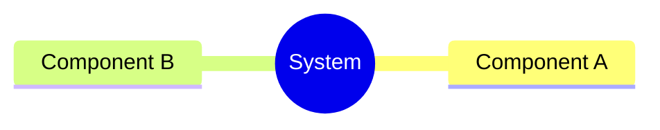
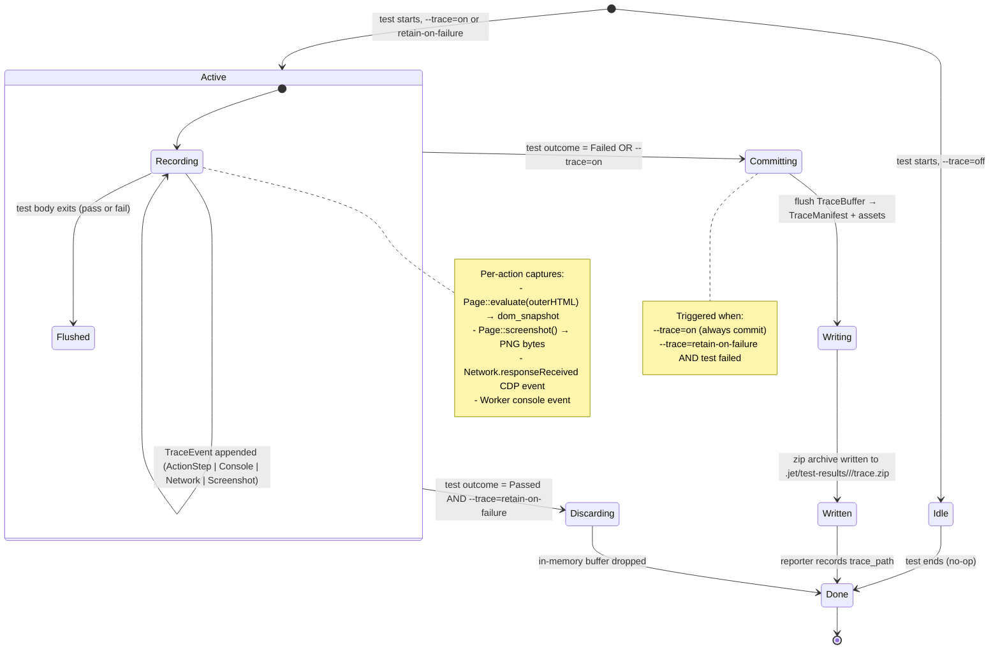
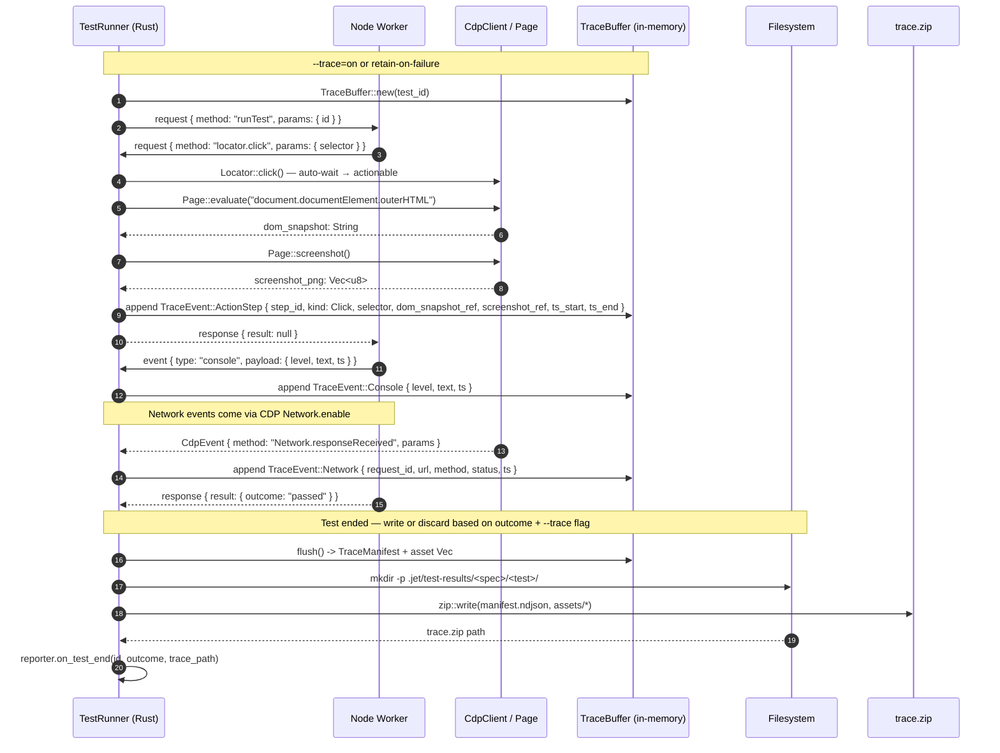
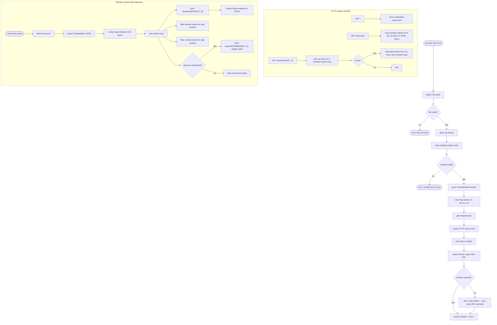
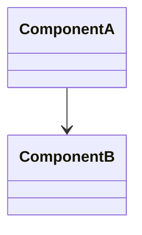
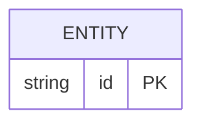

# Enhancement Native Trace Viewer Trace Capture Standalone Html Spec

## Overview
<!-- type: overview lang: markdown -->

Native trace capture and standalone HTML viewer for `jet test`. Three interacting components:

1. **Trace Capture** (`crates/jet/src/test_runner/`) — hooks into the NDJSON wire protocol (extending `WireChannel` with `TraceEvent` messages) and the existing CDP client (`Page::screenshot`, `Page::evaluate`) to record a per-test trace buffer: step timeline, DOM snapshots, network requests, console messages, and screenshots.
2. **Trace Format** (`crates/jet/src/trace/`) — jet-owned, self-describing NDJSON + zip-of-assets format with a `TraceManifest` header. No dependency on Playwright trace format or any external schema.
3. **Trace Viewer** (`crates/jet/src/cli/trace.rs` + embedded assets) — `jet trace view <file>` launches a local HTTP server on `127.0.0.1:<free-port>`, serves bundled vanilla JS/HTML/CSS assets (no React/Vue/npm framework at runtime), and opens the browser. The viewer renders the step timeline, DOM snapshot iframe, network panel, console panel, and inline screenshots.

Trace capture is gated by `--trace=on|retain-on-failure|off` (default `off`). When `off`, zero overhead is added to the test run. When `retain-on-failure`, only failed-test trace files are written to disk; passing-test buffers are discarded. The trace file path convention is compatible with the HTML reporter's deep-link requirement so per-test trace links can be embedded in the HTML report.
## Requirements

```mermaid
---
id: requirements
---
requirementDiagram

requirement R1 {
  id: R1
  text: "jet test captures trace artifacts when --trace=on|retain-on-failure|off is set; flag semantics match Playwright"
  risk: high
  verifymethod: test
}

requirement R2 {
  id: R2
  text: "Each trace artifact records: test step timeline, DOM snapshots per action, network requests, console messages, screenshots"
  risk: high
  verifymethod: test
}

requirement R3 {
  id: R3
  text: "Trace file format is jet-owned stable NDJSON (or zip+NDJSON); no dependency on Playwright trace format"
  risk: high
  verifymethod: analysis
}

requirement R4 {
  id: R4
  text: "Trace files are discoverable by HTML reporter for per-test deep-link trace view URLs"
  risk: high
  verifymethod: test
}

requirement R5 {
  id: R5
  text: "jet trace view <file> spins up local HTTP server, serves embedded static viewer, opens browser automatically"
  risk: high
  verifymethod: test
}

requirement R6 {
  id: R6
  text: "Embedded viewer assets bundled into jet binary via include_bytes!; no external CDN fetch at runtime"
  risk: high
  verifymethod: analysis
}

requirement R7 {
  id: R7
  text: "Viewer is standalone: does not invoke npx playwright show-trace or reference @playwright/test at runtime"
  risk: high
  verifymethod: analysis
}

requirement R8 {
  id: R8
  text: "Viewer UI renders step timeline, step-level navigation, DOM snapshots per action, network request details, console messages"
  risk: high
  verifymethod: test
}

requirement R9 {
  id: R9
  text: "Screenshots captured during test run are viewable inline in the trace viewer at the corresponding timeline position"
  risk: medium
  verifymethod: test
}

requirement R10 {
  id: R10
  text: "Trace capture adds negligible overhead when --trace=off; no allocation or CDP calls on the trace path"
  risk: medium
  verifymethod: test
}

requirement R11 {
  id: R11
  text: "When --trace=retain-on-failure: trace artifacts written only for failed tests; passing test buffers are discarded"
  risk: medium
  verifymethod: test
}

requirement R12 {
  id: R12
  text: "HTTP server binds to 127.0.0.1 only; selects free port automatically; prints URL to stdout"
  risk: low
  verifymethod: test
}
```

<!-- type: requirements lang: mermaid -->


## Scenarios
<!-- type: scenarios lang: markdown -->

```yaml
- id: S1
  given: jet test is run with --trace=on and a spec file containing two tests
  when: both tests pass
  then: two trace zip files are written to .jet/test-results/<spec>/<test-name>/trace.zip; each contains manifest.ndjson and asset files
  diagram_ref: interaction-S1

- id: S2
  given: jet test is run with --trace=retain-on-failure and a spec with one passing and one failing test
  when: the suite finishes
  then: only the failing test's trace.zip is written to disk; the passing test's in-memory buffer is discarded

- id: S3
  given: jet test is run with --trace=off (default)
  when: any test runs
  then: no trace buffer is allocated; no CDP snapshot or screenshot calls are made on the trace path; overhead is negligible

- id: S4
  given: a trace file .jet/test-results/my-spec/my-test/trace.zip exists
  when: user runs jet trace view .jet/test-results/my-spec/my-test/trace.zip
  then: an HTTP server starts on 127.0.0.1 on a free port, the URL is printed to stdout, the default browser opens automatically, and the viewer loads the trace
  diagram_ref: interaction-S4

- id: S5
  given: the trace viewer is open in the browser
  when: user clicks a step in the timeline
  then: the DOM snapshot iframe updates to show the captured HTML snapshot for that step; the network and console panels filter to events within that step's time window

- id: S6
  given: the trace viewer is open and the trace contains screenshot assets
  when: user hovers or selects a step that has an associated screenshot
  then: the screenshot is displayed inline within the viewer at the corresponding timeline position

- id: S7
  given: the HTML reporter has generated a report with per-test trace links
  when: user clicks a trace link in the HTML report
  then: the browser navigates to the jet trace view URL for that test's trace file; the viewer loads the correct trace

- id: S8
  given: a trace file references assets (DOM snapshot HTML, PNG screenshots)
  when: the viewer fetches an asset URL
  then: the HTTP server resolves the asset from within the zip archive and returns it with the correct Content-Type header
```
## Mindmap
<!-- type: mindmap lang: mermaid -->
<!-- TODO: Use Mermaid Plus mindmap (YAML frontmatter inside mermaid block).

-->

## State Machine
<!-- type: state-machine lang: mermaid -->


## Interaction
<!-- type: interaction lang: mermaid -->


## Logic
<!-- type: logic lang: mermaid -->


## Dependencies
<!-- type: dependency lang: mermaid -->
<!-- TODO: Use Mermaid Plus classDiagram (YAML frontmatter inside mermaid block).

-->

## Data Model
<!-- type: db-model lang: mermaid -->
<!-- TODO: Use Mermaid Plus erDiagram (YAML frontmatter inside mermaid block).

-->

## RPC API
<!-- type: rpc-api lang: yaml -->
<!-- TODO: OpenRPC 1.3 as YAML. Example:
```yaml
openrpc: "1.3.2"
info:
  title: Service Name
  version: "1.0.0"
methods: []
```
-->

## CLI
<!-- type: cli lang: yaml -->

```yaml
# jet test — extended with trace flag
command: jet test
flags:
  - name: trace
    type: enum
    values: ["on", "retain-on-failure", "off"]
    default: "off"
    description: |
      Enable trace capture for test runs.
      on: capture and write trace for every test.
      retain-on-failure: capture for all tests but only write to disk for failed tests.
      off: no trace capture (zero overhead).
    config_key: use.trace
    overrides: jet.test.config.ts use.trace field

# jet trace — new top-level subcommand
command: jet trace
subcommands:
  - name: view
    description: Open a local HTTP trace viewer for a jet trace archive file.
    usage: jet trace view <FILE>
    args:
      - name: file
        type: path
        required: true
        description: Path to a trace.zip archive produced by jet test --trace=on|retain-on-failure
    flags:
      - name: port
        short: p
        type: u16
        default: 0
        description: Port to bind. 0 selects a free port automatically (default).
      - name: no-open
        type: bool
        default: false
        description: Skip automatic browser open; print URL only.
    output:
      stdout: "Trace viewer running at http://127.0.0.1:<PORT>"
    exit_codes:
      0: server shut down cleanly (Ctrl-C)
      1: file not found or invalid trace format
      2: port bind failed
```
## Schema
<!-- type: schema lang: yaml -->

```yaml
# TraceManifest — first NDJSON line in manifest.ndjson (inside trace.zip)
"$schema": "https://json-schema.org/draft/2020-12/schema"
"$id": "jet://schemas/trace-manifest"
title: TraceManifest
type: object
required: [version, test_id, spec_file, test_title, outcome, started_at, finished_at, events]
properties:
  version:
    type: integer
    const: 1
    description: Schema version; bump on breaking changes.
  test_id:
    type: string
    description: Stable slug derived from spec file path + test title.
  spec_file:
    type: string
    description: Workspace-relative path to the .spec.ts file.
  test_title:
    type: string
    description: Full test title including describe nesting (joined by " > ").
  outcome:
    type: string
    enum: [passed, failed, timed-out]
  started_at:
    type: integer
    description: Unix timestamp in milliseconds (wall-clock).
  finished_at:
    type: integer
    description: Unix timestamp in milliseconds.
  events:
    type: array
    description: Ordered trace events (one JSON object per line after the manifest header in manifest.ndjson).
    items:
      oneOf:
        - "$ref": "#/$defs/ActionStepEvent"
        - "$ref": "#/$defs/ConsoleEvent"
        - "$ref": "#/$defs/NetworkEvent"
        - "$ref": "#/$defs/ScreenshotEvent"
  assets:
    type: object
    description: Map of asset_id -> zip entry path for all binary assets (DOM snapshots, screenshots).
    additionalProperties:
      type: string
additionalProperties: false
"$defs":
  ActionStepEvent:
    type: object
    required: [kind, step_id, action, selector, ts_start, ts_end]
    properties:
      kind:
        type: string
        const: action_step
      step_id:
        type: integer
        description: Monotonically increasing step index within the test.
      action:
        type: string
        enum: [click, fill, goto, evaluate, screenshot, wait_for, hover, check, uncheck, type_text]
      selector:
        type: [string, "null"]
        description: CSS/ARIA/text selector, null for page-level actions.
      url:
        type: [string, "null"]
        description: Present for goto actions.
      ts_start:
        type: integer
        description: Milliseconds since test start.
      ts_end:
        type: integer
        description: Milliseconds since test start.
      dom_snapshot_ref:
        type: [string, "null"]
        description: asset_id in assets map for the post-action DOM snapshot HTML file.
      screenshot_ref:
        type: [string, "null"]
        description: asset_id in assets map for the post-action PNG screenshot.
      error:
        type: [string, "null"]
        description: Error message if the action threw; null on success.
  ConsoleEvent:
    type: object
    required: [kind, level, text, ts]
    properties:
      kind:
        type: string
        const: console
      level:
        type: string
        enum: [log, info, warn, error, debug]
      text:
        type: string
      ts:
        type: integer
        description: Milliseconds since test start.
  NetworkEvent:
    type: object
    required: [kind, request_id, url, method, status, ts_start]
    properties:
      kind:
        type: string
        const: network
      request_id:
        type: string
      url:
        type: string
      method:
        type: string
      status:
        type: [integer, "null"]
        description: HTTP response status; null if request never completed.
      ts_start:
        type: integer
      ts_end:
        type: [integer, "null"]
      request_headers:
        type: object
        additionalProperties:
          type: string
      response_headers:
        type: object
        additionalProperties:
          type: string
  ScreenshotEvent:
    type: object
    required: [kind, screenshot_ref, ts]
    properties:
      kind:
        type: string
        const: screenshot
      screenshot_ref:
        type: string
        description: asset_id in assets map for the PNG screenshot.
      ts:
        type: integer
        description: Milliseconds since test start.
```
## Test Plan

```mermaid
---
id: test-plan
---
requirementDiagram

requirement R1 {
  id: R1
  text: "jet test captures trace artifacts when --trace=on|retain-on-failure"
  risk: high
  verifymethod: test
}

requirement R2 {
  id: R2
  text: "Trace records step timeline, DOM snapshots, network, console, screenshots"
  risk: high
  verifymethod: test
}

requirement R3 {
  id: R3
  text: "Jet-owned trace format — no Playwright dependency"
  risk: high
  verifymethod: analysis
}

requirement R4 {
  id: R4
  text: "Trace path in test-results.json for HTML reporter deep-link"
  risk: high
  verifymethod: test
}

requirement R5 {
  id: R5
  text: "jet trace view starts HTTP server and opens browser"
  risk: high
  verifymethod: test
}

requirement R6 {
  id: R6
  text: "Viewer assets bundled — no external CDN fetch"
  risk: high
  verifymethod: analysis
}

requirement R7 {
  id: R7
  text: "Viewer standalone — no Playwright reference"
  risk: high
  verifymethod: analysis
}

requirement R8 {
  id: R8
  text: "Viewer renders timeline, DOM snapshots, network, console"
  risk: high
  verifymethod: test
}

requirement R9 {
  id: R9
  text: "Screenshots viewable inline in viewer"
  risk: medium
  verifymethod: test
}

requirement R10 {
  id: R10
  text: "--trace=off adds negligible overhead"
  risk: medium
  verifymethod: test
}

requirement R11 {
  id: R11
  text: "retain-on-failure discards passing test buffers"
  risk: medium
  verifymethod: test
}

requirement R12 {
  id: R12
  text: "Server binds 127.0.0.1, selects free port, prints URL"
  risk: low
  verifymethod: test
}

element T1 {
  type: "Test"
  docref: "crates/jet/tests/trace_capture.rs::test_trace_buffer_append_flush"
}

element T2 {
  type: "Test"
  docref: "crates/jet/tests/trace_capture.rs::test_trace_zip_roundtrip"
}

element T3 {
  type: "Test"
  docref: "crates/jet/tests/trace_capture.rs::test_retain_on_failure_discard_passing"
}

element T4 {
  type: "Test"
  docref: "crates/jet/tests/trace_capture.rs::test_retain_on_failure_write_failing"
}

element T5 {
  type: "Test"
  docref: "crates/jet/tests/trace_capture.rs::test_trace_off_no_cdp_calls"
}

element T6 {
  type: "Test"
  docref: "crates/jet/tests/trace_viewer.rs::test_http_server_binds_loopback"
}

element T7 {
  type: "Test"
  docref: "crates/jet/tests/trace_viewer.rs::test_trace_json_endpoint_matches_manifest"
}

element T8 {
  type: "Test"
  docref: "crates/jet/tests/trace_viewer.rs::test_asset_endpoint_returns_bytes"
}

element T9 {
  type: "Test"
  docref: "crates/jet/tests/trace_capture.rs::test_trace_path_in_test_results_json"
}

element T10 {
  type: "Test"
  docref: "crates/jet/tests/trace_capture.rs::test_all_event_types_captured"
}

T1 - verifies -> R1
T2 - verifies -> R3
T3 - verifies -> R11
T4 - verifies -> R11
T5 - verifies -> R10
T6 - verifies -> R12
T7 - verifies -> R5
T8 - verifies -> R5
T9 - verifies -> R4
T10 - verifies -> R2
T10 - verifies -> R9
```

<!-- type: test-plan lang: markdown -->


## Changes
<!-- type: changes lang: yaml -->

```yaml
changes:
  # --- Trace capture: wire protocol extension ---
  - action: modify
    path: crates/jet/src/test_runner/wire.rs
    purpose: Add TraceEvent enum variants (ActionStep, Console, Network, Screenshot) to WireChannel; add TraceMode enum (On, RetainOnFailure, Off).

  # --- Trace capture: buffer + flush logic ---
  - action: create
    path: crates/jet/src/trace/mod.rs
    purpose: TraceBuffer (in-memory append-only buffer), TraceMode gating logic, flush() -> (TraceManifest, Vec<TraceAsset>); re-exports TraceManifest, TraceEvent, TraceAsset.

  - action: create
    path: crates/jet/src/trace/manifest.rs
    purpose: TraceManifest struct + all TraceEvent variants (ActionStepEvent, ConsoleEvent, NetworkEvent, ScreenshotEvent) with serde Serialize/Deserialize; NDJSON serialization helpers.

  - action: create
    path: crates/jet/src/trace/archive.rs
    purpose: write_trace_zip(manifest, assets, out_path) — creates zip archive with manifest.ndjson entry + asset entries; uses zip crate.

  # --- Trace capture: worker integration ---
  - action: modify
    path: crates/jet/src/test_runner/worker.rs
    purpose: Create TraceBuffer per test when TraceMode != Off; hook into handle_action_request to capture dom_snapshot (Page::evaluate outerHTML) + screenshot (Page::screenshot) after each action; forward worker console events to buffer; subscribe to CDP Network.responseReceived events and append NetworkEvent to buffer; on test end, flush + write zip or discard based on mode + outcome.

  # --- CLI: trace flag on jet test ---
  - action: modify
    path: crates/jet/src/test_runner/config.rs
    purpose: Add trace: TraceMode field to RunnerConfig; parse --trace CLI flag; merge from jet.test.config.ts use.trace.

  # --- CLI: jet trace view subcommand ---
  - action: modify
    path: crates/jet/src/cli.rs
    purpose: Add Trace(TraceArgs) variant to top-level Cli enum; add TraceArgs + TraceSubcommand::View { file, port, no_open }; dispatch to trace::view::run().

  - action: create
    path: crates/jet/src/trace/view.rs
    purpose: run(file: PathBuf, port: u16, no_open: bool) — open zip, parse manifest, bind TcpListener on 127.0.0.1:port (0 = free), spawn hyper/axum HTTP handler, print URL, open::that URL unless --no-open, await SIGINT.

  - action: create
    path: crates/jet/src/trace/server.rs
    purpose: HTTP request handler: GET / -> embedded viewer.html bytes; GET /trace.json -> manifest JSON; GET /assets/:id -> zip asset bytes with correct Content-Type; 404 for unknown routes.

  # --- Embedded viewer assets ---
  - action: create
    path: crates/jet/assets/trace-viewer/viewer.html
    purpose: Standalone HTML entry point; inlines viewer.js and viewer.css via include_str! at build time; no external script/link tags at runtime.

  - action: create
    path: crates/jet/assets/trace-viewer/viewer.js
    purpose: Vanilla JS trace viewer: fetches /trace.json, renders step timeline, handles step selection, loads DOM snapshot into iframe, renders network + console panels, displays inline screenshots. No npm runtime dependency.

  - action: create
    path: crates/jet/assets/trace-viewer/viewer.css
    purpose: Styles for the trace viewer UI panels (timeline, snapshot pane, network table, console log).

  # --- Reporter: trace path integration ---
  - action: modify
    path: crates/jet/src/test_runner/reporter.rs
    purpose: Add trace_path: Option<PathBuf> to TestOutcome; JsonReporter includes trace_path in .jet/test-results.json per-test entry for HTML reporter deep-link.

  # --- lib.rs: re-export new trace module ---
  - action: modify
    path: crates/jet/src/lib.rs
    purpose: Add pub mod trace; re-export.

  # --- Tests ---
  - action: create
    path: crates/jet/tests/trace_capture.rs
    purpose: Integration tests for TraceBuffer append + flush roundtrip; zip archive write + read back; retain-on-failure discard logic; --trace=off zero-overhead assertion (no CDP calls on trace path).

  - action: create
    path: crates/jet/tests/trace_viewer.rs
    purpose: Integration tests for jet trace view: HTTP server starts, /trace.json returns valid JSON matching manifest, /assets/:id returns correct bytes, server binds to 127.0.0.1 only.

  # --- Spec files (new tech_design specs) ---
  - action: create
    path: .score/tech_design/crates/jet/testing/trace-capture.md
    purpose: Tech design spec for TraceBuffer, WireChannel extension, CDP snapshot hooks, retain-on-failure logic.

  - action: create
    path: .score/tech_design/crates/jet/testing/trace-format.md
    purpose: Tech design spec for TraceManifest schema, NDJSON + zip asset format, asset naming convention, version field.

  - action: create
    path: .score/tech_design/crates/jet/testing/trace-viewer.md
    purpose: Tech design spec for jet trace view CLI, embedded HTTP server, asset bundling via include_bytes!, viewer UI panel design.
```

# Reviews

## Review: reviewer (Iteration 1)

**Change ID**: enhancement-native-trace-viewer-trace-capture-standalone-html

**Verdict**: APPROVED

### Summary

Spec is implementation-ready. Overview is substantive (~1400 chars) and clearly identifies the three components (capture, format, viewer) with their source locations. Requirements R1-R12 are well-defined as a Mermaid requirementDiagram with IDs, text, risk, and verifymethod fields. Scenarios cover capture, retain-on-failure, trace file discovery, and viewer workflow (S1-S12+). Interaction diagram shows browser/test-runner/viewer sequences. Logic flowchart covers the capture and viewer flows. State-machine covers trace buffer lifecycle. CLI section documents `jet trace view/show/extract` subcommands per R5-R9 of the issue. Schema defines the TraceManifest + event types as JSON schema. Changes section enumerates files added/modified. Test plan has T1-T10 with element→requires-verifies edges. No duplicate section types. Sections follow logical order.

### Issues

No issues found.
