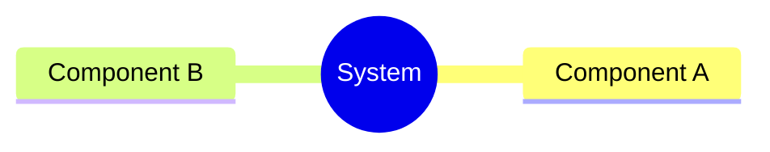
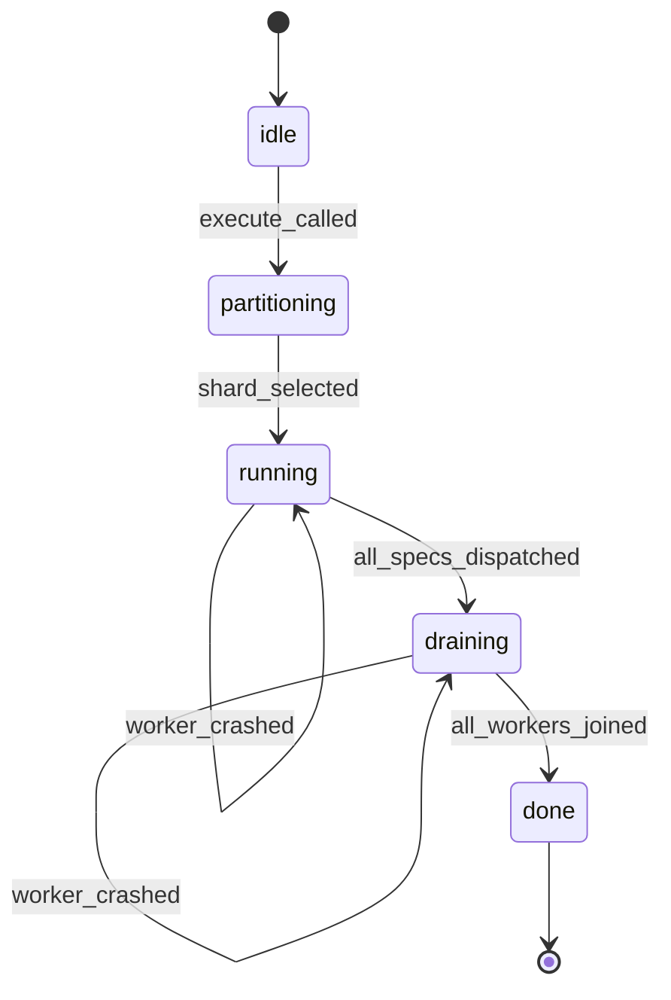
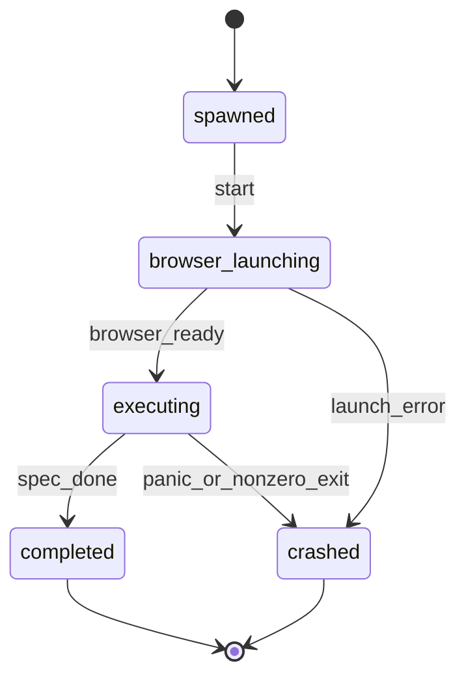
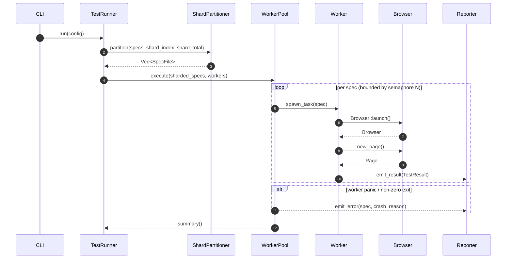
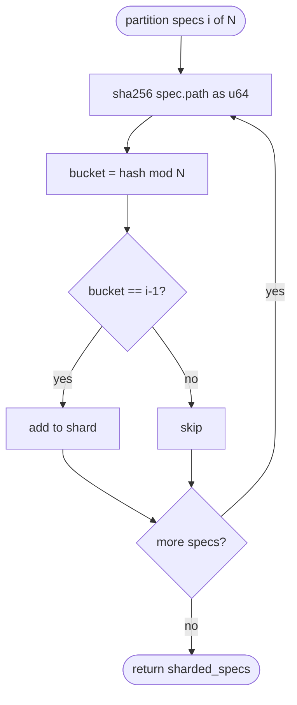
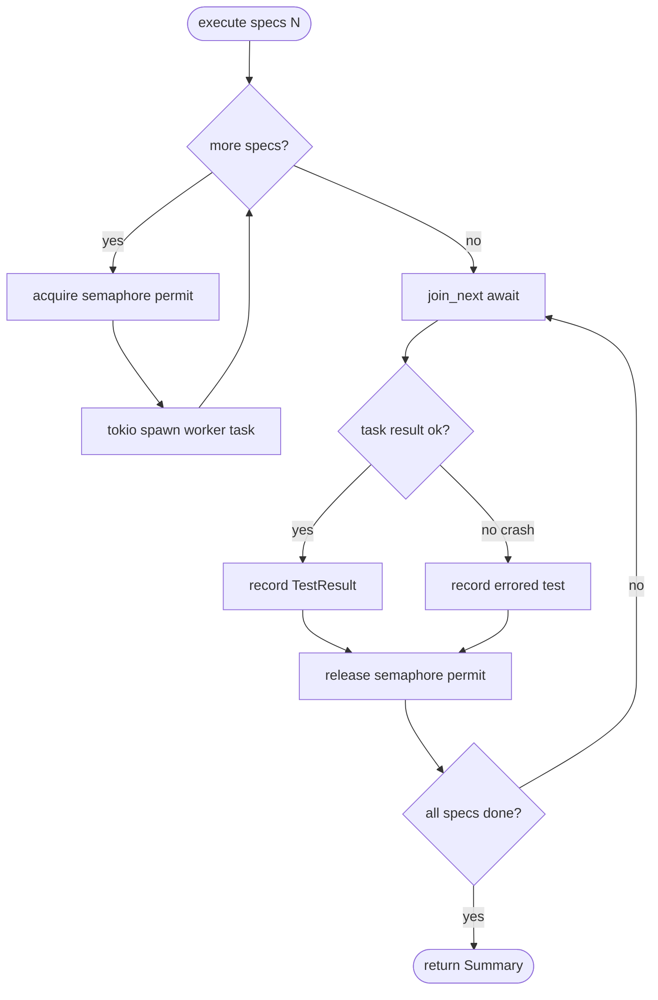
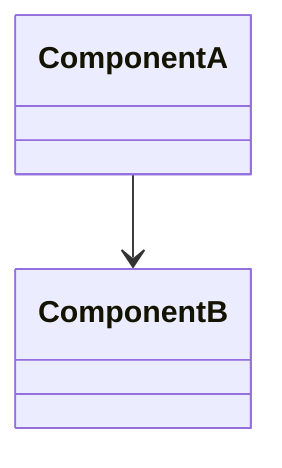
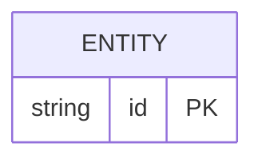

# Enhancement Parallel Test Execution Sharding For Native Test R Spec

## Overview
<!-- type: overview lang: markdown -->

Phase 4b extension to the jet native test runner: parallel spec execution via a bounded worker pool and deterministic shard partitioning for CI distribution.

The MVP serial runner (Phase 1-3) runs one spec process at a time. This change activates the `workers` field stub in `RunnerConfig` and introduces a `--shard=i/N` flag.

New module `crates/jet/src/test_runner/worker_pool.rs`:
- **WorkerPool** — tokio semaphore-bounded task set; spawns up to `N` concurrent spec workers; collects results; surfaces crashed workers as errored tests without halting the pool.
- **ShardPartitioner** — hashes each spec file path (SHA-256 truncated to u64) and partitions the full spec set into N equal buckets; the i-th shard selects bucket `(hash % N) == (i - 1)`.
- **Per-worker browser isolation** — each worker task calls `Browser::launch` independently; no shared `CdpClient` or `CdpSession` across worker boundaries.

Wire protocol additions: `shard_index` and `shard_total` fields on `testEnd` event payloads enable the HTML reporter to merge multi-shard NDJSON files.

Trace file naming: `trace-shard-<i>-of-<N>-<spec-slug>.zip` prevents artifact collisions when N CI workers each capture traces.

Files introduced: `worker_pool.rs`. Files modified: `config.rs`, `wire.rs`, `reporter.rs`, `cli.rs`, `test-runner.md`.
## Requirements

```mermaid
---
id: requirements
---
requirementDiagram

requirement R1 {
  id: R1
  text: "jet test MUST accept --workers=<N> flag; when omitted N defaults to std::thread::available_parallelism()."
  risk: high
  verifymethod: test
}

requirement R2 {
  id: R2
  text: "--workers=1 MUST force fully serial execution with no concurrency."
  risk: medium
  verifymethod: test
}

requirement R3 {
  id: R3
  text: "jet test MUST accept --shard=i/N (1-indexed) selecting the i-th of N equal partitions from the full spec set."
  risk: high
  verifymethod: test
}

requirement R4 {
  id: R4
  text: "Shard partitioning MUST be deterministic across runs using a stable hash of each spec file path (SHA-256 truncated to u64, bucket = hash % N)."
  risk: high
  verifymethod: test
}

requirement R5 {
  id: R5
  text: "A crashed or non-zero-exit worker MUST NOT halt the pool; the affected spec MUST surface as an errored test and the pool MUST continue remaining specs."
  risk: high
  verifymethod: test
}

requirement R6 {
  id: R6
  text: "Each worker task MUST own an isolated browser context: one Browser::launch + one Page per worker, no shared CdpClient or CdpSession across workers."
  risk: high
  verifymethod: test
}

requirement R7 {
  id: R7
  text: "Trace filenames MUST embed shard index: trace-shard-<i>-of-<N>-<spec-slug>.zip."
  risk: medium
  verifymethod: inspection
}

requirement R8 {
  id: R8
  text: "HTML reporter MUST accept multiple NDJSON result files (one per shard) and merge them into a single unified report using shard_index and shard_total fields."
  risk: medium
  verifymethod: test
}

requirement R9 {
  id: R9
  text: "--workers and --shard MUST appear in jet test --help with descriptions of accepted values and defaults."
  risk: low
  verifymethod: inspection
}

R2 - refines -> R1
R4 - refines -> R3
R6 - refines -> R1
R7 - traces -> R3
R8 - traces -> R3
```

<!-- type: requirements lang: mermaid -->


## Scenarios
<!-- type: scenarios lang: markdown -->

```yaml
- id: S1
  given: "8-core host, no --workers flag"
  when: "jet test runs"
  then: "WorkerPool created with N=8; up to 8 spec workers run concurrently"

- id: S2
  given: "--workers=1 flag"
  when: "jet test runs with 10 spec files"
  then: "specs execute serially one at a time; output is deterministic; no concurrency"

- id: S3
  given: "12 spec files, --shard=2/4 flag"
  when: "ShardPartitioner partitions by hash % 4 == 1"
  then: "exactly the 3 specs whose path hash maps to bucket 1 are selected and run"

- id: S4
  given: "same 12 spec files run on a different OS with --shard=2/4"
  when: "ShardPartitioner hashes paths"
  then: "identical spec subset selected as S3 (SHA-256 is platform-independent)"

- id: S5
  given: "--workers=4, one of 4 concurrent spec workers panics during browser launch"
  when: "WorkerPool join_next detects task error"
  then: "affected spec recorded as errored; remaining 3 workers continue; pool does not hang"

- id: S6
  given: "--workers=3, 3 concurrent spec workers"
  when: "each worker starts"
  then: "each worker calls Browser::launch independently; no shared CdpClient or Page across workers"

- id: S7
  given: "--shard=2/4 and trace mode enabled"
  when: "a spec produces a trace file"
  then: "filename is trace-shard-2-of-4-<spec-slug>.zip"

- id: S8
  given: "4 NDJSON result files from 4 CI shards, each record has shard_index and shard_total fields"
  when: "HTML reporter invoked with all 4 files"
  then: "single unified HTML report with all results merged in order"

- id: S9
  given: "no --shard flag"
  when: "jet test --help displayed"
  then: "--shard description and default shown; --workers description and default shown"
```
## Mindmap
<!-- type: mindmap lang: mermaid -->
<!-- TODO: Use Mermaid Plus mindmap (YAML frontmatter inside mermaid block).

-->

## State Machine
<!-- type: state-machine lang: mermaid -->




## Interaction
<!-- type: interaction lang: mermaid -->


## Logic
<!-- type: logic lang: mermaid -->




## Dependencies
<!-- type: dependency lang: mermaid -->
<!-- TODO: Use Mermaid Plus classDiagram (YAML frontmatter inside mermaid block).

-->

## Data Model
<!-- type: db-model lang: mermaid -->
<!-- TODO: Use Mermaid Plus erDiagram (YAML frontmatter inside mermaid block).

-->

## RPC API
<!-- type: rpc-api lang: yaml -->
<!-- TODO: OpenRPC 1.3 as YAML. Example:
```yaml
openrpc: "1.3.2"
info:
  title: Service Name
  version: "1.0.0"
methods: []
```
-->

## CLI
<!-- type: cli lang: yaml -->

```yaml
_sdd:
  id: jet-test-cli
  refs:
    - $ref: "#requirements"
command: jet test
flags:
  - name: workers
    short: null
    long: --workers
    value: "<N>"
    type: integer
    minimum: 1
    default: "std::thread::available_parallelism()"
    description: "Number of concurrent spec worker processes. 1 = serial (debug mode)."
    help_text: "--workers=<N>  Number of concurrent workers [default: logical CPU count]"
  - name: shard
    short: null
    long: --shard
    value: "<i/N>"
    type: string
    pattern: "^[1-9][0-9]*/[1-9][0-9]*$"
    default: null
    description: "Select shard i of N (1-indexed). Run CI with i=1..N to distribute specs."
    help_text: "--shard=<i/N>  Run only the i-th of N shards [e.g. --shard=2/4]"
    validation:
      - "i >= 1"
      - "N >= 1"
      - "i <= N"
```
## Schema
<!-- type: schema lang: yaml -->

```json
{
  "$schema": "https://json-schema.org/draft/2020-12/schema",
  "$id": "jet://schemas/worker-pool",
  "title": "WorkerPool types",
  "$defs": {
    "ShardConfig": {
      "type": "object",
      "required": ["shard_index", "shard_total"],
      "properties": {
        "shard_index": {
          "type": "integer",
          "minimum": 1,
          "description": "1-indexed shard number selected by --shard=i/N."
        },
        "shard_total": {
          "type": "integer",
          "minimum": 1,
          "description": "Total number of shards N in --shard=i/N."
        }
      },
      "additionalProperties": false
    },
    "RunnerConfigExtension": {
      "description": "Fields added to RunnerConfig in config.rs for this change.",
      "type": "object",
      "properties": {
        "workers": {
          "type": "integer",
          "minimum": 1,
          "description": "Parallel worker count. Default: std::thread::available_parallelism()."
        },
        "shard": {
          "oneOf": [
            { "type": "null" },
            { "$ref": "#/$defs/ShardConfig" }
          ],
          "description": "Shard selection. null = no sharding (run all specs)."
        }
      },
      "additionalProperties": false
    },
    "NdjsonTestEndExtension": {
      "description": "Fields added to testEnd wire event payload for multi-shard NDJSON merge.",
      "type": "object",
      "properties": {
        "shard_index": {
          "type": ["integer", "null"],
          "minimum": 1,
          "description": "1-indexed shard number; null when --shard not set."
        },
        "shard_total": {
          "type": ["integer", "null"],
          "minimum": 1,
          "description": "Total shard count N; null when --shard not set."
        }
      },
      "additionalProperties": false
    },
    "TraceFilenamePattern": {
      "type": "string",
      "description": "Filename pattern for trace archives when --shard is active.",
      "pattern": "^trace-shard-[0-9]+-of-[0-9]+-[a-z0-9_-]+\\.zip$",
      "examples": ["trace-shard-2-of-4-login-spec.zip"]
    }
  }
}
```
## Test Plan

```mermaid
---
id: test-plan
---
requirementDiagram

requirement R1 {
  id: R1
  text: "--workers=N flag bounds concurrency; default = logical CPU count"
  risk: high
  verifymethod: test
}

requirement R2 {
  id: R2
  text: "--workers=1 forces serial execution"
  risk: high
  verifymethod: test
}

requirement R3 {
  id: R3
  text: "--shard=i/N partitions spec set and selects i-th bucket"
  risk: high
  verifymethod: test
}

requirement R4 {
  id: R4
  text: "Partition is deterministic across runs (stable hash on spec path)"
  risk: high
  verifymethod: test
}

requirement R5 {
  id: R5
  text: "Crashed worker surfaces as errored test; pool continues"
  risk: high
  verifymethod: test
}

requirement R6 {
  id: R6
  text: "Each worker owns isolated browser context (no shared CdpClient)"
  risk: high
  verifymethod: analysis
}

requirement R7 {
  id: R7
  text: "Trace filenames include shard-<i>-of-<N> tag"
  risk: medium
  verifymethod: test
}

requirement R8 {
  id: R8
  text: "NDJSON result records include shard_index + shard_total"
  risk: medium
  verifymethod: test
}

requirement R9 {
  id: R9
  text: "--workers and --shard appear in jet test --help"
  risk: low
  verifymethod: test
}

element T1 {
  type: "Test"
  docref: "crates/jet/tests/worker_pool_tests.rs::test_workers_bounds_concurrency"
}
element T2 {
  type: "Test"
  docref: "crates/jet/tests/worker_pool_tests.rs::test_workers_one_is_serial"
}
element T3 {
  type: "Test"
  docref: "crates/jet/tests/worker_pool_tests.rs::test_shard_partition_selects_ith_bucket"
}
element T4 {
  type: "Test"
  docref: "crates/jet/tests/worker_pool_tests.rs::test_shard_partition_stable_across_runs"
}
element T5 {
  type: "Test"
  docref: "crates/jet/tests/worker_pool_tests.rs::test_shard_partition_covers_all_specs"
}
element T6 {
  type: "Test"
  docref: "crates/jet/tests/worker_pool_tests.rs::test_crashed_worker_surfaces_errored"
}
element T7 {
  type: "Test"
  docref: "crates/jet/tests/worker_pool_tests.rs::test_trace_filename_includes_shard_tag"
}
element T8 {
  type: "Test"
  docref: "crates/jet/tests/worker_pool_tests.rs::test_ndjson_contains_shard_fields"
}

T1 - verifies -> R1
T2 - verifies -> R2
T3 - verifies -> R3
T4 - verifies -> R4
T5 - verifies -> R4
T6 - verifies -> R5
T7 - verifies -> R7
T8 - verifies -> R8
```

<!-- type: test-plan lang: markdown -->


## Changes
<!-- type: changes lang: yaml -->

```yaml
changes:
  - path: crates/jet/src/test_runner/worker_pool.rs
    action: add
    purpose: WorkerPool + ShardPartitioner implementation (R1-R6)
  - path: crates/jet/src/test_runner/mod.rs
    action: modify
    purpose: Expose worker_pool module; wire WorkerPool into run_tests orchestrator
  - path: crates/jet/src/test_runner/config.rs
    action: modify
    purpose: Activate workers field stub; add shard (Option<(u32,u32)>) field on RunnerConfig (R1,R3)
  - path: crates/jet/src/test_runner/wire.rs
    action: modify
    purpose: Add shard_index + shard_total fields to TestEnd wire event (R8)
  - path: crates/jet/src/test_runner/reporter.rs
    action: modify
    purpose: Propagate shard metadata into TestReport; emit in NDJSON output
  - path: crates/jet/src/cli.rs
    action: modify
    purpose: Add --workers=<N> and --shard=<i/N> flags to jet test subcommand (R1,R3,R9)
  - path: crates/jet/src/trace/buffer.rs
    action: modify
    purpose: Accept optional shard tuple; emit trace-shard-<i>-of-<N>-<spec>.zip naming (R7)
  - path: .score/tech_design/crates/jet/testing/worker-pool.md
    action: add
    purpose: Main spec target (new)
  - path: .score/tech_design/crates/jet/testing/test-runner.md
    action: modify
    purpose: Promote T2 parallelism from deferred to active; document shard metadata in T8 NDJSON
```

# Reviews

## Review: reviewer (Iteration 1)

**Change ID**: enhancement-parallel-test-execution-sharding-for-native-test-r

**Verdict**: APPROVED

### Summary

Spec is implementation-ready. Overview substantive (~1200 chars) and identifies WorkerPool + ShardPartitioner + per-worker isolation as the three components. Requirements R1-R9 as requirementDiagram with ids/text/risk/verifymethod. Scenarios cover bounded concurrency, serial debug, shard selection, stable hashing, crash recovery, shard-tagged traces, NDJSON merge, --help output. Interaction + logic + state-machine + cli + schema filled. Changes section enumerates worker_pool.rs + wiring edits. Test plan has T1-T8 with element→requires-verifies edges covering all high-risk requirements. No duplicate section types. Sections follow logical order.

### Issues

No issues found.
