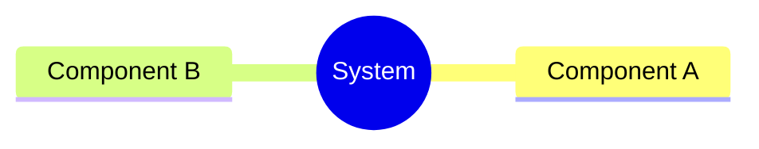
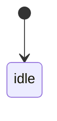
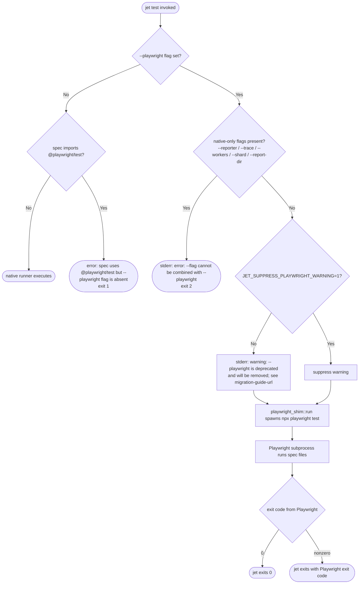
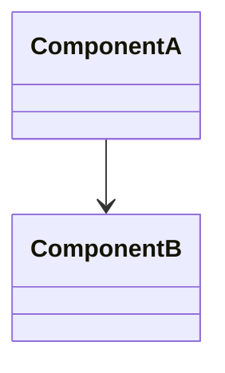
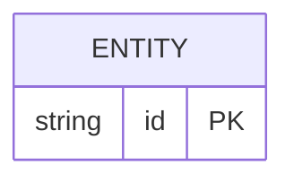

# Enhancement Playwright Compat Shim For Migration Window Spec

## Overview
<!-- type: overview lang: markdown -->

Phase 5a formalization of the `--playwright` escape hatch in `crates/jet/src/test_runner/` (commit `1dccd7b9`). The escape hatch already exists as an undocumented path that shells out to `npx playwright test`; this change promotes it to a supported, documented migration aid with a strict deprecation contract.

Three concerns are codified:

1. **Deprecation warning emitter** — every `jet test --playwright` invocation prints `warning: --playwright is deprecated and will be removed; see <migration-guide-url>` on stderr. Suppressed by `JET_SUPPRESS_PLAYWRIGHT_WARNING=1`.
2. **Flag namespace isolation** — native-only flags (`--reporter`, `--trace`, `--workers`, `--shard`, `--report-dir`) are rejected with a clear error when combined with `--playwright`; they must not silently pass through or leak into Playwright's argument list.
3. **Import auto-detection routing** — when `--playwright` is set, spec files importing `@playwright/test` are routed to the Playwright subprocess; no further transformation by jet's native runner.

Shim lifetime: deprecated in the minor release that ships this issue; removed two minor releases later. The removal date is declared in `CHANGELOG.md` and the migration guide.

Migration guide ships at `crates/jet/docs/migration-from-playwright.md` covering side-by-side flag mapping, `@playwright/test` import rewrite recipes, and trace viewer / HTML reporter deep-link usage.

Files touched: `crates/jet/src/cli.rs` (flag validation + warning emitter), `crates/jet/src/playwright_shim.rs` (new — subprocess orchestration), `crates/jet/docs/migration-from-playwright.md` (new), `crates/jet/tests/playwright_compat_tests.rs` (new — e2e fixture).
## Requirements

```mermaid
---
id: requirements
---
requirementDiagram

requirement R1 {
  id: R1
  text: "jet test --playwright delegates to the existing Playwright runner path in crates/jet/src/test_runner/ (commit 1dccd7b9). The flag is formally documented as the supported migration escape hatch."
  risk: medium
  verifymethod: test
}

requirement R2 {
  id: R2
  text: "When --playwright is set, any spec file importing @playwright/test is routed to the Playwright subprocess without transformation by jet's native runner. Non-Playwright specs on the same invocation continue through the native path."
  risk: high
  verifymethod: test
}

requirement R3 {
  id: R3
  text: "Every jet test --playwright invocation prints on stderr: warning: --playwright is deprecated and will be removed; see <migration-guide-url>. The message is printed before the Playwright subprocess is spawned."
  risk: high
  verifymethod: test
}

requirement R4 {
  id: R4
  text: "Setting JET_SUPPRESS_PLAYWRIGHT_WARNING=1 suppresses the deprecation warning entirely. Any other value (or absence) leaves the warning enabled."
  risk: medium
  verifymethod: test
}

requirement R5 {
  id: R5
  text: "Shim lifetime: deprecated in the minor release shipping this issue; removed in the second subsequent minor release. Removal version is recorded in crates/jet/docs/migration-from-playwright.md and CHANGELOG.md."
  risk: low
  verifymethod: inspection
}

requirement R6 {
  id: R6
  text: "Native-only flags (--reporter, --trace, --workers, --shard, --report-dir) combined with --playwright produce a hard error on stderr and exit code 2. They must not pass through to Playwright's argv."
  risk: high
  verifymethod: test
}

requirement R7 {
  id: R7
  text: "Playwright-specific CLI flags and jet.test.config.ts options only take effect on the --playwright code path. They must not pollute jet's native flag namespace when --playwright is absent."
  risk: high
  verifymethod: test
}

requirement R8 {
  id: R8
  text: "Migration guide ships at crates/jet/docs/migration-from-playwright.md covering: side-by-side runner flag mapping table, @playwright/test import rewrite recipes, trace viewer and HTML reporter deep-link usage, deprecation timeline."
  risk: medium
  verifymethod: inspection
}

requirement R9 {
  id: R9
  text: "Automated test at crates/jet/tests/playwright_compat_tests.rs includes at least one fixture spec importing @playwright/test that verifies jet test --playwright executes it end-to-end without regression (exit code 0)."
  risk: high
  verifymethod: test
}

R2 - refines -> R1
R3 - refines -> R1
R4 - refines -> R3
R6 - refines -> R1
R7 - refines -> R1
R9 - traces -> R1
R9 - traces -> R2
```

<!-- type: requirements lang: mermaid -->


## Scenarios
<!-- type: scenarios lang: markdown -->

```yaml
- id: S1
  given: user runs jet test --playwright with a spec file importing @playwright/test
  when: the command is invoked
  then: deprecation warning printed on stderr; Playwright subprocess spawned with the spec file; exit code propagated from Playwright

- id: S2
  given: JET_SUPPRESS_PLAYWRIGHT_WARNING=1 is set; user runs jet test --playwright
  when: the command is invoked
  then: no deprecation warning on stderr; Playwright subprocess spawned normally

- id: S3
  given: user runs jet test --playwright --reporter=html
  when: the command is invoked
  then: error on stderr: "--reporter cannot be combined with --playwright"; process exits 2; Playwright subprocess never spawned
  diagram_ref: logic-S3

- id: S4
  given: user runs jet test --playwright --trace=on
  when: the command is invoked
  then: error on stderr: "--trace cannot be combined with --playwright"; process exits 2

- id: S5
  given: user runs jet test --playwright --workers=4
  when: the command is invoked
  then: error on stderr: "--workers cannot be combined with --playwright"; process exits 2

- id: S6
  given: user runs jet test --playwright --shard=1/2
  when: the command is invoked
  then: error on stderr: "--shard cannot be combined with --playwright"; process exits 2

- id: S7
  given: user runs jet test --playwright --report-dir=./out
  when: the command is invoked
  then: error on stderr: "--report-dir cannot be combined with --playwright"; process exits 2

- id: S8
  given: user runs jet test (without --playwright) with a spec that uses native flags
  when: the command is invoked
  then: native runner executes normally; no Playwright subprocess is spawned; --playwright flag namespace has no effect

- id: S9
  given: fixture spec at crates/jet/tests/fixtures/playwright_compat.spec.ts imports @playwright/test
  when: jet test --playwright crates/jet/tests/fixtures/playwright_compat.spec.ts is run in CI
  then: Playwright executes the spec; exit code 0; test results printed by Playwright to stdout

- id: S10
  given: Playwright subprocess exits with code 1 (test failure)
  when: jet test --playwright runs
  then: jet exits with code 1; deprecation warning was still printed before subprocess spawn
```
## Mindmap
<!-- type: mindmap lang: mermaid -->
<!-- TODO: Use Mermaid Plus mindmap (YAML frontmatter inside mermaid block).

-->

## State Machine
<!-- type: state-machine lang: mermaid -->
<!-- TODO: Use Mermaid Plus stateDiagram-v2 (YAML frontmatter inside mermaid block).

-->

## Interaction
<!-- type: interaction lang: mermaid -->

Invocation flow for `jet test --playwright` from CLI parse through subprocess exit:

```mermaid
---
id: playwright-shim-invocation
---
sequenceDiagram
    autonumber
    participant User as user
    participant CLI as jet CLI (cli.rs)
    participant Shim as playwright_shim.rs
    participant Env as env (JET_SUPPRESS_PLAYWRIGHT_WARNING)
    participant PW as npx playwright test

    User->>CLI: jet test --playwright [files...]
    CLI->>CLI: detect --playwright flag
    CLI->>CLI: validate no native-only flags (R6)
    alt native-only flag present
        CLI-->>User: stderr: error: --<flag> cannot be combined with --playwright
        CLI-->>User: exit 2
    end
    CLI->>Shim: playwright_shim::run(args)
    Shim->>Env: read JET_SUPPRESS_PLAYWRIGHT_WARNING
    alt env not set or != "1"
        Shim-->>User: stderr: warning: --playwright is deprecated and will be removed; see <url>
    end
    Shim->>PW: spawn npx playwright test [files...]
    PW-->>User: stdout/stderr (Playwright output passthrough)
    PW-->>Shim: exit code
    Shim-->>CLI: propagate exit code
    CLI-->>User: exit with Playwright's exit code
```
## Logic
<!-- type: logic lang: mermaid -->


## Dependencies
<!-- type: dependency lang: mermaid -->
<!-- TODO: Use Mermaid Plus classDiagram (YAML frontmatter inside mermaid block).

-->

## Data Model
<!-- type: db-model lang: mermaid -->
<!-- TODO: Use Mermaid Plus erDiagram (YAML frontmatter inside mermaid block).

-->

## RPC API
<!-- type: rpc-api lang: yaml -->
<!-- TODO: OpenRPC 1.3 as YAML. Example:
```yaml
openrpc: "1.3.2"
info:
  title: Service Name
  version: "1.0.0"
methods: []
```
-->

## CLI
<!-- type: cli lang: yaml -->

```yaml
command: jet test
stability: stable
flags:
  - name: --playwright
    type: boolean
    default: false
    stability: deprecated
    description: >
      Delegate test execution to the Playwright subprocess (npx playwright test).
      Formally supported migration escape hatch; deprecated in this minor release,
      removed in the second subsequent minor release. See migration guide at
      crates/jet/docs/migration-from-playwright.md.
    mutually_exclusive_with:
      - --reporter
      - --trace
      - --workers
      - --shard
      - --report-dir
    error_on_conflict: "--{flag} cannot be combined with --playwright (exit 2)"

  - name: --reporter
    type: string
    default: null
    stability: stable
    description: Set the test reporter (native runner only). Incompatible with --playwright.

  - name: --trace
    type: string
    default: null
    stability: stable
    description: Enable tracing mode (native runner only). Incompatible with --playwright.

  - name: --workers
    type: integer
    default: null
    stability: stable
    description: Number of parallel workers (native runner only). Incompatible with --playwright.

  - name: --shard
    type: string
    pattern: "^[0-9]+/[0-9]+$"
    default: null
    stability: stable
    description: Shard index/total (native runner only). Incompatible with --playwright.

  - name: --report-dir
    type: string
    default: null
    stability: stable
    description: Output directory for test reports (native runner only). Incompatible with --playwright.

env_vars:
  - name: JET_SUPPRESS_PLAYWRIGHT_WARNING
    type: string
    values:
      - value: "1"
        effect: Suppress the --playwright deprecation warning on stderr.
      - value: "<any other value or absent>"
        effect: Deprecation warning is printed on stderr before subprocess spawn.
    default: absent
```
## Schema
<!-- type: schema lang: yaml -->
<!-- TODO: JSON Schema as YAML. Example:
```yaml
"$schema": "https://json-schema.org/draft/2020-12/schema"
type: object
properties:
  id:
    type: string
required: [id]
```
-->

## Test Plan

```mermaid
---
id: test-plan
---
requirementDiagram

requirement R1 {
  id: R1
  text: "jet test --playwright delegates to Playwright runner path"
  risk: medium
  verifymethod: test
}

requirement R2 {
  id: R2
  text: "@playwright/test imports routed to Playwright subprocess without native transformation"
  risk: high
  verifymethod: test
}

requirement R3 {
  id: R3
  text: "Deprecation warning printed on stderr before subprocess spawn"
  risk: high
  verifymethod: test
}

requirement R4 {
  id: R4
  text: "JET_SUPPRESS_PLAYWRIGHT_WARNING=1 suppresses deprecation warning"
  risk: medium
  verifymethod: test
}

requirement R5 {
  id: R5
  text: "Shim lifetime recorded in migration guide and CHANGELOG.md"
  risk: low
  verifymethod: inspection
}

requirement R6 {
  id: R6
  text: "Native-only flags combined with --playwright produce exit 2 error"
  risk: high
  verifymethod: test
}

requirement R7 {
  id: R7
  text: "Playwright flags do not pollute native flag namespace when --playwright absent"
  risk: high
  verifymethod: test
}

requirement R8 {
  id: R8
  text: "Migration guide ships at crates/jet/docs/migration-from-playwright.md"
  risk: medium
  verifymethod: inspection
}

requirement R9 {
  id: R9
  text: "Automated test verifies end-to-end Playwright execution via fixture spec"
  risk: high
  verifymethod: test
}

element T1 {
  type: "test"
  docref: "crates/jet/tests/playwright_compat_tests.rs::test_playwright_flag_delegates_to_playwright_runner"
}

element T2 {
  type: "test"
  docref: "crates/jet/tests/playwright_compat_tests.rs::test_playwright_test_import_routed_to_subprocess"
}

element T3 {
  type: "test"
  docref: "crates/jet/tests/playwright_compat_tests.rs::test_deprecation_warning_printed_on_stderr"
}

element T4 {
  type: "test"
  docref: "crates/jet/tests/playwright_compat_tests.rs::test_suppress_warning_env_var"
}

element T5 {
  type: "test"
  docref: "crates/jet/docs/migration-from-playwright.md"
}

element T6a {
  type: "test"
  docref: "crates/jet/tests/playwright_compat_tests.rs::test_reporter_flag_conflict_exits_2"
}

element T6b {
  type: "test"
  docref: "crates/jet/tests/playwright_compat_tests.rs::test_trace_flag_conflict_exits_2"
}

element T6c {
  type: "test"
  docref: "crates/jet/tests/playwright_compat_tests.rs::test_workers_flag_conflict_exits_2"
}

element T6d {
  type: "test"
  docref: "crates/jet/tests/playwright_compat_tests.rs::test_shard_flag_conflict_exits_2"
}

element T6e {
  type: "test"
  docref: "crates/jet/tests/playwright_compat_tests.rs::test_report_dir_flag_conflict_exits_2"
}

element T7 {
  type: "test"
  docref: "crates/jet/tests/playwright_compat_tests.rs::test_native_runner_unaffected_without_playwright_flag"
}

element T8 {
  type: "test"
  docref: "crates/jet/docs/migration-from-playwright.md"
}

element T9 {
  type: "test"
  docref: "crates/jet/tests/playwright_compat_tests.rs::test_e2e_playwright_fixture_spec_exit_0"
}

T1 - verifies -> R1
T2 - verifies -> R2
T3 - verifies -> R3
T4 - verifies -> R4
T5 - verifies -> R5
T6a - verifies -> R6
T6b - verifies -> R6
T6c - verifies -> R6
T6d - verifies -> R6
T6e - verifies -> R6
T7 - verifies -> R7
T8 - verifies -> R8
T9 - verifies -> R9
T9 - verifies -> R1
T9 - verifies -> R2
```

<!-- type: test-plan lang: markdown -->


## Changes
<!-- type: changes lang: yaml -->

```yaml
changes:
  - path: crates/jet/src/cli.rs
    action: MODIFY
    description: Add --playwright flag definition, mutually-exclusive validation against native-only flags, and deprecation warning emitter.
    targets:
      - type: function
        name: build_test_command
        change: add --playwright BoolArg to the command definition
      - type: function
        name: parse_test_args
        change: detect --playwright; validate no native-only flags are co-present (exit 2 on conflict); call playwright_shim::run when flag is set
      - type: struct
        name: TestArgs
        change: add playwright: bool field
    do_not_touch:
      - validate_input
      - build_native_runner_args

  - path: crates/jet/src/playwright_shim.rs
    action: CREATE
    description: New module — subprocess orchestration for the --playwright escape hatch. Reads JET_SUPPRESS_PLAYWRIGHT_WARNING, emits deprecation warning on stderr, spawns npx playwright test, and propagates exit code.
    targets:
      - type: function
        name: run
        change: entry point called from cli.rs; accepts forwarded file args and env
      - type: function
        name: emit_deprecation_warning
        change: prints deprecation message to stderr unless JET_SUPPRESS_PLAYWRIGHT_WARNING=1
      - type: function
        name: spawn_playwright
        change: spawns npx playwright test with forwarded file paths; returns process exit code

  - path: crates/jet/src/test_runner/mod.rs
    action: MODIFY
    description: Branch on config.playwright to dispatch to playwright_shim::run instead of native runner when --playwright is active.
    targets:
      - type: function
        name: run_tests
        change: check config.playwright; if true delegate to playwright_shim::run and return its exit code
    do_not_touch:
      - collect_specs
      - build_native_config

  - path: crates/jet/src/lib.rs
    action: MODIFY
    description: Declare the new playwright_shim module.
    targets:
      - type: impl
        name: module declarations
        change: add `pub mod playwright_shim;`

  - path: crates/jet/docs/migration-from-playwright.md
    action: CREATE
    description: Migration guide covering side-by-side flag mapping table, @playwright/test import rewrite recipes, trace viewer and HTML reporter deep-link usage, and deprecation timeline (removal version).

  - path: crates/jet/tests/playwright_compat_tests.rs
    action: CREATE
    description: Integration tests T1-T9 covering deprecation warning emission, warning suppression, native-only flag conflict errors (exit 2), native runner isolation, and end-to-end Playwright subprocess execution.

  - path: crates/jet/tests/fixtures/playwright-compat/basic.spec.ts
    action: CREATE
    description: Fixture spec that imports @playwright/test and contains a minimal passing test; used by T9 end-to-end test.

  - path: CHANGELOG.md
    action: MODIFY
    description: Record --playwright deprecation entry with removal minor version.
    targets:
      - type: function
        name: changelog entry
        change: add Deprecated section entry for --playwright with removal timeline
```

# Reviews

## Review: reviewer (Iteration 1)

**Change ID**: enhancement-playwright-compat-shim-for-migration-window

**Verdict**: APPROVED

### Summary

Spec comprehensively covers R1-R9 from the issue with substantive content in all required sections. Overview establishes Phase 5a context (deprecation warning, flag namespace isolation, import auto-detection routing). Requirements uses mermaid requirementDiagram with all 9 requirements and refines/traces relations. Scenarios yaml provides 10 scenarios: happy path, warning suppression, five native-only flag conflicts, native-runner isolation, fixture e2e, non-zero exit propagation. Interaction sequenceDiagram and Logic flowchart trace invocation from CLI parse to subprocess exit. CLI yaml documents --playwright flag with mutually_exclusive_with on five native-only flags and JET_SUPPRESS_PLAYWRIGHT_WARNING env contract. Test Plan links T1-T9 (with T6a-T6e per-flag tests) to R1-R9 via verifies edges. Changes yaml enumerates all affected files with structured targets.

### Issues

No issues found.
