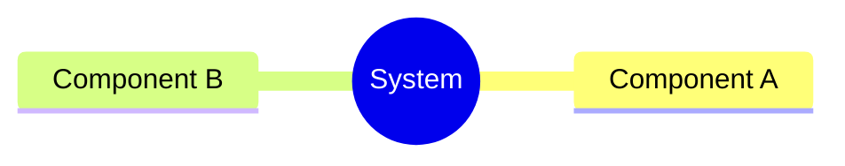
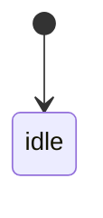
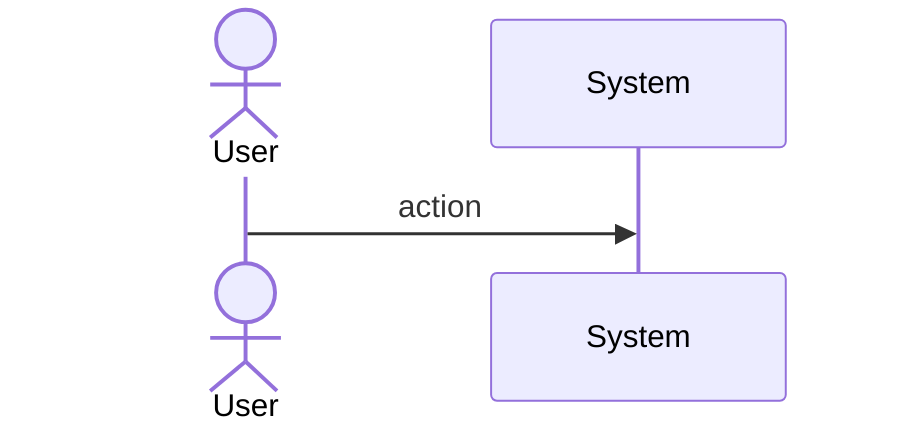
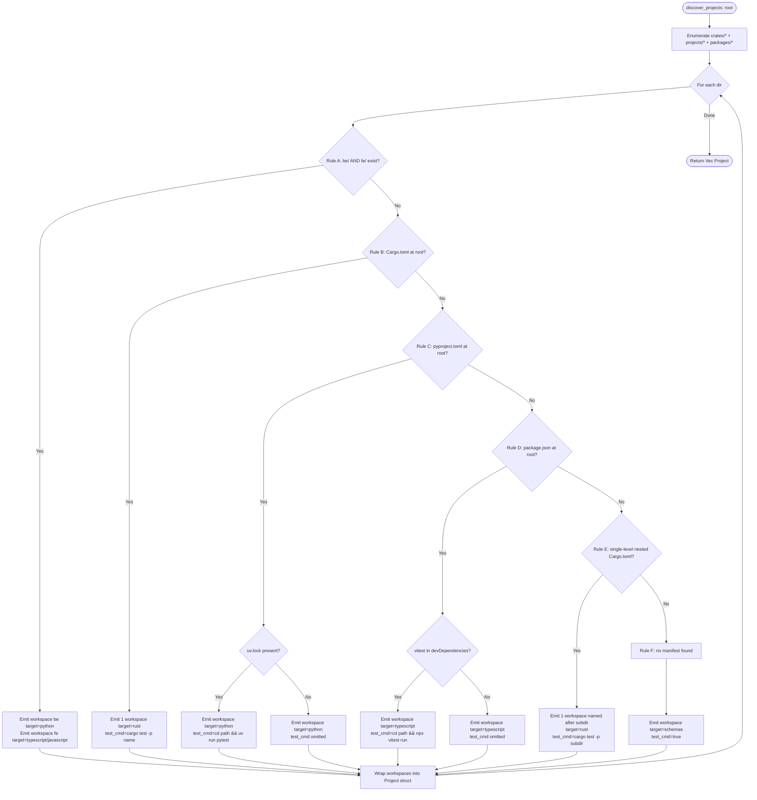
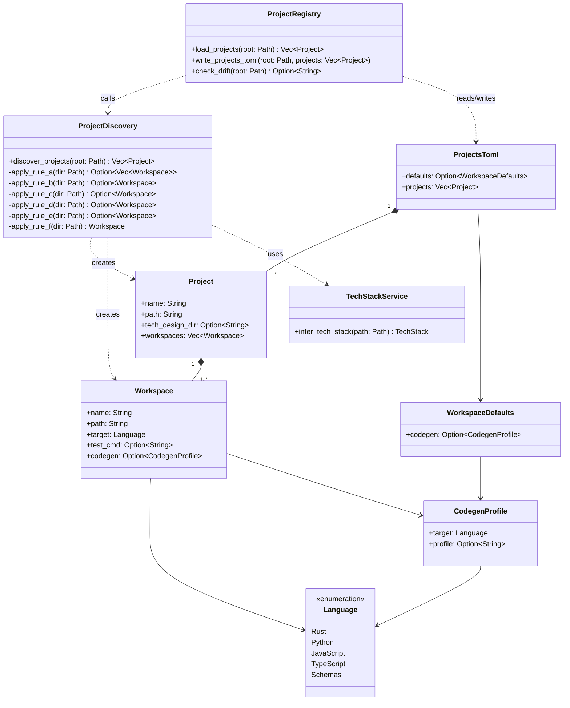
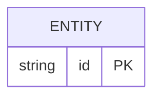

# Enhancement Score Sync Auto Discovered Project Workspace Regis Spec

## Overview
<!-- type: overview lang: markdown -->

Adds `score sync` — a non-interactive CLI command that auto-discovers the project→workspace hierarchy under `crates/`, `projects/`, and `packages/`, writes a structured registry to `.score/projects.toml`, and merges sparse manual overrides from `.score/config.toml`.

| Aspect | Detail |
|--------|--------|
| Command | `score sync [--dry-run] [--check]` |
| Output file | `.score/projects.toml` (auto-generated, header-commented) |
| Discovery roots | `crates/*`, `projects/*`, `packages/*` |
| Override source | `.score/config.toml` sparse `[[projects]]` entries |
| Tech-stack reuse | `infer_tech_stack` + `Language` enum from `crates/sdd` |
| Merge semantics | config fields win per-field; absent fields fall to `[defaults.workspace]` |
| CI support | `--check` exits 1 when diff is non-empty |
## Requirements

```mermaid
---
id: requirements
---
requirementDiagram

requirement R1 {
  id: R1
  text: "score sync auto-discovers all project-level dirs under crates/, projects/, packages/ and writes .score/projects.toml"
  risk: high
  verifymethod: test
}

requirement R2 {
  id: R2
  text: "Discovery applies six ordered rules A-F per directory to infer workspaces; Rule A has priority over B-D at same level"
  risk: high
  verifymethod: test
}

requirement R3 {
  id: R3
  text: "Each workspace has inferred test_cmd: Rust=cargo test -p <name>; Python=uv run pytest (uv.lock required); TS=npx vitest run (vitest in devDeps); schemas=true"
  risk: high
  verifymethod: test
}

requirement R4 {
  id: R4
  text: "Project with be/ and fe/ subdirectories produces exactly two workspaces with independent target and test_cmd, sharing one parent project entry"
  risk: high
  verifymethod: test
}

requirement R5 {
  id: R5
  text: "projects.toml carries a machine-generated header comment warning against hand-edits and records a Last sync: RFC 3339 timestamp"
  risk: high
  verifymethod: inspection
}

requirement R6 {
  id: R6
  text: "Sparse [[projects]] entries in config.toml are merged over auto-generated entries: config fields win per-field; absent fields fall to defaults.workspace; config-only entries are appended"
  risk: high
  verifymethod: test
}

requirement R7 {
  id: R7
  text: "--dry-run prints a unified diff without writing; --check exits 1 when diff is non-empty"
  risk: high
  verifymethod: test
}

requirement R8 {
  id: R8
  text: "Default run (no flags) is non-interactive: new dirs appended, removed dirs deleted, existing manual-addition fields preserved"
  risk: high
  verifymethod: test
}

requirement R9 {
  id: R9
  text: "sdd crate exposes Project, Workspace, CodegenProfile, WorkspaceDefaults structs with serde derives as canonical data model"
  risk: medium
  verifymethod: inspection
}

requirement R10 {
  id: R10
  text: "Implementation reuses infer_tech_stack for manifest detection and Language enum for codegen.target values"
  risk: medium
  verifymethod: inspection
}

requirement R11 {
  id: R11
  text: "Unit tests cover each rule A-F with tempfile::TempDir fixtures, merge semantics (4 cases), and drift detection round-trip"
  risk: medium
  verifymethod: test
}

requirement R12 {
  id: R12
  text: "Scope limited to schema, discovery logic, and score sync command — no migration of [[sdd.test.scope]] consumers, no codegen generator changes, no cross-workspace drift detection"
  risk: high
  verifymethod: inspection
}
```

<!-- type: requirements lang: mermaid -->


## Scenarios
<!-- type: scenarios lang: markdown -->

```yaml
- id: S1
  given: Monorepo with crates/sdd (Cargo.toml), projects/conductor/be (pyproject.toml + uv.lock), projects/conductor/fe (package.json + vitest in devDeps), packages/cclab-ui (package.json, no vitest)
  when: score sync (no flags)
  then: projects.toml written with 4 workspaces — sdd(rust), conductor-be(python,uv run pytest), conductor-fe(typescript,npx vitest run), cclab-ui(typescript,test_cmd omitted); RFC 3339 Last sync timestamp present

- id: S2
  given: projects.toml already exists with a manual-only entry for a crate not found in discovery
  when: score sync
  then: auto-discovered entries appended/updated; manual-only entry preserved; no entries removed unless their directory is also gone

- id: S3
  given: config.toml contains sparse [[projects]] entry for crates/sdd with codegen.profile overriding auto-inferred value
  when: score sync
  then: merged projects list uses auto-discovered base for sdd but config-supplied codegen.profile field wins; other fields fall to defaults.workspace

- id: S4
  given: projects.toml is up-to-date with current filesystem
  when: score sync --dry-run
  then: empty diff printed; file not modified; exit 0

- id: S5
  given: One new crate directory added since last sync
  when: score sync --check
  then: unified diff printed to stdout showing the new project entry; process exits 1

- id: S6
  given: Directory projects/schemas (no manifest of any kind)
  when: score sync
  then: workspace produced with target=schemas and test_cmd=true per rule F

- id: S7
  given: projects/score directory with single-level nested Cargo.toml at projects/score/cli/Cargo.toml
  when: score sync
  then: workspace produced for the nested crate named cli with target=rust per rule E
```
## Mindmap
<!-- type: mindmap lang: mermaid -->
<!-- TODO: Use Mermaid Plus mindmap (YAML frontmatter inside mermaid block).

-->

## State Machine
<!-- type: state-machine lang: mermaid -->
<!-- TODO: Use Mermaid Plus stateDiagram-v2 (YAML frontmatter inside mermaid block).

-->

## Interaction
<!-- type: interaction lang: mermaid -->
<!-- TODO: Use Mermaid Plus sequenceDiagram (YAML frontmatter inside mermaid block).

-->

## Logic
<!-- type: logic lang: mermaid -->


## Dependencies
<!-- type: dependency lang: mermaid -->


## Data Model
<!-- type: db-model lang: mermaid -->
<!-- TODO: Use Mermaid Plus erDiagram (YAML frontmatter inside mermaid block).

-->

## RPC API
<!-- type: rpc-api lang: yaml -->
<!-- TODO: OpenRPC 1.3 as YAML. Example:
```yaml
openrpc: "1.3.2"
info:
  title: Service Name
  version: "1.0.0"
methods: []
```
-->

## CLI
<!-- type: cli lang: yaml -->

```yaml
command: score sync
description: Auto-discover project/workspace hierarchy and write .score/projects.toml
args: []
flags:
  - name: dry-run
    short: ~
    type: bool
    default: false
    description: Print unified diff of what would change without writing the file
  - name: check
    short: ~
    type: bool
    default: false
    description: Like --dry-run but exits with code 1 when the diff is non-empty; suitable for CI
examples:
  - cmd: score sync
    description: Discover all projects and write .score/projects.toml
  - cmd: score sync --dry-run
    description: Preview changes without writing
  - cmd: score sync --check
    description: CI guard — fail if projects.toml is out of date
exit_codes:
  - code: 0
    condition: Success or --dry-run with no diff
  - code: 1
    condition: --check with non-empty diff, or any I/O or parse error
struct: |
  // projects/score/cli/src/sync.rs
  #[derive(Parser, Debug)]
  pub struct SyncArgs {
      #[arg(long)]
      pub dry_run: bool,
      #[arg(long)]
      pub check: bool,
  }
```
## Schema
<!-- type: schema lang: yaml -->

```yaml
"$schema": "https://json-schema.org/draft/2020-12/schema"
"$id": "projects-toml"
title: ProjectsToml
description: Schema for .score/projects.toml — auto-generated project/workspace registry
type: object
properties:
  defaults:
    type: object
    title: Defaults
    properties:
      workspace:
        "$ref": "#/$defs/WorkspaceDefaults"
  projects:
    type: array
    items:
      "$ref": "#/$defs/Project"
required: [projects]
"$defs":
  WorkspaceDefaults:
    type: object
    title: WorkspaceDefaults
    description: Fallback values applied when a workspace field is absent in both auto-discovery and config.toml overrides
    properties:
      codegen:
        "$ref": "#/$defs/CodegenProfile"
    additionalProperties: false

  CodegenProfile:
    type: object
    title: CodegenProfile
    properties:
      target:
        type: string
        enum: [rust, python, javascript, typescript, schemas]
        description: Maps to Language enum values in crates/sdd/src/models/tech_stack.rs
      profile:
        type: string
        description: Named generation profile (e.g. axum-service, react-component)
    required: [target]
    additionalProperties: false

  Workspace:
    type: object
    title: Workspace
    properties:
      name:
        type: string
        description: Short identifier (e.g. be, fe, cli, or same as project name for single-workspace projects)
      path:
        type: string
        description: Path relative to repo root (e.g. projects/conductor/be)
      target:
        type: string
        enum: [rust, python, javascript, typescript, schemas]
        description: Language/runtime target inferred from manifest files
      test_cmd:
        type: string
        description: Shell command to run the workspace test suite; omitted when tool not present
      codegen:
        "$ref": "#/$defs/CodegenProfile"
    required: [name, path, target]
    additionalProperties: false

  Project:
    type: object
    title: Project
    properties:
      name:
        type: string
        description: Project identifier derived from directory name
      path:
        type: string
        description: Path relative to repo root (e.g. crates/sdd, projects/conductor)
      tech_design_dir:
        type: string
        description: Override for .score/tech_design sub-path; defaults to crates/<name> or projects/<name>
      workspaces:
        type: array
        items:
          "$ref": "#/$defs/Workspace"
        minItems: 1
    required: [name, path, workspaces]
    additionalProperties: false
```
## Config
<!-- type: config lang: yaml -->

Two-file layering: `.score/projects.toml` holds auto-generated entries; `.score/config.toml` holds sparse manual overrides. At load time `load_projects()` merges them: config-supplied fields win per-field; missing fields fall to `[defaults.workspace]`.

```yaml
# .score/projects.toml  (AUTO-GENERATED — do not hand-edit)
# Last sync: 2026-04-21T03:30:00Z

[defaults.workspace]
  codegen.target = "rust"

[[projects]]
name = "sdd"
path = "crates/sdd"
  [[projects.workspaces]]
  name = "sdd"
  path = "crates/sdd"
  target = "rust"
  test_cmd = "cargo test -p sdd"

[[projects]]
name = "conductor"
path = "projects/conductor"
  [[projects.workspaces]]
  name = "be"
  path = "projects/conductor/be"
  target = "python"
  test_cmd = "cd projects/conductor/be && uv run pytest"

  [[projects.workspaces]]
  name = "fe"
  path = "projects/conductor/fe"
  target = "typescript"
  test_cmd = "cd projects/conductor/fe && npx vitest run"
```

```yaml
# .score/config.toml  (manual sparse overrides — safe to edit)

[[projects]]
name = "conductor"
path = "projects/conductor"
  [[projects.workspaces]]
  name = "be"
  codegen.profile = "fastapi-service"   # overrides auto-discovered value
  # all other fields fall through from projects.toml + defaults.workspace

# config-only entry (not present in auto-discovery) — appended to merged list
[[projects]]
name = "shared-proto"
path = "shared/proto"
  [[projects.workspaces]]
  name = "shared-proto"
  path = "shared/proto"
  target = "schemas"
  test_cmd = "true"
```

Merge algorithm (applied in `load_projects`):
1. Compute auto-discovered `Vec<Project>` via `discover_projects`.
2. Parse sparse `[[projects]]` from `config.toml`.
3. For each config entry: if `name` matches an auto entry → merge fields per-field (config wins); else → append as-is.
4. For each workspace field absent in both auto and config → fill from `[defaults.workspace]`.
## Test Plan

```mermaid
---
id: test-plan
---
requirementDiagram

requirement R1 {
  id: R1
  text: "score sync writes .score/projects.toml from crates/+projects/+packages/ discovery"
  risk: high
  verifymethod: test
}

requirement R2 {
  id: R2
  text: "Rules A-F applied in priority order"
  risk: high
  verifymethod: test
}

requirement R3 {
  id: R3
  text: "test_cmd inferred per target with presence check"
  risk: high
  verifymethod: test
}

requirement R4 {
  id: R4
  text: "be/+fe/ produces exactly 2 workspaces under 1 project"
  risk: high
  verifymethod: test
}

requirement R5 {
  id: R5
  text: "projects.toml has header comment and RFC 3339 Last sync timestamp"
  risk: high
  verifymethod: inspection
}

requirement R6 {
  id: R6
  text: "config.toml sparse entries merged with field-level priority"
  risk: high
  verifymethod: test
}

requirement R7 {
  id: R7
  text: "--dry-run no write; --check exits 1 on non-empty diff"
  risk: high
  verifymethod: test
}

requirement R8 {
  id: R8
  text: "Non-interactive default: append/delete/preserve semantics"
  risk: high
  verifymethod: test
}

requirement R9 {
  id: R9
  text: "Serde derives on all data model structs"
  risk: medium
  verifymethod: inspection
}

requirement R10 {
  id: R10
  text: "infer_tech_stack + Language enum reused"
  risk: medium
  verifymethod: inspection
}

requirement R11 {
  id: R11
  text: "Unit tests for rules A-F, 4 merge cases, drift round-trip"
  risk: medium
  verifymethod: test
}

requirement R12 {
  id: R12
  text: "No migration of sdd.test.scope, no codegen changes, no cross-workspace drift"
  risk: high
  verifymethod: inspection
}

element T1 {
  type: "Test"
  docref: "project_discovery.rs::tests::rule_a_be_fe"
}

element T2 {
  type: "Test"
  docref: "project_discovery.rs::tests::rule_b_cargo"
}

element T3 {
  type: "Test"
  docref: "project_discovery.rs::tests::rule_c_pyproject_with_uv_lock"
}

element T4 {
  type: "Test"
  docref: "project_discovery.rs::tests::rule_c_pyproject_no_uv_lock"
}

element T5 {
  type: "Test"
  docref: "project_discovery.rs::tests::rule_d_package_json_with_vitest"
}

element T6 {
  type: "Test"
  docref: "project_discovery.rs::tests::rule_d_package_json_no_vitest"
}

element T7 {
  type: "Test"
  docref: "project_discovery.rs::tests::rule_e_nested_cargo"
}

element T8 {
  type: "Test"
  docref: "project_discovery.rs::tests::rule_f_no_manifest"
}

element T9 {
  type: "Test"
  docref: "project_registry.rs::tests::merge_auto_only"
}

element T10 {
  type: "Test"
  docref: "project_registry.rs::tests::merge_manual_only"
}

element T11 {
  type: "Test"
  docref: "project_registry.rs::tests::merge_both_with_override"
}

element T12 {
  type: "Test"
  docref: "project_registry.rs::tests::merge_manual_not_in_auto"
}

element T13 {
  type: "Test"
  docref: "project_registry.rs::tests::check_drift_round_trip"
}

element T14 {
  type: "Test"
  docref: "project_registry.rs::tests::dry_run_no_write"
}

element T15 {
  type: "Test"
  docref: "project_registry.rs::tests::check_exits_nonzero_on_diff"
}

element T16 {
  type: "Test"
  docref: "project_registry.rs::tests::header_comment_and_timestamp"
}

T1 - verifies -> R2
T1 - verifies -> R4
T2 - verifies -> R2
T3 - verifies -> R3
T4 - verifies -> R3
T5 - verifies -> R3
T6 - verifies -> R3
T7 - verifies -> R2
T8 - verifies -> R2
T9 - verifies -> R6
T9 - verifies -> R8
T10 - verifies -> R6
T11 - verifies -> R6
T12 - verifies -> R6
T13 - verifies -> R7
T13 - verifies -> R8
T14 - verifies -> R7
T15 - verifies -> R7
T16 - verifies -> R5
```

<!-- type: test-plan lang: markdown -->


## Changes
<!-- type: changes lang: yaml -->

```yaml
new_files:
  - path: crates/sdd/src/models/project.rs
    description: Project, Workspace, CodegenProfile, WorkspaceDefaults structs with serde derives; canonical data model for projects.toml

  - path: crates/sdd/src/services/project_discovery.rs
    description: discover_projects(root) -> Vec<Project> implementing discovery rules A-F in priority order; inline #[cfg(test)] unit tests for each rule

  - path: crates/sdd/src/services/project_registry.rs
    description: load_projects(root), write_projects_toml(root, projects), check_drift(root) -> Option<String>; inline #[cfg(test)] unit tests for merge semantics and drift round-trip

  - path: projects/score/cli/src/sync.rs
    description: SyncArgs clap struct (--dry-run, --check) and run(args) -> Result<()> delegating to sdd services

modified_files:
  - path: projects/score/cli/src/commands.rs
    change: Add Commands::Sync(SyncArgs) variant to the Commands enum

  - path: projects/score/cli/src/lib.rs
    change: Add dispatch arm Commands::Sync(args) => sync::run(args) in run_command()

  - path: crates/sdd/src/models/mod.rs
    change: Add pub mod project; re-export

  - path: crates/sdd/src/services/mod.rs
    change: Add pub mod project_discovery; pub mod project_registry; re-exports

  - path: crates/sdd/src/shared/workspace.rs
    change: Add pub const PROJECTS_FILE: &str = "projects.toml"; alongside WORKSPACE_DIR and CONFIG_FILE

unchanged_reused:
  - path: crates/sdd/src/services/tech_stack_service.rs
    note: infer_tech_stack consumed as-is; no modifications required

  - path: crates/sdd/src/models/tech_stack.rs
    note: Language enum consumed as-is; no modifications required

  - path: crates/sdd/src/shared/workspace.rs
    note: WORKSPACE_DIR and CONFIG_FILE constants reused by project_registry for path resolution
```

# Reviews

## Review: reviewer (Iteration 1)

**Change ID**: enhancement-score-sync-auto-discovered-project-workspace-regis

**Verdict**: APPROVED

### Summary

Spec is implementation-ready. All R1-R12 from the issue are captured in the Requirements requirementDiagram with matching IDs, risk, and verifymethod. Logic flowchart encodes discovery rules A-F with correct precedence (A over B-D). Scenarios S1-S7 cover multi-language (conductor be/fe), manual-only preservation, config override, --dry-run no-op, --check non-zero exit, schemas fallback, and nested Rust (projects/score/cli). Schema defines Project, Workspace, CodegenProfile, WorkspaceDefaults as JSON Schema 2020-12 with required fields and Language enum. CLI correctly defines `score sync [--dry-run] [--check]` with exit codes. Changes enumerate the 4 new files (project.rs, project_discovery.rs, project_registry.rs, sync.rs) and 5 modified files (commands.rs, lib.rs, models/mod.rs, services/mod.rs, shared/workspace.rs) matching the approved plan exactly. Test Plan has T1-T16 with verifies relations covering R1-R12. Formal notation dominates; natural language well under 10%. English only throughout. No rest-api / async-api / wireframe sections required for a local CLI feature.

### Issues

No issues found.
