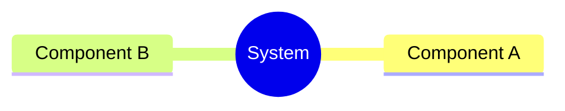
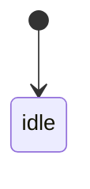
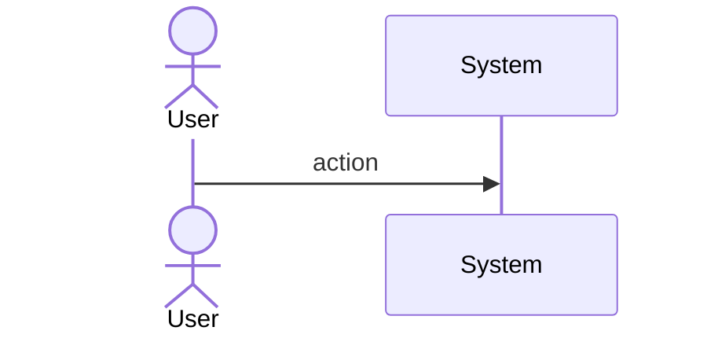
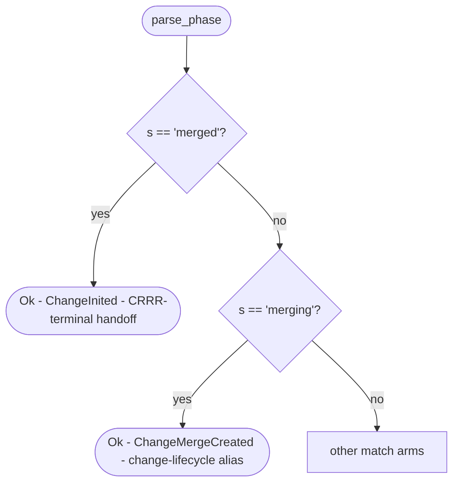
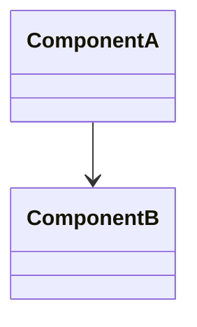
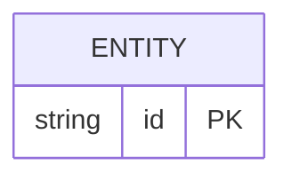

# Bug Init Change Phase Mapping Conflates Crrr Terminal Spec

## Overview
<!-- type: overview lang: markdown -->

Fixes a phase-mapping ambiguity in `parse_phase` (`crates/sdd/src/tools/phase_transition.rs`): the legacy alias `"merged"` is the CRRR-terminal state written by `score issues merge` (`Lifecycle-Stage: Merge`, `state: open`, `phase: merged`), but the combined match arm `"merging" | "merged" => Ok(StatePhase::ChangeMergeCreated)` resolves it to the change-lifecycle phase `ChangeMergeCreated`. When `score workflow init-change` reads an issue with `phase: merged` it therefore skips `ChangeInited` and all intermediate change-lifecycle phases, injecting the issue directly into the late-stage merge flow.

Fix: split the arm so `"merged"` maps to `ChangeInited` (CRRR-terminal → change-lifecycle-initial handoff) and `"merging"` continues to map to `ChangeMergeCreated` (legitimate legacy alias for an in-flight merge). No existing issue frontmatter changes are required — backward compatibility is preserved.

Spec update target: add an explicit CRRR-terminal → change-lifecycle-initial transition rule to `.score/tech_design/projects/score/specs/issue-crrr-state-machine.md` (R4).

Self-bootstrap note: this issue itself was bootstrapped via a one-shot manual phase reset (`phase: merged` → `change_inited`) committed as `82d76ccc` with `Lifecycle-Stage: Reset`, because the very bug being fixed prevented `init-change` from reading the issue's CRRR-terminal phase correctly. That precedent is documented in the Bootstrap/Rollout section of the Changes block.
## Requirements
<!-- type: requirements lang: mermaid -->

```mermaid
---
id: phase-mapping-requirements
---
requirementDiagram

requirement R1 {
  id: R1
  text: "parse_phase(\"merged\") MUST return StatePhase::ChangeInited. The CRRR-terminal alias \"merged\" is the initial phase for a new change-lifecycle, not a late-stage merge alias."
  risk: high
  verifymethod: test
}

requirement R2 {
  id: R2
  text: "parse_phase(\"merging\") MUST continue to return StatePhase::ChangeMergeCreated. The two arms must be split: \"merging\" and \"merged\" are no longer a combined match arm."
  risk: high
  verifymethod: test
}

requirement R3 {
  id: R3
  text: "A regression unit test in the phase_transition module MUST assert parse_phase(\"merged\") == Ok(StatePhase::ChangeInited), with an inline comment documenting the CRRR-terminal handoff semantics."
  risk: high
  verifymethod: test
}

requirement R4 {
  id: R4
  text: "issue-crrr-state-machine.md MUST add an explicit CRRR-terminal to change-lifecycle-initial transition rule: when init-change reads phase: merged from issue frontmatter, it maps to ChangeInited (not ChangeMergeCreated)."
  risk: medium
  verifymethod: inspection
}

requirement R5 {
  id: R5
  text: "Issues with phase: merged in frontmatter MUST remain parseable after the fix with no manual intervention. The string \"merged\" is still a valid parse_phase input — only the output StatePhase changes."
  risk: medium
  verifymethod: test
}

requirement R6 {
  id: R6
  text: "An audit of other legacy alias arms in parse_phase for the same class of dual-meaning conflation MUST be performed. Findings MUST be documented in spec Changes comments. Unrelated aliases MUST NOT be fixed in this change."
  risk: low
  verifymethod: inspection
}

R1 - refines -> R2
R3 - traces -> R1
R3 - traces -> R2
R5 - traces -> R1
R6 - traces -> R1
```
## Scenarios
<!-- type: scenarios lang: markdown -->

```yaml
- id: S1
  given: issue frontmatter has phase: merged (CRRR-terminal, set by score issues merge)
  when: parse_phase("merged") is called
  then: returns Ok(StatePhase::ChangeInited)

- id: S2
  given: issue frontmatter has a legacy change-lifecycle alias phase: merging
  when: parse_phase("merging") is called
  then: returns Ok(StatePhase::ChangeMergeCreated)

- id: S3
  given: score workflow init-change is invoked for an issue with phase: merged
  when: StateManager reads the issue phase and routes the change lifecycle
  then: change starts at ChangeInited, traverses all intermediate phases normally (change_spec_created, change_implementation_created, etc.)

- id: S4
  given: an issue stuck at phase: merged due to the pre-fix bug
  when: the fix lands (no manual frontmatter edit needed)
  then: next init-change invocation succeeds, reading phase: merged as ChangeInited

- id: S5
  given: parse_phase regression test suite
  when: the test for "merged" is executed
  then: asserts Ok(StatePhase::ChangeInited) and the inline comment documents CRRR-terminal handoff semantics

- id: S6
  given: the CRRR state machine spec (issue-crrr-state-machine.md) after the update
  when: the Lifecycle-Stage Trailers table is inspected
  then: the Merge row documents that phase: merged at the CRRR level maps to ChangeInited when init-change is invoked
```
## Mindmap
<!-- type: mindmap lang: mermaid -->
<!-- TODO: Use Mermaid Plus mindmap (YAML frontmatter inside mermaid block).

-->

## State Machine
<!-- type: state-machine lang: mermaid -->
<!-- TODO: Use Mermaid Plus stateDiagram-v2 (YAML frontmatter inside mermaid block).

-->

## Interaction
<!-- type: interaction lang: mermaid -->
<!-- TODO: Use Mermaid Plus sequenceDiagram (YAML frontmatter inside mermaid block).

-->

## Logic
<!-- type: logic lang: mermaid -->


## Dependencies
<!-- type: dependency lang: mermaid -->
<!-- TODO: Use Mermaid Plus classDiagram (YAML frontmatter inside mermaid block).

-->

## Data Model
<!-- type: db-model lang: mermaid -->
<!-- TODO: Use Mermaid Plus erDiagram (YAML frontmatter inside mermaid block).

-->

## RPC API
<!-- type: rpc-api lang: yaml -->
<!-- TODO: OpenRPC 1.3 as YAML. Example:
```yaml
openrpc: "1.3.2"
info:
  title: Service Name
  version: "1.0.0"
methods: []
```
-->

## Schema
<!-- type: schema lang: yaml -->
<!-- TODO: JSON Schema as YAML. Example:
```yaml
"$schema": "https://json-schema.org/draft/2020-12/schema"
type: object
properties:
  id:
    type: string
required: [id]
```
-->

## Test Plan
<!-- type: test-plan lang: markdown -->

```mermaid
---
id: phase-mapping-test-plan
---
requirementDiagram

requirement R1 {
  id: R1
  text: "parse_phase(\"merged\") returns Ok(StatePhase::ChangeInited)"
  risk: high
  verifymethod: test
}

requirement R2 {
  id: R2
  text: "parse_phase(\"merging\") still returns Ok(StatePhase::ChangeMergeCreated) after split"
  risk: high
  verifymethod: test
}

requirement R3 {
  id: R3
  text: "Unit test includes inline comment documenting CRRR-terminal handoff semantics"
  risk: high
  verifymethod: inspection
}

requirement R4 {
  id: R4
  text: "issue-crrr-state-machine.md Lifecycle-Stage Trailers row for Merge documents ChangeInited handoff"
  risk: medium
  verifymethod: inspection
}

requirement R5 {
  id: R5
  text: "score workflow init-change on issue with phase: merged transitions to change_inited and populates .score/changes/<slug>/"
  risk: high
  verifymethod: test
}

requirement R6 {
  id: R6
  text: "Alias audit findings recorded in Changes section comments; no unrelated aliases modified"
  risk: low
  verifymethod: inspection
}

element T1 {
  type: "test"
  docref: "phase_transition.rs::tests::merged_maps_to_change_inited"
}

element T2 {
  type: "test"
  docref: "phase_transition.rs::tests::merging_maps_to_change_merge_created"
}

element T3 {
  type: "test"
  docref: "phase_transition.rs::tests::merged_is_ok_not_err"
}

element T4 {
  type: "test"
  docref: "integration: score workflow init-change on CRRR-merged issue produces change_inited frontmatter"
}

element T5 {
  type: "inspection"
  docref: "issue-crrr-state-machine.md Lifecycle-Stage Trailers table"
}

element T6 {
  type: "inspection"
  docref: "Changes section alias audit comment in this spec"
}

T1 - verifies -> R1
T1 - verifies -> R3
T2 - verifies -> R2
T3 - verifies -> R1
T4 - verifies -> R5
T5 - verifies -> R4
T6 - verifies -> R6
```
## Changes
<!-- type: changes lang: yaml -->

```yaml
# Alias audit (R6): other legacy aliases in parse_phase reviewed for the same
# dual-meaning conflation as "merged".
#   - "archived"   => ChangeArchived  : change-lifecycle alias only; CRRR writes "change_archived". No conflict.
#   - "rejected"   => ChangeRejected  : change-lifecycle alias only; CRRR writes "change_rejected". No conflict.
#   - "impl_approved" => ChangeMergeCreated: removed phase alias; no CRRR semantic. No conflict.
# No other alias exhibits the CRRR-terminal / change-lifecycle dual-meaning pattern.
# None of the above are modified in this change.
changes:
  - path: crates/sdd/src/tools/phase_transition.rs
    action: MODIFY
    description: split "merging" | "merged" arm so "merged" maps to ChangeInited (CRRR-terminal handoff) and "merging" stays on ChangeMergeCreated
    targets:
      - type: function
        name: parse_phase
        change: replace combined arm `"merging" | "merged" => Ok(StatePhase::ChangeMergeCreated)` with two separate arms; "merged" => Ok(StatePhase::ChangeInited) with inline comment documenting CRRR-terminal handoff semantics (satisfies R1, R2, R5)
    do_not_touch: [phase_to_string, phase_order, validate_transition]

  - path: crates/sdd/src/tools/phase_transition.rs
    action: MODIFY
    description: add unit tests T1, T2, T3 asserting correct parse_phase behavior post-split
    targets:
      - type: impl
        name: tests
        change: add tests merged_maps_to_change_inited (T1), merging_maps_to_change_merge_created (T2), merged_is_ok_not_err (T3); T1 includes inline comment explaining CRRR-terminal handoff (satisfies R3)

  - path: .score/tech_design/projects/score/specs/issue-crrr-state-machine.md
    action: MODIFY
    description: document CRRR-terminal to change-lifecycle-initial transition rule (R4)
    targets:
      - type: function
        name: Lifecycle-Stage Trailers table (Merge row)
        change: add note that phase:merged written at CRRR-terminal maps to ChangeInited (not ChangeMergeCreated) when score workflow init-change reads issue frontmatter
```

# Reviews

## Review: reviewer (Iteration 1)

**Change ID**: bug-init-change-phase-mapping-conflates-crrr-terminal

**Verdict**: APPROVED

### Summary

Spec is implementation-ready. Overview explains the CRRR-terminal vs change-lifecycle alias conflation clearly and documents the self-bootstrap precedent (commit 82d76ccc, Lifecycle-Stage: Reset). Requirements R1-R6 are testable, each priority-tagged, with a coherent trace graph. Scenarios S1-S6 cover happy path + backward-compat + bootstrap recovery. Logic flowchart captures the two-arm split precisely. Test-plan requirementDiagram binds every requirement to a concrete test element (T1-T6). Changes block lists the three affected targets (parse_phase match arm, tests module, issue-crrr-state-machine.md Lifecycle-Stage Trailers row) with do_not_touch guards for adjacent functions (phase_to_string, phase_order, validate_transition). Alias audit (R6) documented inline with negative findings for 'archived', 'rejected', 'impl_approved' — no other dual-meaning aliases exist. Scope is tight: no enum redesign, no frontmatter renaming.

### Issues

No issues found.
