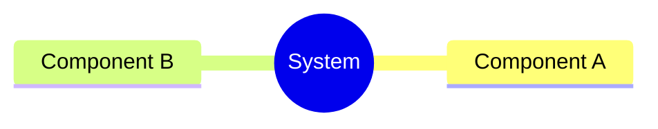
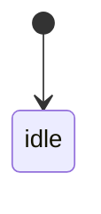
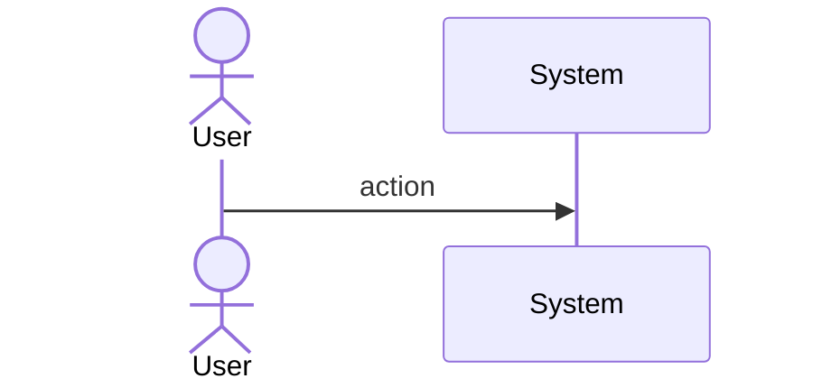
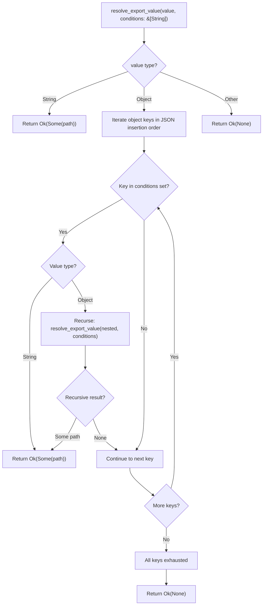
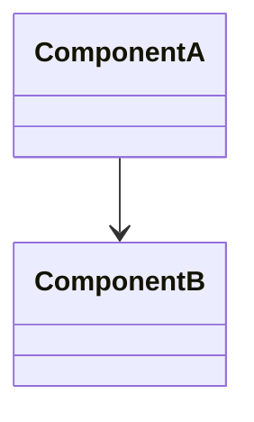
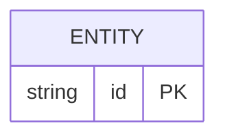

# Enhancement Resolver Conditional Exports Import Require Browse Spec

## Overview
<!-- type: overview lang: markdown -->

`resolve_export_value()` in `crates/cclab-jet/src/resolver/package.rs` iterated a hardcoded condition list without accepting a caller-supplied condition set, and without recursing into nested condition objects. This caused packages like React 18, Vue 3, and `node-fetch` to resolve to the wrong file — typically the CJS build when an ESM build should be preferred.

Fix: thread a `ConditionSet` (via `conditions: Vec<String>` on `ResolveOptions`) through `resolve_exports` → `resolve_export_value`, defaulting to `[import, browser, default]` in dev mode and configurable via `jet.config.toml` `[resolve] conditions` for build mode. Recursive descent handles nested condition objects (e.g. `{ "node": { "import": "./node.mjs", "require": "./node.cjs" } }`). Returns `Ok(None)` when no condition matches.
## Requirements

```mermaid
---
id: requirements
---
requirementDiagram

requirement R1 {
  id: R1
  text: "resolve_exports and resolve_export_value accept a conditions slice; standard conditions: import, require, browser, node, default"
  risk: low
  verifymethod: test
}

requirement R2 {
  id: R2
  text: "resolve_export_value recurses into nested condition objects at arbitrary depth per Node.js PACKAGE_EXPORTS_RESOLVE spec"
  risk: medium
  verifymethod: test
}

requirement R3 {
  id: R3
  text: "Object key insertion order in the exports map determines condition precedence; the conditions parameter acts as a membership filter defining which conditions are active"
  risk: medium
  verifymethod: test
}

requirement R4 {
  id: R4
  text: "Dev mode default conditions = import+browser+default; build mode configurable via jet.config.toml resolve.conditions"
  risk: low
  verifymethod: test
}

requirement R5 {
  id: R5
  text: "When no condition matches, return Ok(None) and surface a diagnostic listing conditions tried and package path"
  risk: low
  verifymethod: test
}
```

<!-- type: requirements lang: mermaid -->


## Scenarios
<!-- type: scenarios lang: markdown -->

```yaml
- id: S1
  given: 'package exports { ".": { "import": "./esm.mjs", "require": "./cjs.js", "default": "./index.js" } }'
  when: resolve with conditions [import, default]
  then: returns ./esm.mjs

- id: S2
  given: same package as S1
  when: resolve with conditions [require, default]
  then: returns ./cjs.js

- id: S3
  given: 'package exports { ".": { "import": "./esm.mjs", "require": "./cjs.js" } }'
  when: resolve with conditions [browser, default]
  then: returns Ok(None) — no matching condition

- id: S4
  given: 'package exports nested { ".": { "node": { "import": "./node.mjs", "require": "./node.cjs" }, "browser": "./browser.js" } }'
  when: resolve with conditions [browser, import, default]
  then: returns ./browser.js (browser matched at top level)

- id: S5
  given: same nested package as S4
  when: resolve with conditions [node, import, default]
  then: recurses into node object, returns ./node.mjs

- id: S6
  given: 'package exports { ".": { "node": { "import": "./node.mjs", "require": "./node.cjs" }, "default": "./fallback.js" } }'
  when: resolve with conditions [import, default] (no node)
  then: skips node block, returns ./fallback.js via default

- id: S7
  given: 'package exports string shorthand "./dist/index.js"'
  when: resolve with any conditions
  then: returns ./dist/index.js (no condition evaluation needed)

- id: S8
  given: dev mode resolver with no explicit conditions
  when: resolve React 18 exports
  then: uses default conditions [import, browser, default], selects import entry
```
## Mindmap
<!-- type: mindmap lang: mermaid -->
<!-- TODO: Use Mermaid Plus mindmap (YAML frontmatter inside mermaid block).

-->

## State Machine
<!-- type: state-machine lang: mermaid -->
<!-- TODO: Use Mermaid Plus stateDiagram-v2 (YAML frontmatter inside mermaid block).

-->

## Interaction
<!-- type: interaction lang: mermaid -->
<!-- TODO: Use Mermaid Plus sequenceDiagram (YAML frontmatter inside mermaid block).

-->

## Logic
<!-- type: logic lang: mermaid -->



The algorithm iterates exports object keys in JSON insertion order (preserved by `serde_json::Map`). For each key, checks membership in the caller-supplied `conditions` set. When a key matches and its value is another object, recurses. First matching condition in object-key order wins — this matches the Node.js PACKAGE_EXPORTS_RESOLVE spec. The `conditions` parameter acts as a membership filter (which conditions are active), not a precedence list.
## Dependencies
<!-- type: dependency lang: mermaid -->
<!-- TODO: Use Mermaid Plus classDiagram (YAML frontmatter inside mermaid block).

-->

## Data Model
<!-- type: db-model lang: mermaid -->
<!-- TODO: Use Mermaid Plus erDiagram (YAML frontmatter inside mermaid block).

-->

## RPC API
<!-- type: rpc-api lang: yaml -->
<!-- TODO: OpenRPC 1.3 as YAML. Example:
```yaml
openrpc: "1.3.2"
info:
  title: Service Name
  version: "1.0.0"
methods: []
```
-->

## Schema
<!-- type: schema lang: yaml -->

```yaml
"$schema": "https://json-schema.org/draft/2020-12/schema"
"$id": resolve-options
title: ResolveOptions
description: "Options for the cclab-jet module resolver. conditions field added by this change."
type: object
properties:
  conditions:
    type: array
    items:
      type: string
    description: "Active export conditions used as membership filter when evaluating package.json exports. Object key order in the exports map determines precedence. Standard values: import, require, browser, node, default."
    default: [import, browser, default]
  base_dirs:
    type: array
    items:
      type: string
    description: "Base directories to search for modules."
  extensions:
    type: array
    items:
      type: string
    description: "File extensions to try when resolving."
    default: [js, jsx, ts, tsx, json]
  resolve_index:
    type: boolean
    description: "Whether to resolve index files in directories."
    default: true
  alias:
    type: array
    items:
      type: array
      items:
        type: string
      minItems: 2
      maxItems: 2
    description: "Alias mappings as (prefix, target_path) pairs. E.g., [['@', 'src']]."
  externals:
    type: array
    items:
      type: string
    description: "Module specifiers to treat as external (not bundled)."
  externalize_all_packages:
    type: boolean
    description: "When true, treat all bare package specifiers as external."
    default: false
```
## Config
<!-- type: config lang: yaml -->

```yaml
"$schema": "https://json-schema.org/draft/2020-12/schema"
"$id": jet-config-resolve
title: "jet.config.toml [resolve] section"
description: "Schema for the [resolve] table in jet.config.toml. conditions field added by this change."
type: object
properties:
  conditions:
    type: array
    items:
      type: string
    description: "Active export conditions for build mode. Overrides the dev-mode default [import, browser, default]."
    examples:
      - [import, browser, default]
      - [import, node, default]
      - [require, default]
```

TOML example:
```toml
[resolve]
conditions = ["import", "node", "default"]
```
## Test Plan
<!-- type: test-plan lang: markdown -->

```mermaid
---
id: test-plan
---
requirementDiagram

element T1 {
  type: "Test"
  text: "Given exports {import:esm.mjs,require:cjs.js,default:index.js}; When conditions=[import,default]; Then returns ./esm.mjs"
}

element T2 {
  type: "Test"
  text: "Given exports {import:esm.mjs,require:cjs.js,default:index.js}; When conditions=[require,default]; Then returns ./cjs.js"
}

element T3 {
  type: "Test"
  text: "Given exports {import:esm.mjs,require:cjs.js} (no browser/default); When conditions=[browser,default]; Then returns Ok(None) with diagnostic listing conditions tried and package path"
}

element T4 {
  type: "Test"
  text: "Given nested exports {node:{import:node.mjs,require:node.cjs},browser:browser.js}; When conditions=[browser,import,default]; Then returns ./browser.js without recursing into node"
}

element T5 {
  type: "Test"
  text: "Given nested exports {node:{import:node.mjs,require:node.cjs},browser:browser.js}; When conditions=[node,import,default]; Then recurses into node object and returns ./node.mjs"
}

element T6 {
  type: "Test"
  text: "Given nested exports {node:{import:node.mjs,require:node.cjs},default:fallback.js}; When conditions=[import,default] (no node); Then skips node block, returns ./fallback.js via default"
}

element T7 {
  type: "Test"
  text: "Given exports is plain string './dist/index.js'; When conditions is any non-empty slice; Then returns ./dist/index.js without condition evaluation"
}

element T8 {
  type: "Test"
  text: "Given dev-mode ResolveOptions with no explicit conditions; When resolving a synthetic package.json with exports {import:./esm.mjs,require:./cjs.js,default:./index.js} using tempfile fixture; Then default conditions [import,browser,default] select ./esm.mjs via import key"
}

element T9 {
  type: "Test"
  text: "Given jet.config.toml [resolve] conditions=[import,node,default]; When build-mode resolver resolves a package; Then configured conditions override the dev default"
}

element T10 {
  type: "Test"
  text: "Given exports {import:esm.mjs,require:cjs.js}; When conditions=[require,import] vs [import,require]; Then both return ./esm.mjs because import appears first in object key order, proving object-key-order precedence over conditions order"
}

T1 - verifies -> R1
T2 - verifies -> R1
T3 - verifies -> R5
T4 - verifies -> R2
T4 - verifies -> R3
T5 - verifies -> R2
T5 - verifies -> R3
T6 - verifies -> R2
T6 - verifies -> R3
T7 - verifies -> R1
T8 - verifies -> R4
T9 - verifies -> R4
T10 - verifies -> R3
```
## Changes
<!-- type: changes lang: yaml -->

```yaml
changes:
  - path: crates/cclab-jet/src/resolver/mod.rs
    action: MODIFY
    description: Add conditions field to ResolveOptions, update resolve_package_dir to pass conditions to resolve_exports
    targets:
      - type: struct
        name: ResolveOptions
        change: add `conditions: Vec<String>` field with Default impl producing ["import", "browser", "default"]
      - type: method
        name: resolve_package_dir
        change: update the `package::resolve_exports(exports, subpath)` call to `package::resolve_exports(exports, subpath, &self.options.conditions)`
    do_not_touch: [try_extensions, resolve_relative, resolve_alias, resolve_absolute]

  - path: crates/cclab-jet/src/resolver/package.rs
    action: MODIFY
    description: Make resolve_exports and resolve_export_value accept a conditions slice; implement object-key-order iteration with conditions as membership filter; recurse into nested condition objects
    targets:
      - type: function
        name: resolve_exports
        change: add `conditions: &[String]` parameter, pass to resolve_export_value
      - type: function
        name: resolve_export_value
        change: add `conditions: &[String]` parameter, iterate object keys in insertion order checking membership in conditions set, recurse into nested Value::Object when matched key's value is an object
    do_not_touch: [read_package_json, get_package_main, match_export_pattern]

  - path: crates/cclab-jet/src/resolver/package.rs
    action: MODIFY
    description: Update existing tests and add new tests for conditional exports (T1-T10)
    targets:
      - type: function
        name: test_resolve_exports_conditional
        change: update to pass conditions parameter
      - type: function
        name: test_resolve_exports_string
        change: update to pass conditions parameter
      - type: function
        name: test_resolve_exports_object
        change: update to pass conditions parameter
      - type: function
        name: test_resolve_exports_pattern
        change: update to pass conditions parameter
      - type: function
        name: test_resolve_exports_no_match
        change: "NEW — T3: conditions=[browser,default] against {import,require} returns None"
      - type: function
        name: test_resolve_exports_nested_recurse
        change: "NEW — T5: conditions=[node,import,default] recurses into nested node object"
      - type: function
        name: test_resolve_exports_nested_skip
        change: "NEW — T6: conditions=[import,default] skips node block, hits default"
      - type: function
        name: test_resolve_exports_object_key_order_precedence
        change: "NEW — T10: both [require,import] and [import,require] return import entry (object-key-order wins)"

  - path: crates/cclab-jet/src/task_runner/config.rs
    action: MODIFY
    description: Add resolve config section to JetConfig for build-mode condition overrides
    targets:
      - type: struct
        name: JetConfig
        change: add `resolve: Option<ResolveConfig>` field with serde(default)
      - type: struct
        name: ResolveConfig
        change: "NEW — struct with `conditions: Option<Vec<String>>` for build-mode override"
    do_not_touch: [DevConfig, JetBuildConfig, TaskDef, load_config]

  - path: crates/cclab-jet/src/dev_server/prebundle.rs
    action: SKIP
    description: "prebundle.rs has its own resolve_exports_entry() with hardcoded [import, require, default]. This is intentional — prebundle resolves entry points for pre-bundling, not for general module resolution. The prebundle condition list is a separate concern and should be updated independently if needed."
    do_not_touch: [resolve_exports_entry, resolve_exports_condition, detect_circular_deps]
```

# Reviews

## Review: reviewer (Iteration 1)
<!-- type: review lang: markdown -->

**Change ID**: enhancement-resolver-conditional-exports-import-require-browse

**Verdict**: APPROVED

### Summary

Revision 2 addresses all 8 issues from iteration 1. R3 and logic flowchart now consistently use object-key-order precedence (Node.js PACKAGE_EXPORTS_RESOLVE compliant). Schema uses default instead of required. config.rs added for build-mode ResolveConfig. prebundle.rs marked SKIP with clear rationale. 4 new test functions cover T3/T5/T6/T10. T8 clarified as synthetic fixture. Alias field added to schema. Spec is implementation-ready.

### Issues

No issues found.
