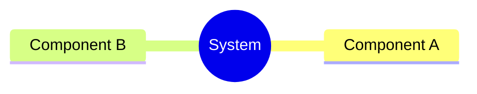
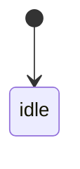
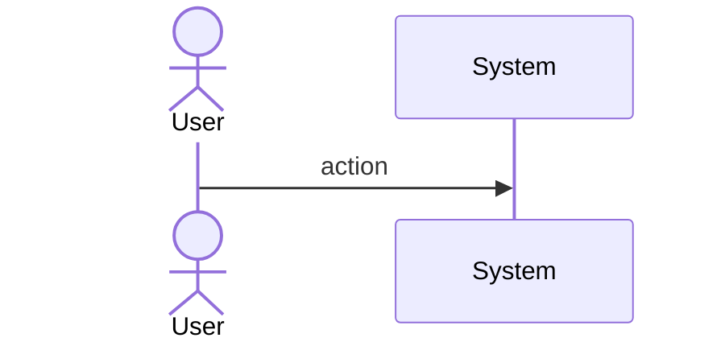
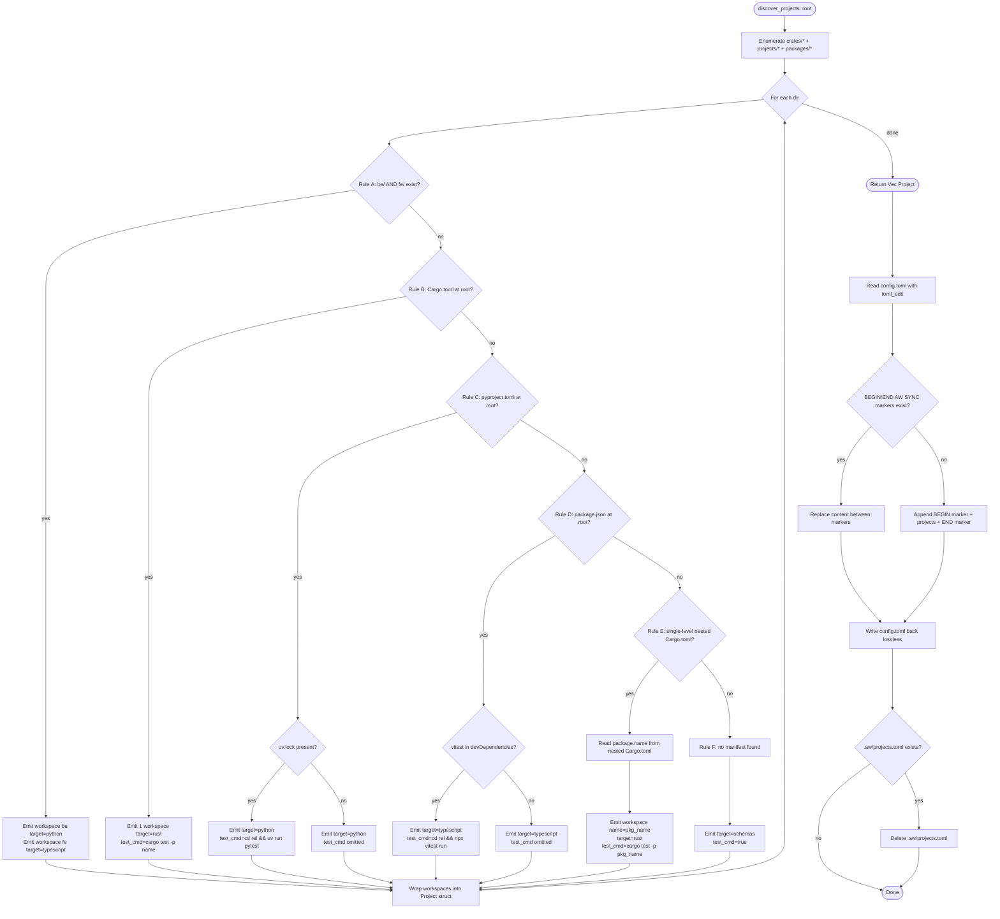
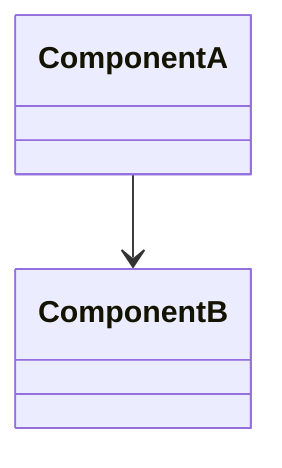
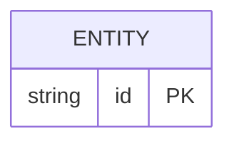

# Enhancement Score Sync Writes Into Score Config Toml Retires P Spec

## Overview
<!-- type: overview lang: markdown -->

Retires `.aw/projects.toml` as a separate write target. `aw sync` now writes a marker-delimited `[[projects]]` block directly inside `.aw/config.toml`, using `toml_edit` for lossless round-trips that preserve all non-generated content.

| Aspect | Before | After |
|--------|--------|-------|
| Write target | `.aw/projects.toml` | `.aw/config.toml` (marker-delimited block) |
| Load path | `projects.toml` overlaid with `config.toml` sparse entries | `config.toml` only (marker block) |
| Round-trip safety | Header comment; serde full rewrite | `toml_edit` lossless; non-generated sections byte-identical |
| Bug: Rule E name | Directory basename (`cli`) | `[package].name` from nested `Cargo.toml` (`score-cli`) |
| Bug: test_cmd paths | May leak absolute paths | Project-relative (`cd projects/conductor/be && ...`) |
| Migration | n/a | One-shot: delete `.aw/projects.toml` on first successful sync |

Two spec updates:
- `projects/agentic-workflow/specs/sync-command.md` — update overview, requirements, logic, config, test-plan, changes
- `projects/agentic-workflow/specs/sync-config-toml-schema.md` — new spec: schema + annotated config example
## Requirements

```mermaid
---
id: requirements
---
requirementDiagram

requirement R1 {
  id: R1
  text: "aw sync writes all discovered projects into .aw/config.toml [[projects]] block, replacing .aw/projects.toml"
  risk: high
  verifymethod: test
}

requirement R2 {
  id: R2
  text: "The auto-generated block is bounded by: # BEGIN AW SYNC — auto-generated, do not edit by hand and # END AW SYNC marker comments"
  risk: high
  verifymethod: inspection
}

requirement R3 {
  id: R3
  text: "Non-[[projects]] content in config.toml (workspaces, defaults.workspace, sdd.*) survives every sync run without modification to comments, order, or formatting"
  risk: high
  verifymethod: test
}

requirement R4 {
  id: R4
  text: "config.toml round-trips use toml_edit (lossless crate) so comments and whitespace in non-generated sections are preserved byte-identical"
  risk: high
  verifymethod: inspection
}

requirement R5 {
  id: R5
  text: "aw sync is idempotent: running twice with no filesystem changes produces a zero diff in config.toml"
  risk: high
  verifymethod: test
}

requirement R6 {
  id: R6
  text: "All ~82 discovered projects are written on each sync (full enumeration, no sparse override list)"
  risk: high
  verifymethod: test
}

requirement R7 {
  id: R7
  text: "test_cmd strings use project-relative paths (e.g. cd projects/conductor/be && uv run pytest), not absolute filesystem paths"
  risk: high
  verifymethod: test
}

requirement R8 {
  id: R8
  text: "Rule E derives the project name from [package].name in the nested Cargo.toml (not directory basename), producing cargo test -p agentic-workflow-cli not cargo test -p cli"
  risk: high
  verifymethod: test
}

requirement R9 {
  id: R9
  text: "Registry consumers read [[projects]] exclusively from config.toml; projects.toml is no longer read"
  risk: high
  verifymethod: test
}

requirement R10 {
  id: R10
  text: "If .aw/projects.toml exists at sync time, it is deleted after a successful write to config.toml"
  risk: medium
  verifymethod: test
}

requirement R11 {
  id: R11
  text: "aw sync --dry-run and aw sync --check continue with identical semantics, now targeting config.toml"
  risk: high
  verifymethod: test
}
```

<!-- type: requirements lang: mermaid -->


## Scenarios
<!-- type: scenarios lang: yaml -->

<!-- TODO: Use YAML GWT structured format. Example:
```yaml
- id: S1
  given: Initial state description
  when: Action or event that triggers the scenario
  then: Expected outcome

- id: S2
  given: Another initial state
  when: Another action
  then: Another expected outcome
  diagram_ref: interaction-S2
```
-->

## Mindmap
<!-- type: mindmap lang: mermaid -->
<!-- TODO: Use Mermaid Plus mindmap (YAML frontmatter inside mermaid block).

-->

## State Machine
<!-- type: state-machine lang: mermaid -->
<!-- TODO: Use Mermaid Plus stateDiagram-v2 (YAML frontmatter inside mermaid block).

-->

## Interaction
<!-- type: interaction lang: mermaid -->
<!-- TODO: Use Mermaid Plus sequenceDiagram (YAML frontmatter inside mermaid block).

-->

## Logic
<!-- type: logic lang: mermaid -->


## Dependencies
<!-- type: dependency lang: mermaid -->
<!-- TODO: Use Mermaid Plus classDiagram (YAML frontmatter inside mermaid block).

-->

## Data Model
<!-- type: db-model lang: mermaid -->
<!-- TODO: Use Mermaid Plus erDiagram (YAML frontmatter inside mermaid block).

-->

## RPC API
<!-- type: rpc-api lang: yaml -->
<!-- TODO: OpenRPC 1.3 as YAML. Example:
```yaml
openrpc: "1.3.2"
info:
  title: Service Name
  version: "1.0.0"
methods: []
```
-->

## Schema
<!-- type: schema lang: yaml -->

JSON Schema for the auto-generated `[[projects]]` block written between BEGIN/END AW SYNC markers in `.aw/config.toml`.

```json
{
  "$schema": "https://json-schema.org/draft/2020-12/schema",
  "$id": "sync-config-toml-projects-block",
  "title": "SyncProjectsBlock",
  "description": "Schema for the [[projects]] array written between BEGIN AW SYNC / END AW SYNC markers in .aw/config.toml. Data model is unchanged from ProjectsToml; only the write target and load path change.",
  "type": "object",
  "properties": {
    "projects": {
      "type": "array",
      "description": "Full enumeration of all discovered projects. No sparse override model — config.toml entries within the marker block are overwritten on each sync.",
      "items": {
        "$ref": "#/$defs/Project"
      },
      "minItems": 0
    }
  },
  "required": ["projects"],
  "$defs": {
    "Project": {
      "type": "object",
      "title": "Project",
      "properties": {
        "name": {
          "type": "string",
          "description": "Project identifier. For Rule E, derived from [package].name in the nested Cargo.toml, not the directory basename."
        },
        "path": {
          "type": "string",
          "description": "Path relative to repo root (e.g. crates/sdd, projects/conductor)."
        },
        "tech_design_dir": {
          "type": "string",
          "description": "Override for .aw/tech-design sub-path. Defaults to crates/<name> or projects/<name>."
        },
        "workspaces": {
          "type": "array",
          "items": {
            "$ref": "#/$defs/Workspace"
          },
          "minItems": 1
        }
      },
      "required": ["name", "path", "workspaces"],
      "additionalProperties": false
    },
    "Workspace": {
      "type": "object",
      "title": "Workspace",
      "properties": {
        "name": {
          "type": "string",
          "description": "Short identifier (e.g. be, fe, cli, or same as project name for single-workspace projects)."
        },
        "path": {
          "type": "string",
          "description": "Path relative to repo root. MUST be a project-relative path — absolute paths are a bug (R7)."
        },
        "target": {
          "type": "string",
          "enum": ["rust", "python", "javascript", "typescript", "schemas"],
          "description": "Language/runtime target inferred from manifest files."
        },
        "test_cmd": {
          "type": "string",
          "description": "Shell command to run the workspace test suite. MUST use project-relative form (e.g. cd projects/conductor/be && uv run pytest). Omitted when the required tool is absent."
        },
        "codegen": {
          "$ref": "#/$defs/CodegenProfile"
        }
      },
      "required": ["name", "path", "target"],
      "additionalProperties": false
    },
    "CodegenProfile": {
      "type": "object",
      "title": "CodegenProfile",
      "properties": {
        "target": {
          "type": "string",
          "enum": ["rust", "python", "javascript", "typescript", "schemas"]
        },
        "profile": {
          "type": "string",
          "description": "Named generation profile (e.g. axum-service, react-component)."
        }
      },
      "required": ["target"],
      "additionalProperties": false
    },
    "SyncMarkers": {
      "type": "object",
      "title": "SyncMarkers",
      "description": "String constants that delimit the auto-generated block. These appear as TOML comments in config.toml.",
      "properties": {
        "begin": {
          "type": "string",
          "const": "# BEGIN AW SYNC — auto-generated, do not edit by hand"
        },
        "end": {
          "type": "string",
          "const": "# END AW SYNC"
        }
      },
      "required": ["begin", "end"]
    }
  }
}
```
## Config
<!-- type: config lang: yaml -->

Annotated example of `.aw/config.toml` after migration. User-authored sections coexist with the auto-generated marker block. `toml_edit` ensures non-generated sections are preserved byte-identical on every sync.

```json
{
  "$schema": "https://json-schema.org/draft/2020-12/schema",
  "$id": "score-config-toml-layout",
  "title": "ScoreConfigTomlLayout",
  "description": "Describes the structural layout of .aw/config.toml after migration. Three namespace zones must not overlap.",
  "type": "object",
  "properties": {
    "zones": {
      "type": "array",
      "description": "Ordered zones in config.toml. Zones are non-overlapping. aw sync only touches zone: sync-block.",
      "items": {
        "oneOf": [
          {
            "type": "object",
            "properties": {
              "zone": { "type": "string", "const": "user-authored" },
              "description": { "type": "string", "const": "sdd.*, defaults.workspace, workspaces tables — user-managed, never touched by aw sync" },
              "example_keys": {
                "type": "array",
                "items": { "type": "string" },
                "examples": [["[agentic_workflow.test.scope]", "[defaults.workspace]", "[[workspaces]]"]]
              }
            },
            "required": ["zone"]
          },
          {
            "type": "object",
            "properties": {
              "zone": { "type": "string", "const": "sync-block" },
              "description": { "type": "string", "const": "Marker-delimited block written by aw sync on every run. Full enumeration, no sparse overrides." },
              "begin_marker": { "type": "string", "const": "# BEGIN AW SYNC — auto-generated, do not edit by hand" },
              "end_marker": { "type": "string", "const": "# END AW SYNC" },
              "content": { "type": "string", "const": "[[projects]] array covering all ~82 discovered projects" }
            },
            "required": ["zone", "begin_marker", "end_marker"]
          }
        ]
      }
    },
    "toml_edit_constraints": {
      "type": "object",
      "description": "Rules governing how toml_edit is used to write config.toml",
      "properties": {
        "read": { "type": "string", "const": "Parse entire config.toml into toml_edit Document" },
        "locate": { "type": "string", "const": "Find BEGIN/END AW SYNC comment pair by scanning raw string; positions are line-based" },
        "replace_strategy": { "type": "string", "const": "If markers found: splice out content between markers (inclusive), splice in new [[projects]] TOML string" },
        "append_strategy": { "type": "string", "const": "If markers absent: append newline + BEGIN marker + [[projects]] TOML + END marker to end of file" },
        "write": { "type": "string", "const": "Serialize toml_edit Document back to file; non-generated sections must be byte-identical to input" }
      }
    },
    "example_file": {
      "type": "string",
      "description": "Representative config.toml layout. Zone order is illustrative — user zones may appear before or after the sync block.",
      "const": "# .aw/config.toml\n\n# --- user-authored agentic_workflow settings ---\n[agentic_workflow.test.scope]\nroots = [\"crates\", \"projects\", \"packages\"]\n\n[defaults.workspace]\ncodegen.target = \"rust\"\n\n# --- auto-generated by aw sync (do not edit manually) ---\n# BEGIN AW SYNC — auto-generated, do not edit by hand\n\n[[projects]]\nname = \"sdd\"\npath = \"crates/sdd\"\n\n  [[projects.workspaces]]\n  name = \"sdd\"\n  path = \"crates/sdd\"\n  target = \"rust\"\n  test_cmd = \"cargo test -p agentic-workflow\"\n\n[[projects]]\nname = \"conductor\"\npath = \"projects/conductor\"\n\n  [[projects.workspaces]]\n  name = \"be\"\n  path = \"projects/conductor/be\"\n  target = \"python\"\n  test_cmd = \"cd projects/conductor/be && uv run pytest\"\n\n  [[projects.workspaces]]\n  name = \"fe\"\n  path = \"projects/conductor/fe\"\n  target = \"typescript\"\n  test_cmd = \"cd projects/conductor/fe && npx vitest run\"\n\n[[projects]]\nname = \"score-cli\"\npath = \"projects/agentic-workflow/cli\"\n\n  [[projects.workspaces]]\n  name = \"score-cli\"\n  path = \"projects/agentic-workflow/cli\"\n  target = \"rust\"\n  test_cmd = \"cargo test -p agentic-workflow-cli\"\n\n# END AW SYNC"
    }
  }
}
```
## Test Plan
<!-- type: test-plan lang: markdown -->

Extends existing T1–T16 (unchanged). Adds T17–T20 for this change. Existing tests that reference `projects.toml` as write target must be updated to expect `config.toml`.

```mermaid
---
id: test-plan
---
requirementDiagram

requirement R1 {
  id: R1
  text: "aw sync writes all discovered projects into config.toml [[projects]] block"
  risk: high
  verifymethod: test
}

requirement R2 {
  id: R2
  text: "BEGIN/END AW SYNC markers delimit the auto-generated block"
  risk: high
  verifymethod: inspection
}

requirement R3 {
  id: R3
  text: "Non-[[projects]] content in config.toml preserved without modification"
  risk: high
  verifymethod: test
}

requirement R5 {
  id: R5
  text: "aw sync is idempotent: double-run produces zero diff"
  risk: high
  verifymethod: test
}

requirement R7 {
  id: R7
  text: "test_cmd uses project-relative paths, not absolute paths"
  risk: high
  verifymethod: test
}

requirement R8 {
  id: R8
  text: "Rule E derives project name from [package].name in nested Cargo.toml"
  risk: high
  verifymethod: test
}

requirement R9 {
  id: R9
  text: "Registry consumers read [[projects]] from config.toml only"
  risk: high
  verifymethod: test
}

requirement R10 {
  id: R10
  text: "Stale .aw/projects.toml deleted after successful sync"
  risk: medium
  verifymethod: test
}

requirement R11 {
  id: R11
  text: "--dry-run and --check target config.toml"
  risk: high
  verifymethod: test
}

element T17 {
  type: "Test"
  docref: "project_registry_test.rs::marker_upsert_first_run — Given config.toml with no markers; When write_projects_config called; Then config.toml contains BEGIN marker, [[projects]] entries, END marker; existing user content untouched"
}

element T18 {
  type: "Test"
  docref: "project_registry_test.rs::marker_upsert_round_trip — Given config.toml with arbitrary comments and sdd.* tables; When sync run twice with identical filesystem; Then diff between run-1 and run-2 output is empty (idempotency R5); non-projects sections byte-identical (R3)"
}

element T19 {
  type: "Test"
  docref: "project_discovery_test.rs::rule_e_package_name — Given TempDir with subdir/Cargo.toml where [package].name=score-cli and dir name=cli; When Rule E applied; Then workspace.name=score-cli and test_cmd=cargo test -p agentic-workflow-cli"
}

element T20 {
  type: "Test"
  docref: "project_discovery_test.rs::test_cmd_relative_path — Given TempDir at absolute /tmp/xyz/projects/conductor/be with uv.lock; When Rule C applied; Then test_cmd starts with cd projects/conductor/be, not /tmp/xyz/projects/conductor/be"
}

element T21 {
  type: "Test"
  docref: "project_registry_test.rs::migration_deletes_projects_toml — Given workspace with .aw/projects.toml present; When aw sync runs; Then .aw/projects.toml does not exist after sync"
}

element T22 {
  type: "Test"
  docref: "sync_check_test.rs::check_targets_config_toml — Given config.toml out-of-date; When aw sync --check; Then exits 1 with diff referencing config.toml path (not projects.toml)"
}

T17 - verifies -> R1
T17 - verifies -> R2
T17 - verifies -> R3
T18 - verifies -> R3
T18 - verifies -> R5
T19 - verifies -> R8
T20 - verifies -> R7
T21 - verifies -> R10
T22 - verifies -> R9
T22 - verifies -> R11
```


## Changes
<!-- type: changes lang: yaml -->

```yaml
spec_changes:
  - path: projects/agentic-workflow/specs/sync-command.md
    action: update
    sections:
      - overview: update output file from projects.toml to config.toml with marker convention; remove two-file overlay description
      - requirements: update R5 (idempotency via marker upsert), R6 (full enum to config.toml), R7 (relative test_cmd), R8 (Rule E package name fix); add toml_edit constraint; retire R6 override model
      - logic: update flowchart — add read_config, locate_markers, replace_block/append_block, write_config, check_stale, delete_stale nodes after ReturnVec; update Rule E branch to read [package].name
      - config: replace two-file example with single-file config.toml showing BEGIN AW SYNC / END AW SYNC block coexisting with sdd.* and workspaces tables
      - test-plan: add T17–T22 for marker round-trip, idempotency, Rule E package-name fix, relative-path test_cmd, migration delete, --check targeting config.toml
      - changes: update project_registry.rs description; add workspace.rs marker constants; add toml_edit dep note; retire projects.toml write target

  - path: projects/agentic-workflow/specs/sync-config-toml-schema.md
    action: create
    sections:
      - overview: describe the new single-file write model and marker semantics
      - requirements: R1–R11 from issue
      - schema: JSON Schema for the [[projects]] block inside config.toml with BEGIN/END marker semantics and SyncMarkers constants
      - config: annotated config.toml example showing user content + BEGIN AW SYNC block coexisting with sdd.* and workspaces tables; toml_edit zone constraints

code_changes:
  modified_files:
    - path: crates/sdd/src/services/project_registry.rs
      change: |
        - Replace write_projects_toml with write_projects_config: reads config.toml via toml_edit, locates or appends BEGIN/END AW SYNC markers, splices in full [[projects]] TOML block, writes back.
        - Replace load_projects two-file overlay with single-file load: parse [[projects]] from config.toml only (bounded by markers for writes; readable anywhere in the file for loads).
        - Update check_drift and read_existing_defaults to target config.toml.
        - Add one-shot migration: after successful write, delete .aw/projects.toml if it exists.

    - path: crates/sdd/src/services/project_discovery.rs
      change: |
        - Rule E: parse nested Cargo.toml with toml crate; extract [package].name for workspace.name and test_cmd -p arg.
        - Rules A/C/D: emit test_cmd as project-relative path (cd <rel-path> && ...) computed as path.strip_prefix(repo_root).

    - path: crates/sdd/src/shared/workspace.rs
      change: |
        - Remove PROJECTS_FILE constant.
        - Add SYNC_BEGIN_MARKER: &str = "# BEGIN AW SYNC — auto-generated, do not edit by hand".
        - Add SYNC_END_MARKER: &str = "# END AW SYNC".

    - path: projects/agentic-workflow/cli/src/sync.rs
      change: Update user-visible strings and help text to reference config.toml instead of projects.toml.

    - path: crates/sdd/Cargo.toml
      change: Add toml_edit dependency for lossless round-trip writes to config.toml.

  modified_tests:
    - path: crates/sdd/tests/project_registry_test.rs
      change: Rewrite merge/round-trip tests for single-file marker-delimited writer; add T17 (marker upsert), T18 (round-trip preservation + idempotency), T21 (migration delete).

    - path: crates/sdd/tests/project_discovery_test.rs
      change: Extend Rule E fixture to use Cargo.toml with [package].name differing from directory basename (T19); add relative-path assertion on test_cmd (T20).

    - path: crates/sdd/tests/sync_check_test.rs
      change: Update target file path from projects.toml to config.toml; add T22 asserting --check output references config.toml.

  retired_files:
    - path: .aw/projects.toml
      reason: Superseded by [[projects]] block in .aw/config.toml. Deleted by aw sync on first run after migration.
```

# Reviews

## Review: reviewer (Iteration 1)

**Change ID**: enhancement-score-sync-writes-into-score-config-toml-retires-p

**Verdict**: APPROVED

### Summary

Spec covers all 11 Requirements. Logic flowchart extends the existing Rules A-F graph with the new marker-aware write path (read_config → locate_markers → replace_block|append_block → write_config → check_stale → delete_stale → done) and Rule E now routes through read_pkg_name. Schema + Config JSON Schemas capture the delimited-section contract and the toml_edit operation constraints. Test plan T17-T22 covers R1, R2, R3, R5, R7, R8, R9, R10, R11. Out-of-scope boundaries respected (user's [[workspaces]] WIP untouched; no downstream consumer wiring). R4 (toml_edit lossless) is verifymethod: inspection — acceptable. The one soft gap: R6 (full enumeration of ~82 projects) has verifymethod: test but no T-element explicitly verifies it — easily backfilled in T18 with an assert_eq!(projects.len(), N) where N is derived from the fixture. Linter warnings on Schema/Config ```json fencing are false positives per AUTHORING.md format priority (OpenRPC > JSON Schema > Mermaid > YAML > Markdown) — JSON-fenced JSON Schema is preferred.

### Issues

- **[low]** 
- **[low]** 
