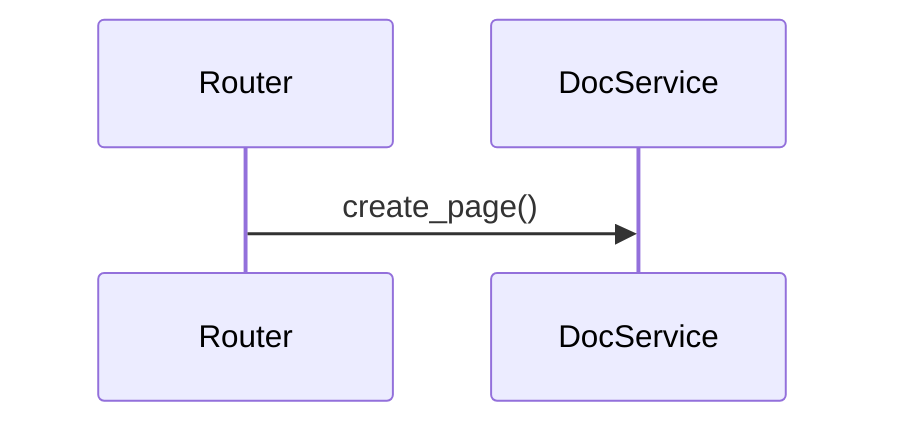
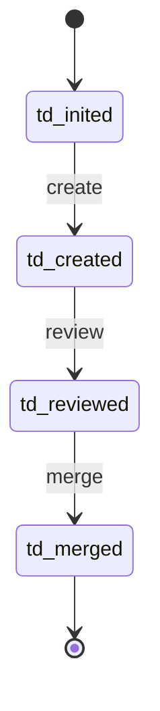
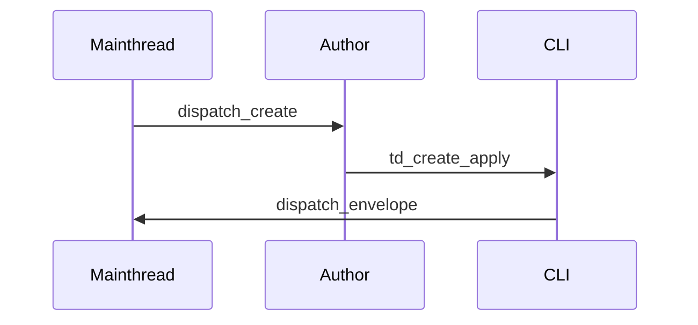
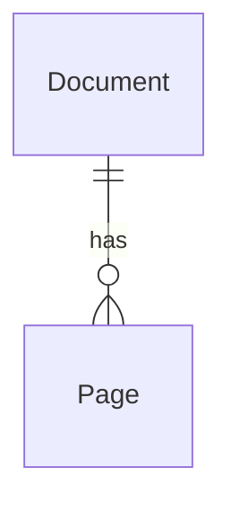
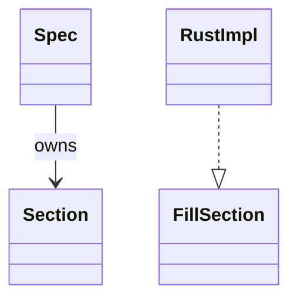
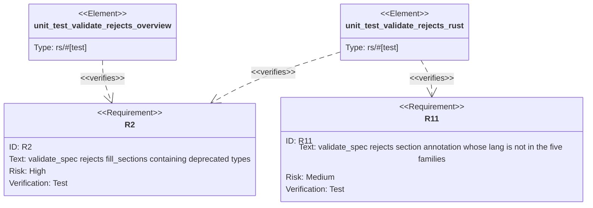

# Spec Authoring Guide

Every spec under `.aw/tech-design/` follows this contract. Both humans and
agents. For a quick summary, see CLAUDE.md § Spec Authoring.

## What TD describes (and what it doesn't)

TD is a **codebase contract**. Every A-class section type maps to codegen
output in one or more target languages (`rs` / `py` / `ts` / `css` / `html`).
The section type name is **language-neutral**; the target language is
selected from the workspace profile in `.aw/config.toml`. A single
`schema` section generates a Rust struct in one workspace and a Pydantic
class in another.

**Out of scope for TD** (tracked in other document types; not under
`.aw/tech-design/`):

| concept | belongs in |
|---------|-----------|
| `requirements` | BRD / PRD (future doc type) |
| `overview` | PRD, or TD frontmatter (`summary:` field) |
| `doc` (user-facing) | Docs (future doc type) |
| implementation file lists / `changes` | inferred by TD-to-codebase tooling; legacy TDs may keep `## Changes` for compatibility |

A TD spec that tries to carry these will be rejected by `aw td validate`.

## Format Families (five YAML standards)

Every section is YAML in one of these five families:

| family | standard | fence | purpose |
|--------|----------|-------|---------|
| OpenAPI 3.1 | [OAS 3.1](https://spec.openapis.org/oas/v3.1.0) | `yaml` | HTTP API |
| AsyncAPI 2.6 | [AsyncAPI](https://www.asyncapi.com/docs/reference/specification/v2.6.0) | `yaml` | Pub/sub, WS, queue |
| OpenRPC 1.3 | [OpenRPC](https://spec.open-rpc.org/) | `yaml` | JSON-RPC API / service method dispatch |
| JSON Schema 2020-12 | [JSON Schema](https://json-schema.org/draft/2020-12) | `yaml` | Data shape, config, CLI, wireframe, CEM, DTCG |
| Mermaid Plus | YAML frontmatter + mermaid body | `mermaid` | State, flow, sequence, ER, class, mindmap |

Hard rules:

- **No JSON in specs** — even for standards normally written in JSON (CEM,
  DTCG). Use the YAML form.
- **No language-specific code strings** — no Rust / Python / TypeScript
  syntax embedded as YAML values. Section content is *schema*, not *source*.
- **One format per section** — the annotation's `lang` declares which family
  applies to the code fence below it.
- **Mermaid Plus means YAML frontmatter first, mermaid body second** — the
  frontmatter is the source of truth for codegen; the mermaid body is for
  visual rendering.

## Section Annotation

Every section self-describes via an HTML comment after the heading:

```markdown
## {section title}
<!-- type: {section-type} lang: {family} -->

```{fence-lang}
{content}
```
```

Attr-style metadata is also accepted when a section needs routing or
validation attributes:

```markdown
## {section title}
<!-- score-section type="{section-type}" lang="{family}" workspace="{workspace-name}" surface="{surface-name}" role="{role-name}" -->
```

Only `type` and `lang` are required. `workspace`, `surface`, and `role` are
optional target metadata and are preserved by parsers. Complex target matrices
belong in the section body, not in the annotation line.

`{family}` is one of: `openapi`, `asyncapi`, `openrpc`, `json-schema`,
`mermaid-plus`. The fence language is always `yaml` (JSON Schema / OpenAPI /
AsyncAPI / OpenRPC / CEM / DTCG / wireframe / cli / config) or
`mermaid` (Mermaid Plus body — state-machine / logic / interaction /
scenarios / db-model / dependency / test-plan). There is no `markdown` lang
— prose belongs in the optional section description, not inside a fence.

Parsing regex:

```
^## (.+)\n<!-- type: ([\w-]+) lang: ([\w-]+) -->
```

Attr-style parsing accepts quoted key/value pairs:

```
^## (.+)\n<!-- score-section type="([\w-]+)" lang="([\w-]+)" ... -->
```

## Section Type Registry (18 A-class + `changes`)

All types are language-neutral. Codegen target is decided per-workspace, not
per-section.

| type | family | purpose | primary targets |
|------|--------|---------|-----------------|
| `rest-api` | OpenAPI 3.1 | HTTP endpoint contracts | rs / py / ts |
| `rpc-api` | OpenRPC 1.3 | JSON-RPC method contracts | rs / py / ts |
| `async-api` | AsyncAPI 2.6 | Pub/sub, WS, queue contracts | rs / py / ts |
| `schema` | JSON Schema | Data type definitions | rs / py / ts |
| `db-model` | Mermaid Plus (erDiagram) | Table + relationship model | rs / py / sql |
| `state-machine` | Mermaid Plus (stateDiagram-v2) | FSM contract | rs / py / ts |
| `logic` | Mermaid Plus (flowchart) | Function body / branch tree | rs / py / ts |
| `dependency` | Mermaid Plus (classDiagram) | Type hierarchy / trait graph | rs / py / ts |
| `interaction` | Mermaid Plus (sequenceDiagram) | Internal actor flow | rs / py / ts |
| `scenarios` | Mermaid Plus (sequenceDiagram) | End-to-end user flow | rs test / py test / ts test |
| `cli` | JSON Schema | Command tree + args | rs (clap) / py (click) / ts (commander) |
| `config` | JSON Schema | Config file shape | rs / py / ts |
| `test-plan` | Mermaid Plus (requirementDiagram) | Requirement → test verification graph | rs test / py test / ts test |
| `wireframe` | JSON Schema (Layout DSL) | UI layout + component tree | html + css |
| `component` | Custom Elements Manifest (YAML) | UI component contract (props / events / slots) | ts / html / css |
| `design-token` | W3C DTCG 2025.10 (YAML) | Design system tokens | css / ts |
| `manifest` | YAML (dependency list) | Package manifest deps (Cargo.toml `[dependencies]`, pyproject deps, package.json deps) | rs (toml) / py (pyproject) / ts (package.json) |
| `runtime-image` | YAML (image build contract) | Container image build inputs, base image, env, entrypoint, command | Dockerfile / .dockerignore |
| `deployment` | YAML (runtime manifest contract) | Runtime deployment resources, Kustomize base/component/overlay composition | Kubernetes / Kustomize |
| `tests` | YAML (setup + assertions) | Executable test cases — imports + `setup` + `assertions` (raw target-lang snippets) per test | rs / py / ts |
| `changes` | JSON Schema | File change list (path + action) | — (meta) |

### Deprecated types (must not appear in new specs)

These existed in older TD. `aw td validate` now rejects them:

- `overview`, `requirements`, `doc` — moved out of TD (see "Out of scope" above)
- `rust/trait`, `rust/enum`, `rust/type-alias`, `rust/impl`, `rust/trait-impl`,
  `rust/functions`, `rust/reexports` — language-specific, replaced by abstract
  types + per-language templates (see next section)

Existing specs using deprecated types must be migrated before the next
`aw td merge` touches them.

## Anti-Pattern Catalog

`aw td validate` enforces every named anti-pattern below. Reviewer agents
(LLM) trust validator-pass and do NOT re-check these — their job is purely
semantic content review.

Each entry: short name, error code, one-line trigger, GOOD vs BAD example.

### AP-001 placeholder-leftover

`TdErrorCode::PlaceholderLeftover`. A section's body still contains
`(fill)`, `<!-- TODO -->`, or `<!-- TBD -->` placeholders.

**BAD**:
```markdown
## Doc
<!-- type: doc lang: markdown -->

(fill)
```

**GOOD**: substantive body text replacing every placeholder.

### AP-002 raw-mermaid-in-logic

A `lang: mermaid` Logic / State-Machine / Interaction section's fence body
does not begin with `---` (Mermaid Plus frontmatter delimiter).

**BAD**:
````markdown
## Logic
<!-- type: logic lang: mermaid -->

```mermaid
flowchart TD
  start --> end
```
````

**GOOD**: fence body opens with `---\nid: ...\nentry: ...\nnodes: ...\nedges: ...\n---\nflowchart TD\n...`

### AP-003 orphan-changes-target

`TdErrorCode::OrphanChangesTarget`. A `## Changes` entry's `path:` /
`replaces:` cannot be matched to any anchor produced by another section.
The change-target is "orphaned" — gen-code will not fire on it because
no section drives content into it.

**BAD**: `## Changes` lists `path: src/foo.rs, replaces: [bar]` but no
`## Schema` defines `bar` and no `## Logic` has `signature: pub fn bar(...)`.

**GOOD**: every `replaces` symbol traces to a section anchor (Schema
definition name, Logic signature, CLI command name, etc.).

### AP-004 non-existent-spec-ref

`TdErrorCode::NonExistentSpecRef`. The spec text mentions a
`.aw/tech-design/.../*.md` path that does not exist on disk.

**BAD**:
```markdown
| `projects/agentic-workflow/tech-design/core/imaginary.md` | high | does not exist |
```

**GOOD**: every cited spec file is reachable from project root.

### AP-005 deprecated-section-included

`fill_sections` contains a deprecated section type
(`overview` / `requirements` / `doc` / `rust/*`). See "Deprecated types"
above for the full list.

**BAD**:
```yaml
fill_sections: [overview, schema, changes]
```

**GOOD**:
```yaml
fill_sections: [schema, logic, test-plan, changes]
```

### AP-006 forbidden-substrings

A requirement bullet contains `tbd` / `todo` / `maybe` / `unclear` /
`uncertain` (case-insensitive). Authoring drift; replace with concrete text.

**BAD**: `R3: validator MUST handle the TBD case appropriately`

**GOOD**: `R3: validator MUST emit error 'no anchor matches ...' when ...`

### AP-007 mermaid-plus-malformed

A `kind: mermaid` section's frontmatter does not deserialise into the
expected typed payload (`StateMachineContent` / `LogicContent` /
`InteractionContent`). The codegen-ready safety net rejects.

**BAD**: frontmatter missing `entry:` field, or referencing a target
node id that does not appear in `nodes:`.

**GOOD**: frontmatter fully populated, all targets resolve, parser
accepts as the matching content type.

### AP-008 body-equals-title

`TdErrorCode::BodyEqualsTitle`. A `## Problem` section body's first
sentence is byte-near-identical to the spec title. Authors sometimes
paste the title as a placeholder.

**BAD**:
```markdown
## Problem

enhancement: foo bar
```

**GOOD**:
```markdown
## Problem

The foo subsystem currently lacks codegen for X, blocking Y.
This issue extends the Z generator to cover X by ...
```

### AP-009 non-existent-replaces-symbol

`TdErrorCode::NonExistentReplacesSymbol`. A `## Changes` entry's
`replaces: [foo, bar]` lists a symbol that does not appear as a `pub fn`
/ `pub struct` / `pub enum` / `pub trait` / `pub mod` declaration in the
target file. Heuristic grep, not full Rust parse.

**BAD**: `replaces: [missing_fn]` on a path where the file has no
`pub fn missing_fn` (or any of the recognised forms).

**GOOD**: every replaces symbol is found in the target file.

### AP-010 changes-path-not-found

`TdErrorCode::ChangesPathNotFound`. A `## Changes` entry's `path:` does
not exist in the workspace AND the entry's `action:` is not `create`.

**BAD**:
```yaml
- path: src/missing.rs
  action: modify
  ...
```

**GOOD**: either the file exists OR `action: create` declares the file as new.

## Per-Language Codegen Templates

Each A-class section type has a **template registry** keyed by target
language. The workspace's `target` field in `.aw/config.toml` selects
which template runs.

Template dispatch contract:

```
section_type × workspace_target  →  template  →  file(s) under workspace.path
```

Example dispatch for `schema`:

| target | template output |
|--------|-----------------|
| `rs` | `#[derive(Serialize, Deserialize)] struct` with serde attrs |
| `py` | `class Foo(BaseModel)` (Pydantic) |
| `ts` | `interface Foo` (or `type Foo = ...` for unions) |
| `sql` | `CREATE TABLE` (via `db-model`) |

Example dispatch for `logic`:

| target | template output |
|--------|-----------------|
| `rs` | `fn body` reconstructed from flowchart |
| `py` | `def body` |
| `ts` | arrow function body |

Template discovery: `projects/agentic-workflow/templates/<section-type>/<target>.tera`. A
missing template for a given pair produces `UnsupportedLanguage` at
`aw td gen-code` time — fail loud, no fallback.

Adding a new language target = adding template files, not touching section
types.

## Workspace Grouping

Each workspace in `.aw/config.toml` declares its codebase organization
strategy. This determines how `aw td gen-code` places generated files:

```toml
[[projects.workspaces]]
name = "httpkit"
path = "projects/mamba/mambalibs/httpkit"
target = "rs"

  [projects.workspaces.tech_design]
  grouping = "function"   # | "feature"
  spec_root = ".aw/tech-design/projects/httpkit"
```

Two strategies:

| grouping | spec layout | code layout |
|----------|-------------|-------------|
| `function` | one file per **kind of thing** (`schemas.md`, `routes.md`, `handlers.md`) | `src/schemas/`, `src/routes/`, `src/handlers/` |
| `feature` | one file per **capability** (`upload.md`, `validation.md`, `auth.md`) | `src/upload/`, `src/validation/`, `src/auth/` |

The chosen strategy is the contract: `aw sync` preserves the
`[projects.workspaces.tech_design]` sub-table across regenerations, but
filesystem-derived keys (`name`, `path`, `paths`, `target`, `test_cmd`) are
replaced each run.

## `aw sync` Merge Contract

`aw sync` regenerates `[[projects]]` / `[[projects.workspaces]]` from the
filesystem. To keep user-preference sub-tables (`tech_design`) alive across
runs, sync uses **per-key merge**, not whole-block replace.

Ownership table:

| owned by sync (replace) | hand-written (preserve) |
|-------------------------|-------------------------|
| `name`, `path`, `paths`, `target`, `test_cmd` | `[projects.workspaces.tech_design]` |
| (future: discovery-derived keys) | (future: other user-preference sub-tables) |

Algorithm: for each workspace in the filesystem-derived list,
`merged = owned_keys(discovered) ⊕ non_owned_keys(existing)`. Workspaces
that disappear from the filesystem are dropped (owned list is authoritative).
Hand-written sub-tables under a dropped workspace are lost — intentional.

Implementation: `aw sync` uses `toml_edit` rather than a pure serializer
so comments and key order in user-written sub-tables survive rewrites.

## Codegen Policy (1 / 2-1 / 2-2)

A piece of code is EITHER 100% codegen-driven OR 100% hand-written. No
partial-patching middle ground. Pick a lane per unit and honour it.

**Rule 1** — Every line of a codegen unit is produced from the spec.
`aw td gen-code` is the only way to update it. Hand-edits inside a
codegen unit are a contract violation — they get silently overwritten
on the next regen (or, once drift detection ships, refused).

**Rule 2-1** — If you want a new surface under codegen, fix the TD
until it's complete. Regen is the update primitive. Partial specs
aren't allowed to "patch" an existing hand-written fn body.

**Rule 2-2** — If a change doesn't fit into codegen (bug fix, refactor
to hand-written code, any behavioural patch on imperative code), the
SDD issue still tracks requirements + tests + decisions, but the Rust
edit is done by an agent, not by `aw td gen-code`. Mark the
change's `impl_mode: hand-written` so the generator skips it.

### Two-tier unit + marker system

| Level | Marker | Meaning |
|-------|--------|---------|
| File region | `// CODEGEN-BEGIN` / `// CODEGEN-END` | Block is codegen's home; content is replaced wholesale on regen. |
| Individual item | `/// @spec <spec_path>#<anchor>` | This item was produced from `<anchor>` of the referenced spec. Absence ⇒ hand-written. |

**Invariant:** every generated item carries exactly one `@spec` marker.
`aw td audit` classifies every top-level `pub` item it finds into one of
four statuses via single-pass walk:

| Item inside CODEGEN block? | Has `@spec` marker? | File claimed by any spec's `changes:`? | Status |
|---|---|---|---|
| ✓ | ✓ | (any) | **Clean** (regenerate-diff match) or **Drift** (mismatch) |
| ✓ | ✗ | (any) | **MarkerGap** — hand-edit smuggled into generated block |
| ✗ | (any) | ✓ | **Uncovered** — governance-review candidate |
| ✗ | (any) | ✗ | healthy hand-written region (not flagged) |

`Uncovered` is deliberately narrow: it fires only on files that at least
one spec's `changes:` claims. A hand-written utility in an unclaimed file
produces zero findings — the audit cares about code adjacent to codegen,
not every `pub fn` in the repo.

### Two-verb contract: `validate` (spec-side) + `audit` (code-side)

The CLI splits spec-side and code-side checks into two verbs with
non-overlapping scopes. Each verb takes a path argument and has a stable
exit-code contract (0 = no findings, 1 = findings, 2 = invocation error).

| Verb | Path argument | Checks |
|------|---------------|--------|
| `aw td validate <slug>` | issue slug (commit-gate only after Phase 1) | CRRR commit-gate path: unified rule registry (R3a–R3h, R6a–R6b, R7a–R7f), advances issue phase, commits the matching `Lifecycle-Stage:` trailer. Path-mode invocation routes to `aw td check` with a deprecation notice (Phase 1 compat shim). |
| `aw td check <target>` | issue slug / `.aw/tech-design/...` prefix / single spec file | Read-only rule-registry check. Same rules as `td validate`'s slug mode, but no commit, no phase advance, no envelope. Exit 0 = no findings, 1 = violations, 2 = invocation error. Absorbs the deprecated `aw validate-spec-structure` / `aw check-alignment` and the path-mode of `aw td validate`. |
| `aw cb gen <slug>` | issue slug | Generate implementation code from an approved TD spec. Advances phase to `cb_genned`, commits `Lifecycle-Stage: Cb-Gen`. Post-codegen: dispatches `aw cb fill` when HANDWRITE markers are present, or `aw td merge` when zero markers (R8/R11). Replaces `aw td gen-code`. |
| `aw cb fill <slug>` | issue slug | Phase 3: fill HANDWRITE-BEGIN/END marker blocks in generated code. Brief mode emits a dispatch envelope to `score-cb-handwriter` with the marker list + spec path. `--apply --marker <id>` mode merges `.aw/payloads/<slug>/<id>.md` into the matching block; on the last marker, runs `cb check` as a gate, commits `Lifecycle-Stage: Cb-Fill`, advances phase to `cb_filled`, and dispatches `aw td merge`. |
| `aw cb check <path>` | code-space prefix (e.g. `projects/mamba/mambalibs/httpkit/`) / single source file | Unified code-space walk: Clean / Drift / MarkerGap / Uncovered / Aggregate / Unresolvable / Handwrite. `--group-by gap\|file\|status` aggregates the result; `--group-by gap` subsumes the deprecated `score sdd coverage` view. Replaces `aw td audit`. |
| `aw td claim <slug>` | issue slug (`--from-path` opt) | Phase 2 recovery: adopt an on-disk TD spec into the score lifecycle. Uses the current project branch; only launches `td-<slug>` when invoked from `main`. Sets phase `td_reviewed` (bypass CRRR), commits `Lifecycle-Stage: Td-Claim` + `Claim-Source:` sub-trailer, dispatches `aw cb gen`. Idempotent unless `--force-rebase`. |
| `aw td idle` | (no args) | Phase 2 recovery: scan stalled `td-*` worktrees, identify `td_*` phases, emit `batch` envelope of dispatch / invoke / skip recommendations conforming to `issue-cli-envelope`. |
| `aw cb claim <code-path>` | source file or directory | Phase 2 recovery: adopt existing code via the fillback pipeline. Writes generated TD spec to `.aw/tech-design/<group>/`. Inside an active worktree, commits `Lifecycle-Stage: Cb-Claim`. `--init` auto-creates `.aw/`. `--issue-stub` creates a derived issue. |
| `aw cb idle` | (no args) | Phase 2 recovery: scan `td-*` worktrees for `cb_*` phases, emit `batch` envelope. Mirrors `aw td idle` for the CB phase space. |

CI integration:
```
aw td check .aw/tech-design/ && aw cb check projects/
```
Neither command requires a live build environment — both read specs +
source text only.

**Deprecated verbs (transparent aliases — removed next release).** The
following are retained as transparent aliases that delegate to the verbs
above and print a one-line stderr deprecation notice
(`deprecated: use 'score <new>' instead`):
- `aw td gen-code <slug>` → `aw cb gen <slug>` (also renames trailer `Td-GenCode` → `Cb-Gen` and phase `td_gen_coded` → `cb_genned` for new writes; readers accept both)
- `aw td audit <path>` → `aw cb check <path>`
- `aw td validate <path>` → `aw td check <path>`
- `aw td validate <slug> --check` → `aw td check <slug>` (the `--check` flag is hidden / deprecated)
- `aw validate-spec-structure [path]` → `aw td check`
- `aw check-alignment [path]` → `aw td check`
- `score sdd coverage [--workspace-root X]` → `aw cb check X --group-by gap`

Legacy flags `aw td audit --ready-only` and `--drift` have been
removed. Codegen readiness migrated to `validate`; drift is now the
default behaviour of `aw cb check` alongside MarkerGap, Uncovered,
and Handwrite.

Canonical `@spec` anchors emitted by current generators:
- `#schema` — struct / enum declaration
- `#schema.as_str` — enum's `impl Self { as_str }` (enum codegen only)
- `#schema.from_str` — enum's `impl FromStr` (enum codegen only)
- `#x-constructor` — `impl Self { pub fn new(..) }`
- `#x-mamba-binding` — `extern "C"` FFI shim
- `#x-mamba-attributes.<name>` — per-attribute getter fn
- `#x-mamba-binding.register` — per-type `register_<snake>` fn
- `#x-mamba-binding.register-aggregate` — file-level aggregate `register(r)` fn

### Legacy `changes` entries

New TDs should not contain a `## Changes` section. TD-to-codebase tooling
infers existing implementation targets from `@spec <td>#<section>` and CODEGEN
markers in the codebase.

Legacy TDs may still carry `changes:` entries while they are being migrated.
For those entries, `impl_mode` follows rule 2-2.

### `impl_mode` on legacy changes entries (rule 2-2)

Each `changes:` entry can declare `impl_mode: codegen` (default) or
`impl_mode: hand-written`. Hand-written entries participate in the SDD
record — requirements, tests, review — but `aw td gen-code` skips
them: no CODEGEN block is inserted, the target file is left untouched.

Use this for bug fixes / refactors to code that isn't fully
codegen-driven, e.g. a small behavioural tweak to an existing
hand-written function.

```yaml
changes:
  - path: projects/agentic-workflow/src/cli/td.rs
    action: modify
    impl_mode: hand-written
    description: |
      Resolve merge target from current branch rather than hard-coded
      `main`. Spec tracks the requirement; agent edits td.rs directly.

  - path: projects/agentic-workflow/tests/merge_target_test.rs
    action: create
    section: tests
    description: |
      Default-mode test cases — `impl_mode` omitted ⇒ `codegen`;
      generator produces the test file via the tests generator.
```

`aw td audit` recognises hand-written entries and excludes their
targets from content-drift checks — there's no generator output to
compare against.

## Schema Annotations (mamba-binding conventions)

The `schema` section accepts a set of JSON-Schema extensions (`x-*` keys)
that drive the mamba FFI codegen for `projects/mamba/mambalibs/httpkit/` + `projects/httpkit-demo/`
(and any future mamba-native workspace). All are **optional** — a schema
without any `x-mamba-*` annotations produces a plain Rust struct / enum
via the base schema generator. Adding them opts into:

- a constructor with typed args + validators
- an `extern "C"` FFI shim callable from mamba Python
- per-field attribute getters registered in mamba's `ObjectOps` table
- a per-type `register_<snake>(r)` fn that the apply-pass auto-wire
  aggregates into the owning crate's `MambaModule::register` body

### `x-mamba-binding` — Python-visible class registration

```yaml
x-mamba-binding:
  module: mambalibs.http          # documentation only; the registered
                                  #   mamba module comes from the owning
                                  #   crate's `MambaModule::name()`.
  symbol: HTTPException           # Python-visible class name
  extern_fn: http_exception_new   # Rust `extern "C"` fn identifier
  signature: "HTTPException(status_code: int, detail: str | None = None) -> HTTPException"
```

The `helpers: [http_status_phrase]` escape hatch has been retired. Mamba
PR-4 ships `cclab_mamba_registry::http::{status_phrase, status_name,
canonical_codes}`; specs call these directly via `default_expr`:

```yaml
x-constructor:
  args:
    - { name: detail, mb_type: str, rust_type: String, nullable: true,
        default_expr: "cclab_mamba_registry::http::status_phrase(status_code).to_string()" }
```

### `x-constructor` — constructor args + validators

```yaml
x-constructor:
  args:
    - { name: status_code, mb_type: int,  rust_type: u16,    default: "500" }
    - { name: detail,      mb_type: str,  rust_type: String, nullable: true,
        default_expr: "http_status_phrase(status_code)" }
    - { name: headers,     mb_type: dict,
        rust_type: "std::collections::HashMap<String, String>",
        default: "std::collections::HashMap::new()" }
  validations:
    - { field: status_code, rule: range, min: 100, max: 599,
        message: "status_code must be in [100, 599]" }
    - { field: name,  rule: min_length, min: 1 }
    - { field: name,  rule: max_length, max: 64 }
    - { field: email, rule: expr, expr: "email.contains('@')",
        message: "email must contain @" }
```

Arg fields:

| field | meaning |
|---|---|
| `name` | constructor parameter + struct field identifier |
| `mb_type` | mamba calling-convention kind — see table below |
| `rust_type` | Rust type for the ctor parameter (if omitted, inferred from `mb_type`) |
| `nullable` | `true` → ctor param is `Option<T>`; `false` (default) → plain `T` |
| `default` | literal Rust expression used when mamba caller passes `None` |
| `default_expr` | Rust expression applied AFTER validation (for computed defaults) |

`mb_type` values:

| value | primitive reader? | FFI reader path |
|---|---|---|
| `int` | ✓ | `i64::from_mb_value(arg).ok().map(\|v\| v as <rust_type>)` |
| `str` | ✓ | `String::from_mb_value(arg).ok()` |
| `bool` | ✓ | `bool::from_mb_value(arg).ok()` |
| `float` | ✓ | `f64::from_mb_value(arg).ok()` |
| `enum` | ✓ | `String::from_mb_value(arg).ok().and_then(\|s\| s.parse::<<rust_type>>().ok())` |
| `dict` | ✓ when element type is primitive (String / i64 / etc.) | `<HashMap<String, V>>::from_mb_value(arg).ok()` via mamba PR-2 ops table |
| `list` | ✓ when element type is primitive | `<Vec<T>>::from_mb_value(arg).ok()` via mamba PR-2 ops table |
| any other | ✗ | falls through to `default` literal |

When the element type is a non-primitive (`Vec<Cookie>`, `HashMap<String, MyStruct>`, `Vec<u8>`), the
generator reverts to the `default` literal path and emits a TODO
comment — the mamba registry doesn't ship `FromMbValue` for
user-defined types, so round-tripping requires either hand-written
glue or a future generator extension that wraps each element via
`mb_unwrap_native`.

Validator rules (`x-constructor.validations[*].rule`):

| rule | shape | renders as |
|---|---|---|
| `range` | `{ field, min, max, message? }` | `(min..=max).contains(&(field as i64))` |
| `min_length` | `{ field, min, message? }` | `field.len() >= min` |
| `max_length` | `{ field, max, message? }` | `field.len() <= max` |
| `expr` | `{ expr, message? }` | raw Rust bool — escape hatch. Arg names are in scope. |

When validation fails, the generated constructor returns `Err(String)`;
the FFI shim raises a Python `ValueError` via the ops table.

### `x-mamba-attributes` — per-field getters

```yaml
x-mamba-attributes:
  - name: status_code
    rust_expr: "self_.status_code as i64"   # optional; defaults to
                                            #   `self_.<name>.clone()`
    doc: "HTTP status code."                # optional; renders as `///` doc
  - name: detail                            # uses the default rust_expr
  - name: headers
    readonly: true                          # reserved; setters TBD
```

Each entry emits:

1. `#[no_mangle] pub unsafe extern "C" fn <struct_snake>_get_<attr>(args, nargs) -> MbValue`
   that borrows the wrapped struct via `mb_unwrap_native_ref` and returns
   the attribute value via `IntoMbValue`.
2. A `r.register_getter("<StructName>", "<attr>", fn_ptr)` call inside the
   generated `register_<struct_snake>(r)` fn.

Python-side `exc.status_code` dispatches to these getters via mamba's
`ObjectOps.register_getter` machinery (PR-5; PR-1 stores the registrations
in a hash-map even before dispatch is wired).

### Multi-type specs via `definitions:`

A single spec file may declare multiple types by putting each under JSON
Schema `definitions:`. Each definition becomes its own Rust symbol, each
carries its own (optional) `x-mamba-binding` / `x-constructor` /
`x-mamba-attributes`. A file-level aggregate `pub fn register(r)` is
emitted that calls every per-type `register_<snake>(r)` in declaration
order — this is what `auto_wire_mamba_lib` picks up when wiring the
owning crate's `lib.rs`.

```yaml
definitions:
  HealthStatus:
    type: string
    enum: [healthy, degraded, unhealthy]
    # enums don't take x-mamba-binding — mamba unit enums have no
    # positional-arg construction.
  HealthCheck:
    type: object
    required: [name, status]
    properties:
      name: { type: string }
      status: { $ref: "#/definitions/HealthStatus" }
    x-mamba-binding: { ... }
    x-constructor: { ... }
    x-mamba-attributes: [ ... ]
  HealthManager:
    type: object
    ...
```

## Async Convention

Current state: **deferred** — specs authored today do not declare async.
Data types (structs / enums) and their constructors / attribute getters
are sync by construction (struct init, field read) and stay that way.

Plan for when we start specifying framework methods (Router / App /
BackgroundTasks / Middleware — all blocked on mamba's callable storage
support):

1. **Rust-side method async-ness**: explicit opt-in via an `async: true`
   flag on each method entry (when a `x-methods:` or similar block is
   introduced). Default `false`.
2. **User-handler sync/async**: runtime dispatch. The generated framework
   code detects whether a mamba callable is a coroutine via `ObjectOps`
   and either awaits it through `asyncio.run` or calls it directly. The
   spec does NOT declare whether user handlers are sync or async — the
   user writes `def` or `async def` in Python and the framework adapts.

This split keeps async out of data-type specs and moves the
spec-declared async concern to the narrow set of methods that genuinely
need to expose an async contract on the Rust side.

## Cross-Reference System

Sections link via content-level `id` and `$ref`. Each format family has its
own native reference mechanism — SDD does not invent a wrapper.

| family | id mechanism | ref mechanism |
|--------|-------------|---------------|
| OpenAPI / OpenRPC / AsyncAPI | `x-sdd.id` | `x-sdd.refs[*].$ref` |
| JSON Schema | `$id` | `$ref` |
| Mermaid Plus | frontmatter `id:` | frontmatter `refs[*].$ref` |
| Custom Elements Manifest | `x-sdd.id` | `x-sdd.refs[*].$ref` |
| W3C DTCG | `$extensions.sdd.id` | `$extensions.sdd.refs[*].$ref` |

### `$ref` syntax (unified)

- `#local-id` — same file
- `other-spec#remote-id` — cross file (no path, resolved against spec_root)

### Rule

If a section may be referenced by other sections, its content MUST declare
an `id`. Leaf sections (`changes`) typically don't need one.

### Example

```yaml
# rest-api section
paths:
  /docs/{id}/pages:
    post:
      summary: Create page
      x-sdd:
        id: create-page-api
        refs:
          - $ref: "#create-page-flow"
```



Traversal: API endpoint → interaction flow → business logic → data model.

## Mermaid Plus Content Models

Mermaid-family sections that feed code generators use YAML frontmatter as
the structured source. The mermaid body renders visually; codegen reads the
frontmatter.

### `state-machine` (stateDiagram-v2)



Required frontmatter: `id`, `initial`, `nodes` (map id → `{kind, label?}`),
`edges` (list of `{from, to, event?, guard?}`). Node kinds: `initial`,
`normal`, `terminal`, `transient`, `choice`.

### `logic` (flowchart)

```mermaid
---
id: validate-spec
entry: start
nodes:
  start:          { kind: start,    label: "Begin" }
  check_fm:       { kind: decision, label: "Has frontmatter?" }
  check_sections: { kind: process,  label: "Validate sections" }
  ok:             { kind: terminal, label: "Return ok" }
  error:          { kind: terminal, label: "Return errors" }
edges:
  - { from: start,          to: check_fm }
  - { from: check_fm,       to: check_sections, label: "yes" }
  - { from: check_fm,       to: error,          label: "no"  }
  - { from: check_sections, to: ok }
---
flowchart TD
    start([Begin]) --> check_fm{Has frontmatter?}
    check_fm -->|yes| check_sections[Validate sections]
    check_fm -->|no|  error([Return errors])
    check_sections --> ok([Return ok])
```

Required frontmatter: `id`, `entry`, `nodes`, `edges`. Node kinds: `start`,
`process`, `decision`, `terminal`.

### `interaction` / `scenarios` (sequenceDiagram)



Same structure for both. Convention: `interaction` uses `kind: system` /
`participant` for internal components; `scenarios` uses `kind: actor` for a
human user at the entry point. A `scenarios` section whose first actor is
not a user fails validation.

### `db-model` (erDiagram)



Required frontmatter: `id`, `entities` (JSON Schema subset per entity),
`relations`. Field types: SQL-neutral primitives (`uuid`, `string`, `int`,
`float`, `bool`, `datetime`, `text`, `json`, `blob`).

### `dependency` (classDiagram)



Edge kinds: `owns`, `references`, `implements`, `extends`.

### `test-plan` (requirementDiagram)



Required frontmatter: `id`, `requirements` (map id → `{id, text, kind, risk, verify}`),
`elements` (map id → `{kind, type}`), `relations` (list of `{from, verifies|satisfies|refines, <target>}`).
Requirement kinds (SysML): `functional`, `performance`, `interface`, `physical`,
`design-constraint`. Element kinds: `test`, `simulation`, `analysis`, `inspection`.

### Section types without content model

`changes`, `rest-api`, `rpc-api`, `async-api`, `schema`, `cli`, `config`,
`wireframe`, `component`, `design-token`, `manifest`, `runtime-image`,
`deployment`, `tests` — these use their standard format directly, no mermaid
wrapper.

## Mermaid Diagram Selection

Choose by mathematical structure, not visual preference:

| structure | diagram | identify by |
|-----------|---------|-------------|
| Finite State Machine | `stateDiagram-v2` | Fixed set of states + transition events |
| Directed Acyclic Graph | `flowchart` | Conditional branches, decision nodes |
| Ordered Message Passing | `sequenceDiagram` | Two+ actors exchanging messages in time order |
| Entity-Relationship | `erDiagram` | Entities with cardinality constraints |
| Type Hierarchy | `classDiagram` | Inheritance, trait impl, composition |
| Requirement ↔ Verification | `requirementDiagram` | Requirements linked to test / simulation elements (SysML) |
| Tree | `mindmap` | Hierarchical decomposition, no cross-links |

Hard constraints:

- FSM → always `stateDiagram-v2`, never flowchart
- DAG with conditions → always `flowchart`
- Actor interaction → always `sequenceDiagram`
- One diagram per structure — never duplicate the same structure in two diagram types

## UI Reproduction Trio

The three UI section types compose to fully reproduce a product's shell
from TD alone:

| type | owns | codegen |
|------|------|---------|
| `wireframe` | Layout, component placement, responsive rules, state variants | `html` skeleton + `css` layout |
| `component` | Props, events, slots, state machine per component | `ts` component + `html` template |
| `design-token` | Colors, spacing, typography, elevation | `css` variables + `ts` constants |

`wireframe` references `component` definitions via `$ref`; `component` and
`wireframe` reference `design-token` values via DTCG alias syntax
(`{color.brand.primary}`).

### UI Complexity Budgets

UI-oriented sections (`wireframe`, `component`, `design-token`, `config`,
`manifest`, `tests`, `test-plan`) may declare a `workspace` annotation attribute and
carry task complexity metrics in YAML:

```markdown
## Artifact Studio Wireframe
<!-- score-section type="wireframe" lang="yaml" workspace="cue-artifact-studio" surface="studio" role="owner" -->
```

```yaml
tasks:
  - id: prompt_to_workitem
    class: intake
    metrics:
      visible_actions: 3
      required_decisions: 2
      required_fields: 1
      context_switches: 0
      irreversible_actions: 0
```

The workspace resolves through `.aw/config.toml`:

```toml
[[projects.workspaces]]
name = "cue-artifact-studio"
ui_profile = "owner-frontoffice"

[ui_profiles.owner-frontoffice.task_budgets]
intake = 8
review = 12
approve = 10
configure = 12
operate = 14
recover = 10
```

`aw td check` sums numeric metric values for each task and compares the
sum with `task_budgets.<class>`. Task ids stay product-specific inside the TD;
config budgets use generic task classes.

## Operations Reproduction Pair

The operations section types cover deployable runtime artifacts without
introducing tool-branded TD types:

| type | owns | codegen |
|------|------|---------|
| `runtime-image` | Container image build contract, build context, env, entrypoint, command | `Dockerfile` + `.dockerignore` |
| `deployment` | Runtime resource composition, Kustomize base/component/overlay resources, Kubernetes manifests | `kustomization.yaml` + resource YAML |

`deployment` may reference `runtime-image` outputs by image name/tag and should
model Kustomize as source-equivalent YAML: the TD owns the structured content,
while codegen may copy or render the manifest form directly when no
simplification is available.

### Layout DSL (wireframe)

Framework-agnostic YAML:

```yaml
id: <string>
direction: horizontal | vertical
width: <px> | auto
height: <px> | auto
flex: <number>
scroll: vertical | horizontal | both | none
children: [...]
```

Component reference from wireframe:

```yaml
- id: docs_list
  component: DocsList
  data_source: "GET /api/docs"
  width: 300
  scroll: vertical
```

Component definition lives in a `component` section:

```yaml
id: DocsList
props:
  items:   { type: array, items: { $ref: "#/components/schemas/Doc" } }
  loading: { type: boolean }
states:
  empty:     "items.length === 0"
  loading:   "loading === true"
  populated: "items.length > 0 && !loading"
interactions:
  "click(item)": "emit:select"
slots: []
events:
  - { name: select, payload: { $ref: "#/components/schemas/Doc" } }
```

`states` values must be programmatically evaluable conditions, not visual
descriptions (no `"shows a spinner"`).

### Design tokens (DTCG YAML)

```yaml
$schema: "https://design-tokens.org/schema.json"
color:
  brand:
    primary:   { $value: "#2F6FE5", $type: color }
    secondary: { $value: "#4CAF50", $type: color }
spacing:
  sm: { $value: "0.5rem", $type: dimension }
  md: { $value: "1rem",   $type: dimension }
```

## Section Fill Order

When authoring a spec (manually or via SDD), order sections by dependency:

```
db-model → schema → state-machine → logic → dependency
→ interaction → rest-api / rpc-api / async-api → cli
→ wireframe → component → design-token
→ config → test-plan → scenarios → changes
```

`changes` is always last.

## Anti-Patterns

- Do NOT paste language source (Rust / Python / TS / SQL) into section
  bodies — section content is *schema*, not *implementation*.
- Do NOT use JSON — even for CEM / DTCG, always YAML.
- Do NOT describe state transitions in prose — use `stateDiagram-v2`.
- Do NOT list fields in prose — use JSON Schema `properties`.
- Do NOT use `states` values as layout descriptions — use evaluable conditions.
- Do NOT mix two format families in one section.
- Do NOT write deprecated types (`overview`, `requirements`, `doc`,
  `rust/*`) — `aw td validate` rejects them.
- Do NOT put prompt templates under `interaction` — they are logic (they
  define agent behavior), so live in `logic`.

## File Naming

- `function`-grouped workspaces: files named by kind (`schemas.md`, `routes.md`, `handlers.md`)
- `feature`-grouped workspaces: files named by capability (`upload.md`, `auth.md`, `validation.md`)
- kebab-case for all filenames
- one spec file per domain concept — no mixing unrelated topics

## Spec Quality Checklist

Before submitting (human or agent):

- [ ] Every section has `<!-- type: X lang: Y -->` annotation
- [ ] `type` is one of the 16 A-class types or `changes`
- [ ] `lang` is one of: `openapi`, `asyncapi`, `openrpc`, `json-schema`, `mermaid-plus`
- [ ] Fence language is `yaml` or `mermaid` (never `json`, `markdown`, `rust`, etc.)
- [ ] Content matches declared family (stateDiagram → state-machine, flowchart → logic, etc.)
- [ ] Cross-references: all `$ref` targets exist
- [ ] Referenceable sections declare `id`
- [ ] `states` field (wireframe / component) uses evaluable conditions
- [ ] No source code of any target language in content
- [ ] No deprecated types present
- [ ] `changes` section is present and last
- [ ] Naming matches code identifiers exactly (generated code will inherit names)
