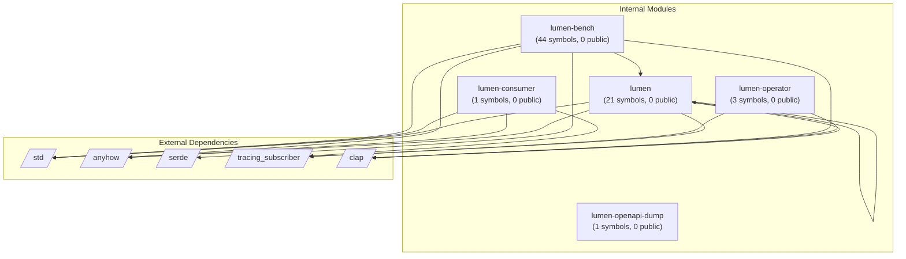

# Dependency Graph: Analyzed Project

## Overview

- **Internal Modules**: 5
- **External Dependencies**: 5
- **Total Relationships**: 15

## Module Graph

## Internal Modules

| Module | Path | Symbols | Public |
|--------|------|---------|--------|
| lumen | projects/lumen/src/bin/lumen.rs | 21 | 0 |
| lumen-operator | projects/lumen/src/bin/lumen-operator.rs | 3 | 0 |
| lumen-consumer | projects/lumen/src/bin/lumen-consumer.rs | 1 | 0 |
| lumen-bench | projects/lumen/src/bin/lumen-bench.rs | 44 | 0 |
| lumen-openapi-dump | projects/lumen/src/bin/lumen-openapi-dump.rs | 1 | 0 |

## External Dependencies

| Dependency |
|------------|
| std |
| anyhow |
| serde |
| tracing_subscriber |
| clap |

## Dependency Details

| From | To | Type |
|------|-----|------|
| lumen | std | import |
| lumen | anyhow | import |
| lumen | clap | import |
| lumen | tracing_subscriber | import |
| lumen | lumen | import |
| lumen-operator | clap | import |
| lumen-operator | tracing_subscriber | import |
| lumen-consumer | anyhow | import |
| lumen-consumer | std | import |
| lumen-consumer | tracing_subscriber | import |
| lumen-bench | std | import |
| lumen-bench | anyhow | import |
| lumen-bench | clap | import |
| lumen-bench | serde | import |
| lumen-bench | lumen | import |
