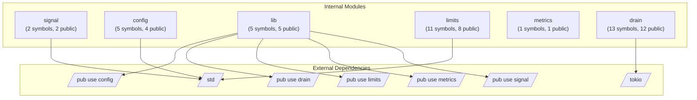

# Dependency Graph: Analyzed Project

## Overview

- **Internal Modules**: 6
- **External Dependencies**: 7
- **Total Relationships**: 9

## Module Graph

```mermaid
flowchart TD
    subgraph Internal["Internal Modules"]
        signal["signal\n(2 symbols, 2 public)"]
        config["config\n(5 symbols, 4 public)"]
        lib["lib\n(5 symbols, 5 public)"]
        limits["limits\n(11 symbols, 8 public)"]
        metrics["metrics\n(1 symbols, 1 public)"]
        drain["drain\n(13 symbols, 12 public)"]
    end
    subgraph External["External Dependencies"]
        pub_use_metrics[/"pub use metrics"/]
        pub_use_config[/"pub use config"/]
        pub_use_drain[/"pub use drain"/]
        std[/"std"/]
        pub_use_limits[/"pub use limits"/]
        pub_use_signal[/"pub use signal"/]
        tokio[/"tokio"/]
    end
    signal --> std
    config --> std
    lib --> pub_use_config
    lib --> pub_use_drain
    lib --> pub_use_limits
    lib --> pub_use_metrics
    lib --> pub_use_signal
    limits --> std
    drain --> tokio
```

## Internal Modules

| Module | Path | Symbols | Public |
|--------|------|---------|--------|
| signal | libs/server-core/src/signal.rs | 2 | 2 |
| config | libs/server-core/src/config.rs | 5 | 4 |
| lib | libs/server-core/src/lib.rs | 5 | 5 |
| limits | libs/server-core/src/limits.rs | 11 | 8 |
| metrics | libs/server-core/src/metrics.rs | 1 | 1 |
| drain | libs/server-core/src/drain.rs | 13 | 12 |

## External Dependencies

| Dependency |
|------------|
| pub use metrics |
| pub use config |
| pub use drain |
| std |
| pub use limits |
| pub use signal |
| tokio |

## Dependency Details

| From | To | Type |
|------|-----|------|
| signal | std | import |
| config | std | import |
| lib | pub use config | import |
| lib | pub use drain | import |
| lib | pub use limits | import |
| lib | pub use metrics | import |
| lib | pub use signal | import |
| limits | std | import |
| drain | tokio | import |
