## Logic: introspection builtins dispatch
<!-- type: logic lang: mermaid -->

```mermaid
---
id: introspection-builtins-dispatch
entry: start
nodes:
  start:             { kind: start,    label: "Call introspection builtin" }
  which_builtin:     { kind: decision, label: "Which builtin?" }
  globals_impl:      { kind: process,  label: "mb_globals: snapshot module namespace dict" }
  vars_codegen_arity: { kind: decision, label: "CODEGEN (cranelift/mod.rs IR emission): vars() call-site arg count == 0?" }
  vars_emit_locals:  { kind: process,  label: "emit call to mb_locals(0 args) — compile-time routing, no runtime branch" }
  vars_emit_vars:    { kind: process,  label: "emit call to mb_vars(1 arg) — compile-time routing" }
  locals_impl:       { kind: process,  label: "mb_locals: snapshot current frame locals dict" }
  vars_dispatch:     { kind: decision, label: "RUNTIME (builtins.rs mb_vars): arg has __dict__?" }
  vars_return_dict:  { kind: process,  label: "return arg.__dict__" }
  vars_typeerror:    { kind: terminal, label: "raise TypeError: vars() arg must have __dict__" }
  dir_has_dict:      { kind: process,  label: "mb_dir (builtins.rs): collect keys from obj.__dict__" }
  dir_walk_mro:      { kind: process,  label: "for each C in type(obj).__mro__, union C.__dict__.keys() into attr_set (helper in class.rs)" }
  dir_sort_dedup:    { kind: process,  label: "sort + deduplicate attr_set" }
  return_value:      { kind: terminal, label: "return result" }
edges:
  - from: start
    to: which_builtin
  - from: which_builtin
    to: globals_impl
    label: "globals()"
  - from: which_builtin
    to: vars_codegen_arity
    label: "vars()"
  - from: which_builtin
    to: locals_impl
    label: "locals()"
  - from: which_builtin
    to: dir_has_dict
    label: "dir(obj)"
  - from: globals_impl
    to: return_value
  - from: locals_impl
    to: return_value
  - from: vars_codegen_arity
    to: vars_emit_locals
    label: "yes (zero-arg call site)"
  - from: vars_codegen_arity
    to: vars_emit_vars
    label: "no (one-arg call site)"
  - from: vars_emit_locals
    to: locals_impl
  - from: vars_emit_vars
    to: vars_dispatch
  - from: vars_dispatch
    to: vars_return_dict
    label: "yes"
  - from: vars_dispatch
    to: vars_typeerror
    label: "no"
  - from: vars_return_dict
    to: return_value
  - from: dir_has_dict
    to: dir_walk_mro
  - from: dir_walk_mro
    to: dir_sort_dedup
  - from: dir_sort_dedup
    to: return_value
---
flowchart TD
    start([Call introspection builtin]) --> which_builtin{Which builtin?}
    which_builtin -->|globals()| globals_impl[mb_globals: snapshot module namespace dict]
    which_builtin -->|locals()| locals_impl[mb_locals: snapshot current frame locals dict]
    which_builtin -->|vars()| vars_codegen_arity{"CODEGEN cranelift/mod.rs IR emission\nvars() call-site arg count == 0?"}
    which_builtin -->|dir obj| dir_has_dict["mb_dir builtins.rs: collect keys from obj.__dict__"]
    globals_impl --> return_value
    locals_impl --> return_value
    vars_codegen_arity -->|"yes — zero-arg call site\nemit call to mb_locals 0 args"| vars_emit_locals[compile-time: emit call mb_locals 0 args]
    vars_codegen_arity -->|"no — one-arg call site\nemit call to mb_vars 1 arg"| vars_emit_vars[compile-time: emit call mb_vars 1 arg]
    vars_emit_locals --> locals_impl
    vars_emit_vars --> vars_dispatch
    vars_dispatch{"RUNTIME builtins.rs mb_vars\narg has __dict__?"} -->|yes| vars_return_dict[return arg.__dict__]
    vars_dispatch -->|no| vars_typeerror([raise TypeError: vars arg must have __dict__])
    vars_return_dict --> return_value
    dir_has_dict --> dir_walk_mro["for each C in type(obj).__mro__\nunion C.__dict__.keys() into attr_set\n(helper in class.rs)"]
    dir_walk_mro --> dir_sort_dedup[sort + deduplicate attr_set]
    dir_sort_dedup --> return_value([return result])
```
## Test Plan: introspection builtins verification

```mermaid
---
id: introspection-builtins-test-plan
requirements:
  r1_globals:
    id: R1
    text: "globals() returns a dict-like view of the current module-level namespace"
    kind: functional
    risk: high
    verify: test
  r2_locals:
    id: R2
    text: "locals() returns a dict snapshot of the current frame's local variables at function/module/class scope"
    kind: functional
    risk: high
    verify: test
  r3_vars:
    id: R3
    text: "vars(obj) returns obj.__dict__; vars() with no arg equals locals(); both JIT-compile without verifier errors"
    kind: functional
    risk: high
    verify: test
  r4_dir:
    id: R4
    text: "dir(obj) returns sorted list of attribute names from obj.__dict__ plus type(obj).__mro__ walk; non-empty for standard types"
    kind: functional
    risk: high
    verify: test
  r5_fixtures:
    id: R5
    text: "Conformance fixtures under builtins/introspection/ pin behavior against CPython 3.12 output"
    kind: functional
    risk: medium
    verify: test
elements:
  fix_globals_module_scope:
    kind: test
    type: "conformance-fixture/globals_module_scope.py"
  fix_locals_function_scope:
    kind: test
    type: "conformance-fixture/locals_function_scope.py"
  fix_locals_class_scope:
    kind: test
    type: "conformance-fixture/locals_class_scope.py"
  fix_vars_no_arg:
    kind: test
    type: "conformance-fixture/vars_no_arg.py"
  fix_vars_with_dict:
    kind: test
    type: "conformance-fixture/vars_with_dict.py"
  fix_vars_typeerror:
    kind: test
    type: "conformance-fixture/vars_typeerror.py"
  fix_dir_list:
    kind: test
    type: "conformance-fixture/dir_list.py"
  fix_dir_class:
    kind: test
    type: "conformance-fixture/dir_class.py"
relations:
  - { from: fix_globals_module_scope, verifies: r1_globals }
  - { from: fix_locals_function_scope, verifies: r2_locals }
  - { from: fix_locals_class_scope, verifies: r2_locals }
  - { from: fix_vars_no_arg, verifies: r3_vars }
  - { from: fix_vars_with_dict, verifies: r3_vars }
  - { from: fix_vars_typeerror, verifies: r3_vars }
  - { from: fix_dir_list, verifies: r4_dir }
  - { from: fix_dir_class, verifies: r4_dir }
  - { from: fix_globals_module_scope, verifies: r5_fixtures }
  - { from: fix_locals_function_scope, verifies: r5_fixtures }
  - { from: fix_locals_class_scope, verifies: r5_fixtures }
  - { from: fix_vars_no_arg, verifies: r5_fixtures }
  - { from: fix_vars_with_dict, verifies: r5_fixtures }
  - { from: fix_vars_typeerror, verifies: r5_fixtures }
  - { from: fix_dir_list, verifies: r5_fixtures }
  - { from: fix_dir_class, verifies: r5_fixtures }
---
requirementDiagram
    requirement R1 {
      id: R1
      text: "globals() returns module namespace dict"
      risk: high
      verifymethod: test
    }
    requirement R2 {
      id: R2
      text: "locals() returns frame locals snapshot"
      risk: high
      verifymethod: test
    }
    requirement R3 {
      id: R3
      text: "vars() both forms JIT-compile correctly"
      risk: high
      verifymethod: test
    }
    requirement R4 {
      id: R4
      text: "dir(obj) walks MRO, returns non-empty sorted list"
      risk: high
      verifymethod: test
    }
    requirement R5 {
      id: R5
      text: "Conformance fixtures pin CPython 3.12 behavior"
      risk: medium
      verifymethod: test
    }
    element fix_globals_module_scope {
      type: "conformance-fixture/globals_module_scope.py"
    }
    element fix_locals_function_scope {
      type: "conformance-fixture/locals_function_scope.py"
    }
    element fix_locals_class_scope {
      type: "conformance-fixture/locals_class_scope.py"
    }
    element fix_vars_no_arg {
      type: "conformance-fixture/vars_no_arg.py"
    }
    element fix_vars_with_dict {
      type: "conformance-fixture/vars_with_dict.py"
    }
    element fix_vars_typeerror {
      type: "conformance-fixture/vars_typeerror.py"
    }
    element fix_dir_list {
      type: "conformance-fixture/dir_list.py"
    }
    element fix_dir_class {
      type: "conformance-fixture/dir_class.py"
    }
    fix_globals_module_scope - verifies -> R1
    fix_locals_function_scope - verifies -> R2
    fix_locals_class_scope - verifies -> R2
    fix_vars_no_arg - verifies -> R3
    fix_vars_with_dict - verifies -> R3
    fix_vars_typeerror - verifies -> R3
    fix_dir_list - verifies -> R4
    fix_dir_class - verifies -> R4
    fix_globals_module_scope - verifies -> R5
    fix_locals_function_scope - verifies -> R5
    fix_locals_class_scope - verifies -> R5
    fix_vars_no_arg - verifies -> R5
    fix_vars_with_dict - verifies -> R5
    fix_vars_typeerror - verifies -> R5
    fix_dir_list - verifies -> R5
    fix_dir_class - verifies -> R5
```

<!-- type: test-plan lang: mermaid -->


## Changes
<!-- type: changes lang: yaml -->

```yaml
changes:
  - path: crates/mamba/src/runtime/builtins.rs
    action: modify
    impl_mode: hand-written
    description: |
      Register mb_globals and mb_locals as mamba builtins (currently undefined names).
      Fix mb_vars to correctly handle zero-arg form (delegate to mb_locals) and one-arg
      form (return arg.__dict__ or raise TypeError).
      mb_dir entry point lives here: register the builtin, collect keys from obj.__dict__
      (instance attributes only), then call the class.rs MRO helper to collect inherited
      attribute names, then sort and deduplicate the combined set. Does NOT contain the
      per-class MRO iteration loop — that is owned by class.rs.

  - path: crates/mamba/src/codegen/cranelift/mod.rs
    action: modify
    impl_mode: hand-written
    description: |
      Fix call-arity bug for vars() zero-arg invocation: codegen currently emits a 1-arg
      call site when vars() is called with no arguments, causing a JIT verifier error
      (mismatched argument count). The zero-arg path must emit a call to mb_locals (0 args)
      rather than the 1-arg mb_vars stub. This is a compile-time IR emission decision — the
      fix lives entirely in this file's call-site lowering, not in any runtime function body.

  - path: crates/mamba/src/runtime/class.rs
    action: modify
    impl_mode: hand-written
    description: |
      Add a per-class MRO iteration helper (e.g., mb_dir_mro_keys) that accepts a type
      object and returns the union of C.__dict__.keys() for each class C in
      type(obj).__mro__. This file owns only the MRO traversal loop; it does NOT register
      mb_dir as a builtin and does NOT touch obj.__dict__ directly — that is owned by
      builtins.rs. Called by mb_dir in builtins.rs after instance __dict__ collection.

  - path: crates/mamba/tests/fixtures/conformance/builtins/introspection/globals_module_scope.py
    action: create
    impl_mode: hand-written
    description: |
      Conformance fixture: module-level globals() returns a dict whose keys include
      module-level names. Pin that 'x' is present after assignment at module scope.

  - path: crates/mamba/tests/fixtures/conformance/builtins/introspection/globals_module_scope.py.expected
    action: create
    impl_mode: hand-written
    description: Expected CPython 3.12 output for globals_module_scope fixture.

  - path: crates/mamba/tests/fixtures/conformance/builtins/introspection/locals_function_scope.py
    action: create
    impl_mode: hand-written
    description: |
      Conformance fixture: locals() inside a function returns a dict whose keys include
      the function's parameters and local variables.

  - path: crates/mamba/tests/fixtures/conformance/builtins/introspection/locals_function_scope.py.expected
    action: create
    impl_mode: hand-written
    description: Expected CPython 3.12 output for locals_function_scope fixture.

  - path: crates/mamba/tests/fixtures/conformance/builtins/introspection/locals_class_scope.py
    action: create
    impl_mode: hand-written
    description: |
      Conformance fixture: locals() inside a class body returns the class namespace dict
      containing the class-level names defined so far.

  - path: crates/mamba/tests/fixtures/conformance/builtins/introspection/locals_class_scope.py.expected
    action: create
    impl_mode: hand-written
    description: Expected CPython 3.12 output for locals_class_scope fixture.

  - path: crates/mamba/tests/fixtures/conformance/builtins/introspection/vars_no_arg.py
    action: create
    impl_mode: hand-written
    description: |
      Conformance fixture: vars() with no argument returns the same keys as locals()
      in the same scope. Verified by comparing sorted key sets.

  - path: crates/mamba/tests/fixtures/conformance/builtins/introspection/vars_no_arg.py.expected
    action: create
    impl_mode: hand-written
    description: Expected CPython 3.12 output for vars_no_arg fixture.

  - path: crates/mamba/tests/fixtures/conformance/builtins/introspection/vars_with_dict.py
    action: create
    impl_mode: hand-written
    description: |
      Conformance fixture: vars(obj) for a user-defined instance returns obj.__dict__
      containing the instance attributes set in __init__.

  - path: crates/mamba/tests/fixtures/conformance/builtins/introspection/vars_with_dict.py.expected
    action: create
    impl_mode: hand-written
    description: Expected CPython 3.12 output for vars_with_dict fixture.

  - path: crates/mamba/tests/fixtures/conformance/builtins/introspection/vars_typeerror.py
    action: create
    impl_mode: hand-written
    description: |
      Conformance fixture: vars(1) raises TypeError because int has no __dict__.
      Pin the exception type name and message shape.

  - path: crates/mamba/tests/fixtures/conformance/builtins/introspection/vars_typeerror.py.expected
    action: create
    impl_mode: hand-written
    description: Expected CPython 3.12 output for vars_typeerror fixture.

  - path: crates/mamba/tests/fixtures/conformance/builtins/introspection/dir_list.py
    action: create
    impl_mode: hand-written
    description: |
      Conformance fixture: dir([1,2,3]) returns a sorted list that includes
      'append', 'sort', and '__iter__' as standard list method names.

  - path: crates/mamba/tests/fixtures/conformance/builtins/introspection/dir_list.py.expected
    action: create
    impl_mode: hand-written
    description: Expected CPython 3.12 output for dir_list fixture.

  - path: crates/mamba/tests/fixtures/conformance/builtins/introspection/dir_class.py
    action: create
    impl_mode: hand-written
    description: |
      Conformance fixture: dir(MyClass) for a class with single-inheritance walks the MRO
      and includes inherited method names from the parent class.

  - path: crates/mamba/tests/fixtures/conformance/builtins/introspection/dir_class.py.expected
    action: create
    impl_mode: hand-written
    description: Expected CPython 3.12 output for dir_class fixture.
```

# Reviews

## Review 2
**Verdict:** approved

- [logic] Codegen arity boundary: `vars_codegen_arity` node is now explicitly labeled "CODEGEN (cranelift/mod.rs IR emission): vars() call-site arg count == 0?" and `vars_dispatch` is labeled "RUNTIME (builtins.rs mb_vars): arg has __dict__?". Both the YAML node definitions and the rendered Mermaid flowchart carry the labels. Round-1 flag resolved.
- [logic] MRO walk specification: `dir_walk_mro` node now reads "for each C in type(obj).__mro__, union C.__dict__.keys() into attr_set (helper in class.rs)" in both the YAML and the rendered flowchart. Per-class iteration and the union step are both explicit. Round-1 flag resolved.
- [changes] mb_dir ownership split: `builtins.rs` owns registration + `obj.__dict__` key collection and explicitly disclaims the MRO loop; `class.rs` owns only `mb_dir_mro_keys` (MRO traversal, no registration, no `obj.__dict__` access). Descriptions are non-overlapping and unambiguous. Round-1 flag resolved.
- [test-plan] Unchanged from round-1 approval — 8 fixtures cover all five requirements with correct verifies relations. No issues.

## Review 1
**Verdict:** needs-revision

- [logic] The `vars()` zero-arg codegen arity fix is a compile-time decision (cranelift IR emission), not a runtime branch, yet the flowchart models only the runtime dispatch path. The logic section must add a separate codegen-layer node (e.g., a decision node labeled "vars() zero-arg? emit call to mb_locals(0 args) : emit call to mb_vars(1 arg)" at the codegen entry point) so the implementer knows the fix lives in cranelift IR generation, not in the runtime `mb_vars` body. Without this, an implementer reading only the logic section would not know whether to fix the arity at AST lowering, parse time, or IR emission — the changes section mentions cranelift/mod.rs in prose, but the logic flowchart is the authoritative dispatch contract and must make the compile-time / runtime boundary explicit.
- [logic] The `mb_dir` MRO walk node label "walk type(obj).__mro__ chain, collect attr names" is underspecified for implementation. The node should state the iteration rule: "for each C in type(obj).__mro__, union C.__dict__.keys() into attr_set" — without naming the dict-key source per MRO class, an implementer could miss collecting superclass `__dict__` entries and only walk the class list. The current label is one sentence away from being actionable; add the per-class key collection rule directly in the node label or as a note annotation on the edge from `dir_walk_mro`.
- [changes] The `mb_dir` fix is split across two files (`builtins.rs` registers and "walks MRO", `class.rs` "extends mb_dir to walk the MRO chain") with overlapping descriptions. Clarify which file owns which responsibility: `builtins.rs` should own registration + obj.__dict__ key collection, and `class.rs` should own the per-class MRO iteration helper. As written, both descriptions claim to "walk type(obj).__mro__", which would leave an implementer uncertain where to write the loop.
