# Mamba Runtime Shutdown Conformance

## Runtime Teardown Logic

```mermaid
---
id: mamba-runtime-shutdown
entry: start
nodes:
  start: { kind: start, label: "CompilerSession::run or run_source begins" }
  register_native_modules: { kind: process, label: "Register native modules and registry bridge callbacks" }
  initialize_paths: { kind: process, label: "Initialize script dir, search paths, and project search path" }
  compile_entry: { kind: process, label: "Parse, type-check, lower, and JIT compile entry module" }
  execute_entry: { kind: process, label: "Call JIT entry while entry backend remains in scope" }
  pending_exception: { kind: decision, label: "Uncaught traceback exists after entry returns?" }
  record_failure: { kind: process, label: "Take traceback into owned status and mark failure without exiting" }
  record_success: { kind: process, label: "Mark success status" }
  cleanup_runtime: { kind: process, label: "Clear runtime registries that hold MbValue or function addresses" }
  clear_gc_tracking: { kind: process, label: "Discard GC tracking without collecting live JIT stack values" }
  drop_module_backends: { kind: process, label: "Drop imported module JIT backends after registry and GC state are cleared" }
  drop_entry_backend: { kind: process, label: "Drop entry JIT backend last, after cleanup guard completes" }
  failure_recorded: { kind: decision, label: "Failure status recorded?" }
  return_failure: { kind: terminal, label: "Print saved traceback and return non-zero failure" }
  return_ok: { kind: terminal, label: "Return success status with no signal abort or segfault" }
edges:
  - { from: start, to: register_native_modules }
  - { from: register_native_modules, to: initialize_paths }
  - { from: initialize_paths, to: compile_entry }
  - { from: compile_entry, to: execute_entry }
  - { from: execute_entry, to: pending_exception }
  - { from: pending_exception, to: record_failure, label: "yes" }
  - { from: pending_exception, to: record_success, label: "no" }
  - { from: record_failure, to: cleanup_runtime }
  - { from: record_success, to: cleanup_runtime }
  - { from: cleanup_runtime, to: clear_gc_tracking }
  - { from: clear_gc_tracking, to: drop_module_backends }
  - { from: drop_module_backends, to: drop_entry_backend }
  - { from: drop_entry_backend, to: failure_recorded }
  - { from: failure_recorded, to: return_failure, label: "yes" }
  - { from: failure_recorded, to: return_ok, label: "no" }
---
flowchart TD
    start([run/run_source begins]) --> register_native_modules[register native modules and callbacks]
    register_native_modules --> initialize_paths[initialize script dir and search paths]
    initialize_paths --> compile_entry[parse type-check lower and JIT compile entry]
    compile_entry --> execute_entry[call JIT entry while backend is alive]
    execute_entry --> pending_exception{uncaught traceback?}
    pending_exception -->|yes| record_failure[save traceback and mark failure]
    pending_exception -->|no| record_success[mark success]
    record_failure --> cleanup_runtime[clear runtime registries]
    record_success --> cleanup_runtime
    cleanup_runtime --> clear_gc_tracking[discard GC tracking]
    clear_gc_tracking --> drop_module_backends[drop imported module JIT backends]
    drop_module_backends --> drop_entry_backend[drop entry backend last]
    drop_entry_backend --> failure_recorded{failure recorded?}
    failure_recorded -->|yes| return_failure([print saved traceback and fail])
    failure_recorded -->|no| return_ok([return success])
```

<!-- type: logic lang: mermaid -->



## Test Plan

```mermaid
---
id: mamba-runtime-shutdown-test-plan
requirements:
  no_signal_shutdown:
    id: R1
    text: "The four previously crashing conformance fixtures exit normally after producing expected stdout"
    kind: functional
    risk: high
    verify: test
  cleanup_order:
    id: R2
    text: "Runtime cleanup clears registries and GC tracking before dropping module and entry JIT backends"
    kind: design-constraint
    risk: high
    verify: inspection
  regression_coverage:
    id: R3
    text: "Regression coverage includes at least one file-import fixture and one stdlib-heavy fixture"
    kind: functional
    risk: high
    verify: test
  mbvalue_abi:
    id: R4
    text: "MbValue is FFI-safe for extern dispatch and remains a 64-bit transparent value"
    kind: interface
    risk: medium
    verify: test
  native_modules_feature:
    id: R5
    text: "The native-modules Cargo feature is declared and cargo check accepts it"
    kind: interface
    risk: medium
    verify: test
  generator_registry_reset:
    id: R6
    text: "Runtime cleanup discards stale generator handles without resuming suspended coroutine bodies"
    kind: design-constraint
    risk: high
    verify: test
  store_setter_ownership:
    id: R7
    text: "Cranelift global and cell stores delegate overwritten-value release to runtime setters exactly once"
    kind: design-constraint
    risk: high
    verify: inspection
  entry_epilogue_lifetime:
    id: R8
    text: "The top-level entry body does not release borrowed runtime values in its JIT epilogue"
    kind: design-constraint
    risk: high
    verify: inspection
  float_hash_range:
    id: R9
    text: "Non-integral float hashes fit inside Mamba's 48-bit integer payload"
    kind: functional
    risk: medium
    verify: test
  conformance_harness_isolation:
    id: R10
    text: "The release conformance stdout golden gate runs each fixture in an isolated mamba process so one long test process cannot accumulate stale JIT code pages"
    kind: design-constraint
    risk: high
    verify: test
elements:
  conformance_full:
    kind: test
    type: "cargo test -p mamba --test conformance_tests"
  shutdown_fixture_tests:
    kind: test
    type: "focused conformance regression fixtures"
  runtime_cleanup_tests:
    kind: test
    type: "mamba runtime cleanup unit or integration tests"
  cargo_feature_check:
    kind: test
    type: "cargo check -p mamba --features native-modules"
  abi_compile_check:
    kind: test
    type: "cargo check -p mamba"
  generator_cleanup_unit:
    kind: test
    type: "cargo test -p mamba test_cleanup_all_runtime_state_discards_generator_handles"
  hash_unit:
    kind: test
    type: "cargo test -p mamba test_hash_non_integral_float_fits_mamba_int"
  codegen_ownership_inspection:
    kind: inspection
    type: "manual inspection of Cranelift StoreGlobal/StoreCell and entry epilogue"
relations:
  - { from: conformance_full, verifies: no_signal_shutdown }
  - { from: conformance_full, verifies: generator_registry_reset }
  - { from: conformance_full, verifies: float_hash_range }
  - { from: conformance_full, verifies: conformance_harness_isolation }
  - { from: shutdown_fixture_tests, verifies: no_signal_shutdown }
  - { from: shutdown_fixture_tests, verifies: regression_coverage }
  - { from: runtime_cleanup_tests, verifies: cleanup_order }
  - { from: abi_compile_check, verifies: mbvalue_abi }
  - { from: cargo_feature_check, verifies: native_modules_feature }
  - { from: generator_cleanup_unit, verifies: generator_registry_reset }
  - { from: hash_unit, verifies: float_hash_range }
  - { from: codegen_ownership_inspection, verifies: store_setter_ownership }
  - { from: codegen_ownership_inspection, verifies: entry_epilogue_lifetime }
---
requirementDiagram
    requirement R1 {
      id: R1
      text: "previously crashing fixtures exit normally"
      risk: high
      verifymethod: test
    }
    requirement R2 {
      id: R2
      text: "cleanup order preserves JIT lifetimes"
      risk: high
      verifymethod: inspection
    }
    requirement R3 {
      id: R3
      text: "regression coverage includes import and stdlib cases"
      risk: high
      verifymethod: test
    }
    requirement R4 {
      id: R4
      text: "MbValue ABI is transparent and 64-bit"
      risk: medium
      verifymethod: test
    }
    requirement R5 {
      id: R5
      text: "native-modules feature is declared"
      risk: medium
      verifymethod: test
    }
    requirement R6 {
      id: R6
      text: "cleanup discards stale generator handles"
      risk: high
      verifymethod: test
    }
    requirement R7 {
      id: R7
      text: "store setters own overwritten-value release"
      risk: high
      verifymethod: inspection
    }
    requirement R8 {
      id: R8
      text: "entry epilogue avoids borrowed-value release"
      risk: high
      verifymethod: inspection
    }
    requirement R9 {
      id: R9
      text: "float hash fits 48-bit int payload"
      risk: medium
      verifymethod: test
    }
    requirement R10 {
      id: R10
      text: "conformance fixtures run in isolated mamba processes"
      risk: high
      verifymethod: test
    }
    element conformance_full {
      type: "cargo test -p mamba --test conformance_tests"
    }
    element shutdown_fixture_tests {
      type: "focused shutdown regression fixtures"
    }
    element runtime_cleanup_tests {
      type: "runtime cleanup tests"
    }
    element abi_compile_check {
      type: "cargo check -p mamba"
    }
    element cargo_feature_check {
      type: "cargo check -p mamba --features native-modules"
    }
    element generator_cleanup_unit {
      type: "cleanup generator handle regression"
    }
    element hash_unit {
      type: "non-integral float hash unit"
    }
    element codegen_ownership_inspection {
      type: "Cranelift ownership inspection"
    }
    conformance_full - verifies -> R1
    conformance_full - verifies -> R6
    conformance_full - verifies -> R9
    conformance_full - verifies -> R10
    shutdown_fixture_tests - verifies -> R1
    shutdown_fixture_tests - verifies -> R3
    runtime_cleanup_tests - verifies -> R2
    abi_compile_check - verifies -> R4
    cargo_feature_check - verifies -> R5
    generator_cleanup_unit - verifies -> R6
    hash_unit - verifies -> R9
    codegen_ownership_inspection - verifies -> R7
    codegen_ownership_inspection - verifies -> R8
```

<!-- type: test-plan lang: mermaid -->



## Changes
<!-- type: changes lang: yaml -->

```yaml
changes:
  - path: crates/mamba/src/driver/mod.rs
    action: modify
    impl_mode: hand-written
    description: >
      Wrap JIT execution in run and run_source with a deterministic runtime
      cleanup path. The entry CraneliftJitBackend must stay alive until after
      the JIT entrypoint returns and uncaught exceptions are surfaced. Cleanup
      must run for normal returns and must not call std::process::exit before
      runtime state is reset. The resulting process status must still be
      non-zero for uncaught exceptions.

  - path: crates/mamba/src/runtime/mod.rs
    action: modify
    impl_mode: hand-written
    description: >
      Keep cleanup_all_runtime_state as the single teardown entrypoint and make
      the ordering explicit for shutdown conformance: runtime registries first,
      GC tracking clear second, imported module JIT backend cleanup third.
      Generator handles must be discarded without resuming suspended coroutine
      bodies. The function must be idempotent and panic-safe when called after
      both empty and populated runtime executions.

  - path: crates/mamba/src/runtime/generator.rs
    action: modify
    impl_mode: hand-written
    description: >
      Add a runtime-teardown cleanup path that drops the generator registry,
      coroutine stacks, and transfer thread-locals without invoking
      mb_generator_close. This prevents stale integer generator handles from
      shadowing ordinary int method dispatch in subsequent in-process
      conformance fixtures.

  - path: crates/mamba/src/runtime/module.rs
    action: modify
    impl_mode: hand-written
    description: >
      Ensure module registry cleanup resets MODULES without dropping mixed-owned
      module attrs, clears SEARCH_PATHS,
      NATIVE_FUNC_ADDRS, VARIADIC_SYMBOL_IDS, VARIADIC_FUNC_ADDRS,
      KWARGS_SYMBOL_IDS, KWARGS_FUNC_ADDRS, SCRIPT_DIR, and
      CURRENT_MODULE_PACKAGE without dropping MODULE_JIT_BACKENDS until the
      explicit backend-cleanup phase. The backend cleanup phase drops backend
      handles only after mixed-owned module attrs have been detached. Add or
      update tests that prove re-registering modules after cleanup starts from a
      clean registry.

  - path: crates/mamba/src/runtime/value.rs
    action: modify
    impl_mode: hand-written
    description: >
      Mark MbValue as repr(transparent) over its u64 storage. Add a compile-time
      or unit-test assertion that MbValue has size 8 and alignment compatible
      with u64 so extern dispatchers no longer trigger the FFI-safety warning
      cluster.

  - path: crates/mamba/Cargo.toml
    action: modify
    impl_mode: hand-written
    description: >
      Declare the native-modules feature and wire the first-party mamba binding
      crates used by src/main.rs as optional dependencies, or remove the stale
      feature gates if the project decides not to support force-linking them
      from the mamba binary. The accepted outcome must make cargo check
      --features native-modules succeed.

  - path: crates/mamba/src/main.rs
    action: verify
    impl_mode: hand-written
    description: >
      Keep force-link cfg gates consistent with Cargo.toml. The binary should
      either force-link the declared optional native module crates when the
      feature is enabled or contain no stale cfg(feature = "native-modules")
      gates.

  - path: crates/mamba/src/codegen/cranelift/jit.rs
    action: modify
    impl_mode: hand-written
    description: >
      Remove pre-release of overwritten globals and cells from JIT store
      emission because mb_global_set_id and mb_cell_set already own retain and
      release. Skip return-time local releases for the synthetic top-level
      __main__ body so borrowed runtime values survive until centralized
      cleanup.

  - path: crates/mamba/src/codegen/cranelift/mod.rs
    action: modify
    impl_mode: hand-written
    description: >
      Mirror the Cranelift JIT ownership fixes in the alternate Cranelift
      backend: runtime setters are the sole overwritten-value release point,
      and top-level entry epilogue release is disabled.

  - path: crates/mamba/src/runtime/builtins.rs
    action: modify
    impl_mode: hand-written
    description: >
      Fold non-integral float hash bits into the 48-bit MbValue integer payload
      before constructing the hash result so full conformance no longer panics
      on hash(1.5).

  - path: crates/mamba/tests/conformance_tests.rs
    action: modify
    impl_mode: hand-written
    description: >
      Keep the release conformance suite as a stdout golden test, but execute
      each fixture through the mamba CLI in a separate child process. This
      preserves the historical stdout-only semantics while avoiding a single
      long-running test process accumulating Cranelift JIT code pages and stale
      runtime function addresses across hundreds of fixtures.

  - path: crates/mamba/tests/runtime_shutdown_conformance_tests.rs
    action: create
    impl_mode: hand-written
    description: >
      Add focused regression coverage for the abnormal shutdown path. Include a
      file-import case equivalent to imports/test_import.py and a stdlib-heavy
      case equivalent to one of itertools or re broad fixtures. The tests must
      assert normal process exit, not only stdout equality.

  - path: tests/fixtures/conformance/imports/test_import.py
    action: verify
    impl_mode: hand-written
    description: >
      Existing full-suite fixture remains part of the release conformance gate
      and must no longer terminate with signal 6.

  - path: tests/fixtures/conformance/stdlib/itertools/edges.py
    action: verify
    impl_mode: hand-written
    description: >
      Existing full-suite fixture remains part of the release conformance gate
      and must no longer terminate with signal 11.

  - path: tests/fixtures/conformance/stdlib/re/broad.py
    action: verify
    impl_mode: hand-written
    description: >
      Existing full-suite fixture remains part of the release conformance gate
      and must no longer terminate with signal 11.

  - path: tests/fixtures/conformance/stdlib/re/ops_broad.py
    action: verify
    impl_mode: hand-written
    description: >
      Existing full-suite fixture remains part of the release conformance gate
      and must no longer terminate with signal 11.
```

# Reviews

## Review 1
**Verdict:** needs-revision

- [logic] The `pending_exception -> report_exception` branch terminates before `cleanup_runtime`, which contradicts the `changes` requirement that shutdown must not call `std::process::exit` before runtime state is reset. Route both success and exception outcomes through cleanup, then return either success or failure status after JIT/runtime teardown.

## Review 2
**Verdict:** approved

- [logic] Prior finding addressed: both success and exception paths now record status, pass through runtime cleanup, clear GC tracking, drop module and entry JIT backends, then return success or failure after teardown.
