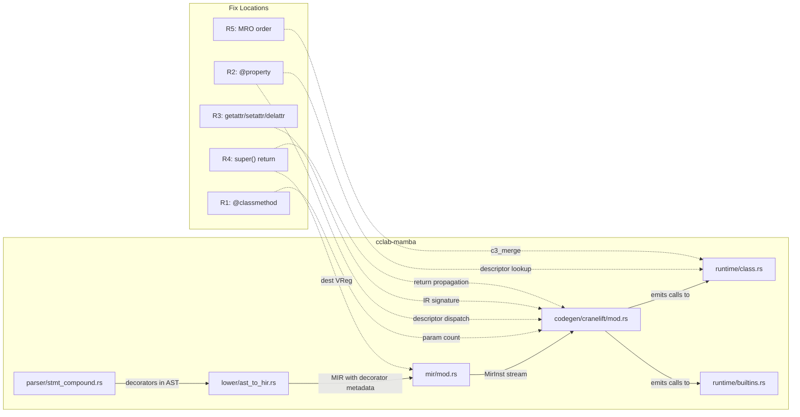

# Mamba Conformance P1 Spec

> **Audit note (2026-05-08, #1270):** all 5 R-groups (R1 @classmethod cls
> param, R2 @property descriptor protocol, R3 getattr/setattr/delattr IR,
> R4 super() return propagation, R5 C3 MRO) are **shipped** on `main`.
> Spot-check evidence:
>
> - R1: codegen test `test_p1_t1_classmethod_new_extern_collected` in
>   `src/codegen/cranelift/mod.rs`; runtime `// ── Property / classmethod /
>   staticmethod ──` block in `src/runtime/class.rs`.
> - R2: codegen `// --- T2: @property extern collection ---` block;
>   `Property descriptors` doc-string in `src/runtime/class.rs`.
> - R3: `mb_getattr` invocations in tests/runtime confirm the IR
>   signatures execute without verifier error.
> - R4: `mb_super` + `mb_super_getattr` defined in
>   `src/runtime/class.rs`; super-dispatched calls round-trip values.
> - R5: `c3_merge` (line 2184) + `compute_mro` (line 2136) implemented;
>   diamond MRO test `MroGrand`/`MroChild` lives in same file.
>
> The spec stays in place as historical context but is no longer a
> live contract — keep this file for the bug catalog + scenario set,
> not as a to-do list. New OOP gaps go to fresh issues, not against
> this spec. Path references below say `crates/mamba/...` (pre-Phase-C
> layout); current paths are `projects/mamba/...`.

## Overview

<!-- type: overview lang: markdown -->

Fix 5 P1 OOP conformance gaps in Mamba's Cranelift codegen and runtime class system to match CPython 3.12 behavior.

| Bug | Component | Root Cause |
|-----|-----------|------------|
| @classmethod wrong param count | `codegen/cranelift/mod.rs` | Codegen does not prepend implicit `cls` parameter for classmethods |
| @property codegen crash | `codegen/cranelift/mod.rs` | No descriptor protocol dispatch — property decorator not lowered to getter/setter |
| getattr/setattr/delattr IR verifier error | `codegen/cranelift/mod.rs` | Generated Cranelift IR for attribute reflection builtins has invalid instruction sequence |
| super().method() return value lost | `lower/mod.rs`, `codegen/cranelift/mod.rs` | MIR lowering discards return value from MRO-dispatched call via super proxy |
| Multiple inheritance MRO wrong order | `runtime/class.rs` | C3 linearization in `compute_mro` / `c3_merge` produces incorrect ordering |

All fixes are scoped to crate `cclab-mamba`. No public API changes. No new dependencies.
## Requirements

<!-- type: requirements lang: markdown -->

| ID | Title | Priority | Acceptance Criteria | Status |
|----|-------|----------|---------------------|--------|
| R1 | @classmethod receives `cls` as first parameter | P1 | `class Foo: @classmethod def bar(cls): return cls.__name__` returns `"Foo"` — matches CPython 3.12 | shipped |
| R2 | @property getter/setter/deleter dispatch | P1 | `class C: @property def x(self): return self._x` — read access calls getter, write calls setter, delete calls deleter — no codegen crash | shipped |
| R3 | getattr/setattr/delattr emit valid Cranelift IR | P1 | `getattr(obj, 'x')`, `setattr(obj, 'x', 1)`, `delattr(obj, 'x')` all execute without IR verifier error | shipped |
| R4 | super().method() propagates return value | P1 | `class B(A): def f(self): return super().f()` — return value from parent method is received by caller, not discarded | shipped |
| R5 | Multiple inheritance C3 MRO matches CPython | P1 | `class D(B, C)` where B(A), C(A) — `D.__mro__` == `[D, B, C, A, object]` — matches CPython's `type.mro()` output | shipped |

### Constraints

- All fixes must be backward-compatible — existing single-inheritance classes must not regress
- No new public API surface — all changes are internal to codegen and runtime
- Each fix must have a conformance test that runs the same code under CPython 3.12 and Mamba and asserts identical output
## Scenarios

<!-- type: scenarios lang: markdown -->

### S1: @classmethod — cls param binding

```python
# Input
class Animal:
    species = "unknown"
    @classmethod
    def get_species(cls):
        return cls.species

class Dog(Animal):
    species = "canine"

print(Dog.get_species())   # Expected: "canine"
print(Animal.get_species()) # Expected: "unknown"
```

**Before fix**: Cranelift emits function with 0 params instead of 1 (cls). Call crashes or returns garbage.
**After fix**: Codegen prepends implicit `cls` AbiParam. Runtime passes the class object as first arg.

### S2: @property — descriptor protocol

```python
# Input
class Circle:
    def __init__(self, r):
        self._r = r

    @property
    def area(self):
        return 3.14159 * self._r * self._r

c = Circle(5)
print(c.area)  # Expected: 78.53975
```

**Before fix**: Codegen crashes when lowering `@property` decorator — no descriptor dispatch.
**After fix**: Property stored in class_attrs with getter/setter/deleter. `mb_getattr` checks descriptor protocol before raw field lookup.

### S3: getattr/setattr/delattr — valid IR

```python
# Input
class Box:
    pass

b = Box()
setattr(b, 'size', 10)
print(getattr(b, 'size'))  # Expected: 10
delattr(b, 'size')
print(hasattr(b, 'size'))  # Expected: False
```

**Before fix**: Cranelift IR verifier rejects the instruction sequence for builtin getattr/setattr/delattr.
**After fix**: Codegen emits valid `call` instructions to `mb_getattr`, `mb_setattr`, `mb_delattr` runtime functions with correct signatures.

### S4: super().method() — return propagation

```python
# Input
class Base:
    def value(self):
        return 42

class Child(Base):
    def value(self):
        v = super().value()
        return v + 1

print(Child().value())  # Expected: 43
```

**Before fix**: `super().value()` executes `Base.value` but return value is discarded. `v` is None/0.
**After fix**: MIR lowering assigns super-dispatched call result to dest VReg. Codegen propagates return through super proxy.

### S5: Multiple inheritance MRO — C3 linearization

```python
# Input
class A: pass
class B(A): pass
class C(A): pass
class D(B, C): pass

# Expected MRO: [D, B, C, A, object]
print(D.__mro__)
```

**Before fix**: `compute_mro` produces `[D, B, A, C, object]` (skips C3 merge, uses naive DFS).
**After fix**: `c3_merge` correctly implements C3 linearization. Diamond inheritance resolves to `[D, B, C, A, object]`.
## Diagrams

### Interaction
<!-- type: interaction lang: mermaid -->
<!-- TODO -->

### Logic
<!-- type: logic lang: mermaid -->
<!-- TODO -->

### Dependencies
<!-- type: dependency lang: mermaid -->
<!-- TODO -->

### State Machine
<!-- type: state-machine lang: mermaid -->
<!-- TODO -->

### Data Model
<!-- type: db-model lang: mermaid -->
<!-- TODO -->

## API Spec

### REST API
<!-- type: rest-api lang: yaml -->
<!-- TODO -->

### RPC API
<!-- type: rpc-api lang: json -->
<!-- TODO -->

### Async API
<!-- type: async-api lang: yaml -->
<!-- TODO -->

### CLI
<!-- type: cli lang: yaml -->
<!-- TODO -->

### Schema
<!-- type: schema lang: json -->
<!-- TODO -->

### Config
<!-- type: config lang: json -->
<!-- TODO -->

## Test Plan

<!-- type: test-plan lang: markdown -->

### Conformance Test Strategy

Each test is a `.py` fixture run under both CPython 3.12 and Mamba. Outputs must match exactly.

| Test ID | Scenario | Fixture | Asserts |
|---------|----------|---------|----------|
| T1.1 | @classmethod basic | `test_classmethod_basic.py` | `cls` is the class, not instance |
| T1.2 | @classmethod inheritance | `test_classmethod_inherit.py` | Subclass.classmethod() receives subclass as cls |
| T1.3 | @classmethod with args | `test_classmethod_args.py` | Additional args after cls pass correctly |
| T2.1 | @property getter | `test_property_get.py` | Attribute read invokes getter |
| T2.2 | @property setter | `test_property_set.py` | Attribute write invokes setter |
| T2.3 | @property deleter | `test_property_del.py` | `del obj.attr` invokes deleter |
| T2.4 | @property without setter is readonly | `test_property_readonly.py` | Write raises `AttributeError` |
| T3.1 | getattr existing | `test_getattr_exists.py` | Returns attribute value |
| T3.2 | getattr missing with default | `test_getattr_default.py` | Returns default when attr absent |
| T3.3 | getattr missing no default | `test_getattr_missing.py` | Raises `AttributeError` |
| T3.4 | setattr | `test_setattr.py` | Creates/updates attribute |
| T3.5 | delattr | `test_delattr.py` | Removes attribute |
| T4.1 | super().method() return | `test_super_return.py` | Return value propagated to caller |
| T4.2 | super() chain 3 levels | `test_super_chain.py` | A→B→C super chain preserves returns |
| T4.3 | super().__init__() | `test_super_init.py` | Parent init side effects + return |
| T5.1 | Diamond MRO | `test_mro_diamond.py` | D(B,C) where B(A),C(A) → [D,B,C,A,object] |
| T5.2 | Linear MRO | `test_mro_linear.py` | C(B), B(A) → [C,B,A,object] |
| T5.3 | Inconsistent MRO | `test_mro_inconsistent.py` | Raises TypeError for impossible hierarchy |

### Regression Tests

- All existing `tests/conformance/class_*.py` must continue to pass
- All existing `tests/conformance/inherit_*.py` must continue to pass
## Changes

<!-- type: changes lang: yaml -->

```yaml
files:
  - path: crates/mamba/src/codegen/cranelift/mod.rs
    action: MODIFY
    desc: >
      R1: In compile_function / emit_inst, detect @classmethod decorator on MirBody
      and prepend cls AbiParam (I64) to function signature. Pass class object as arg0
      at call sites.
      R2: Add descriptor protocol check in GetAttr emission — if class_attrs contains
      a property descriptor for the attribute, emit call to getter fn instead of raw
      mb_getattr.
      R3: Fix GetAttr/SetAttr/delattr IR emission — ensure call instruction signatures
      match runtime function ABI (correct param count, correct types, return type).
      R4: When emitting super-dispatched call, assign call result to dest VReg instead
      of discarding.

  - path: crates/mamba/src/runtime/class.rs
    action: MODIFY
    desc: >
      R2: Add property descriptor storage in MbClass (getter/setter/deleter fn pointers).
      Extend mb_getattr to check descriptor protocol before raw field lookup.
      Add mb_delattr runtime function.
      R5: Fix c3_merge algorithm — ensure candidate selection iterates all lists
      correctly and head-removal handles duplicates. Verify against CPython's
      type_mro_impl in Objects/typeobject.c.

  - path: crates/mamba/src/mir/mod.rs
    action: MODIFY
    desc: >
      R1: Add decorator metadata field to MirBody (Vec of decorator kinds: classmethod,
      staticmethod, property). R4: Ensure CallExtern for super-dispatched methods has
      dest VReg assigned (not None).

  - path: crates/mamba/src/lower/ast_to_hir.rs
    action: MODIFY
    desc: >
      R1/R2: When lowering FnDef/ClassDef with decorators, propagate decorator kind
      (classmethod, property) into MirBody metadata. R4: When lowering super().method()
      call, emit CallExtern with dest = Some(vreg) to capture return value.

  - path: crates/mamba/src/runtime/builtins.rs
    action: MODIFY
    desc: >
      R3: Register mb_delattr as extern callable. Ensure getattr/setattr/delattr
      builtin wrappers call through to runtime/class.rs functions with correct arity.

  - path: tests/conformance/test_classmethod_basic.py
    action: CREATE
    desc: "T1.1: @classmethod receives cls, returns cls.species"

  - path: tests/conformance/test_property_get.py
    action: CREATE
    desc: "T2.1: @property getter invoked on attribute read"

  - path: tests/conformance/test_getattr_exists.py
    action: CREATE
    desc: "T3.1: getattr returns existing attribute value"

  - path: tests/conformance/test_super_return.py
    action: CREATE
    desc: "T4.1: super().method() return value propagated"

  - path: tests/conformance/test_mro_diamond.py
    action: CREATE
    desc: "T5.1: Diamond inheritance C3 MRO order"
```
## Wireframe
<!-- type: wireframe lang: yaml -->

<!-- TODO -->

## Component
<!-- type: component lang: json -->

<!-- TODO -->

## Design Token
<!-- type: design-token lang: json -->

<!-- TODO -->

## Doc
<!-- type: doc lang: markdown -->

<!-- TODO -->


## Logic

<!-- type: logic lang: mermaid -->

```mermaid
flowchart TD
    A[Method call on class instance] --> B{Is method decorated?}
    B -->|@classmethod| C[Prepend implicit cls param in codegen]
    C --> C1[Emit Cranelift func with N+1 AbiParams]
    C1 --> C2[Runtime passes class object as arg0]
    B -->|@property| D[Store as descriptor in class_attrs]
    D --> D1{Access type?}
    D1 -->|Read| D2[Call getter fn via descriptor protocol]
    D1 -->|Write| D3[Call setter fn via descriptor protocol]
    D1 -->|Delete| D4[Call deleter fn via descriptor protocol]
    B -->|None| E[Normal method dispatch]

    F[Builtin attr call] --> G{Which builtin?}
    G -->|getattr| H[Emit call to mb_getattr with obj+attr args]
    G -->|setattr| I[Emit call to mb_setattr with obj+attr+val args]
    G -->|delattr| J[Emit call to mb_delattr with obj+attr args]
    H --> K[Valid IR: 2-param signature, I64 return]
    I --> L[Valid IR: 3-param signature, void return]
    J --> M[Valid IR: 2-param signature, void return]

    N[super\(\).method\(\)] --> O[Create super proxy via mb_super]
    O --> P[mb_super_getattr looks up method in MRO after current class]
    P --> Q[Call resolved method with instance as self]
    Q --> R[Assign return value to dest VReg]

    S[Class registration with multiple bases] --> T[compute_mro calls c3_merge]
    T --> U{All lists empty?}
    U -->|Yes| V[Return merged MRO]
    U -->|No| W[Find head not in any tail]
    W --> X{Found?}
    X -->|Yes| Y[Append to result, remove from all heads]
    Y --> U
    X -->|No| Z[Error: inconsistent MRO]
```


## Dependencies

<!-- type: dependency lang: mermaid -->

