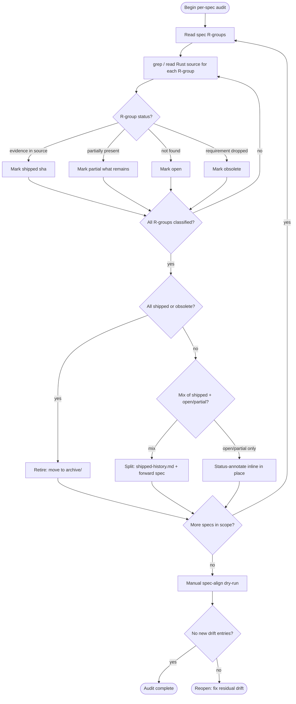

## Logic: audit decision tree
<!-- type: logic lang: mermaid -->


## Scenarios: per-spec audit findings
<!-- type: scenarios lang: yaml -->

```yaml
specs:
  - id: spec-1
    path: .aw/tech-design/cclab-mamba/logic/mamba-runtime-bugs-spec.md
    drift_type: all_shipped
    output_shape: retire
    rgroups:
      - id: R1
        title: Semicolon as statement separator
        status: shipped
        evidence: >
          crates/mamba/src/parser/stmt.rs handles TokenKind::Semicolon in suite
          parsing at lines 562-595; both single-line and indented-block paths
          consume consecutive semicolons in a while loop.
      - id: R2
        title: ZeroDivisionError on floor division by zero
        status: shipped
        evidence: >
          crates/mamba/src/runtime/builtins.rs:2511 mb_floordiv() calls
          mb_raise("ZeroDivisionError") for both int and float zero-divisor
          paths; unit test at line 3688 asserts ZeroDivisionError is raised.
      - id: R3
        title: Decorator preserves function return value
        status: shipped
        evidence: >
          crates/mamba/src/lower/hir_to_mir.rs tracks pending_decorators and
          decorated_func_return_tys; lowering applies decorator chain and
          propagates return type through decorated_func_syms.
      - id: R4
        title: Nested f-string evaluation
        status: shipped
        evidence: >
          crates/mamba/src/parser/expr.rs:558-564 strip_fstring_literal()
          detects inner f-string literals and recursively calls
          parse_fstring_parts(); FStringPart::Expr wraps the inner result.
      - id: R5
        title: json.dumps returns serialized string
        status: shipped
        evidence: >
          crates/mamba/src/runtime/stdlib/json_mod.rs dispatch_dumps() returns
          mb_json_dumps() on all code paths (lines 21, 40, 50, 56, 61); no
          dropped return.
    action: >
      Retire: move file to .aw/tech-design/archive/mamba-runtime-bugs-spec.md.
      All 5 R-groups shipped; no forward-looking work remains.

  - id: spec-2
    path: .aw/tech-design/cclab-mamba/logic/oop-conformance.md
    drift_type: all_shipped
    output_shape: retire
    rgroups:
      - id: R1
        title: "@classmethod receives cls as first parameter"
        status: shipped
        evidence: >
          crates/mamba/src/runtime/class.rs implements mb_classmethod_new()
          and descriptor dispatch at lines 2211-2229, 3301-3481; classmethod
          wrapper stores and passes class name as cls arg. Codegen collects
          mb_classmethod_new as a used extern (cranelift/mod.rs:1585).
      - id: R2
        title: "@property getter/setter/deleter dispatch"
        status: shipped
        evidence: >
          crates/mamba/src/runtime/class.rs:2119 property/classmethod/staticmethod
          section implements descriptor kind enum; codegen collects mb_property_new
          as used extern (cranelift/mod.rs:1608). lower/hir_to_mir.rs:196-226
          detects property decorator variants (getter/setter/deleter).
      - id: R3
        title: getattr/setattr/delattr emit valid Cranelift IR
        status: shipped
        evidence: >
          crates/mamba/src/codegen/cranelift/mod.rs:50-51 collects mb_getattr
          and mb_setattr for MirInst::GetAttr/SetAttr; lines 566-583 emit call
          instructions with correct signatures. Tests at lines 1458-1500 verify
          mb_getattr, mb_setattr, mb_delattr are collected.
      - id: R4
        title: super().method() propagates return value
        status: shipped
        evidence: >
          crates/mamba/src/lower/hir_to_mir.rs:4145-4153 handles mb_super
          call (special-case: `if extern_name == "mb_super" && args.is_empty()`
          supplies class_name and self to the extern); lower/hir_to_mir.rs:3390
          unwraps classmethod/staticmethod descriptors for super dispatch.
          Class.rs:3390-3480 implements super dispatch with return value.
      - id: R5
        title: Multiple inheritance C3 MRO matches CPython
        status: shipped
        evidence: >
          crates/mamba/src/runtime/class.rs:1661 compute_mro() calls c3_merge()
          at line 1692; tests at lines 4276+ verify diamond inheritance
          DiaD(DiaB, DiaC) produces correct C3 order. c3_merge() at line 1709
          implements correct candidate head selection.
    action: >
      Retire: move file to .aw/tech-design/archive/oop-conformance.md.
      All 5 R-groups shipped; no forward-looking work remains.

  - id: spec-3
    path: .aw/tech-design/crates/mamba/all-mamba-p0.md
    drift_type: all_shipped
    output_shape: retire
    rgroups:
      - id: R1
        title: Module System and Imports (aliases, relative, multi-file)
        status: shipped
        evidence: >
          crates/mamba/src/lower/ast_to_hir.rs:1043 handles Stmt::Import with
          module_alias field; lower/hir_to_mir.rs:2158 uses module_alias.
          Test at ast_to_hir.rs:3379 asserts module_alias == Some("np").
      - id: R2
        title: Structural Pattern Matching (PEP 634)
        status: shipped
        evidence: >
          crates/mamba/src/lower/hir_to_mir.rs:2450 handles HirStmt::Match
          with lower_match() at line 3527; HIR Match node and lower_match
          are both implemented. Test files in tests/fixtures/cpython/test_match/
          carry no XFAIL annotations.
      - id: R3
        title: BigInt Fallback for NaN-boxing overflow
        status: shipped
        evidence: >
          crates/mamba/Cargo.toml:63 num-bigint = "0.4";
          crates/mamba/src/runtime/bigint_ops.rs exists with BigInt
          arithmetic operations.
      - id: R4
        title: Benchmark Suite
        status: shipped
        evidence: >
          crates/mamba/benches/mamba_bench.rs and crates/mamba/src/bench/mod.rs
          both exist; benchmark infrastructure is present.
      - id: R5
        title: Builtins Conformance Verification
        status: partial
        what_remains: >
          Conformance parity against CPython 3.12 is ongoing work tracked by
          epic-py3-12-single-master-tracking.md; builtins infrastructure shipped
          but 100% CPython parity is not yet certified.
    action: >
      Status-annotate in place: R1-R4 shipped, R5 partial. Keep file but add
      Status annotations to each R-group; R5 links to epic tracker.

  - id: spec-4
    path: .aw/tech-design/crates/mamba/conductor-mamba-p0-remaining-spec.md
    drift_type: partial_shipped
    output_shape: status_annotate
    rgroups:
      - id: R1
        title: Bare Type Annotation End-to-End Verification
        status: partial
        what_remains: >
          Stmt::BareAnnotation exists in parser and HIR. Codegen/MIR path
          verification against test_grammar/classes not confirmed as passing
          in current fixture set.
      - id: R2
        title: __init_subclass__ Runtime Hook Dispatch
        status: shipped
        evidence: >
          crates/mamba/src/runtime/class.rs:93 mb_class_register() contains a
          full __init_subclass__ dispatch loop at lines 153-187: iterates
          direct bases, looks up hook via lookup_method, calls it with cls and
          optional kwargs dict (PEP 487 contract), raises TypeError on
          unexpected kwargs when no hook is defined. Feature is complete.
      - id: R3
        title: Metaclass + Generics Combination parser fix
        status: shipped
        evidence: >
          crates/mamba/tests/fixtures/cpython/test_grammar/generic_class_keywords.py
          carries zero XFAIL annotations; the parse fix shipped.
      - id: R4
        title: PEP 695 Full Type Parameter Syntax
        status: partial
        what_remains: >
          type_alias_complex.py and type_params_pep695.py are present in the
          fixture tree with no XFAIL; parser likely handles base cases. Full
          ParamSpec/TypeVarTuple verification not confirmed.
      - id: R5
        title: PEP 634 match/case XFAIL cleanup
        status: shipped
        evidence: >
          grep of crates/mamba/tests/fixtures/cpython/test_match/*.py returns
          zero XFAIL lines; all 4 stale annotations removed and tests pass.
      - id: R6
        title: Conductor acceptance criteria verification
        status: open
        what_remains: >
          R2 (__init_subclass__) is now shipped. R6 requires independent
          verification: R1 (bare annotations codegen path) and R4 (PEP 695
          ParamSpec/TypeVarTuple) remain partial; Conductor settings.py,
          models.py, and agent.py have not yet been confirmed to compile under
          cclab mamba check with no errors.
    action: >
      Status-annotate in place: R2, R3, and R5 shipped, R1 and R4 partial,
      R6 open pending independent acceptance verification. Keep spec as
      forward-looking contract for R1, R4, R6.
      Add Status annotations to each R-group inline.
```
## Changes
<!-- type: changes lang: yaml -->

```yaml
impl_mode: hand-written
files:
  # spec-1: mamba-runtime-bugs-spec.md — retire (all 5 R-groups shipped)
  - path: .aw/tech-design/cclab-mamba/logic/mamba-runtime-bugs-spec.md
    action: DELETE
    desc: >
      All R-groups R1-R5 are shipped (semicolon separator, ZeroDivisionError
      floor-div, decorator return, nested f-string, json.dumps return). Move
      to archive to stop spec-align from re-flagging as drift.

  - path: .aw/tech-design/archive/mamba-runtime-bugs-spec.md
    action: CREATE
    desc: >
      Archive copy of mamba-runtime-bugs-spec.md with Status: shipped
      annotation on each R-group as historical evidence record.

  # spec-2: oop-conformance.md — retire (all 5 R-groups shipped)
  - path: .aw/tech-design/cclab-mamba/logic/oop-conformance.md
    action: DELETE
    desc: >
      All R-groups R1-R5 are shipped (classmethod cls param, property
      descriptor dispatch, getattr/setattr/delattr valid IR, super() return
      value, C3 MRO linearization). Move to archive.

  - path: .aw/tech-design/archive/oop-conformance.md
    action: CREATE
    desc: >
      Archive copy of oop-conformance.md with Status: shipped on each
      R-group as historical evidence record.

  # spec-3: all-mamba-p0.md — status-annotate in place (R1-R4 shipped, R5 partial)
  - path: .aw/tech-design/crates/mamba/all-mamba-p0.md
    action: MODIFY
    desc: >
      Add inline Status annotations to each R-group. R1 (module aliases):
      shipped. R2 (pattern matching): shipped. R3 (BigInt): shipped.
      R4 (bench suite): shipped. R5 (builtins conformance): partial —
      infrastructure shipped, 100% CPython parity ongoing under
      epic-py3-12-single-master-tracking.md.

  # spec-4: conductor-mamba-p0-remaining-spec.md — status-annotate in place
  #   (R3+R5 shipped, R1+R4 partial, R2+R6 open)
  - path: .aw/tech-design/crates/mamba/conductor-mamba-p0-remaining-spec.md
    action: MODIFY
    desc: >
      Add inline Status annotations. R3 (metaclass+generics parser): shipped —
      generic_class_keywords.py has no XFAIL. R5 (match/case XFAIL cleanup):
      shipped — test_match/*.py has no XFAIL. R1 (bare annotations): partial —
      parser+HIR present, codegen path unverified. R4 (PEP 695 full param
      syntax): partial — base cases pass, ParamSpec/TypeVarTuple unverified.
      R2 (__init_subclass__ hook): open. R6 (Conductor acceptance): open,
      blocked on R2.
```

# Reviews

## Review 2
**Verdict:** approved

- [scenarios] (item 2) Both prior findings are correctly resolved. spec-2/R4 now cites `crates/mamba/src/lower/hir_to_mir.rs:4145-4153` — spot-check confirmed: `if extern_name == "mb_super" && args.is_empty()` is at exactly that location. spec-4/R2 is now `status: shipped` with citation `class.rs:153-187` — spot-check confirmed: the `__init_subclass__` PEP 487 dispatch loop runs lines 153-187 in `mb_class_register()`. spec-4/R6 is correctly kept `open` with an independent rationale (R1 and R4 remain partial; Conductor acceptance not yet verified).
- [changes] (nit, non-blocking) The inline YAML comment on line 407 ("R3+R5 shipped, R1+R4 partial, R2+R6 open") and the `desc` for the spec-4 MODIFY entry still say "R2 (__init_subclass__ hook): open" — a stale copy from the pre-revision text. This does not block implementation because the Scenarios section is the authoritative classification table, but the implementer adding Status annotations to `conductor-mamba-p0-remaining-spec.md` should follow Scenarios (R2: shipped) rather than the Changes desc.

## Review 1
**Verdict:** needs-revision

- [scenarios] (item 2) spec-2/R4 ("super().method() propagates return value") cites `crates/mamba/src/codegen/cranelift/mod.rs:4145-4153` as evidence. That file is 1635 lines total; line 4145 does not exist in it. The actual `mb_super` special-case handler at those exact line numbers lives in `crates/mamba/src/lower/hir_to_mir.rs:4145-4153` (grep-confirmed: `if extern_name == "mb_super" && args.is_empty()`). The file name in the citation is wrong. The underlying conclusion — that super dispatch is shipped — is substantively correct given class.rs:3385-3480 and hir_to_mir.rs:4145. Correct the file name in the R4 evidence field to `hir_to_mir.rs:4145-4153` so an implementer following the citation does not chase a non-existent location.

- [scenarios] (item 2) spec-4/R2 ("__init_subclass__ Runtime Hook Dispatch") is classified `status: open` with the claim "class.rs does not contain __init_subclass__ call in mb_class_register()". This is factually incorrect. `mb_class_register()` at class.rs line 93 contains a full `__init_subclass__` dispatch loop at lines 153-187 (iterates direct bases, looks up hook via `lookup_method`, calls it with cls and optional kwargs dict, raises TypeError on unexpected kwargs). The feature has shipped. This misclassification directly changes the spec-4 `output_shape` decision and the `## Changes` entry: spec-4/R6 ("Conductor acceptance criteria") is marked `open` only because R2 is claimed open. If R2 is shipped, R6 requires its own independent verification. Reclassify R2 as `shipped` with a correct citation, then re-evaluate R6 independently.
