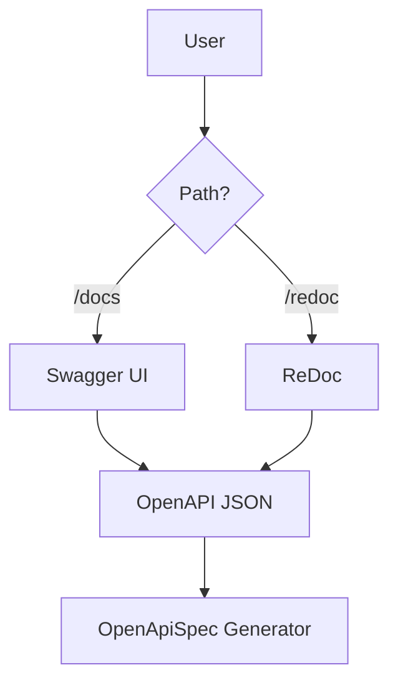

<spec>

# Quasar Interactive Docs Spec

## Overview

This specification covers the interactive documentation serving for Quasar applications. It provides built-in route handlers for Swagger UI and ReDoc, allowing developers to explore and test their APIs directly from the browser.

## Requirements

### R1 - Swagger UI Route

```yaml
id: R1
priority: medium
status: draft
```

Implement a route handler in 'crates/cclab-quasar/src/openapi.rs' or 'docs.rs' to serve Swagger UI assets and the OpenAPI specification.

### R2 - ReDoc Route

```yaml
id: R2
priority: medium
status: draft
```

Implement a route handler to serve ReDoc assets for alternative API documentation visualization.

## Acceptance Criteria

### Scenario: Access Swagger UI

- **GIVEN** A Quasar application with OpenAPI spec enabled
- **WHEN** The user navigates to the /docs endpoint.
- **THEN** The browser renders the Swagger UI interface showing all registered routes.

### Scenario: Access ReDoc

- **GIVEN** A Quasar application with OpenAPI spec enabled
- **WHEN** The user navigates to the /redoc endpoint.
- **THEN** The browser renders the ReDoc interface with the documentation.

### Scenario: Missing Spec Error

- **GIVEN** A server with no OpenAPI spec generated
- **WHEN** The user attempts to access /docs.
- **THEN** The server returns a 404 or a descriptive error page.

## Flow Diagram



</spec>
