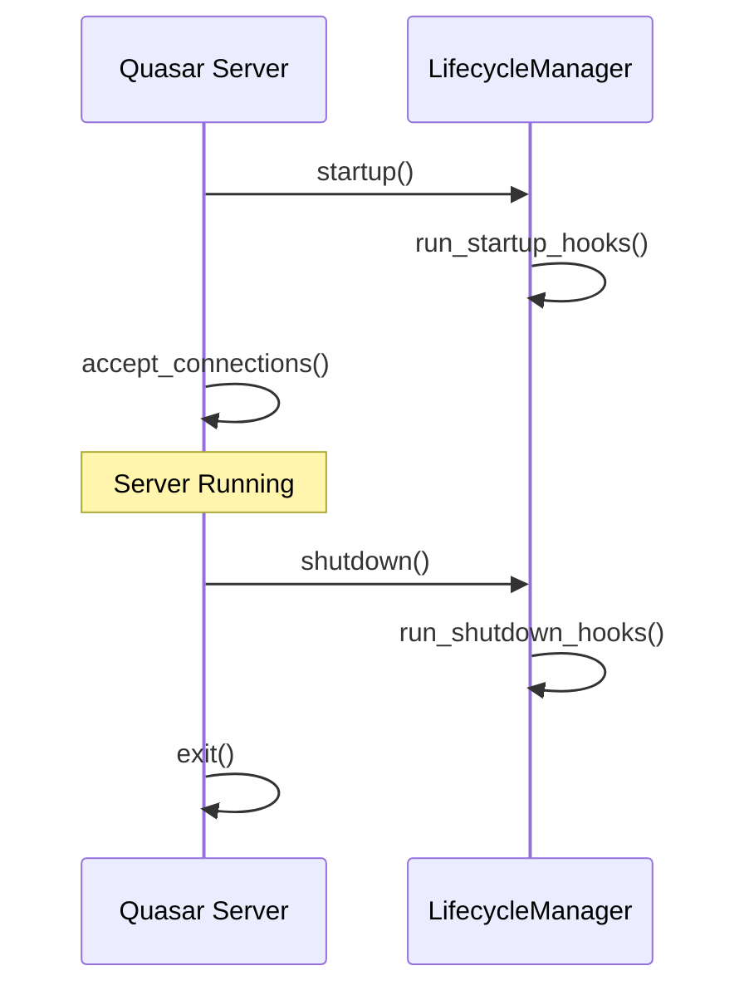

<spec>

# Quasar Lifespan Events Spec

## Overview

This specification covers the integration of lifespan events (startup and shutdown) into the Quasar server loop. It ensures that initialization logic and cleanup tasks are executed reliably at the correct points in the server's lifecycle.

## Requirements

### R1 - Startup Integration

```yaml
id: R1
priority: high
status: draft
```

Modify the Server run loop in 'crates/cclab-quasar/src/server.rs' to invoke LifecycleManager startup hooks before accepting any incoming connections.

### R2 - Shutdown Integration

```yaml
id: R2
priority: high
status: draft
```

Ensure that shutdown hooks are executed after the server receives a termination signal but before the process exits.

## Acceptance Criteria

### Scenario: Startup Hook Failure

- **GIVEN** A server with a startup hook that returns an error
- **WHEN** The server is started.
- **THEN** The server must log the error and terminate without accepting any connections.

### Scenario: Multiple Hooks Execution

- **GIVEN** A server with multiple startup and shutdown hooks
- **WHEN** The server starts and then receives a shutdown signal.
- **THEN** All hooks are executed in the order they were registered.

### Scenario: Graceful Shutdown on SIGTERM

- **GIVEN** A server running in a container environment
- **WHEN** A SIGTERM signal is received.
- **THEN** The server stops accepting new connections and runs all shutdown hooks before exiting.

## Flow Diagram



</spec>
