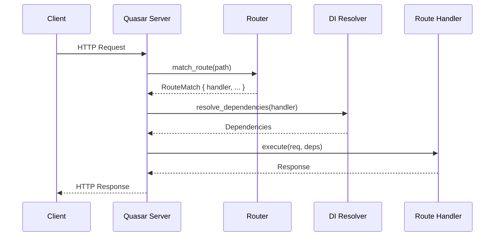

<spec>

# Quasar Maturity Upgrade Specification

## Overview

This specification covers the overall technical design for upgrading cclab-quasar to 95% maturity. It consolidates the requirements for automated Dependency Injection, interactive docs, lifespan events, and the TestClient into a unified architecture.

## Requirements

### R1 - Automated DI Resolution

```yaml
id: R1
priority: high
status: draft
```

Extend the Dependency Injection system to support automated resolution of 'Depends' markers in handler signatures.

### R2 - DI-Aware Routing

```yaml
id: R2
priority: high
status: draft
```

Update routing and handler execution to be DI-aware.

### R3 - Built-in Docs UIs

```yaml
id: R3
priority: medium
status: draft
```

Provide built-in routes for Swagger UI and ReDoc in the Server.

### R4 - Reliable Lifespan Events

```yaml
id: R4
priority: medium
status: draft
```

Ensure lifespan startup/shutdown hooks are reliably executed by the Server loop.

### R5 - In-Process TestClient

```yaml
id: R5
priority: high
status: draft
```

Implement an in-process TestClient for fast integration testing.

### R6 - Enhanced Test Coverage

```yaml
id: R6
priority: medium
status: draft
```

Reach 95% test coverage for core framework features.

## Acceptance Criteria

### Scenario: End-to-End Request with DI

- **GIVEN** A Quasar application with all new maturity features enabled
- **WHEN** A request is made to a route using DI.
- **THEN** The handler is called with correctly resolved dependencies and returns a valid response.

### Scenario: Full Lifecycle Execution

- **GIVEN** A Quasar application with lifespan hooks registered
- **WHEN** The server is started and then stopped.
- **THEN** Startup hooks run first, then the server runs, then shutdown hooks run on termination.

### Scenario: Developer Workflow with TestClient

- **GIVEN** A developer writing integration tests for a Quasar app
- **WHEN** The TestClient is used to dispatch multiple requests in a test suite.
- **THEN** The developer can test all API endpoints in-process without needing to manage network ports.

### Scenario: Interactive Docs Access

- **GIVEN** A Quasar server with OpenAPI generation enabled
- **WHEN** The user navigates to /docs and /redoc.
- **THEN** The server returns the Swagger UI and ReDoc pages at their respective endpoints.

### Scenario: SSE Keep-Alive Verification

- **GIVEN** An active SSE stream with keep-alive configured
- **WHEN** No data is sent over the stream for an extended period.
- **THEN** The client receives periodic heartbeat events preventing connection timeout.

### Scenario: Middleware Order Test

- **GIVEN** A route with multiple nested middlewares
- **WHEN** A request is dispatched via TestClient.
- **THEN** The TestClient verifies that middlewares are executed in the correct registration order.

## Flow Diagram



</spec>
