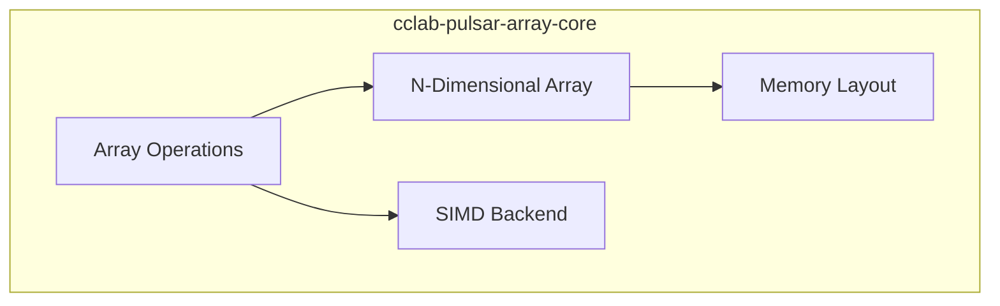

# cclab-pulsar-array-core Specs

High-performance array computation engine (planned).

## Overview
<!-- type: overview lang: markdown -->

Pulsar provides NumPy-like array operations with Rust performance for cclab.

## Architecture
<!-- type: doc lang: markdown -->

## Specs
<!-- type: doc lang: markdown -->

| File | Type | Description |
|------|------|-------------|
| pulsar-array-core-design.md | algorithm | Core array design |
