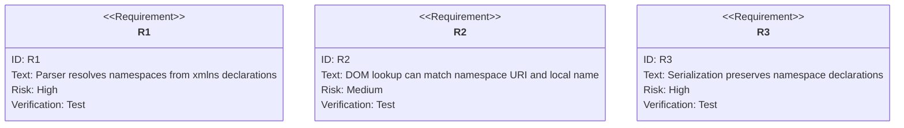
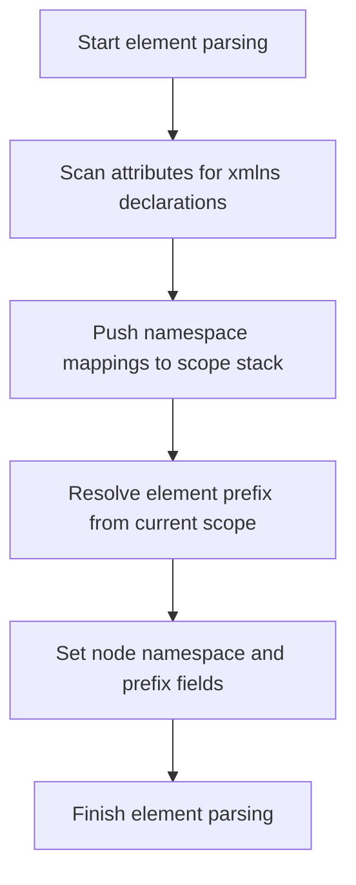

# XML Namespace Support

## Overview
<!-- type: overview lang: markdown -->

XML namespace support covers scope-aware parsing and namespace-aware DOM
operations. Parsing resolves `xmlns` declarations into namespace and prefix
fields on nodes; DOM lookup can match by namespace URI and local name; XML
serialization emits required namespace declarations.

The old file lived at
`.aw/tech-design/crates/cclab-array/pulsar-markup-xml-ns.md`. The canonical
TD now lives under `logic/`.

## Requirements
<!-- type: requirements lang: mermaid -->



### R1: Namespace Resolution During Parsing

The XML parser identifies `xmlns` and `xmlns:prefix` declarations and resolves
element prefixes against the current namespace scope.

### R2: Namespace-aware DOM Lookup

DOM operations provide lookup by namespace URI and local name so callers can
find elements independent of the prefix used in the source document.

### R3: XML Namespace Serialization

Serialization includes the required `xmlns` declarations at appropriate levels
so namespace meaning is preserved in the output XML.

## Scenarios
<!-- type: scenarios lang: yaml -->

```yaml
scenarios:
  - id: S1
    requirement: R1
    given: An XML string with multiple namespace declarations
    when: parse_xml is called
    then: Each DOM node has namespace and prefix fields populated correctly
  - id: S2
    requirement: R2
    given: A DOM tree contains namespace-aware nodes
    when: find_by_tag_ns is called with http://example.com and item
    then: The matching element is returned regardless of the prefix used
  - id: S3
    requirement: R3
    given: A DOM tree contains nodes with namespaces
    when: The document is serialized to XML
    then: The output XML contains xmlns declarations at the appropriate levels
```

## Namespace Resolution Flow
<!-- type: logic lang: mermaid -->



## Changes
<!-- type: changes lang: yaml -->

```yaml
files:
  - path: .aw/tech-design/crates/cclab-array/logic/xml-namespace-support.md
    action: MODIFY
    impl_mode: hand-written
    desc: Move XML namespace TD under logic and normalize sections.
  - path: crates/cclab-array/src
    action: MODIFY
    impl_mode: hand-written
    desc: Implement namespace-aware XML parsing DOM lookup and serialization.
```
