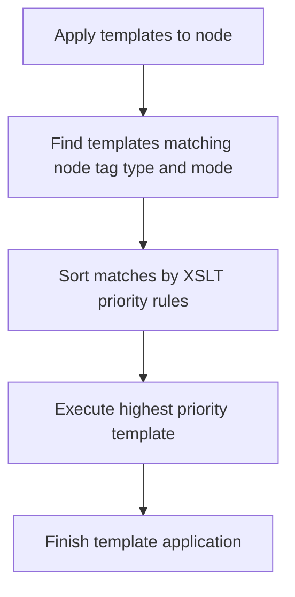

# XSLT Core Instructions

## Overview
<!-- type: overview lang: markdown -->

XSLT core instructions add template application, conditional branching, and node
copying to the markup transformation engine. These instructions enable complex
XML transformations beyond direct element emission.

The old file lived at
`.aw/tech-design/crates/cclab-array/pulsar-markup-xslt-core.md`. The
canonical TD now lives under `logic/`.

## Requirements
<!-- type: requirements lang: mermaid -->

```mermaid
---
id: xslt-core-instructions-requirements
entry: R1
---
requirementDiagram
    requirement R1 {
        id: R1
        text: xsl apply-templates supports select and mode
        risk: high
        verifymethod: test
    }
    requirement R2 {
        id: R2
        text: xsl choose when otherwise selects one branch
        risk: high
        verifymethod: test
    }
    requirement R3 {
        id: R3
        text: xsl copy and copy-of duplicate selected nodes
        risk: medium
        verifymethod: test
    }
```

### R1: XSLT Template Application

`xsl:apply-templates` supports `select` and `mode`, finds matching templates,
sorts by XSLT priority rules, and executes the best match for each selected
node.

### R2: XSLT Conditional Branches

`xsl:choose`, `xsl:when`, and `xsl:otherwise` implement conditional logic by
executing the first true `xsl:when` branch or the fallback `xsl:otherwise`.

### R3: XSLT Node Copying

`xsl:copy` and `xsl:copy-of` duplicate nodes. `xsl:copy-of` recursively copies
the selected nodes and descendants into the output tree.

## Scenarios
<!-- type: scenarios lang: yaml -->

```yaml
scenarios:
  - id: S1
    requirement: R1
    given: A source document and an XSLT with multiple templates
    when: xsl:apply-templates is encountered
    then: The transformer executes the best matching template for each selected node
  - id: S2
    requirement: R2
    given: An XSLT stylesheet with conditional branches
    when: xsl:choose is processed
    then: Only the first true xsl:when or the xsl:otherwise branch executes
  - id: S3
    requirement: R3
    given: An XSLT uses xsl:copy-of to select a subtree
    when: xsl:copy-of is executed
    then: The selected nodes and descendants are recursively copied to output
```

## XSLT Template Matching Flow
<!-- type: logic lang: mermaid -->



## Changes
<!-- type: changes lang: yaml -->

```yaml
files:
  - path: .aw/tech-design/crates/cclab-array/logic/xslt-core-instructions.md
    action: MODIFY
    impl_mode: hand-written
    desc: Move XSLT core TD under logic and normalize sections.
  - path: crates/cclab-array/src
    action: MODIFY
    impl_mode: hand-written
    desc: Implement XSLT apply-templates choose when otherwise copy and copy-of behavior.
```
