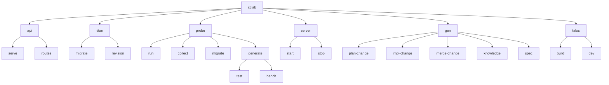
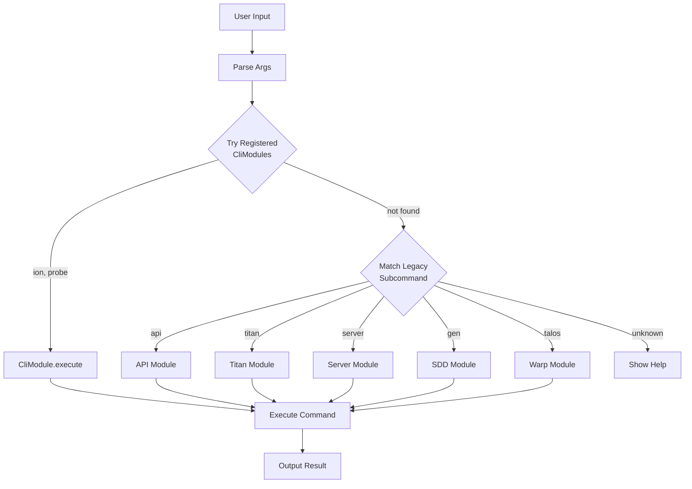

<spec>

# CLI Architecture

## Overview

The `cclab` command provides unified CLI for all cclab operations. Modules can register themselves via the linkme `#[distributed_slice(CLI_MODULES)]` pattern for automatic discovery.

## Command Structure



## CliModule Registration

Modules auto-register via linkme distributed slices. Registered modules are dispatched first before falling back to legacy handling.

```rust
// Example: ProbeCli registration (crates/cclab-cli/src/probe/mod.rs)
#[distributed_slice(CLI_MODULES)]
static PROBE_CLI: &dyn CliModule = &ProbeCli;
```

**Registered CliModules**:
| Module | Status | Location |
|--------|--------|----------|
| ion | Registered | `crates/cclab-cli/src/ion.rs` |
| probe | Registered | `crates/cclab-cli/src/probe/mod.rs` |

## Command Dispatch Flow



**Dispatch Priority**:
1. **Registered modules** (via `try_dispatch_registered()`) - ion, probe
2. **Legacy subcommands** - api, titan, server, gen, talos
3. **Help** - unknown commands

</spec>
