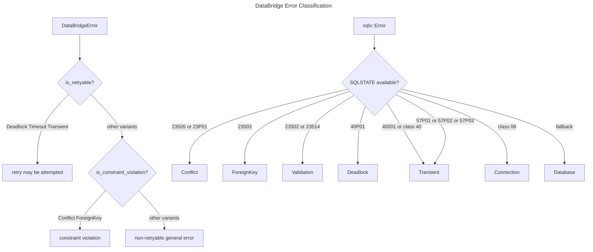
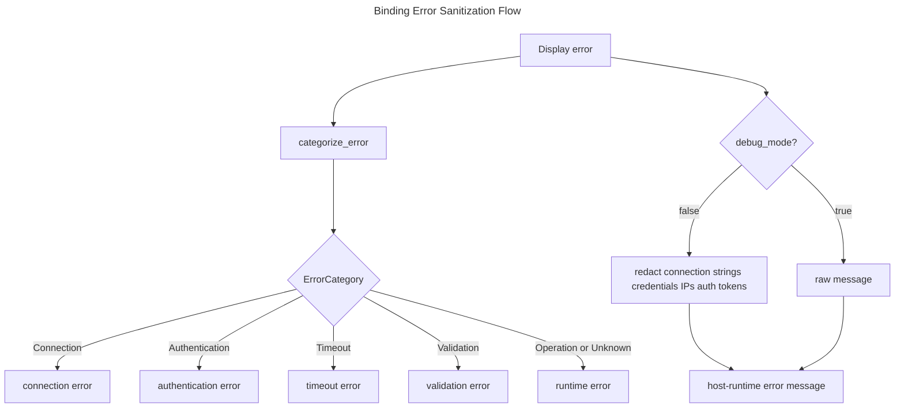

# Structured Error Handling

## Overview
<!-- type: overview lang: markdown -->

cclab-core exposes a structured `DataBridgeError` enum for Rust call sites and
binding-neutral utilities for sanitized host-runtime errors. The Rust core
contract does not depend on native-extension bindings. The current contract
covers database, serialization, validation, connection, query, and
PostgreSQL-specific classification while keeping sensitive connection data out
of production error messages.

## Schema
<!-- type: schema lang: yaml -->

```yaml
definitions:
  DataBridgeError:
    type: object
    required: [variant, message]
    properties:
      variant:
        type: string
        enum:
          - MongoDB
          - Database
          - Serialization
          - Deserialization
          - Connection
          - Query
          - Validation
          - Internal
          - Conflict
          - ForeignKey
          - Deadlock
          - Timeout
          - Transient
      message:
        type: string

  ErrorCategory:
    type: string
    enum:
      - Connection
      - Authentication
      - Timeout
      - Validation
      - Operation
      - Unknown

  ErrorClassification:
    type: object
    required: [retryable, constraint_violation]
    properties:
      retryable:
        type: array
        items:
          type: string
          enum: [Deadlock, Timeout, Transient]
      constraint_violation:
        type: array
        items:
          type: string
          enum: [Conflict, ForeignKey]
```

## Logic
<!-- type: logic lang: mermaid -->



## Interaction
<!-- type: interaction lang: mermaid -->



## Changes
<!-- type: changes lang: yaml -->

```yaml
changes:
  - path: crates/cclab-core/src/error.rs
    action: modify
    section: schema
    impl_mode: hand-written
    description: "Maintain DataBridgeError, Result alias, retryability and constraint classification."
  - path: crates/cclab-core/src/error.rs
    action: modify
    section: logic
    impl_mode: hand-written
    description: "Classify serde, MongoDB, and sqlx errors into DataBridgeError variants."
  - path: crates/cclab-core/src/error_utils.rs
    action: modify
    section: interaction
    impl_mode: hand-written
    description: "Sanitize sensitive error text and categorize errors without a native-extension dependency."
  - path: crates/cclab-core/Cargo.toml
    action: modify
    section: interaction
    impl_mode: hand-written
    description: "Keep cclab-core free of native-extension binding dependencies."
  - path: .aw/tech-design/crates/cclab-core/README.md
    action: modify
    section: overview
    impl_mode: hand-written
    description: "Link the normalized structured error handling spec."
```
