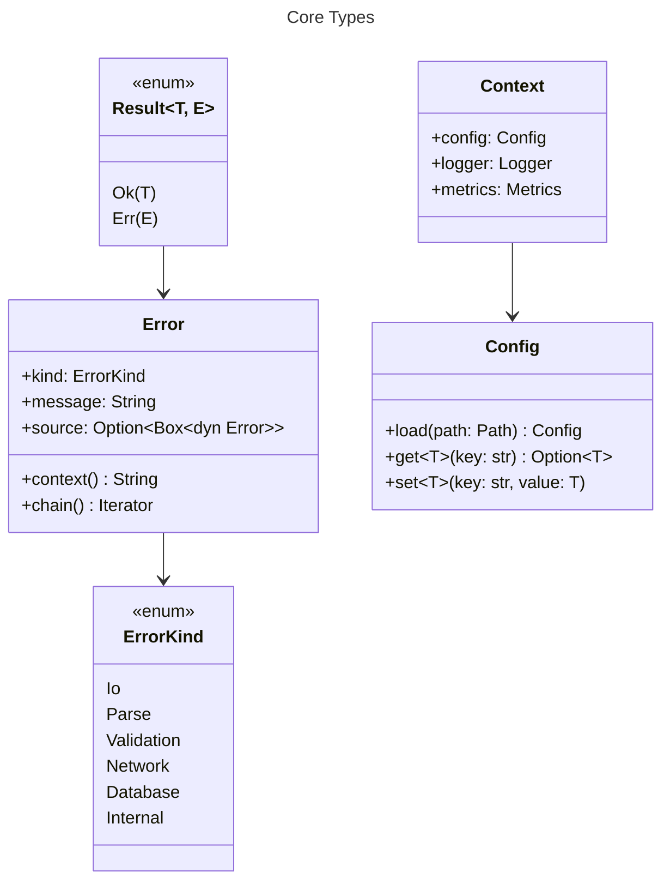
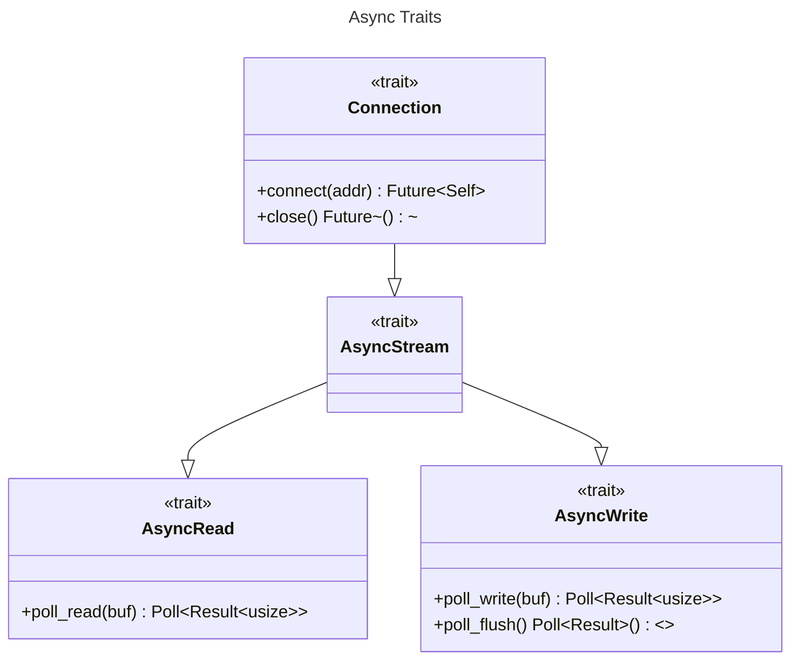
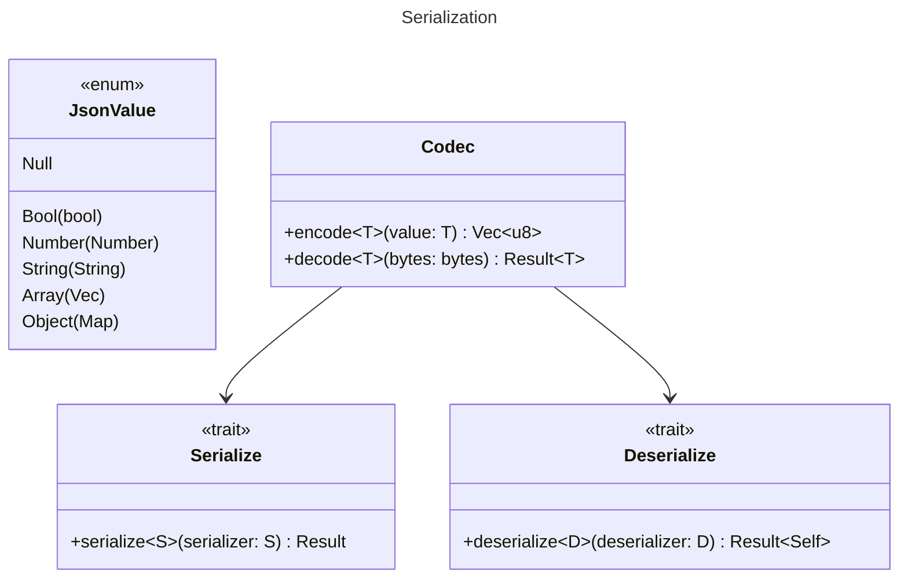

# Core Utilities Architecture

## Overview
<!-- type: overview lang: markdown -->

cclab-core provides shared utilities, types, and abstractions used across all
crates.

## Core Types
<!-- type: dependency lang: mermaid -->



## Async Traits
<!-- type: dependency lang: mermaid -->



## Serialization
<!-- type: dependency lang: mermaid -->



## Changes
<!-- type: changes lang: yaml -->

```yaml
changes:
  - path: .aw/tech-design/crates/cclab-core/logic/architecture/class-diagram.md
    action: modify
    section: dependency
    impl_mode: hand-written
    description: "Maintain high-level cclab-core utility architecture diagrams."
  - path: .aw/tech-design/crates/cclab-core/README.md
    action: modify
    section: overview
    impl_mode: hand-written
    description: "Link to the normalized class diagram spec."
```
