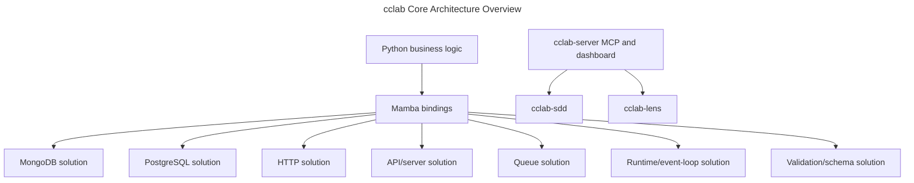

# Architecture Principles

## Overview
<!-- type: overview lang: markdown -->

CCLab is a high-performance Rust toolkit used primarily as the backend for
Python libraries. CPU-heavy work such as parsing, serialization, validation,
query execution, and transformation runs in Rust; Python keeps the business
logic and user-facing API.

## Architecture Overview
<!-- type: dependency lang: mermaid -->



## Design Principles
<!-- type: schema lang: yaml -->

```yaml
principles:
  - id: performance_first
    rule: "Rust handles all heavy lifting."
    implementation:
      - "Parse, serialize, validate, filter, transform, and execute queries in Rust."
      - "Use rayon for CPU-bound batch work and tokio for IO-bound work."

  - id: pythonic_api
    rule: "Expose natural Python APIs despite Rust implementation."
    implementation:
      - "Keep Python as business logic and ergonomic wrapper layer."
      - "Convert only final required values back into Python objects."

  - id: feature_isolation
    rule: "Feature flags control which modules are compiled."
    implementation:
      - "Keep crate-specific integrations isolated."
      - "Avoid forcing unrelated dependencies into every Python package."

  - id: type_safety
    rule: "Strong typing flows through Rust internals and FFI boundaries."
    implementation:
      - "Validate field names, collection/table identifiers, and input schemas at boundaries."
      - "Sanitize errors before exposing them to Python in production mode."

  - id: zero_python_byte_handling
    rule: "Do not process raw database bytes in Python."
    implementation:
      - "Rust receives raw bytes and deserializes into Rust structs."
      - "Filtering and transformation happen before Python object creation."

  - id: gil_release
    rule: "Release the GIL for operations expected to exceed 1ms."
    implementation:
      - "Release for CPU-bound conversion, network IO, and validation."
      - "Hold only while extracting Python inputs or creating Python outputs."

  - id: copy_on_write_state
    rule: "Avoid deep copies for change tracking."
    implementation:
      - "Store an initial-state reference."
      - "Record field-level changes on mutation."
      - "Send only the diff on save."

  - id: lazy_validation
    rule: "Validate only when necessary."
    implementation:
      - "Trust database types on reads where safe."
      - "Run full validation before writes."
      - "Defer validation to save-time rather than constructor-time where appropriate."
```

## Performance Targets
<!-- type: schema lang: yaml -->

```yaml
targets:
  inserts_1k_docs:
    target: "<20ms and at least 2.8x faster than Beanie"
    observed: "17.76ms and 3.2x"
    status: verified
  finds_1k_docs:
    target: "<7ms and at least 1.2x faster than Beanie"
    observed: "6.32ms and 1.4x"
    status: verified
  memory:
    target: "Minimal Python heap pressure"
    status: verified
  scalability:
    target: "Linear with CPU cores where rayon-backed parallelism applies"
    status: verified
```

## Changes
<!-- type: changes lang: yaml -->

```yaml
changes:
  - path: .aw/tech-design/crates/cclab-core/logic/architecture/principles.md
    action: modify
    section: schema
    impl_mode: hand-written
    description: "Maintain cclab-core architecture principles and performance targets."
  - path: .aw/tech-design/crates/cclab-core/README.md
    action: modify
    section: overview
    impl_mode: hand-written
    description: "Link to the normalized architecture principles spec."
```
